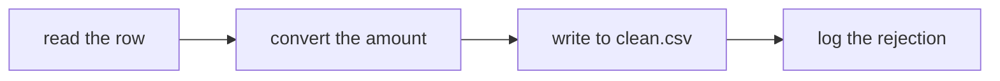

# The device wheel

Eleven devices. Each one tests a different act, and moving across them inside one file is what stops an exercise reading as a quiz. Every example below is written against the Kalpa Retail orders, because a device demonstrated on abstract data is a device nobody copies correctly.

## 1. Raw-artifact diagnosis

Put the artifact on the page exactly as it arrives and ask what is wrong with it. This is the closest device to the real job.

```markdown
### Item 1

Here are four rows exactly as they came out of the vendor feed.

order_id,segment,amount,status
KR4231,Retail-Core,1820,delivered
KR4232,Retail-Plus,,delivered
KR4233,Student,"3,150",delivered
KR4233,Student,3150,returned

Which single statement is true of this extract?

a) Two rows share an order_id and disagree on status.
b) One amount is empty and one carries a thousands separator, and no id repeats.
c) Every row would convert to an integer amount without complaint.
d) The header row is missing a field that the rows supply.
```

## 2. Fix a diagram with planted errors

Give a Mermaid diagram with two or three arrows wrong and ask which correction set is right.

```markdown
### Item 2



Which one change makes this the pass you ran in class?

a) The rejection log branches off the conversion, not off the clean write.
b) The clean write comes before the conversion.
c) The read follows the conversion.
d) The rejection log is removed, since a rejected row is not written anywhere.
```

## 3. Reorder shuffled steps

Give the steps out of order, lettered, and ask for the order as a letter string. This tests sequence without any typing.

```markdown
### Item 3

Put these in the order the profiler runs them.

a) add the value to a set
b) for every field in the header
c) for every row
d) report present, converts and distinct

Answer as four letters in order.
```

## 4. Pick from a lettered bank with a spare

One bank, more options than slots, so elimination alone does not finish it. The spare is the device.

```markdown
### Item 4

Match each symptom to its cause. One cause is left over.

Symptoms
1. The dedupe reports 0 and distinct ids report 49 of 50.
2. present rises to 50 of 50 after cleaning and distinct falls.
3. int() stops the loop on record 17.

Causes
a) A near-duplicate pair differs in one field.
b) Every failed conversion was replaced with a default.
c) One amount is stored as text.
d) The file was read twice.
```

## 5. Multiple choice

The plainest device, and the one to use least. Reserve it for a genuine judgement call where all four options are things a working person would defend.

## 6. Fill the blank in code

One blank, four candidate expressions. The blank sits where the decision is, never where the syntax is.

```markdown
### Item 6

    total = 0
    for r in records:
        if r["status"] == "delivered":
            total = total + ______

a) r["amount"]
b) int(r["amount"])
c) float(r["amount"])
d) str(r["amount"])
```

## 7. Find the defect in a snippet

A snippet that runs and produces a wrong answer. Harder and more useful than a snippet that crashes.

## 8. Predict the output

Give the code and four candidate outputs. One is right, one is what a learner expects, one is what a different bug would produce, one is a crash.

```markdown
### Item 8

    a = [1, 2, 3]
    b = a
    b.append(9)
    print(len(a))

a) 3
b) 4
c) A TypeError, since a list cannot be extended after assignment.
d) 1
```

## 9. Match with a spare

Two columns, one extra on the right. Distinct from device 4 in that both columns are concepts rather than symptom and cause.

## 10. True or false

Cheap, fast, and only worth using where a statement is genuinely half-believed by the room. Answer as `T` or `F`, and say so in the format line.

## 11. Arithmetic on the artifact

A number a learner computes from the artifact on the page, offered as four candidate values.

```markdown
### Item 11

The profile says amount is present on 48 of 50 and converts on 44. How many
values are present and unusable?

a) 2
b) 4
c) 6
d) 44
```

## Transposing across a day

Where a day carries two or three unguided exercises, the same devices run at different layers.

| Layer | What the devices operate on | Example on Day 3 |
|---|---|---|
| Concept | Definitions, decisions, the shape of the method | Classify four missingness cases into drop, default, keep-and-flag or escalate |
| Code | The snippet that implements the concept | Fill the blank in the profiler's inner loop |
| Failure or operating | What goes wrong and who fixes it | Diagnose the dedupe that reported zero, and name the first check |

The device wheel is the same in all three. Only the artifact under it changes.
