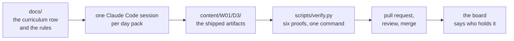
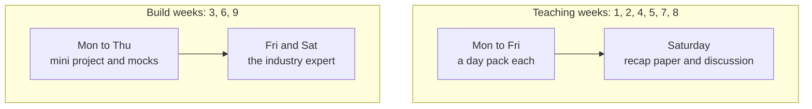
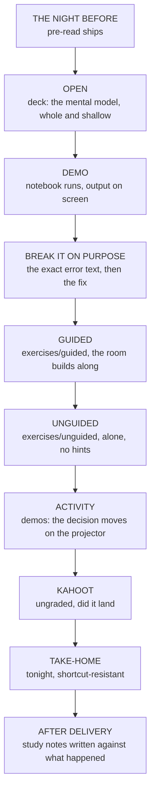
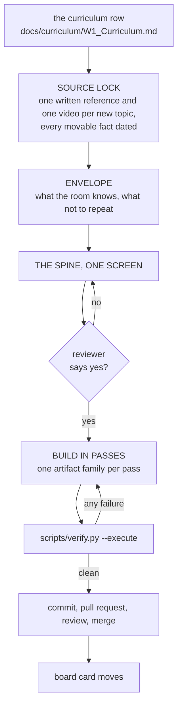
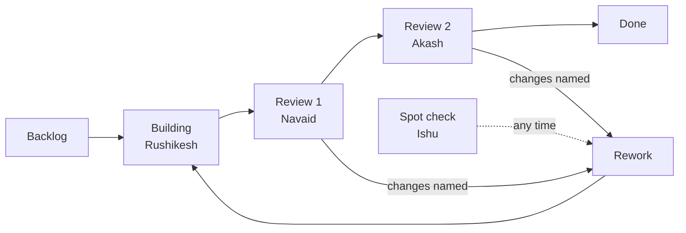

# C2 Content Factory

The build repository for the teaching material of the **PG Diploma in AI-ML and Agentic AI
Engineering, IIT Gandhinagar, Cohort 2**.

One day of training equals one day pack. A pack is built from its curriculum row, in one session,
against a spine the reviewer approved, and it is not finished until one command proves it.

[](https://codespaces.new/fde-academy-lab/c2-content-factory?quickstart=1)
&nbsp;
[**Content board**](https://github.com/fde-academy-lab/c2-content-factory/issues) ·
[**Layout**](content/README.md) ·
[**Rules**](CLAUDE.md) ·
[**Board guide**](docs/agents/content-board.md)

---

## Contents

| Section | Read it when |
|---|---|
| [1. What is in here](#1-what-is-in-here) | You have never opened this repository before |
| [2. How the programme is shaped](#2-how-the-programme-is-shaped) | You need to find a particular week or day |
| [3. The artifacts, and what each one is for](#3-the-artifacts-and-what-each-one-is-for) | You are looking for a specific kind of material |
| [4. How one session actually runs](#4-how-one-session-actually-runs) | You are delivering, or reviewing a delivery |
| [5. The method behind the material](#5-the-method-behind-the-material) | You want to know why it is built this way |
| [6. How a day pack gets built](#6-how-a-day-pack-gets-built) | You are about to build one |
| [7. The gate](#7-the-gate) | Something failed, or you are reviewing |
| [8. The board](#8-the-board) | You are tracking or assigning work |
| [9. Where everything lives](#9-where-everything-lives) | You are looking for a file |
| [10. References](#10-references) | You need the ground truth behind a decision |

---

## 1. What is in here

Nine weeks of material for a cohort programme, built as files rather than as slides in a drive.
Everything a trainer needs to run a day, everything a learner reads before and after it, and the
scripts that prove the material works before anybody stands in front of a room with it.



Three things make this repository different from a folder of decks.

| It is | Which means |
|---|---|
| **Built from a locked row** | A day's content comes from its curriculum row, not from what felt right on the day. A missing row stops the build rather than being invented around. |
| **Proved before it ships** | Notebooks run cold, quizzes are audited for giveaway answers, every control on every demo page is clicked, and every diagram is measured for whether a room can read it. |
| **One session per day** | Yesterday's session is never continued into today's pack. That is what stops one day's decisions leaking into the next. |

## 2. How the programme is shaped

Nine weeks, of two kinds, and a Saturday that is not a teaching day.



### The week folder

```
content/W01/
  D1/    Monday        D2/    Tuesday       D3/    Wednesday
  D4/    Thursday      SAT/   Saturday
```

Two rules decide which folders exist, and both are enforced by the verifier:

1. **Numbers are anchored to weekdays.** `D1` is always Monday and `D5` is always Friday, in every
   week. A reference to D3 means the same weekday wherever you read it.
2. **A day with no session gets no folder.** Week 1 has no `D5` because Friday 02 October is
   Gandhi Jayanti. The gap in the numbering *is* the holiday, and it is deliberate.

Saturday sits in `SAT/` rather than `D6/` because it is a different shape of day. On a teaching
week it runs the pen-and-paper recap paper and the solution discussion. On a build week it is the
expert's second day: demos, defence and grade closure.

The full folder-by-folder layout, including the two build-week shapes, is in
**[`content/README.md`](content/README.md)**.

### File names

```
C2_W{ww}_D{dd}_{topic}_{AUDIENCE}.{ext}      C2_W01_D03_profiling_STUDENT.pdf
C2_W{ww}_SAT_{topic}_{AUDIENCE}.{ext}        C2_W01_SAT_paper_STUDENT.md
```

`AUDIENCE` is `STUDENT`, `TRAINER` or `INTERNAL` and it is never omitted. It is the mechanism that
stops a trainer file reaching a learner, and the verifier fails a file that drops it.

Note the deliberate mismatch: the **folder** is `D3` with one digit, the **filename** is `D03` with
two. They do not match by design, and the verifier fails a pack where they disagree.

## 3. The artifacts, and what each one is for

A teaching day owes ten families. Each one answers a different question, and none of them
substitutes for another.

| Artifact | Folder | Who reads it | The question it answers |
|---|---|---|---|
| **Deck** | `slides/` | The room, live | What is the idea, in the order it has to arrive? |
| **Trainer notes** | `trainer/` | The trainer, before and during | How do I run this day, and where does it usually go wrong? |
| **Notebooks** | `notebooks/` | The room, then alone | What does this look like when it actually runs? |
| **Demos and workbooks** | `demos/` | The room, on the projector | What happens when I change this decision? |
| **Whiteboards** | `whiteboards/` | The trainer, at the board | How is this drawn by hand, live? |
| **Exercises** | `exercises/` | Learners | Can I do it with help, and then without? |
| **Take-home** | `takehome/` | Learners, after | Can I do it tonight, without a shortcut? |
| **Kahoot** | `kahoot/` | The room, at the close | Did the idea land, right now, ungraded? |
| **Pre-read** | `preread/` | Learners, the night before | What vocabulary do I need before tomorrow? |
| **Cheat sheets** | `cheatsheets/` | Learners, at the desk | What do I pin above my keyboard? |
| **Study notes** | `study-notes/` | Learners, after delivery | What did I actually sit through, written down? |

### What they look like

Every diagram in the programme is a mermaid fence rendered through one shared theme, so the
drawing on a slide is the drawing on the cheat sheet and in the notebook.

**Cheat sheet.** One landscape page, an anchor picture, block panels each closing on a crux line,
and a foot strip of the day's vocabulary read from the study notes.


**Deck.** A numbered pill so a trainer can navigate, a claim bar for the line that carries the
point, tables in the programme's own colours, and diagrams measured so a room can read them from
the back.


### Three variants of the cheat sheet, and why

| Variant | File | Use it |
|---|---|---|
| Full | `..._STUDENT.md` and `.pdf` | Pin it above the desk while working |
| Visual | `..._visual_STUDENT.pdf` | Redraw it from memory; pictures only, the words are on the full sheet |
| Gap | `..._gaps_STUDENT.pdf` | Fill about a quarter of the cells from memory, then check against the key at the foot |

Filling the gap sheet twice a week is worth more than reading the full sheet ten times. That is the
whole reason the variant exists.

## 4. How one session actually runs

A day is two blocks of about two hours. The artifacts are not a pile to pick from; each one has a
moment.



Two rules shape that order and are worth knowing before you change anything:

- **Application before theory.** The room sees a thing work before it is told why it works.
- **One deliberate failure per block**, carrying its exact error text. A learner who has never seen
  the error will not recognise it at 11pm.

### Which file do I open?

| You are | Open |
|---|---|
| Delivering the day | `trainer/` first, then `slides/`, with `notebooks/` open beside it |
| Reviewing the day | The board card, then `scripts/verify.py` output, then the deck |
| A learner, before | `preread/` |
| A learner, during | `notebooks/`, `exercises/guided/` |
| A learner, after | `takehome/`, then `cheatsheets/`, then `study-notes/` |
| Rebuilding an artifact | The `.md` source, never the `.pptx` or `.pdf`, which are built from it |

## 5. The method behind the material

The rules in full are in [`CLAUDE.md`](CLAUDE.md) and [`docs/06_Day_Pack_Method.md`](docs/06_Day_Pack_Method.md).
The ones that shape what you see:

| Rule | Why it exists |
|---|---|
| Mental model first, spiral always | The whole pipeline shallow, then the deep stops. Nobody learns a pipeline from its third stage. |
| At most four new ideas per two-hour block | Past four, the room stops encoding and starts copying. |
| One deliberate failure per block, with exact error text | An error a learner has met is an error a learner can fix. |
| Durations only, never clock times | The same pack has to run in a different slot without a rewrite. |
| Role labels, never trainer names, in student files | A trainer can change between build and delivery. |
| Every URL verified the day it entered, carrying that date | A link from memory is a link that is already wrong. |
| Notebooks ship executed | An unexecuted notebook teaches nobody reading it on GitHub. |
| The markdown is the source; the PDF and the PPTX are built | A binary older than its source is stale, and the gate says so. |

## 6. How a day pack gets built



The stop before the spine is the point of the whole process. A spine is one screen and costs
nothing to reject. A built day pack is forty files and costs a day.

To build one, start a fresh session with this repository selected and paste the matching prompt
from [`prompts/web_prompts.md`](prompts/web_prompts.md). One session per day pack, always.

## 7. The gate

One command proves a day pack. It runs six proofs and a layout check.

```bash
python3 scripts/verify.py content/W01/D3 --execute
```

| Proof | What it refuses to let through |
|---|---|
| `nb_check` | A notebook with no saved output, fewer than three rendered diagrams, or fewer than five passing checks |
| `distractor_audit` | A quiz whose key is the longest option, whose keys cluster on one letter, or whose format line shows the answers |
| `xlsx_recalc` | A workbook whose verdict is typed text rather than a formula that moves when a decision flips |
| `html_sweep` | A demo page with a control that does nothing, or a console that is not clean |
| `deck_md_check` | A slide source with unnumbered slides, an over-long title, a question with no answer slide, or too few diagrams |
| `deck_check` | A built deck with text overflowing its box |

Two staleness rules catch the commonest mistake, which is editing a source and shipping the old
binary:

- A `.pptx` older than its `.md` is stale. Rebuild it with `scripts/build_deck.py`.
- A cheat sheet with no `.pdf`, or a `.pdf` older than its `.md`, is stale. Rebuild it with
  `scripts/build_cheatsheet.py`.

A pack that has not passed the gate is not done, whatever the board says.

## 8. The board

Work is tracked as one card per day pack, on the repository's own issues, grouped into a GitHub
Project. Fifty-four cards, one per row of the Content Build Tracker.



Statuses, people, milestones and the exact commands for driving it from Claude Code are in
**[`docs/agents/content-board.md`](docs/agents/content-board.md)**. In short:

```bash
python3 scripts/board_sync.py --week W02 --set-status backlog   # open next week's cards
python3 scripts/board_sync.py --status W02/D3 review-1          # hand one day on
python3 scripts/board_sync.py --dry-run --all                   # see, change nothing
```

## 9. Where everything lives

| Path | What is in it |
|---|---|
| [`CLAUDE.md`](CLAUDE.md) | The rules every build session loads. The single most important file here. |
| [`content/`](content/) | The shipped artifacts, one folder per session. [`content/README.md`](content/README.md) is the layout. |
| [`content/_TEMPLATE/`](content/_TEMPLATE/) | The four empty day shapes to copy from |
| [`docs/`](docs/) | Ground truth: programme facts, doctrine, method, the artifact specs |
| [`docs/curriculum/`](docs/curriculum/) | The workbook and its per-tab markdown exports. The row is the contract. |
| [`docs/agents/`](docs/agents/) | How the board, the issue tracker and the domain docs work |
| [`.claude/skills/`](.claude/skills/) | The build procedures a session reads before producing anything |
| [`prompts/`](prompts/) | Copy-paste prompts, one per task |
| [`scripts/`](scripts/) | The exporter, the builders, and the six proofs |
| [`audits/`](audits/) | What a sweep found and what was done about it |
| [`data/`](data/) | The client-zero generator. Every dataset is written by it, never by hand. |

### The scripts worth knowing

| Script | What it does |
|---|---|
| `verify.py` | The gate. One command, six proofs. Run this before you commit anything. |
| `build_deck.py` | Markdown slide source into a `.pptx`, in the programme's visual system |
| `build_cheatsheet.py` | Cheat sheet markdown into the printed landscape PDF |
| `board_sync.py` | Creates and moves the board cards from the day plan |
| `export_curriculum.py` | Re-exports `docs/curriculum/*.md` after the workbook changes |
| `c2kit.py` | The helper every notebook imports: palette, checks, nine diagram builders |

## 10. References

| Document | What it settles |
|---|---|
| [`docs/01_Programme_Facts_C2.md`](docs/01_Programme_Facts_C2.md) | Dates, structure, the facts nothing may contradict |
| [`docs/02_Content_Doctrine.md`](docs/02_Content_Doctrine.md) | How material is written, and what is refused |
| [`docs/06_Day_Pack_Method.md`](docs/06_Day_Pack_Method.md) | The build workflow in full |
| [`docs/07_Client_Zero.md`](docs/07_Client_Zero.md) | Kalpa Retail: the one company every example lives in |
| [`docs/08_Modules_and_Credits.md`](docs/08_Modules_and_Credits.md) | Module map and credits |
| [`docs/09_Artifact_Specs_v2.md`](docs/09_Artifact_Specs_v2.md) | What each artifact must contain to be finished |
| [`docs/04_Cohort1_Learnings.md`](docs/04_Cohort1_Learnings.md) | What went wrong last time. History, never specification. |
| [`SETUP.md`](SETUP.md) | Getting a working environment, browser only or local |

### Getting a working environment

The fastest path is the Codespaces button at the top: it opens the repository in a browser IDE and
runs [`setup.sh`](setup.sh), which installs the Python packages, the browser and the mermaid
renderer that the builders and the proofs need. Everything else is in [`SETUP.md`](SETUP.md).

---

**Ground truth order, highest first**, when two things disagree: what the requester says in the
session, then `docs/curriculum/`, then the programme facts and the client-zero lock, then the
method and the doctrine, then the detailing manuals, then the Cohort 1 learnings. Anything absent
from those files is unknown, and a build stops and names it rather than inventing it.
