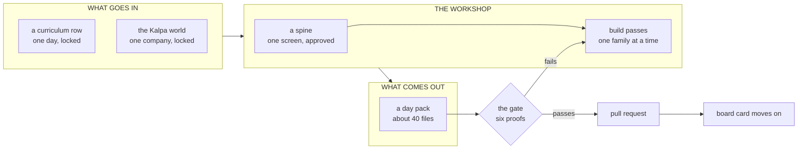
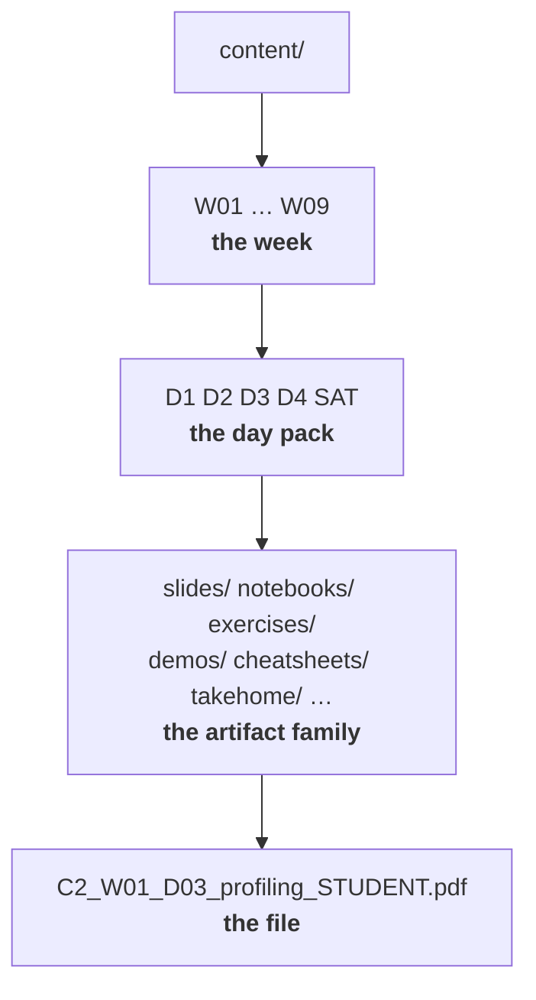
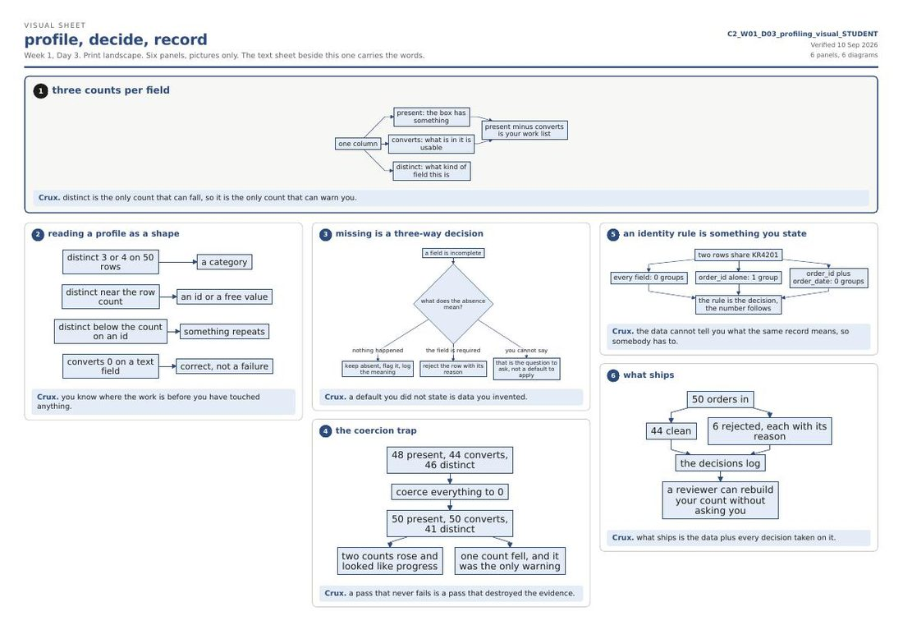
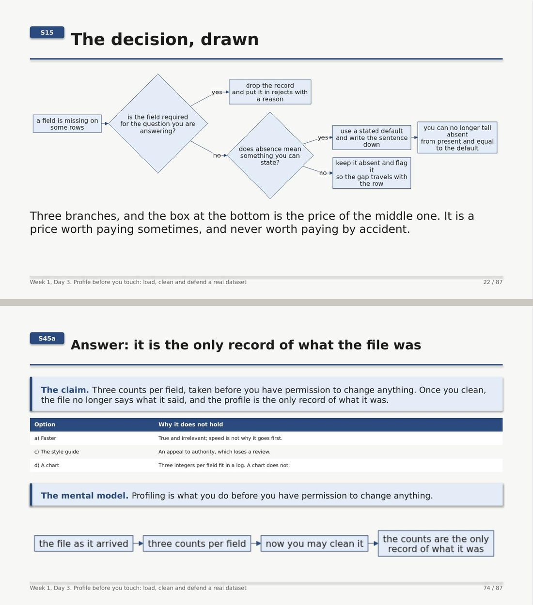
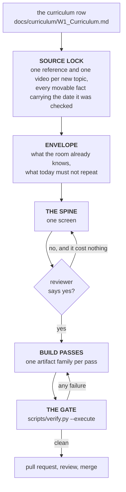
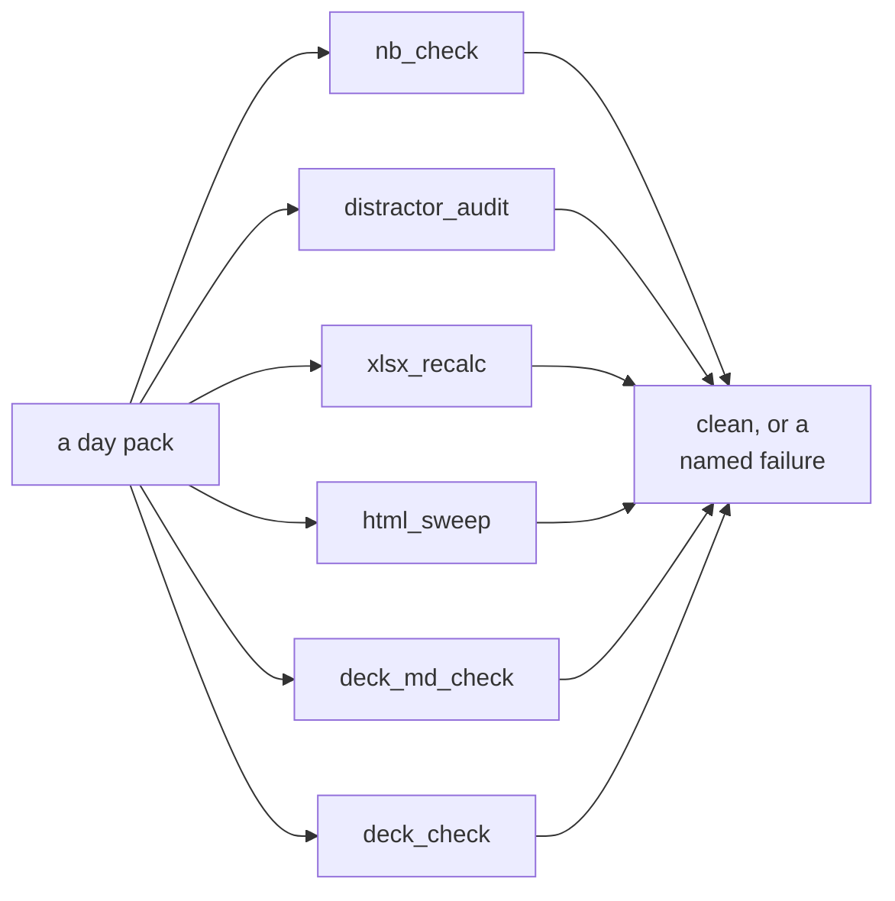
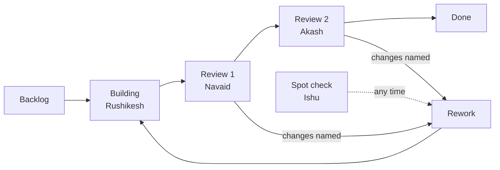

# C2 Content Factory

The workshop where the teaching material for **IIT Gandhinagar Cohort 2** is made, checked and kept.

This repository is for the people who **build and review content**. It is not the cohort's
classroom and it is not a syllabus. It holds the artifacts, the machines that make them, and the
proofs that say whether they are finished.

[](https://codespaces.new/fde-academy-lab/c2-content-factory?quickstart=1)
&nbsp;
[**Board**](https://github.com/fde-academy-lab/c2-content-factory/issues) ·
[**Wiki**](https://github.com/fde-academy-lab/c2-content-factory/wiki) ·
[**Rules**](CLAUDE.md) ·
[**Folder layout**](content/README.md)

---

## The whole thing in one picture



Four ideas hold the whole repository together. Everything below is a consequence of one of them.

| Idea | What follows from it |
|---|---|
| **The unit of work is one day pack** | One folder, one session, one board card, one reviewer, one gate run. Never half a day, never two days. |
| **The source is markdown; binaries are built** | A `.pptx` and a `.pdf` are outputs. Editing one is editing the wrong file, and the gate will say so. |
| **Nothing ships unproved** | Notebooks run cold, quizzes are audited, every control on every page is clicked, every diagram is measured. |
| **One company, forever** | Every example lives inside Kalpa. A learner grows inside one business for twenty weeks instead of re-orienting each session. |

---

## 1. How the shelves are arranged

Three levels, and the path itself tells you where you are.



**`content/W01/D3/slides/C2_W01_D03_profiling_STUDENT.md`** reads left to right as: week one, Wednesday,
a slide source, on profiling, for a learner.

Three conventions the verifier enforces, so you never have to remember them:

| Convention | Example | Why |
|---|---|---|
| `D1` is always Monday, `D5` always Friday | Week 1 jumps `D4` to `SAT` | Friday 02 October is a holiday. The gap in the numbering *is* the holiday. |
| Folder is one digit, filename is two | `D3/` holds `..._D03_...` | They differ on purpose, and a pack where they disagree fails |
| Every file names its audience | `_STUDENT`, `_TRAINER`, `_INTERNAL` | This is the mechanism that stops a trainer answer key reaching a learner |

`SAT/` is not `D6/` because Saturday is a different kind of day: a recap paper and its discussion on
a teaching week, the industry expert's second day on a build week. The full folder-by-folder map,
including the two build-week shapes, is **[`content/README.md`](content/README.md)**.

---

## 2. What is inside one day pack

Ten artifact families. Each answers a question none of the others answer, which is why none of them
can be dropped to save time.

| Family | Folder | It answers |
|---|---|---|
| **Deck** | `slides/` | What is the idea, in the order it has to arrive? |
| **Trainer notes** | `trainer/` | How is this run, and where does it usually go wrong? |
| **Notebooks** | `notebooks/` | What does this look like when it actually runs? |
| **Demos and workbooks** | `demos/` | What happens when the decision changes? |
| **Whiteboards** | `whiteboards/` | How is this drawn by hand, live? |
| **Exercises** | `exercises/` | Can it be done with help, then without? |
| **Take-home** | `takehome/` | Can it be done alone, without a shortcut? |
| **Kahoot** | `kahoot/` | Did it land, right now, ungraded? |
| **Pre-read** | `preread/` | What vocabulary is needed before tomorrow? |
| **Cheat sheets** | `cheatsheets/` | What gets pinned above a desk? |
| **Study notes** | `study-notes/` | What was actually sat through, written down? |

### What they look like

Every diagram in the programme is a mermaid fence rendered through one shared theme, so the drawing
on a slide is the same drawing on the cheat sheet and in the notebook. Nothing is pasted in as a
picture, which is why a diagram can be corrected in one place.



*A cheat sheet: one landscape page, an anchor picture, block panels each closing on a crux line, and
a foot strip of vocabulary read from that day's study notes rather than written twice.*



*Slides: a numbered pill so a trainer can navigate, a claim bar for the line that carries the point,
tables in the programme's own colours, and diagrams measured so the back of a room can read them.*

### The three cheat sheet variants, and why three

| Variant | File | Its job |
|---|---|---|
| Full | `..._STUDENT.pdf` | Pinned above a desk while working |
| Visual | `..._visual_STUDENT.pdf` | Redrawn from memory. Pictures only; the words are on the full sheet |
| Gap | `..._gaps_STUDENT.pdf` | A quarter of the cells blanked, with the key at the foot |

The gap sheet exists because filling it twice is worth more than reading the full sheet ten times.
That is the entire reason a variant is built rather than one sheet shipped three ways.

---

## 3. How a day pack gets made



**The stop before the spine is the point of the whole process.** A spine is one screen and costs
nothing to reject. A built day pack is forty files and costs a day. Everything upstream of that stop
exists to make the rejection cheap.

Two rules that are not negotiable, and the reason for each:

- **One session per day pack.** Yesterday's session is never continued into today's. That is what
  stops one day's decisions leaking silently into the next.
- **A missing fact stops the build.** No inventing a prerequisite, a date, a marks weight or a
  client detail. The build stops and names what it needs.

The how-to lives in the **[wiki](https://github.com/fde-academy-lab/c2-content-factory/wiki)**, whose
source is [`wiki/`](wiki/) and which is published by a workflow on merge. Three sections:

| Section | What is in it |
|---|---|
| [Building content with Claude](https://github.com/fde-academy-lab/c2-content-factory/wiki/Building-content-with-Claude) | Five ways to work: the web, the desktop, a Claude Project alone, the blended way most of the work happens, and the manual pass no script does |
| [The Kalpa world](https://github.com/fde-academy-lab/c2-content-factory/wiki/The-Kalpa-world) | The one company every example lives inside, unit by unit, with the KPIs each one teaches and how each is gamed |
| [The Situation Bank](https://github.com/fde-academy-lab/c2-content-factory/wiki/The-Situation-Bank) | Graded business situations with the twist named and the solution deliberately absent, which is where cases, group discussions and mocks come from |

---

## 4. The gate

One command decides whether a day pack is finished. Not an opinion, not a read-through.

```bash
python3 scripts/verify.py content/W01/D3 --execute
```



| Proof | What it refuses to let through |
|---|---|
| `nb_check` | A notebook with no saved output, under three rendered diagrams, or under five passing checks |
| `distractor_audit` | A quiz whose key is the longest option, whose keys cluster on one letter, or whose format line shows the answers |
| `xlsx_recalc` | A workbook whose verdict is typed text rather than a formula that moves when a decision flips |
| `html_sweep` | A demo page with a control that does nothing, or a console that is not clean |
| `deck_md_check` | A slide source with unnumbered slides, an over-long title, a question with no answer slide, too few diagrams |
| `deck_check` | A built deck with text overflowing its box |

Two staleness rules catch the commonest mistake, which is editing a source and shipping the old
binary. A `.pptx` older than its `.md`, or a cheat sheet with no `.pdf`, fails. Git decides it, not
a timestamp, so a fresh clone does not raise false alarms.

**A pack that has not passed the gate is not done, whatever the board says.**

---

## 5. What makes this unlike a folder of decks

| Most content repositories | This one |
|---|---|
| A deck is the source | The markdown is the source; the deck is built from it and rebuilt when it drifts |
| Diagrams are images somebody pasted | Diagrams are code, rendered through one theme, and **measured**: a label that would print under 9pt on a slide fails the build rather than shipping small |
| Notebooks are saved unrun | Notebooks ship executed, with saved outputs, rendered diagrams and passing checks, because an unrun notebook teaches nobody reading it on GitHub |
| Quizzes are eyeballed | Every option set is audited for the three shortcuts a room finds fastest |
| Interactive pages are assumed to work | A browser clicks every control on every page and fails the build if one does nothing |
| Examples come from wherever | Every example lives in one locked company, so week nineteen still stands on week one |

---

## 6. Working on it

### Get an environment

The Codespaces button at the top is the fastest path: it opens a browser IDE and runs
[`setup.sh`](setup.sh), which installs the Python packages, the browser and the mermaid renderer
that the builders and the proofs need. Local setup is in [`SETUP.md`](SETUP.md).

### The commands worth knowing

```bash
python3 scripts/verify.py content/W01/D3 --execute   # the gate: run before every commit
python3 scripts/build_deck.py <slide-source.md>      # markdown to .pptx
python3 scripts/build_cheatsheet.py content/W01      # cheat sheet markdown to print-ready PDF
python3 scripts/board_sync.py --status W01/D3 review-1   # move a board card
python3 scripts/export_curriculum.py                 # re-export after the workbook changes
```

### Tracking and review

Work is tracked as **one card per day pack** on this repository's issues, fifty-four of them, one
per row of the Content Build Tracker.



Statuses, labels, people and the commands are in
**[`docs/agents/content-board.md`](docs/agents/content-board.md)**.

---

## 7. Where everything lives

| Path | What is in it |
|---|---|
| [`CLAUDE.md`](CLAUDE.md) | The rules every build session loads. The most important file here. |
| [`content/`](content/) | The artifacts. [`content/README.md`](content/README.md) is the folder map. |
| [`content/_TEMPLATE/`](content/_TEMPLATE/) | Four empty day shapes to copy from |
| [`docs/`](docs/) | Ground truth: programme facts, doctrine, method, artifact specs |
| [`docs/curriculum/`](docs/curriculum/) | The workbook and its markdown exports. A day's row is its contract. |
| [`docs/07_Client_Zero.md`](docs/07_Client_Zero.md) | Kalpa: the one company. **Locked**, and edited only by version bump. |
| [`docs/agents/`](docs/agents/) | How the board and the trackers work |
| [`.claude/skills/`](.claude/skills/) | The build procedures a session reads before producing anything |
| [`wiki/`](wiki/) | The wiki's source. Edited here, published to the wiki by a workflow. |
| [`scripts/`](scripts/) | The builders, the six proofs and the board driver |
| [`audits/`](audits/) | What a sweep found and what was done about it |
| [`data/`](data/) | The Kalpa generator. Every dataset is written by it, never by hand. |

### Ground truth order, when two things disagree

1. What the requester says in the session
2. `docs/curriculum/` (the week tabs, Structure, Build Tracker)
3. Programme facts, the Client Zero lock, modules and credits
4. The day-pack method and the content doctrine
5. The detailing manuals
6. Cohort 1 learnings, which are history and never specification

Anything absent from those files is unknown. A build stops and names it rather than inventing it.
