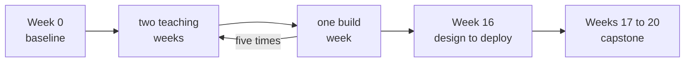

# Your twenty weeks

Week 0, Monday. How the programme runs, on one page. Keep it beside you until the rhythm is second
nature.

## Panel 1: The rhythm

Teaching runs from Monday 5 October 2026 to Saturday 20 February 2027. Build weeks are 3, 6, 9, 12 and 15; major exams sit in Weeks 5, 10 and 16.

**Crux:** Two teaching weeks, then a build week, five times; Week 0 comes before, and Week 16 and the capstone come after.

## Panel 2: Two roles to aim for, two on the way

| Weeks | The role | How the programme treats it |
|---|---|---|
| 7 to 12, and 14 | GenAI or AI Engineer | The primary track |
| 13 to 15 | Agentic AI Engineer | The primary track |
| 1 to 4, and Build 1 | Data or Business Analyst | Supported |
| 4 to 6 | Data Scientist, entry level | Supported |
| Week 16 and every build week | Forward Deployed Engineer | The way of working |

Computer vision is not taught and is not claimed.

**Crux:** The programme is built for two roles, covers two more on the way, and practises one way of working in every build week.

## Panel 3: The three shapes of a week

| Day | What runs |
|---|---|
| Teaching day | A business question, the thinking, the technique, your turn, a Kahoot |
| Saturday | A paper of about two hours, swapped and marked to a key, then the answers said aloud |
| Build week | A brief, a build with checkpoints, a mock interview, a group discussion, a live demo |

**Crux:** The quizzes and the Saturday paper are not graded; they tell you what to fix.

## Panel 4: The three seats

| Seat | Its first question |
|---|---|
| Business owner | What decision does this change, and by when? |
| AI engineer | What will it take to build, and how will we know it works? |
| Forward deployed engineer | Will it run where the client works, and who keeps it running? |

**Crux:** The seats are this programme's own way of seeing a project, and every build week you sit all three.

## Panel 5: This week, and your workspace

Rated and measured on Tuesday in one sitting, agreed in a ten-minute one-to-one on Wednesday or Thursday, and written on your baseline card.

Closing the tab does not stop a codespace. Stop it from github.com/codespaces, because the free plan's 120 core hours are about 30 hours on this starter's four cores.

**Crux:** The gap between what you claim and what you can do is this week's one number, and it is yours.
