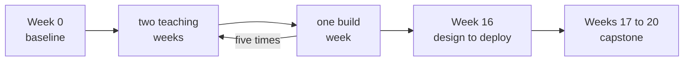
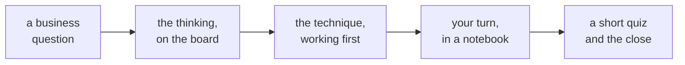
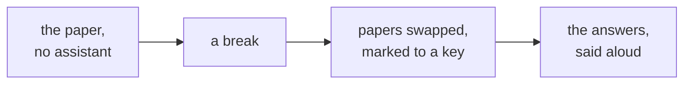
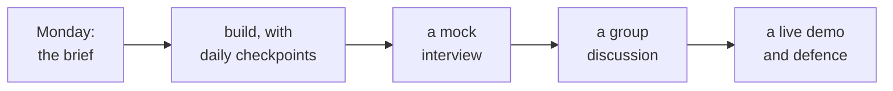
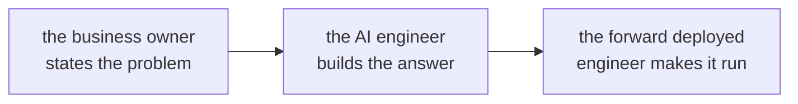
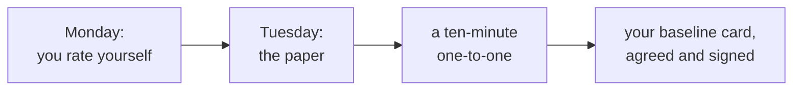
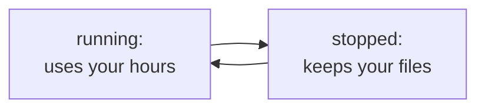

# Welcome: twenty weeks, one way of working

Week 0, Day 1. Slide source. One idea per slide.

Position bar, repeated at every section boundary:
`[the twenty weeks] > [the shape of a week] > [the three seats] > [this week] > [today]`

---

## SECTION A. The twenty weeks

---

## S1. Twenty weeks, one goal after them
Teaching runs from Monday 5 October 2026 to Saturday 20 February 2027, six days a week, on campus.

This week, Week 0, comes before it and is not graded.

After it comes the interview you sit for your first role: 510 hours across ten modules and 33 credits, all of it aimed at the roles on the next slide.

---

## S2. Six steps, each with a role you can interview for
| Weeks | You learn to | The role it opens |
|---|---|---|
| 1 to 4 | Read, question and explain data | Data or Business Analyst |
| 5 and 6 | Predict and evaluate honestly | Entry-level Data Scientist |
| 7 to 9 | Know what a language model is doing | The foundation for AI Engineer |
| 10 to 12 | Build a grounded assistant | GenAI or AI Engineer |
| 13 to 15 | Make it act, safely, in production | Agentic AI Engineer |
| 16 to 20 | Frame, propose, build and defend | Forward Deployed Engineer |

---

## S3. The rhythm: two weeks of teaching, then a build

Build weeks fall in Weeks 3, 6, 9, 12 and 15. Major exams sit in Weeks 5, 10 and 16.

---

## S4. The days off
Gandhi Jayanti on Friday 2 October, this week. Dussehra on Tuesday 20 October. The Monday after Diwali, 9 November. Guru Nanak Jayanti on Tuesday 24 November. Christmas Day on Friday 25 December. Republic Day on Tuesday 26 January 2027.

A week with a day off keeps its shape and loses that day.

---

## SECTION B. The shape of a week

---

## S5. A teaching day, in the order it runs

Every day opens on a question someone in a business is asking, in their words. The technique arrives third, because it exists to answer the question.

---

## S6. What a day leaves you with
Every day breaks something on purpose, with the exact error on the screen, because reading an error is half of the job.

The Kahoot at the close takes a few minutes and is not graded. It shows you, and us, what landed.

After the session: exercises posted on GitHub Discussions, a take-home with a check you can run yourself, and the setup for tomorrow, shipped the evening before.

---

## S7. Saturday: a paper, then the discussion

About two hours of objective questions on paper: fill in the blank, true or false, choose one or several, short scenarios, a little arithmetic, and steps put in order. Every question is one an interviewer asks. It is not graded and it is never a ranking: your score by topic tells you what to fix on Monday.

---

## S8. A build week: one brief, one live defence

Groups of four, a new business and a new brief each time, and no new teaching. Half of the mock interview is about your own project. An industry expert and a senior industry leader join at the end of the week.

---

## S9. After Week 16: the capstone, and interviews
Weeks 17 to 20 are your group's capstone, built in three sprints with a checkpoint each, then a live demo and a panel defence.

Placement preparation runs through the whole programme. Every mock interview is practice against a fixed rubric, behavioural questions join from the third, the challenges log on every project becomes your interview material, and company interviews come in the final weeks with preparation against each job description.

---

## SECTION C. The three seats

---

## S10. Three seats at every table

The forward deployed engineer makes the answer work inside the client's own systems. The three seats are this programme's own way of seeing a project, and in every build week your group sits all three.

---

## S11. Why the seats come before any tool
A technique is worth learning when some business owner needs its answer, some engineer has to build it, and someone has to make it run where the client works.

| Seat | Its first question |
|---|---|
| Business owner | What decision does this change, and by when? |
| AI engineer | What will it take to build, and how will we know it works? |
| Forward deployed engineer | Will it run where the client works, and who keeps it running? |

---

## SECTION D. This week

---

## S12. Week 0, day by day
| Day | What happens |
|---|---|
| Monday | Orientation, setup, and your self-rating |
| Tuesday | The institute's address, then the baseline check on paper, about two hours, no assistant |
| Wednesday | Python brush-up, then introductions: four minutes each, two on you and two on something you built and what broke |
| Thursday | Python into SQL, a class on stating a problem before solving it, then the SQL brush-up |
| Friday | Gandhi Jayanti, no session, with an optional practice set |
| Saturday | A session with a working forward deployed engineer |

---

## S13. Claimed, measured, agreed

The one-to-one with a TA runs on Wednesday or Thursday. None of it is graded. The gap between what you claimed and what the paper found belongs to you, and it decides what you fix first.

---

## D14. Rate your Python out of ten. What does a seven do?
**Question.** Say the number first. Then say what that number lets you do, in tasks rather than adjectives.

[S] Rate yourself in Python out of ten, and tell me what you would expect a seven to be able to do.

---

## D15. Answer: a number means nothing without a task
| Level | What you can do alone, today |
|---|---|
| A | All of it, and you could explain it to someone else |
| B | Most of it, looking up syntax now and then |
| C | Some of it, with an example open beside you |
| D | Not yet, or not in the last year |

"It" is the Python Week 1 uses: values, loops, records as dictionaries, functions that return, files, reading a traceback, and count, sum, mean and median. The self-rating form this afternoon uses the same four levels for Python, SQL, statistics and stating a problem.

---

## SECTION E. Today

---

## S16. Setup, in five ticks
| Tick | Done when |
|---|---|
| 1 | Your GitHub account exists and its email is verified |
| 2 | A codespace from GitHub's Jupyter starter is open |
| 3 | One notebook cell has run and drawn its chart |
| 4 | Your LMS login works |
| 5 | Your GitHub Education application is in, or noted as pending |

The help desk takes anything that does not work within two minutes.

---

## S17. Stop it when you leave

Closing the browser tab does not stop a codespace: it runs until 30 idle minutes pass. The free plan gives 120 core hours a month and this starter runs on four cores, which is about 30 hours of use. Stop it from github.com/codespaces when you finish. A codespace left stopped and untouched for 30 days is deleted.

---

## S18. Your client for twenty weeks
Kalpa Group, a fictional conglomerate.

You meet it, and its first question, on Monday 5 October.

---

## S19. Tomorrow: the paper, taken cold
On paper, about two hours, no assistant and no notes, and it is not graded.

Nothing to read tonight: the paper finds out where you are, not how well you prepared. Anything that failed in setup goes to the help desk before the paper starts.
