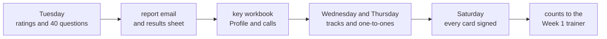

# The Week 0 plan

TRAINER ONLY. The whole baseline week on one page, for the Programme Head, the Academic TA and the
Support TA. Each day's own day sheet carries the detail.

## The week

| Day | First half | Second half | Ships that evening |
|---|---|---|---|
| <!-- sync:day-date:W00/D1 -->Mon 28 Sep 2026<!-- /sync:day-date:W00/D1 --> | The institute's arrival, verification and welcome | The academic orientation, 90 min, then accounts and workspace setup, 60 min | Tuesday's pre-read: the diagnostic, and a laptop and a pen |
| <!-- sync:day-date:W00/D2 -->Tue 29 Sep 2026<!-- /sync:day-date:W00/D2 --> | The institute's address and orientation | The diagnostic on the form, about 90 min, then a 10-minute briefing for the introductions | Wednesday's pre-read: four minutes each |
| <!-- sync:day-date:W00/D3 -->Wed 30 Sep 2026<!-- /sync:day-date:W00/D3 --> | The make-up for Tuesday's absentees, first thing; the Python brush-up in two tracks, about 3 h | The introductions, four minutes each, about 3 h | Thursday's pre-read: one function, and the SQL to come |
| <!-- sync:day-date:W00/D4 -->Thu 01 Oct 2026<!-- /sync:day-date:W00/D4 --> | Postgres in every codespace; Python part two, into SQL; the warden's framing class, 60 min | The SQL brush-up in two tracks, about 3 h | Saturday's pre-read, the self-prep page and the weekend project |
| Friday | Gandhi Jayanti, no session | The practice set, the weekend project and the self-prep page, all optional and self-checking | |
| <!-- sync:day-date:W00/SAT -->Sat 03 Oct 2026<!-- /sync:day-date:W00/SAT --> | The last one-to-ones, then the session with a working forward deployed engineer, one block of about four hours and up to six | The Week 1 readiness checklist | Sunday evening: Week 1 Monday's setup instructions and pre-read |

The one-to-ones, ten minutes each, run beside the practice tracks on Wednesday and Thursday, and the
last of them before Saturday's session.

## The baseline loop

| Step | Where it lives |
|---|---|
| The learner rates five areas on the form's first page, then answers forty questions | The form; `content/W00/D2/paper/` |
| The report email explains every answer on submission, and the results sheet takes a Profiles row | The form's builder, `content/W00/D2/internal/` |
| The key workbook turns each row into section scores, the brush-up calls and a note for the one-to-one | `content/W00/D2/answer-key/` |
| The Python call sets Wednesday's track and the SQL call sets Thursday's | Both day sheets |
| The one-to-one fills the baseline card: ratings beside scores, one gap, two dated actions | The card in `content/W00/D2/paper/`; the guide in `content/W00/D3/trainer/` |
| The discussion threads give the long explanations, posted after Wednesday's make-up | `content/W00/D2/study-notes/` |
| Every card is signed by Saturday, and the room's counts, without names, go to the Week 1 trainer | Saturday's day sheet |

## What moved from the tracker, and where it went

The student sheet is later than the tracker's Week 0 tab and is what learners have read, so the week
follows its running order and takes its content from the tab.

| In the tracker | In the week as built |
|---|---|
| A paper self-rating on Monday | The diagnostic's first page, on Tuesday |
| Four papers on Tuesday | The requester's diagnostic, one form; the four papers became Thursday's practice set |
| The warden's framing class on Wednesday | Thursday's one-hour class, with its Kahoot |
| The coaching-centre class on Thursday | Step 8 of the weekend project and the self-prep page's first exploration prompt |
| The project talks on Saturday | Wednesday's introductions |
| An industry leader on Saturday, to be confirmed | A working forward deployed engineer, still to be confirmed |

## The files, by day

| Day | Folder | The files a trainer opens first |
|---|---|---|
| Monday | `content/W00/D1/` | The day sheet, the orientation deck, the setup walkthrough |
| Tuesday | `content/W00/D2/` | The day sheet, the form page, the key workbook, the posting note |
| Wednesday | `content/W00/D3/` | The day sheet, the one-to-one guide, the introductions run sheet |
| Thursday | `content/W00/D4/` | The day sheet, the class run sheet, the Postgres setup sheet |
| Saturday | `content/W00/SAT/` | The day sheet, the guest brief, the readiness checklist |

## Still open

- The Saturday guest's name, organisation and mode, which the tracker keeps to be confirmed; the
  Saturday day sheet carries the fallback.
- The course repository, which is not open to learners yet, so each day sheet says to post the day's
  files where learners can copy them, and the discussion threads wait for it.
- Week 1 Monday's pre-read and setup instructions, due on Sunday evening, which belong to Week 1
  Monday's pack.
