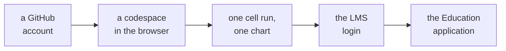

# Setup: your account, your workspace and your first cell

Sixty minutes, five ticks, and the help desk takes anything that does not work within two minutes.
Screens change their labels when a product changes, so each step says what the screen asks for;
match that rather than an exact button name.



---

## 1. A GitHub account

1. Open the sign-up page, https://github.com/signup (verified 27 Sep 2026).
2. The page asks for an email address, a password and a username, then sends a code to that email.
   You can sign up with a Google or Apple account instead.
3. Your username becomes the address of your portfolio, so choose one you would put on a CV.

**You should see** your GitHub home page, with your email verified.

**If the code does not arrive**, look in spam first, then ask the page to send it again.

---

## 2. A codespace from GitHub's Jupyter starter

Today's workspace is GitHub's own Jupyter starter, a template that proves your account and your
browser can run a notebook. Nothing is installed on your laptop.

1. While signed in, open the starter, https://github.com/github/codespaces-jupyter (verified 27 Sep 2026).
2. The page offers to use the repository as a template. Choose to use it, then choose to open it in
   a codespace.
3. VS Code opens in your browser. A terminal at the bottom installs the starter's packages, which can
   take a few minutes the first time.

**You should see** VS Code in the browser, a file list on the left with a `notebooks` folder, and
the terminal finishing its installation. Let it finish before step 3.

---

## 3. Run one cell

1. In the file list, open `notebooks/population.ipynb`.
2. Run the first code cell, with the run button beside it or with Shift and Enter together.
3. If VS Code asks which kernel or environment to run the notebook in, choose the Python environment
   the codespace set up for you.

**You should see** a line chart titled "Population of Atlantis" under the cell. That one chart means
the codespace, the notebook editor, Python, pandas, matplotlib and a file on disk all work.

**If you see this instead:**

```
ModuleNotFoundError: No module named 'pandas'
```

either the installation is still running, so wait for the terminal to finish and run the cell
again, or a different environment was chosen, so choose again. If it still fails, take it to the
help desk.

---

## 4. The LMS

1. Open the LMS address the ground team gives you today (address: to be found).
2. Sign in with the login the ground team issued.

**You should see** your programme's page. **If the login fails**, take it to the ground team the same
day.

---

## 5. The GitHub Education student application

Verification can take several days, so the application starts today.

1. Read GitHub's page on applying as a student, https://docs.github.com/en/education/about-github-education/github-education-for-students/apply-to-github-education-as-a-student (verified 27 Sep 2026),
   and start the application from it.
2. You qualify as a learner in a diploma-granting programme who owns a personal GitHub account.
3. The application asks for proof of current enrolment: a student ID showing a current enrolment
   date, a class schedule, a transcript, or an enrolment verification letter.
4. If recent applicants from your institution verified with an academic email address, it asks you
   to add and verify one on your GitHub account first.

**You should see** the application submitted. **If you do not have the document or the email yet**,
tell the help desk, which notes you as pending until the institute issues it.

---

## 6. Stop it when you leave

Closing the browser tab does not stop a codespace. It keeps running until 30 minutes pass with no
activity, and a running codespace uses your hours.

1. Open https://github.com/codespaces (verified 27 Sep 2026).
2. Beside your codespace, open its menu and choose to stop it.
3. From inside VS Code, the same thing is in the command palette: type `stop` and choose the command
   that stops the codespace.

The free plan gives 120 core hours a month. This starter runs on four cores, so a month holds about
30 hours of it. A stopped codespace keeps your files; one left stopped and untouched for 30 days is
deleted.

---

## For anyone who finishes early: the check

Create a new notebook in the codespace, paste this into its first cell and run it. Every line should
start with PASS.

```python
import os, sys, tempfile
import matplotlib
import pandas as pd

folder = tempfile.mkdtemp()
path = os.path.join(folder, "check.csv")
pd.DataFrame({"block": ["welcome", "setup", "self-rating"], "minutes": [90, 60, 15]}).to_csv(path, index=False)
back = pd.read_csv(path)

checks = [
    ("Python is 3.10 or later", sys.version_info >= (3, 10)),
    ("pandas imports, version " + pd.__version__, True),
    ("matplotlib imports, version " + matplotlib.__version__, True),
    ("a file written and read back holds 3 rows", len(back) == 3),
    ("the three blocks add to 165 minutes", int(back["minutes"].sum()) == 165),
]
for name, ok in checks:
    print(("PASS  " if ok else "FAIL  ") + name)
```

---

## What each check proves

| Check | What it proves |
|---|---|
| The account's verified email | GitHub can reach you, and your username is yours |
| The population chart | The codespace, the notebook editor, Python, pandas and matplotlib all work, and a file can be read |
| Five PASS lines | The same again, plus that you can create a file, write it and read it back |
| The LMS page | Your programme login works |
| The submitted application | GitHub Education has what it needs, and the verification clock has started |

## The help desk checklist

| Tick | Done when | Ticked |
|---|---|---|
| 1 | Your GitHub account exists and its email is verified | |
| 2 | A codespace from GitHub's Jupyter starter is open | |
| 3 | The population cell has run and drawn its chart | |
| 4 | Your LMS login works | |
| 5 | Your GitHub Education application is in, or noted as pending | |
