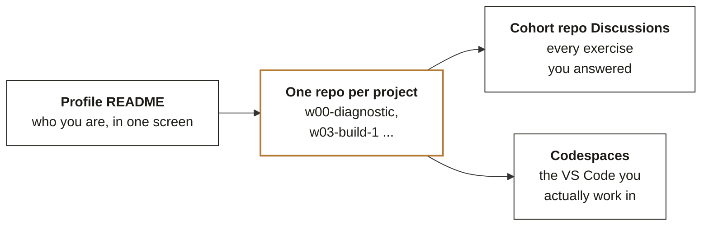

# Chapter 8 hands-on: a repository an interviewer can open

**Week 0 foundations guide, Chapter 8. Guided exercise, 60 minutes.** The chapter is
[Chapter 8 in the study notes](../../study-notes/C2_W00_D02_foundations_08_github_STUDENT.md), and
this walkthrough takes you through its hands-on in eleven steps, each with its minutes and a line that
says when you are done.

> **Meera's question.** "Revenue fell from Q1 to Q2, where did it go?"

Mini project 1 answers the first part of her question from ten order rows, and this exercise puts
that answer where anyone can open it: a public repository called `w00-diagnostic-python` whose README
shows the result and whose notebook runs in a Codespace. The chapter's moment is the first interview
around Week 15, when the interviewer opens your profile on a phone while you are still introducing
yourself.

The steps on github.com are yours to do by hand. Three files sit beside this walkthrough for the part
you run in the Codespace: the checker,
[`C2_W00_D02_foundations_08_readme_check_STUDENT.py`](C2_W00_D02_foundations_08_readme_check_STUDENT.py),
which reads a README and reports the five headings of Figure 32 one by one, and its two test inputs, a
README that passes,
[`C2_W00_D02_foundations_08_readme_pass_sample_STUDENT.md`](C2_W00_D02_foundations_08_readme_pass_sample_STUDENT.md),
and one that fails,
[`C2_W00_D02_foundations_08_readme_fail_sample_STUDENT.md`](C2_W00_D02_foundations_08_readme_fail_sample_STUDENT.md).

## 1. The anatomy, redrawn (4 minutes)

Before you open GitHub, redraw the chapter's picture on paper from memory: the four places an
interviewer looks, the arrows between them, and the one place that is ringed. Then compare your
drawing with Figure 28 below.



*Figure 28, from the chapter. Four places an interviewer looks, connected by the Codespace you work
in; this exercise builds the first repository in the ringed box.*

**You are done when** your drawing carries the four places, with the profile README leading to the
repositories, Discussions and Codespaces hanging off them, and the repositories ringed.

## 2. Lock the account (5 minutes)

Open Settings, then Password and authentication, and turn on two-factor authentication with an
authenticator app. Download the recovery codes and keep them somewhere that is not the laptop, since
losing the phone without them locks you out of your own portfolio. GitHub Docs, "Configuring
two-factor authentication", has the current screenshots for the app you choose.

**You are done when** Password and authentication shows two-factor authentication on, and the
recovery codes are saved off the laptop.

## 3. The profile README (5 minutes)

Create a public repository whose name is exactly your username, with Add a README file ticked; its
`README.md` shows at the top of your profile. Write four lines in it: who you are in one sentence,
what you are building on this programme, the three things you want to be good at by Week 20, and a
link to your best repository, which for now is the one step 4 creates. Three things you can
demonstrate, each linked to a repository as the weeks go on, read better to anyone who has hired than
a wall of badges.

**You are done when** your profile page opens on your four lines.

## 4. Create `w00-diagnostic-python` (4 minutes)

Click the plus in the top right, then New repository. Name it `w00-diagnostic-python`, add the
one-line description "Week 0 mini project, Python. Cleans Kalpa order rows and totals revenue by
tier.", keep it Public, tick Add a README file, choose the Python `.gitignore`, and create it.

**You are done when** the repository page shows `README.md` and `.gitignore` and shows the
repository as Public.

## 5. The README skeleton, committed in the browser (4 minutes)

Open `README.md`, click the pencil to edit, replace the text with the five headings of Figure 32
below, and choose Commit changes with the message "Add README skeleton". That is a commit: a saved,
named, dated change, and everything you do on GitHub from now on is a series of them.

```markdown
# w00-diagnostic-python
One sentence: what this does and for whom (Kalpa Retail's Q1 to Q2 revenue question).
## What it shows (the concept, in your words)
## How to run (open in Codespaces, run notebook.ipynb, top to bottom)
## Result (one table or one number, pasted)
## What I would do next (one honest limit)
```

**You are done when** the repository page shows "Add README skeleton" as its latest commit.

## 6. Open it in a Codespace (4 minutes)

On the repository page, click Code, then the Codespaces tab, then Create codespace on main. VS Code
opens in the browser with Python, a terminal and the repository's files, and nothing installs on your
laptop.

**You are done when** the Explorer lists `README.md` and a terminal is open in the repository's
folder.

## 7. Predict, then run the checker (8 minutes)

Predict before you paste anything. Read the failing sample beside this walkthrough and write down,
by number, the checks you expect it to fail: 1 is the title, 2 What it shows, 3 How to run, 4 Result
and 5 What I would do next.

Then, in the Codespace, make three new files beside `README.md` with the Explorer's New File button,
and paste into each the text of one file beside this walkthrough: `readme_check.py` takes the
checker's text, `sample_pass.md` the passing sample's, and `sample_fail.md` the failing sample's. Run
the passing sample first, in the terminal:

```
python3 readme_check.py sample_pass.md
```

It prints five PASS lines and exits with 0. Now run the failing sample with your numbers after
`--predict`, in the shape of this line:

```
python3 readme_check.py sample_fail.md --predict 2,5
```

The last line of the report says whether the run agreed with you.

**You are done when** that line says your prediction matches the run, or you can name the check you
misread and say why.

## 8. Trace the checker's walk by hand (6 minutes)

The checker reads a README one line at a time and opens a new section at every line that starts
with `#` outside a code fence. Before you ask for its walk, fill this table by hand for
`sample_fail.md`, one row per heading: the heading's line number, the check it matches, and how many
lines of text sit under it before the next heading.

| line | heading | matches | lines of text under it |
|---|---|---|---|
| | | | |
| | | | |
| | | | |
| | | | |
| | | | |

Then ask the checker for its walk and compare its table with yours, row by row:

```
python3 readme_check.py sample_fail.md --trace
```

A row that differs is a place where your reading of a README differs from the machine's. Count the
line numbers with care, because a blank line counts as a line.

**You are done when** your table and the checker's agree on every row.

## 9. Break it on purpose, then fill the README (12 minutes)

The chapter's trap is the Result heading: it is the one most people skip, and it is the only one
that proves the code ran. A README whose Result describes the notebook in a sentence carries all five
headings in the right order and looks finished at a glance, so a TA's quick skim and an interviewer's
twenty seconds on a phone both pass over the missing result.

**Break it.** Fill What it shows, How to run and What I would do next in your own `README.md` from
mini project 1, and write the Result the tempting way, as one sentence about what the notebook
prints, the way `sample_fail.md` does. Then run:

```
python3 readme_check.py README.md
```

The Result check fails with "it holds no table and no number", which is the question an interviewer
would otherwise have asked you: where is the result?

**The fix.** Run mini project 1's notebook top to bottom, paste its printed totals under Result as a
small table, and run the checker again. If mini project 1's notebook has not run yet, the Result keeps
failing, which is the checker telling the truth; come back to this step once the notebook has run.

**You are done when** the checker prints five PASS lines for `README.md` and exits with 0.

## 10. Commit, push and stop (4 minutes)

Delete the three files you pasted (right-click each in the Explorer, then Delete), so the commit
carries the README alone. Open the Source Control view, write a message such as "Add the result to
the README", commit and push. Then stop the codespace, which keeps your files and stops the clock; the
Codespaces quickstart in the chapter's Go deeper table shows where.

**You are done when** github.com shows your message as the repository's latest commit and the
README's Result shows the table.

## 11. The checklist a TA verifies in two minutes (4 minutes)

The chapter's own self-check, one line per item, with the step that satisfies it:

- Two-factor authentication is on and the recovery codes are saved off the laptop (step 2).
- The profile README exists with three claims and three links (step 3, with the links filling in as
  your mini project repositories appear).
- `w00-diagnostic-python` exists, is public, has the five-heading README and a notebook that runs top
  to bottom in a Codespace (steps 4 to 10, with the checker's five PASS lines for the README).
- At least one Discussion reply is posted in the required form: your answer letters on one line, two
  sentences on the item you were least sure of and why, and one reply to another learner. The path
  asks you to post the repository link in the Week 0 thread on Discussions.
- Your best repositories are pinned on your profile, where pins are the first thing shown.

**Back to Meera.** The one sentence you can now say to her: "The paid revenue by tier is in the
Result of the `w00-diagnostic-python` README, and anyone who doubts it can open the repository in a
Codespace and run the notebook from the top."

Nothing else from this folder goes into the repository. The README is the file an interviewer reads,
and the checker stays a tool you run before any commit that touches a README. The finished README for
mini project 1 is the solution,
[`C2_W00_D02_foundations_08_github_solution_STUDENT.md`](../solutions/C2_W00_D02_foundations_08_github_solution_STUDENT.md).
