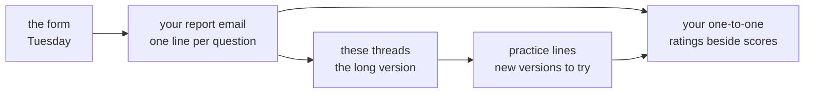

# Baseline diagnostic: the answers, the reasoning, and what to read next

This is the pinned thread for Tuesday's baseline diagnostic. Six threads below it work through every
question: a trace you can follow with a pencil, a picture, why each wrong option looks right, where
the rule comes from, and a new version of the question to try. This thread holds the map, the answers
at a glance, the questions learners ask most, and the best of the reading.

The diagnostic's own first page said what it is for: "This paper carries no marks and goes on no
transcript. It shows you, and the people running your first week, where each of us should start."

## The map

| Section | Questions | Time on the day | Thread |
|---|---|---|---|
| A. Python for data and GenAI | Q1 to Q12 | 30 min | Section A, part 1 (Q1 to Q6) and part 2 (Q7 to Q12) |
| B. SQL for data and GenAI | Q13 to Q20 | 20 min | Section B |
| C. Numbers and reasoning | Q21 to Q28 | 14 min | Section C |
| D. Case and scenarios | Q29 to Q34 | 10 min | Section D |
| E. Judgment calls | Q35 to Q40 | 5 min | Section E |

Each thread follows the same order for every question, so you can jump to the part you need.

The foundations guide works the same forty questions in one place, in
[Chapter 9](C2_W00_D02_foundations_09_diagnostic_worked_STUDENT.md), and its eight earlier chapters
give each section's picture, its history and a mini project to build; [the map](C2_W00_D02_foundations_00_map_STUDENT.md)
says where to start.

| Part | What it gives you |
|---|---|
| The answer | The letter and the one-sentence reason. |
| Trace it, Work it or Simulate it | The code, query or arithmetic run step by step, as a table you can check with a pencil. |
| Run it | The exact output from Python 3.11.15 or PostgreSQL 16.13, run on 28 September 2026. |
| The picture | One diagram of the idea. |
| Every option | Each option, why it tempts, and what actually happens. |
| Where the rule comes from | The documentation, paper or history behind the idea, with links. |
| Practise it | A changed version of the question to try on your own. |

## The answers at a glance

| Section | Answers |
|---|---|
| A | Q1 C, Q2 B, Q3 D, Q4 A, Q5 B, Q6 D, Q7 A, Q8 C, Q9 A, Q10 D, Q11 B, Q12 C |
| B | Q13 B, Q14 A, Q15 D, Q16 C, Q17 A, Q18 B, Q19 D, Q20 C |
| C | Q21 D, Q22 A, Q23 B, Q24 C, Q25 A, Q26 D, Q27 B, Q28 C |
| D | Q29 A, Q30 C, Q31 B, Q32 D, Q33 A, Q34 B |
| E, best then worst | Q35 C and A, Q36 B and D, Q37 D and B, Q38 A and C, Q39 C and D, Q40 B and A |

Section E scores the best pick and the worst pick separately, one point each, so the paper has 46
points in all: 34 from Sections A to D and 12 from Section E.

## Questions learners ask

**"Does the diagnostic count toward my grade?"**
No. The form said so on its first page: "This paper carries no marks and goes on no transcript." The
orientation deck lists the five graded components of the programme and adds: "Nothing else carries
marks."

**"What happens with my scores?"**
Three things. Your Python section decides which of two tracks you start Wednesday's Python brush-up
in, and a TA tells you which one, one to one; no list is posted. Your section scores sit beside your
own ratings on your baseline card, which you fill in with a TA in a ten-minute one-to-one on Wednesday
or Thursday. The team uses the room's results, with no names attached, to plan the rest of the week.
Nobody else sees your score, and nothing is ranked.

**"My report email never arrived."**
Check your spam folder first. If it is not there, the email address you typed was probably mistyped,
and the form cannot re-send the report on its own. Tell your TA, who has your results from the form
and will bring them to your one-to-one.

**"I submitted twice by mistake. Which one counts?"**
The first. The results sheet labels a second submission as a repeat, and your one-to-one uses the first
sitting.

**"What were the ratings on the first page for?"**
They record where you believed you stood in five areas before you saw a single question: 1 means you
have not used it, 2 that you can follow it when someone shows you, 3 that you can do it alone on a
small problem, and 4 that you can find and fix mistakes in someone else's version. Your one-to-one
puts each rating beside the section it matches and looks at where the two disagree most. A rating
above your score and a rating below it are both useful information, and neither is a fault.

**"And the ten statements about how I work?"**
The form said it plainly: "These have no right answers and no marks." They help your TA understand how
you like to work, for example how quickly you ask for help when stuck.

**"Why were some questions about LLMs?"**
Eight questions (Q4, Q5, Q11, Q19, Q20, Q28, Q33 and Q34) involve work with LLMs: counting labels a
model produced, reading an API response, building a prompt template, querying logs of model calls,
estimating token costs, sampling, and checking a model's ratings. Together they give a separate score
out of 8, which sits beside your rating for "Using LLM tools for work".

**"Why was no AI assistant allowed?"**
Because the diagnostic measures you. The programme's AI-use ladder, from the orientation, keeps core
exercises and every assessment assistant-free in Weeks 1 to 6, so the diagnostic was your first
practice of a rule that holds for six weeks.

**"I scored low in a section. What should I do?"**
Read that section's thread, starting with the questions you missed. For each one, cover the answer,
redo the question from a blank notebook or a blank page, and only then compare. Do this before the
weekend, and bring what you found to your one-to-one.

**"I think one of the answers is wrong."**
Reply in that section's thread with the question number, your answer and your reasoning, and a TA
will answer there. Every snippet and query in the threads was run before it was posted, so if your own
run disagrees, paste your output in the reply.

**"Can I take it again?"**
The diagnostic is sat once, as a baseline, so the first sitting is the one that counts. Every question
in the threads ends with a practice version you can try as often as you like.

**"I am stuck on setup, not on a question. Where do I ask?"**
In your setup thread, with the exact error text pasted as text. Section E's Q39 explains why the exact
text matters.

## Watch and read: the best of each section

The video titles and channels below were checked on 28 September 2026. Each section's thread has a
longer list.

- For Section A, watch Ned Batchelder's "Facts and Myths about Python names and values" from PyCon 2015, 25 minutes: https://www.youtube.com/watch?v=_AEJHKGk9ns (checked 28 September 2026).
- For Section A, read "Common Gotchas" in The Hitchhiker's Guide to Python: https://docs.python-guide.org/writing/gotchas/ (checked 28 September 2026).
- For Section B, watch "SQL Window Functions | Clearly Explained | PARTITION BY, ORDER BY, ROW_NUMBER, RANK, DENSE_RANK" by Maven Analytics: https://www.youtube.com/watch?v=rIcB4zMYMas (checked 28 September 2026).
- For Section B, read Markus Winand's "The Three-Valued Logic of SQL": https://modern-sql.com/concept/three-valued-logic (checked 28 September 2026).
- For Section C, watch "The medical test paradox, and redesigning Bayes' rule" by 3Blue1Brown: https://www.youtube.com/watch?v=lG4VkPoG3ko (checked 28 September 2026).
- For Section C, read the Stanford Encyclopedia of Philosophy's "Simpson's Paradox": https://plato.stanford.edu/entries/paradox-simpson/ (checked 28 September 2026).
- For Section D, watch "Ronny Kohavi: A/B Testing Pitfalls: Getting Numbers You Can Trust is Hard - CXL LIVE 2016" by CXL: https://www.youtube.com/watch?v=HEGI5QN3fXE (checked 28 September 2026).
- For Section D, read Eugene Yan's "Evaluating the Effectiveness of LLM-Evaluators (aka LLM-as-Judge)": https://eugeneyan.com/writing/llm-evaluators/ (checked 28 September 2026).
- For Section E, watch "Building a psychologically safe workplace | Amy Edmondson | TEDxHGSE" by TEDx Talks: https://www.youtube.com/watch?v=LhoLuui9gX8 (checked 28 September 2026).
- For Section E, read the Google SRE book's chapter "Postmortem Culture: Learning from Failure": https://sre.google/sre-book/postmortem-culture/ (checked 28 September 2026).
