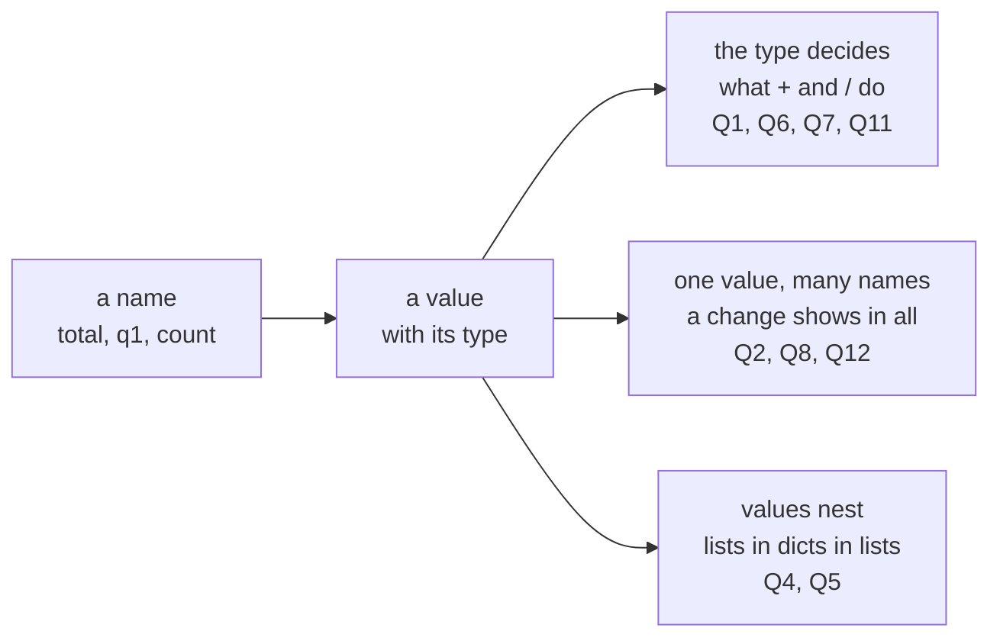
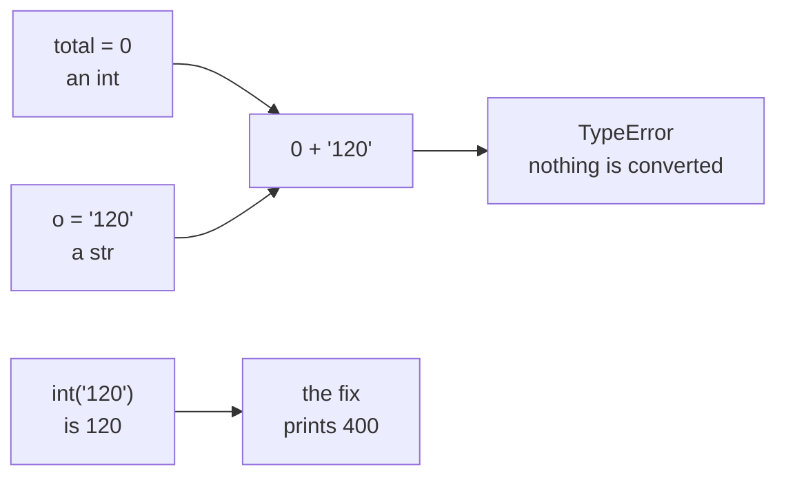
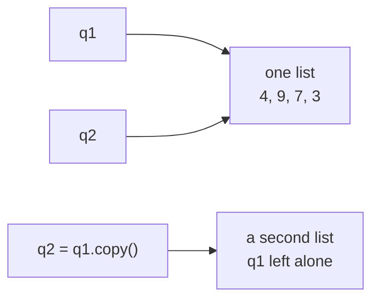
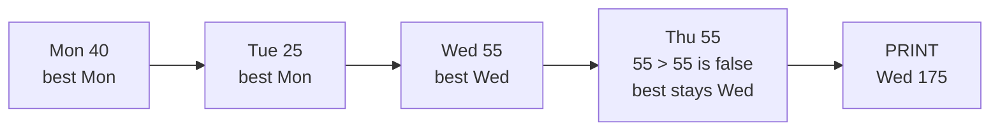
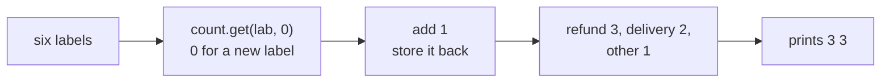
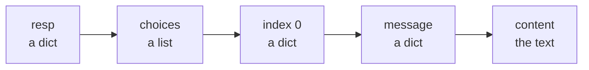
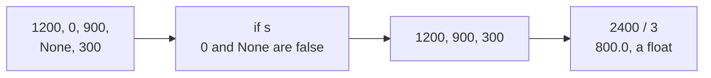

# Diagnostic, Section A, part 1: Python, questions 1 to 6 worked

Section A was the largest section: twelve Python questions in about thirty minutes. This thread works
through the first six, and part 2 works through Q7 to Q12. Every snippet was run in Python 3.11.15 on
28 September 2026, and every output block is exactly what Python printed. The quotes come from the
Python 3.14.7 documentation, which docs.python.org served that day.

Your report email gave one line per question. This thread gives the long version: a trace of every
name after every line, a picture, why each wrong option looks right, where the rule comes from, and a
change to try yourself.

| Question | What it tests | Answer |
|---|---|---|
| Q1 | It tests adding a string to a number. | C |
| Q2 | It tests two names for one list. | B |
| Q3 | It tests tracing a loop with a strict comparison and a tie. | D |
| Q4 | It tests counting with `dict.get` and a default. | A |
| Q5 | It tests reading text out of a nested LLM response. | B |
| Q6 | It tests which values an `if` treats as false, and what `/` returns. | D |

## How to use this thread

- Open your report email beside this thread and read the questions you missed before the ones you
  got right.
- Cover the answer and trace the code on paper first, writing the value of every name after every
  line. That habit is the skill this section measures.
- Reply in this thread with the question number when your own run disagrees with anything here.

## One picture for the whole section

In Python, a name points at a value, and every value carries its type. The type decides what an
operator does, and one value can carry several names at once.



---

## Q1. Predict the output

The question asked what this code prints.

```python
orders = ["120", "80", "200"]
total = 0
for o in orders:
    total = total + o
print(total)
```

**The answer is C: TypeError, since int and str cannot be added.** `total` starts as the integer 0 and
every `o` is a string, so the first `+` has no meaning and Python stops.

**Trace it.**

| Pass | `o` | `total` before | What runs | Result |
|---|---|---|---|---|
| 1 | `"120"`, a str | `0`, an int | `0 + "120"` | TypeError, and the loop never reaches pass 2 |

**Run it.** The last line of the traceback reads:

```text
TypeError: unsupported operand type(s) for +: 'int' and 'str'
```

Python's tutorial says where to look first: "The last line of the error message indicates what
happened."

**The picture.**



**Every option.**

| Option | It says | Why it tempts | What happens |
|---|---|---|---|
| A | 400, since the strings are converted to numbers first | Spreadsheets convert text that looks like a number, so it feels as if Python would too. | Python converts nothing on its own; with `total = total + int(o)` the loop prints 400. |
| B | 12080200, since + joins the strings together | `+` does join strings when both sides are strings. | `total` starts as the integer 0; starting from `total = ""` would print 12080200. |
| C | TypeError, since int and str cannot be added | This is the answer. | The first pass fails on `0 + "120"`. |
| D | 0, since the loop body never runs at all | An error that stops early can look like a loop that never started. | The list holds three strings, so the body runs and fails on its first pass. |

**Where the rule comes from.** PEP 20, "The Zen of Python" by Tim Peters, recorded as a Python
Enhancement Proposal in 2004, sets out two of the rules at work: "Explicit is better than implicit" and "In the face of ambiguity, refuse the
temptation to guess." `"120" + 0` could mean 120 or "1200", so Python refuses to guess. The language
reference states it formally for `+`: "The arguments must either both be numbers or both be sequences
of the same type." The message depends on which side comes first: `"120" + 0` gives
`TypeError: can only concatenate str (not "int") to str`, the example Python's own tutorial uses.

Sources: [PEP 20, The Zen of Python](https://peps.python.org/pep-0020/), checked 28 September 2026; [Python language reference, binary arithmetic operations](https://docs.python.org/3/reference/expressions.html#binary-arithmetic-operations), checked 28 September 2026; [Python tutorial, errors and exceptions](https://docs.python.org/3/tutorial/errors.html#exceptions), checked 28 September 2026.

**Practise it.** Change the fourth line to `total = total + int(o)` and predict the output, which is
400. Then run `"120" + 0` on its own and read the other message.

---

## Q2. Spot the bug, if there is one

The question: Kavya expected `q1` to stay as `[4, 9, 7]`. The code prints `4 9`. Which statement is
right?

```python
q1 = [4, 9, 7]
q2 = q1
q2.append(3)
print(len(q1), sorted(q1)[-1])
```

**The answer is B: the code is right, because `q2 = q1` makes both names refer to one list, and
`q2 = q1.copy()` would give a separate one.** Assignment never copies a list; it gives the same list a
second name.

**Trace it.**

| Line | What happens | The one list |
|---|---|---|
| `q1 = [4, 9, 7]` | A list is built and named `q1`. | `[4, 9, 7]` |
| `q2 = q1` | The same list gets a second name, `q2`. | `[4, 9, 7]` |
| `q2.append(3)` | The one list grows, whichever name is used. | `[4, 9, 7, 3]` |
| `print(len(q1), sorted(q1)[-1])` | `len` is 4, and `sorted` builds a new sorted list, `[3, 4, 7, 9]`, whose last item is 9. | `[4, 9, 7, 3]` |

**Run it.** The code, then `print(q1 is q2, q1)` added at the end:

```text
4 9
True [4, 9, 7, 3]
```

With `q2 = q1.copy()` in the second line, the same code prints `3 9`, and `q1 is q2` is False.

**The picture.**



**Every option.**

| Option | It says | Why it tempts | What happens |
|---|---|---|---|
| A | There is a bug: q2 = q1 should have copied the list and Python failed to, so the change leaked into q1 | In maths, "let y equal x" copies a number, so assignment feels like copying. | Python did exactly what assignment means: one list, two names, and no failure. |
| B | The code is right: q2 = q1 makes both names refer to one list; q2 = q1.copy() would give a separate one | This is the answer. | The append shows through both names because there is only one list. |
| C | append() cannot affect q1 because it was called on q2, so the printed 4 must come from somewhere else in the program | The code says `q2.append`, and never touches `q1` by name. | `q1` and `q2` are the same list, so an append through either name changes it. |
| D | sorted() changed q1 in place, and that in-place sort is what added the fourth element to the list | Something changed `q1`, and `sorted` is the other call on the line. | `sorted` returns a new list and leaves `q1` as it was; a sort adds no elements in any case. |

**Where the rule comes from.** Ned Batchelder's article "Facts and myths about Python names and
values", which became his PyCon 2015 talk, puts it in one line: "Fact: Assignment never copies data."
The `copy` module's documentation says the same: "Assignment statements in Python do not copy
objects, they create bindings between a target and an object." Python's FAQ has an entry for this
exact surprise, "Why did changing list 'y' also change list 'x'?", which adds how to check: "If you
want to know if two variables refer to the same object or not, you can use the is operator, or the
built-in function id()." `list.copy()` itself arrived in Python 3.3.

Sources: [Ned Batchelder, Facts and myths about Python names and values](https://nedbatchelder.com/text/names), checked 28 September 2026; [Python documentation, the copy module](https://docs.python.org/3/library/copy.html), checked 28 September 2026; [Python FAQ, why did changing list y also change list x](https://docs.python.org/3/faq/programming.html#why-did-changing-list-y-also-change-list-x), checked 28 September 2026.

**Practise it.** Print `q1 is q2` straight after `q2 = q1`, then again after changing that line to
`q2 = q1.copy()`, and say why the answer flips.

---

## Q3. Trace the flow (pseudocode)

The question gave pseudocode, which is no particular language, and asked what it prints.

```text
SET running_total TO 0
SET best_day TO none
FOR EACH (day, revenue) IN [(Mon, 40), (Tue, 25), (Wed, 55), (Thu, 55)]
    running_total <- running_total + revenue
    IF best_day IS none OR revenue > best_revenue THEN
        best_day <- day
        best_revenue <- revenue
    END IF
END FOR
PRINT best_day, running_total
```

**The answer is D: Wed 175.** The comparison is strict, so Thursday's 55 does not beat Wednesday's
55, while the running total keeps adding through Thursday.

**Trace it.** The same logic run in Python, printing the state after each pass:

```text
Mon 40 40 Mon 40
Tue 25 65 Mon 40
Wed 55 120 Wed 55
Thu 55 175 Wed 55
Wed 175
```

Each line shows the day, its revenue, the running total, the best day and the best revenue.

**The picture.**



**Every option.**

| Option | It says | Why it tempts | What happens |
|---|---|---|---|
| A | Thu 175 | It reads `>` as "at least as big", which lets Thursday's tie win. | With `>=` in place of `>`, the output is indeed Thu 175. |
| B | Wed 120 | It stops the total when the best day is found. | The total adds every day, so Thursday's 55 takes it from 120 to 175. |
| C | Thu 55 | It prints the last day and its revenue. | The print shows the best day and the running total. |
| D | Wed 175 | This is the answer. | The strict comparison keeps the first of the tied days. |

**Where the rule comes from.** Python's own `max()` makes the same choice on ties: "If multiple items
are maximal, the function returns the first one encountered." Asking `max()` for the best day by
revenue returns `('Wed', 55)`, so a hand-written loop with a strict `>` and the built-in agree.

Source: [Python documentation, max()](https://docs.python.org/3/builtins/functions.html#max), checked 28 September 2026.

**Practise it.** Change `>` to `>=` and trace again. The output becomes Thu 175, because a tie now
replaces the best day.

---

## Q4. Predict the output

The question: an LLM has labelled six support tickets. What does the code print?

```python
labels = ["refund", "delivery", "refund", "refund", "delivery", "other"]
count = {}
for lab in labels:
    count[lab] = count.get(lab, 0) + 1
print(count["refund"], len(count))
```

**The answer is A: 3 3.** Three tickets carry the label refund, and the dictionary ends with three
keys, one per distinct label.

**Trace it.**

| Label | `count` after the line |
|---|---|
| refund | `{'refund': 1}` |
| delivery | `{'refund': 1, 'delivery': 1}` |
| refund | `{'refund': 2, 'delivery': 1}` |
| refund | `{'refund': 3, 'delivery': 1}` |
| delivery | `{'refund': 3, 'delivery': 2}` |
| other | `{'refund': 3, 'delivery': 2, 'other': 1}` |

**Run it.**

```text
3 3
```

**The picture.**



**Every option.**

| Option | It says | Why it tempts | What happens |
|---|---|---|---|
| A | 3 3 | This is the answer. | Three refunds, and three distinct keys. |
| B | 3 6 | Six labels went in, so six feels like the size. | `len(count)` counts keys, and repeated labels share a key. |
| C | 6 3 | It counts every ticket under refund. | Each label adds 1 only to its own key. |
| D | KeyError: 'refund' | Reading a key that is not there yet does raise KeyError. | `count.get(lab, 0)` returns 0 for a missing key; the version without `.get`, `count[lab] = count[lab] + 1`, is the one that stops with `KeyError: 'refund'`. |

**Where the rule comes from.** Python's documentation for `dict.get` says it returns "the value for
key if key is in the dictionary, else default. If default is not given, it defaults to None, so that
this method never raises a KeyError." Raymond Hettinger's PyCon 2013 talk "Transforming Code into
Beautiful, Idiomatic Python" counts colours with the same line, `d[color] = d.get(color, 0) + 1`.
The standard library packages the pattern as `collections.Counter`, "a dict subclass for counting
hashable objects", added in Python 3.1. Counting labels is also the first check on any LLM labelling
run: before reading a single ticket, look at how many of each label came back.

Sources: [Python documentation, dict.get](https://docs.python.org/3/builtins/stdtypes.html#dict.get), checked 28 September 2026; [Python documentation, collections.Counter](https://docs.python.org/3/library/collections.html#collections.Counter), checked 28 September 2026.

**Practise it.** Rewrite the loop as `count = Counter(labels)` after `from collections import
Counter`, and check that `count["refund"]` and `len(count)` still give 3 and 3.

---

## Q5. Fix the code

The question: the last line raises `TypeError: list indices must be integers or slices, not str`.
Which replacement for the last line returns the text 'Refund approved'?

```python
resp = {"choices": [{"message": {"role": "assistant", "content": "Refund approved"}}],
        "usage": {"prompt_tokens": 412, "completion_tokens": 9}}
text = resp["choices"]["message"]["content"]
```

**The answer is B: `text = resp["choices"][0]["message"]["content"]`.** `resp["choices"]` is a list,
so it needs an integer index before anything inside it can be reached.

**Trace it.** Walk the structure one level at a time.

| Expression | What it is |
|---|---|
| `resp` | A dict with the keys "choices" and "usage". |
| `resp["choices"]` | A list holding one dict. |
| `resp["choices"][0]` | That dict, whose one key is "message". |
| `resp["choices"][0]["message"]` | A dict with "role" and "content". |
| `resp["choices"][0]["message"]["content"]` | The string 'Refund approved'. |

**Run it.** Each option in place of the last line:

```text
A: TypeError: list indices must be integers or slices, not str
B: 'Refund approved'
C: AttributeError: 'dict' object has no attribute 'choices'
D: TypeError: list indices must be integers or slices, not str
```

**The picture.**



**Every option.**

| Option | It says | Why it tempts | What happens |
|---|---|---|---|
| A | `text = resp["choices"]["message"][0]["content"]` | It adds the missing `[0]`. | The `[0]` sits one step too late; `resp["choices"]["message"]` still indexes a list with a string and fails first. |
| B | `text = resp["choices"][0]["message"]["content"]` | This is the answer. | Each index matches the type it is applied to. |
| C | `text = resp.choices.message.content` | OpenAI's Python library returns objects that are read this way, as in `completion.choices[0].message.content`. | A plain dict has keys, never attributes, so this fails at once; even on the library's objects, `choices` would still need `[0]`. |
| D | `text = resp["choices"]["message"]["content"][0]` | It keeps the original line and indexes the result. | The original line fails before the `[0]` is reached. |

**Where the rule comes from.** OpenAI's API reference describes `choices` as "A list of chat
completion choices. Can be more than one if n is greater than 1", which is why a reply you expect to
be single still sits inside a list. OpenRouter, which passes requests to many providers, follows the
same shape and says "choices is always an array, even if the model only returns one completion." Two
cautions for real code: OpenAI's reference types `content` as "string or null", so check it before
using it, and OpenAI's own library README now calls Chat Completions "The previous standard
(supported indefinitely)", with the newer Responses API as its primary interface.

Sources: [OpenAI API reference, create chat completion](https://developers.openai.com/api/reference/resources/chat/subresources/completions/methods/create/), checked 28 September 2026; [OpenAI Python library README](https://raw.githubusercontent.com/openai/openai-python/main/README.md), checked 28 September 2026; [OpenRouter API reference overview](https://openrouter.ai/docs/api_reference/overview), checked 28 September 2026.

**Practise it.** Before indexing anything unfamiliar, print its type one level at a time:
`type(resp)`, then `type(resp["choices"])`, then `type(resp["choices"][0])`. The types tell you which
index to use next.

---

## Q6. Predict the output

The question asked what this code prints.

```python
sales = [1200, 0, 900, None, 300]
clean = [s for s in sales if s]
print(sum(clean) / len(clean), len(sales) - len(clean))
```

**The answer is D: 800.0 2.** In an `if`, both 0 and None count as false, so the comprehension drops
two values, and `/` always returns a float.

**Trace it.**

| `s` | `if s` | Kept in `clean` |
|---|---|---|
| 1200 | true | yes |
| 0 | false | no |
| 900 | true | yes |
| None | false | no |
| 300 | true | yes |

`clean` is `[1200, 900, 300]`, so the sum is 2400, the length is 3, and 2400 / 3 is 800.0. Two values
were dropped.

**Run it.** The code, then the same code with `if s is not None` in place of `if s`:

```text
800.0 2
600.0 1
```

**The picture.**



**Every option.**

| Option | It says | Why it tempts | What happens |
|---|---|---|---|
| A | 600.0 1 | It assumes `if s` drops only None. | That is what `if s is not None` gives; plain `if s` drops the 0 as well. |
| B | 800 2 | The numbers are right. | `/` always returns a float in Python 3, so it prints 800.0. |
| C | TypeError, because None cannot be summed | `sum` of a list containing None does fail. | The comprehension removed None before `sum` ran. |
| D | 800.0 2 | This is the answer. | Two values dropped, and a float average. |

**A second look.** Is a zero sale missing data? If 0 means a day that sold nothing, dropping it raises
the average from 600 to 800, and the report now describes only the good days. Ask what 0 means in the
data before choosing the filter.

**Where the rule comes from.** Python's documentation on truth value testing lists the built-in
values that count as false: "constants defined to be false: None and False", "zero of any numeric
type", and "empty sequences and collections". Truth testing is older than the bool type itself: PEP
285, which added True and False in Python 2.3 in 2002, says it "does not change the fact that almost
all object types can be used as truth values." The float comes from PEP 238, which made `/` true
division in Python 3.

Sources: [Python documentation, truth value testing](https://docs.python.org/3/builtins/stdtypes.html#truth-value-testing), checked 28 September 2026; [PEP 285, Adding a bool type](https://peps.python.org/pep-0285/), checked 28 September 2026; [PEP 238, Changing the Division Operator](https://peps.python.org/pep-0238/), checked 28 September 2026.

**Practise it.** Write both filters side by side and say which one answers "the average sale on days
that sold something" and which answers "the average over every recorded day".

---

## Questions learners ask about this section

**"The outputs came from Python 3.11 and the quotes from the 3.14 documentation. Does that matter?"**
Not for these questions. Every behaviour they test is documented in the 3.14.7 documentation quoted
here, and the outputs came from 3.11.15. The wording of an error message can shift slightly between
versions, so compare the type of error first and the wording second. Run `python --version` in your
Codespace to see yours.

**"What is the fastest way to get better at predicting output?"**
Trace by hand. For each question you missed, write the value and type of every name after every line,
as in the trace tables here, then run the code and compare. The gap between your table and the run is
exactly what to practise.

**"Q5 uses a made-up response. Do real responses look like that?"**
The shape is the one OpenAI's reference documents for chat completions, trimmed to the fields the
question needs. Real responses carry more fields, such as an id and the model name, around the same
`choices`, `message` and `content` path.

## The interview question this section answers

Tuesday's row carries **[SV] Predict the output of this snippet.** Q1, Q3, Q4 and Q6 in this thread,
and Q8 in part 2, ask it. A strong answer reads the code a line at a time, keeps each variable's value
as it changes, and gives the output with its type: for `print(9 / 3)`, "3.0, a float, because `/`
always gives a float in Python 3". The weak answer guesses from the shape of the code.

## Watch and read

The video details below were checked on 28 September 2026.

- Watch Ned Batchelder's "Facts and Myths about Python names and values" from PyCon 2015, 25 minutes, for Q2: https://www.youtube.com/watch?v=_AEJHKGk9ns (checked 28 September 2026).
- Watch Raymond Hettinger's "Transforming Code into Beautiful, Idiomatic Python" from PyCon 2013 on the Next Day Video channel, 49 minutes, for Q4: https://www.youtube.com/watch?v=OSGv2VnC0go (checked 28 September 2026).
- Read Ned Batchelder's "Facts and myths about Python names and values", for Q2: https://nedbatchelder.com/text/names (checked 28 September 2026).
- Read the Python tutorial's chapter on errors and exceptions, for Q1 and for reading any traceback: https://docs.python.org/3/tutorial/errors.html (checked 28 September 2026).
- Read the Python documentation on truth value testing, for Q6: https://docs.python.org/3/builtins/stdtypes.html#truth-value-testing (checked 28 September 2026).
