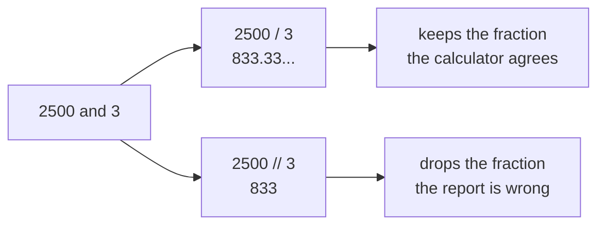
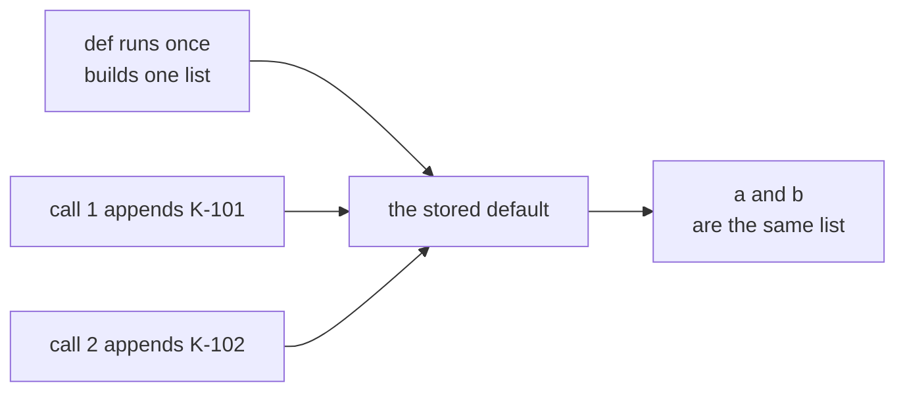
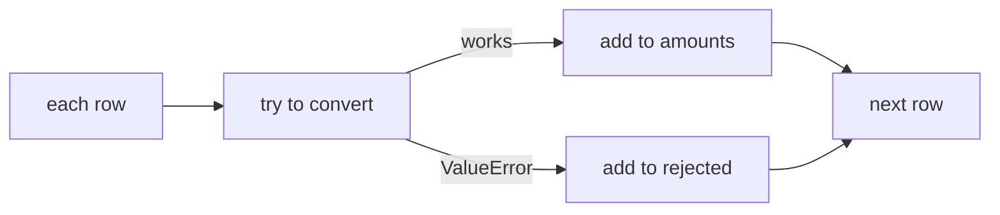
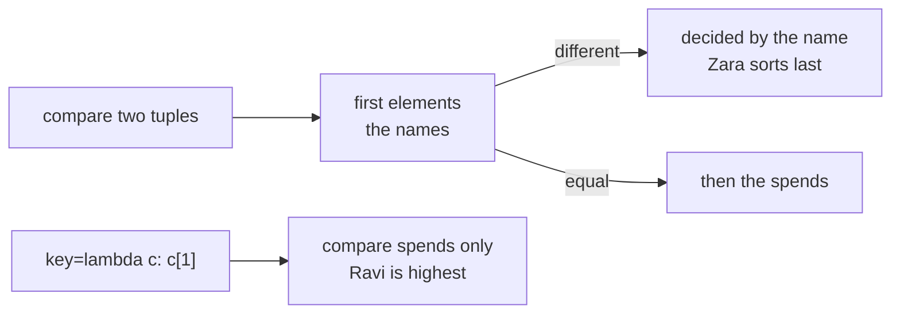
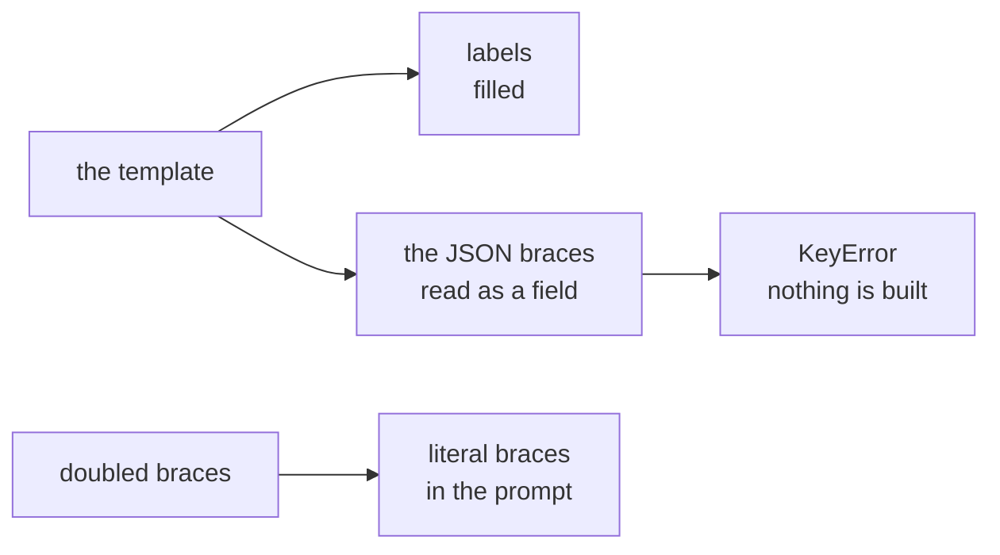
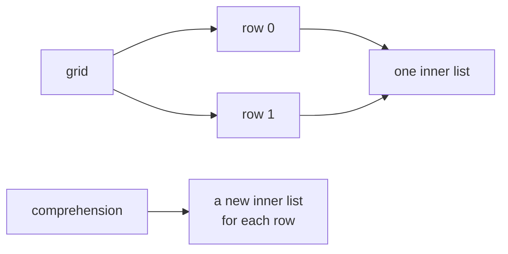

# Diagnostic, Section A, part 2: Python, questions 7 to 12 worked

This thread works through the second half of Section A, Q7 to Q12; part 1 has Q1 to Q6 and the
picture for the whole section. Every snippet was run in Python 3.11.15 on 28 September 2026, and
every output block is exactly what Python printed. The quotes come from the Python 3.14.7
documentation, which docs.python.org served that day.

| Question | What it tests | Answer |
|---|---|---|
| Q7 | It tests finding the line where `//` drops the fraction. | A |
| Q8 | It tests a list used as a default argument. | C |
| Q9 | It tests skipping and counting every bad value with `try` inside the loop. | A |
| Q10 | It tests how Python sorts tuples, and the `key` that changes it. | D |
| Q11 | It tests braces inside a `str.format` template. | B |
| Q12 | It tests building a grid of independent rows. | C |

## How to use this thread

- Open your report email beside this thread and read the questions you missed before the ones you
  got right.
- Cover the answer and trace the code on paper first, writing the value of every name after every
  line.
- Reply in this thread with the question number when your own run disagrees with anything here.

---

## Q7. Which line

The question: Kavya's calculator gives 833.33 as the Plus average for the same rows, but the function
returns 833. Which line causes the difference?

```text
 1  def average_by_tier(rows):
 2      totals = {}
 3      counts = {}
 4      for tier, amount in rows:
 5          totals[tier] = totals.get(tier, 0) + amount
 6          counts[tier] = counts.get(tier, 0) + 1
 7      result = {}
 8      for tier in totals:
 9          result[tier] = totals[tier] // counts[tier]
10      return result
```

**The answer is A: line 9, because `//` discards the fraction.** `//` is floor division; `/` keeps the
fraction.

**Trace it.** The question does not give the rows, so take three Plus orders made up for this thread:
Rs 1,000, Rs 700 and Rs 800.

| After | `totals` | `counts` | `result` |
|---|---|---|---|
| The first loop | `{'Plus': 2500}` | `{'Plus': 3}` | not built yet |
| Line 9 | `{'Plus': 2500}` | `{'Plus': 3}` | `{'Plus': 833}`, since 2500 // 3 is 833 |

**Run it.** The function on those rows, then five divisions side by side,
`print(2500 / 3, round(2500 / 3, 2), 2500 // 3, -7 // 2, int(-7 / 2))`:

```text
{'Plus': 833}
833.3333333333334 833.33 833 -4 -3
```

The last two numbers show what "floor" means: `//` rounds down, toward minus infinity, so -7 // 2 is
-4, while cutting the decimals off -3.5 gives -3.

**The picture.**



**Every option.**

| Option | It says | Why it tempts | What happens |
|---|---|---|---|
| A | Line 9: the // operator discards the fraction | This is the answer. | `totals[tier] / counts[tier]` returns 833.333..., and `round(..., 2)` makes it 833.33 for the report. |
| B | Line 5: totals should be written with += amount | `+=` is the common style, so line 5 looks unfinished. | Line 5 already adds the amount; `totals[tier] += amount` would even fail on a tier's first row, since the key does not exist yet. |
| C | Line 6: counts should start from 1, not 0 | Counting from 1 sounds natural. | `counts.get(tier, 0) + 1` already gives 1 for a tier's first row; starting at 1 would count every tier one too high. |
| D | No line: the calculator is showing extra decimals | Calculators do show long decimals. | 833.33 is the true average of the rows, and the function throws away the 0.33. |

**Where the rule comes from.** PEP 238, written in 2001 by Moshe Zadka and Guido van Rossum, explains
why Python has two operators. The old `/` "has an ambiguous meaning for numerical arguments", giving
floor division for integers and true division for floats, so the PEP proposed "x/y to return a
reasonable approximation of the mathematical result of the division ("true division"), x//y to
return the floor ("floor division")", and made true division standard in Python 3.0. The language
reference states today's rule: "Division of integers yields a float, while floor division of integers
results in an integer." PostgreSQL chose differently, as Section B's Q14 shows: it divides two
integers by cutting toward zero, so the two languages even disagree on negative numbers.

Sources: [PEP 238, Changing the Division Operator](https://peps.python.org/pep-0238/), checked 28 September 2026; [Python language reference, binary arithmetic operations](https://docs.python.org/3/reference/expressions.html#binary-arithmetic-operations), checked 28 September 2026.

**Practise it.** Predict `7 / 2`, `7 // 2`, `-7 // 2` and `7 % 2` before running them. They are 3.5, 3,
-4 and 1.

---

## Q8. Predict the output

The question asked what this code prints.

```python
def tag_order(order_id, tags=[]):
    tags.append(order_id)
    return tags

a = tag_order("K-101")
b = tag_order("K-102")
print(a, b)
```

**The answer is C: `['K-101', 'K-102'] ['K-101', 'K-102']`.** The default list is built once, when
the function is defined, so both calls append to the same list and both names end up pointing at it.

**Trace it.**

| Moment | What happens | The one default list |
|---|---|---|
| `def` runs | The default `[]` is built once and stored with the function. | `[]` |
| `a = tag_order("K-101")` | No list is passed, so `tags` is the stored default; K-101 goes in, and that list is returned. | `['K-101']` |
| `b = tag_order("K-102")` | The same stored list is used again. | `['K-101', 'K-102']` |
| `print(a, b)` | `a` and `b` are both that one list. | printed twice |

**Run it.** The code, then `print(a is b, tag_order.__defaults__)` added at the end:

```text
['K-101', 'K-102'] ['K-101', 'K-102']
True (['K-101', 'K-102'],)
```

The function carries its default with it, and the second line shows that default after both calls.

**The fix, run.**

```python
def tag_order(order_id, tags=None):
    if tags is None:
        tags = []
    tags.append(order_id)
    return tags
```

With this version the same two calls print `['K-101'] ['K-102']`.

**The picture.**



**Every option.**

| Option | It says | Why it tempts | What happens |
|---|---|---|---|
| A | `['K-101'] ['K-102']` | It pictures the default as rebuilt on every call. | That is what the `None` version prints; with `tags=[]` the list is built once. |
| B | `['K-101'] ['K-101', 'K-102']` | It pictures `a` as a snapshot taken after the first call. | `a` is the same list as `b`, so it shows the second append too. |
| C | `['K-101', 'K-102'] ['K-101', 'K-102']` | This is the answer. | One default list, two names, printed twice. |
| D | The output depends on the Python version | Surprising behaviour feels like it must be a version quirk. | The rule is written into the language reference, which says default values are evaluated once, when the function definition is executed. |

**Where the rule comes from.** Python's tutorial carries it as an "Important warning: The default
value is evaluated only once. This makes a difference when the default is a mutable object such as a
list, dictionary, or instances of most classes." The FAQ is blunter: "This type of bug commonly bites
neophyte programmers", because "Default values are created exactly once, when the function is
defined." The Hitchhiker's Guide to Python calls it "Seemingly the most common surprise new Python
programmers encounter".

Sources: [Python tutorial, default argument values](https://docs.python.org/3/tutorial/controlflow.html#default-argument-values), checked 28 September 2026; [Python language reference, function definitions](https://docs.python.org/3/reference/compound_stmts.html#function-definitions), checked 28 September 2026; [Python FAQ, why are default values shared between objects](https://docs.python.org/3/faq/programming.html#why-are-default-values-shared-between-objects), checked 28 September 2026; [The Hitchhiker's Guide to Python, Common Gotchas](https://docs.python-guide.org/writing/gotchas/), checked 28 September 2026.

**Practise it.** Print `tag_order.__defaults__` after each call in the original version and watch the
stored list grow.

---

## Q9. Fix the code

The question: the comprehension crashes with ValueError on 'n/a'. Anand wants every bad value skipped
and counted, whatever it looks like. Which rewrite does that?

```python
def to_amount(text):
    return float(text.replace(",", ""))

rows = ["1,200", "950", "n/a", "300"]
amounts = [to_amount(r) for r in rows]
```

**The answer is A: `try` and `except ValueError` inside the loop, recording each rejected row.** Only a
handler inside the loop catches every failing value, whatever it looks like, and moves on to the next
row.

**Run it.** The original stops at the third row:

```text
ValueError: could not convert string to float: 'n/a'
```

**Every option, run.** Option A:

```python
amounts, rejected = [], []
for r in rows:
    try:
        amounts.append(to_amount(r))
    except ValueError:
        rejected.append(r)
```

```text
[1200.0, 950.0, 300.0] ['n/a']
```

Option B, run on the question's rows and then on rows where the bad value is spelled "N.A.":

```python
amounts = []
for r in rows:
    if r not in ("n/a", "NA", ""):
        amounts.append(to_amount(r))
```

```text
[1200.0, 950.0, 300.0]
ValueError: could not convert string to float: 'N.A.'
```

Option C:

```python
amounts = []
try:
    for r in rows:
        amounts.append(to_amount(r))
except ValueError:
    print("bad row found")
```

```text
bad row found
[1200.0, 950.0]
```

Option D:

```python
amounts = [float(r.replace(",", "")) for r in rows if r.strip()]
```

```text
ValueError: could not convert string to float: 'n/a'
```

**The picture.**



**Every option.**

| Option | Why it tempts | What happens |
|---|---|---|
| A | This is the answer. | Three amounts are kept, and the one bad row is recorded, which is the count Anand asked for. |
| B | It works on the question's data, and naming the bad values feels explicit. | It skips only the spellings it lists, so the next bad value, "N.A.", crashes it, and it records nothing. |
| C | It uses `try` and `except`, which is the right tool. | The `try` wraps the whole loop, so the first failure ends the loop and 300 is lost with it. |
| D | It is short, and it filters. | `r.strip()` removes only blank strings, so 'n/a' still reaches `float` and crashes. |

**Where the rule comes from.** Python's glossary names this style EAFP, "Easier to ask for
forgiveness than permission", which "assumes the existence of valid keys or attributes and catches
exceptions if the assumption proves false", against LBYL, "Look before you leap", which "explicitly
tests for pre-conditions". Option B is LBYL, and it fails the moment the data surprises it. The
exception to catch is ValueError, which the documentation defines as "Raised when an operation or
function receives an argument that has the right type but an inappropriate value". The rejected list
honours a line from PEP 20: "Errors should never pass silently. Unless explicitly silenced."

Sources: [Python glossary, EAFP](https://docs.python.org/3/glossary.html#term-EAFP), checked 28 September 2026; [Python documentation, ValueError](https://docs.python.org/3/builtins/exceptions.html#ValueError), checked 28 September 2026; [Python tutorial, handling exceptions](https://docs.python.org/3/tutorial/errors.html#handling-exceptions), checked 28 September 2026.

**Practise it.** Add "N.A." and an empty string to `rows` and run option A again. It still keeps the
three good amounts, and `rejected` grows to three entries.

---

## Q10. Spot the bug

The question: the code should print the customer with the highest spend, but it prints
`('Zara', 700)`. Why?

```python
customers = [("Asha", 4200), ("Ravi", 9100), ("Zara", 700)]
top = sorted(customers)[-1]
print(top)
```

**The answer is D: `sorted()` orders tuples by their first element, the name, unless a key is given.**
Tuples compare element by element from the first, and the names already differ, so the spend is
never looked at.

**Run it.** The sorted list, then two fixes:

```text
[('Asha', 4200), ('Ravi', 9100), ('Zara', 700)]
('Ravi', 9100) ('Ravi', 9100)
```

The second line printed `sorted(customers, key=lambda c: c[1])[-1]` and
`max(customers, key=lambda c: c[1])`.

**The picture.**



**Every option.**

| Option | It says | Why it tempts | What happens |
|---|---|---|---|
| A | sorted() returns ascending order, so [-1] picks the smallest value rather than the largest | Ascending order and the index -1 are both easy to mix up. | In ascending order `[-1]` is the largest item; the problem is what "largest" is measured by. |
| B | Tuples cannot be compared with each other, so the data must be a list of lists first | Comparing tuples sounds exotic. | Tuples compare fine, element by element, which is exactly why the names decide. |
| C | 700 is compared as text, and the string '7' sorts after '4' and '9' | Text sorting does put '7' after '4'. | The spends are integers, and they are never compared here, because the names already differ. |
| D | sorted() orders tuples by their first element, the name, unless a key is given | This is the answer. | `key=` chooses what to compare. |

**Where the rule comes from.** Python's tutorial describes the comparison: "The comparison uses
lexicographical ordering: first the first two items are compared, and if they differ this determines
the outcome of the comparison". The Sorting Techniques guide by Andrew Dalke and Raymond Hettinger
explains the fix: `sorted()`, `min()`, `max()` and others "have a key parameter to specify a function
(or other callable) to be called on each list element prior to making comparisons", and adds that
"Sorts are guaranteed to be stable." `sorted()` and `key=` both arrived in Python 2.4, contributed by
Raymond Hettinger.

Sources: [Python tutorial, comparing sequences](https://docs.python.org/3/tutorial/datastructures.html#comparing-sequences-and-other-types), checked 28 September 2026; [Python Sorting Techniques](https://docs.python.org/3/howto/sorting.html#key-functions), checked 28 September 2026; [What's New in Python 2.4](https://docs.python.org/3/whatsnew/2.4.html#other-language-changes), checked 28 September 2026.

**Practise it.** Add `("Asha", 9999)` to the list and predict where it lands in `sorted(customers)`.
It lands right after `('Asha', 4200)`, because a tie on the name passes the decision to the spend.

---

## Q11. Predict the output

The question: Kavya builds a classification prompt from a template. What happens on the second line?

```python
template = ('Classify the ticket as one of {labels}. '
            'Reply as JSON: {"label": ...}. Ticket: {ticket}')
prompt = template.format(labels="refund, delivery, other", ticket="My parcel never came")
```

**The answer is B: KeyError, since the braces around "label" read as a third placeholder.**
`str.format()` treats every pair of braces as a place to fill, including the braces of the JSON
example.

**Trace it.** What `format()` sees in the template:

| Braces | What `format()` reads | Filled from |
|---|---|---|
| `{labels}` | A field named `labels`. | `labels="refund, delivery, other"` |
| `{"label": ...}` | A field named `"label"`, quotes included, with ` ...` as its format. | Nothing, so it raises KeyError. |
| `{ticket}` | A field named `ticket`. | Never reached. |

**Run it.** The last line of the traceback, where the quotes inside the key are the giveaway:

```text
KeyError: '"label"'
```

**The fix, run.** Double the braces that belong to the JSON:

```python
template = ('Classify the ticket as one of {labels}. '
            'Reply as JSON: {{"label": ...}}. Ticket: {ticket}')
```

```text
Classify the ticket as one of refund, delivery, other. Reply as JSON: {"label": ...}. Ticket: My parcel never came
```

**The picture.**



**Every option.**

| Option | It says | Why it tempts | What happens |
|---|---|---|---|
| A | The prompt is built with both placeholders filled and the JSON kept as written | A person reading the template sees two placeholders and a JSON example. | `format()` sees three fields, and it cannot fill the second. |
| B | KeyError, since the braces around "label" read as a third placeholder | This is the answer. | The error names the field it could not fill, `'"label"'`. |
| C | SyntaxError, since double quotes cannot sit inside a single-quoted string | Mixed quotes look risky. | Double quotes sit happily inside single quotes; the line compiles, and the error comes when `format()` runs. |
| D | The prompt is built but {ticket} is left unfilled because it comes last | Fields are filled in order, so a failure near the end sounds partial. | `format()` either builds the whole string or raises; here it raises, and no prompt exists. |

**Where the rule comes from.** `str.format()` comes from PEP 3101, written by Talin in 2006 for
Python 3.0, which chose braces as the markup: "Brace characters ('curly braces') are used to
indicate a replacement field within the string", and "Braces can be escaped by doubling". The current
documentation keeps both rules: "If you need to include a brace character in the literal text, it can
be escaped by doubling: {{ and }}." Prompts full of JSON examples meet this rule constantly, which is
why it sits in the GenAI questions.

Sources: [PEP 3101, Advanced String Formatting](https://peps.python.org/pep-3101/#format-strings), checked 28 September 2026; [Python documentation, format string syntax](https://docs.python.org/3/library/string.html#format-string-syntax), checked 28 September 2026.

**Practise it.** Build the same prompt with the JSON example kept in a separate string and joined on
with `+`, so that no braces ever pass through `format()`.

---

## Q12. Fix the code

The question: `grid` should be two independent rows of three zeros. After `grid[0][1] = 7` it prints
`[[0, 7, 0], [0, 7, 0]]`. Which first line gives `[[0, 7, 0], [0, 0, 0]]`?

```python
grid = [[0] * 3] * 2
grid[0][1] = 7
print(grid)
```

**The answer is C: `grid = [[0] * 3 for _ in range(2)]`.** `* 2` repeats one inner list, so both rows
are the same object; a comprehension builds a fresh inner list for each row.

**Trace it.**

| Expression | What it builds |
|---|---|
| `[0] * 3` | One inner list, `[0, 0, 0]`. |
| `[[0] * 3] * 2` | An outer list holding that same inner list twice. |
| `grid[0][1] = 7` | The one inner list changes, and both rows show it. |

**Run it.** Each option as the first line, with `grid[0] is grid[1]` printed for the original and for
option C:

```text
original: [[0, 7, 0], [0, 7, 0]] True
A: [[0, 7, 0], [0, 7, 0]]
B: [[0, 7, 0], [0, 7, 0]]
C: [[0, 7, 0], [0, 0, 0]] False
D: [[0, 7, 0], [0, 7, 0]]
```

**The picture.**



**Every option.**

| Option | It says | Why it tempts | What happens |
|---|---|---|---|
| A | `grid = [[0, 0, 0]] * 2` | Writing the zeros out looks like a different construction. | It is the same repetition of one inner list. |
| B | `grid = list([[0] * 3] * 2)` | `list()` makes a new list. | It copies only the outer list, and both of its items are still the one inner list. |
| C | `grid = [[0] * 3 for _ in range(2)]` | This is the answer. | The comprehension runs `[0] * 3` once per row, so the rows are separate. |
| D | `grid = [[0] * 3] * 2` and then `grid = grid.copy()` | Copying sounds like the fix for shared lists. | `copy()` is shallow, so the rows inside are still shared. |

**Where the rule comes from.** Python's FAQ answers this question almost word for word under "How do
I create a multidimensional list?": "The reason is that replicating a list with * doesn't create
copies, it only creates references to the existing objects", and it gives the comprehension as the
fix. The `copy` module explains option D: "A shallow copy constructs a new compound object and then
(to the extent possible) inserts references into it to the objects found in the original." Ned
Batchelder walks the same bug with a game board in "Names and values: making a game board", which
opens: "Making a 2D list in Python has a gotcha."

Sources: [Python FAQ, how do I create a multidimensional list](https://docs.python.org/3/faq/programming.html#how-do-i-create-a-multidimensional-list), checked 28 September 2026; [Python documentation, the copy module](https://docs.python.org/3/library/copy.html), checked 28 September 2026; [Ned Batchelder, Names and values: making a game board](https://nedbatchelder.com/blog/201308/names_and_values_making_a_game_board), checked 28 September 2026.

**Practise it.** Print `grid[0] is grid[1]` for each of the four options before changing any cell, and
predict each answer first.

---

## Questions learners ask about this section

**"Q9's option B works on the question's own rows. Why is it wrong?"**
Because Anand asked for every bad value skipped "whatever it looks like". Option B skips only the
spellings it lists, and real data always brings a new one; "N.A." crashes it, as the run shows.

**"Is floor division ever the right choice?"**
Yes, when you want whole units: how many full boxes of 12 fit 100 items is `100 // 12`, which is 8,
and the items left over are `100 % 12`, which is 4. It is wrong for an average, which is Q7.

**"When should a default argument be None?"**
Whenever the default would be a list, a dictionary or a set. Build the fresh object inside the
function, as in Q8's fix.

**"Why did Q11 not raise the error on the first line, where the template is defined?"**
Defining the template only builds a string, and the braces mean nothing yet. They become fields when
`format()` reads the string on the second line.

## The interview question this section answers

Tuesday's row carries **[SV] Predict the output of this snippet**, and Q8 is the classic version of it.
A strong answer names the rule before the output: "The default list is built once, when the function
is defined, so both calls share it and both names print the same two-item list."

## Watch and read

The video details below were checked on 28 September 2026.

- Watch Corey Schafer's "Python Tutorial: Clarifying the Issues with Mutable Default Arguments", 16 minutes, for Q8: https://www.youtube.com/watch?v=_JGmemuINww (checked 28 September 2026).
- Watch Trey Hunner's "Mutable default arguments in Python" on Python Morsels, 4 minutes, for Q8: https://www.youtube.com/watch?v=1PTx3-mAO1E (checked 28 September 2026).
- Read Ned Batchelder's "Names and values: making a game board", for Q12: https://nedbatchelder.com/blog/201308/names_and_values_making_a_game_board (checked 28 September 2026).
- Read "Common Gotchas" in The Hitchhiker's Guide to Python, for Q8: https://docs.python-guide.org/writing/gotchas/ (checked 28 September 2026).
- Read Python's "Sorting Techniques" by Andrew Dalke and Raymond Hettinger, for Q10: https://docs.python.org/3/howto/sorting.html (checked 28 September 2026).
- Read the Python tutorial's section on handling exceptions, for Q9: https://docs.python.org/3/tutorial/errors.html#handling-exceptions (checked 28 September 2026).
