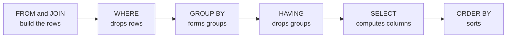
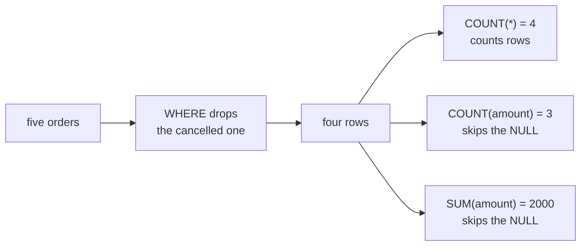
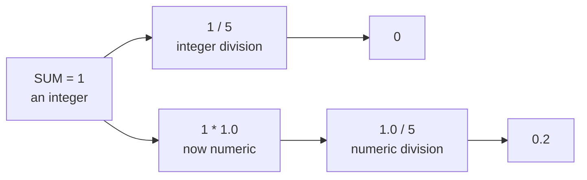
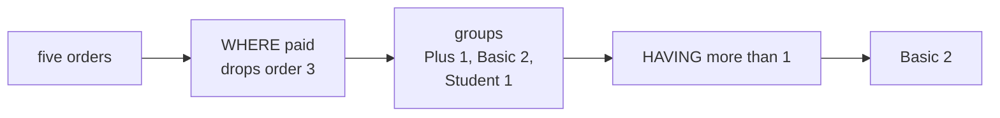
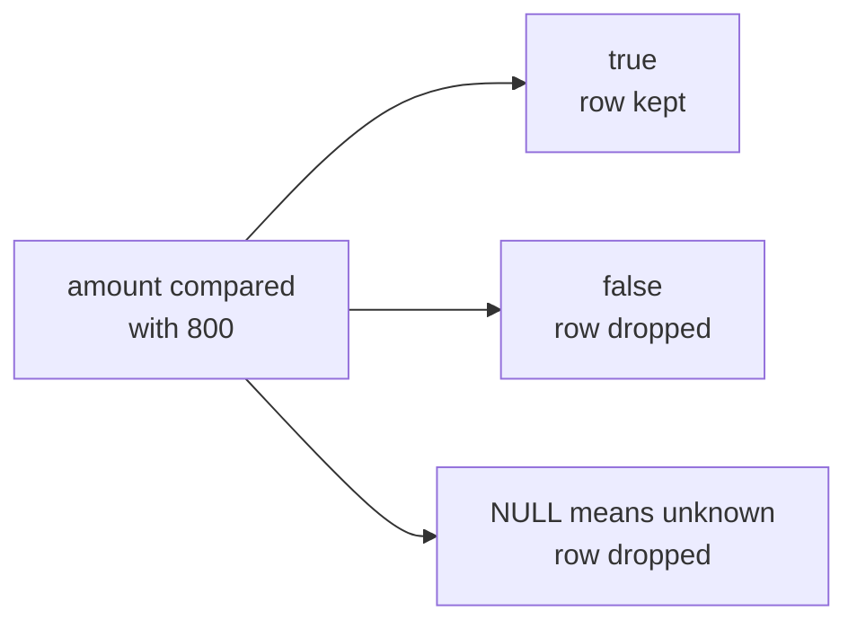
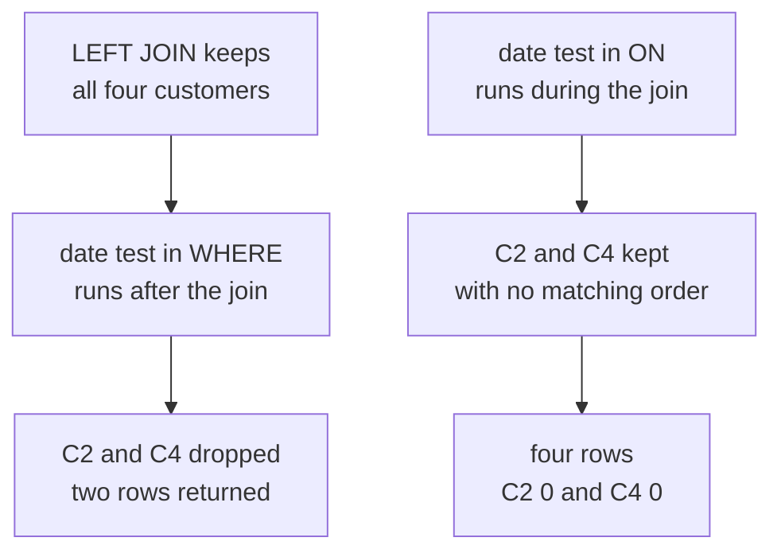
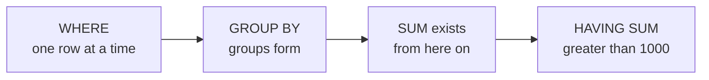
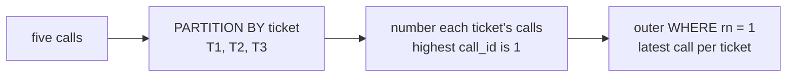
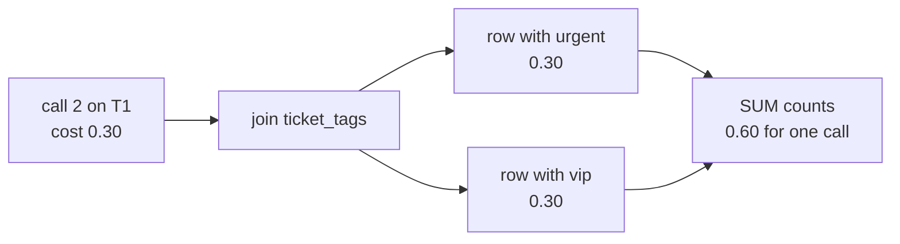

# Diagnostic, Section B: SQL for data and GenAI, every question worked

Section B gave you eight SQL questions and about twenty minutes. Two habits decide most of them:
knowing the order in which a query runs, and knowing what a NULL does at each step. This thread
works through all eight. Every query below was run on PostgreSQL 16.13 in a fresh database on
28 September 2026, and every output block is exactly what `psql` printed.

Your report email gave one line per question. This thread gives the long version: a trace you can
follow with a pencil, a picture, why each wrong option looks right, and where the rule comes from.

| Question | What it tests | Answer |
|---|---|---|
| Q13 | It tests what `COUNT(*)`, `COUNT(column)` and `SUM` do with a NULL. | B |
| Q14 | It tests integer division hiding inside a rate. | A |
| Q15 | It tests `WHERE` filtering rows before the groups form and `HAVING` filtering groups after. | D |
| Q16 | It tests a comparison with NULL inside `WHERE`. | C |
| Q17 | It tests a `LEFT JOIN` undone by its own `WHERE`. | A |
| Q18 | It tests why an aggregate cannot sit in `WHERE`. | B |
| Q19 | It tests `ROW_NUMBER()` in a subquery, used to keep one row per group. | D |
| Q20 | It tests a join that repeats rows and inflates a sum. | C |

## How to use this thread

- Open your report email beside this thread and read the questions you missed before the ones you
  got right.
- Cover the answer, write down what you expect the query to return, and only then read on.
- Reply in this thread with the question number when anything here disagrees with what you see on
  your own screen.

## One picture for the whole section

A query is written in one order and run in another. PostgreSQL's reference page for `SELECT` lists
the run order: the `FROM` list is computed first, then "If the WHERE clause is specified, all rows
that do not satisfy the condition are eliminated from the output", then the rows are combined into
groups and the aggregates computed, then "If the HAVING clause is present, it eliminates groups that
do not satisfy the given condition", and only after that are the output rows computed from the
`SELECT` list.

Source: [PostgreSQL documentation, SELECT](https://www.postgresql.org/docs/current/sql-select.html), checked 28 September 2026.



Six of the eight questions (Q13, Q15, Q16, Q17, Q18 and Q19) are this picture asked six ways. Q14 is
about types, and Q20 is about what a join does to the number of rows.

## The orders table, used for Q13 to Q16 and Q18

| order_id | customer_id | tier | order_date | amount | status |
|---|---|---|---|---|---|
| 1 | C1 | Plus | 2026-04-02 | 1200 | paid |
| 2 | C2 | Basic | 2026-04-03 | NULL | paid |
| 3 | C1 | Plus | 2026-04-05 | 800 | cancelled |
| 4 | C3 | Student | 2026-04-06 | 300 | paid |
| 5 | C2 | Basic | 2026-04-09 | 500 | paid |

---

## Q13. Predict the result

The question asked what this query returns.

```sql
SELECT COUNT(*), COUNT(amount), SUM(amount)
FROM orders
WHERE status <> 'cancelled';
```

**The answer is B: 4, 3, 2000.** The `WHERE` removes the cancelled order, and the three functions
then treat the one NULL amount in three different ways.

**Trace it.**

| Step | What happens | What is left |
|---|---|---|
| `FROM orders` | The database reads all five orders. | Orders 1, 2, 3, 4 and 5 |
| `WHERE status <> 'cancelled'` | Order 3 is the only cancelled order, so it is dropped. | Orders 1, 2, 4 and 5 |
| `COUNT(*)` | It counts rows, whatever the rows hold. | 4 |
| `COUNT(amount)` | It counts only the rows whose amount is not NULL, so order 2 drops out. | 3 |
| `SUM(amount)` | It adds the amounts that are not NULL, which are 1200, 300 and 500. | 2000 |

**Run it.**

```text
 count | count | sum
-------+-------+------
     4 |     3 | 2000
(1 row)
```

**The picture.**



**Every option.**

| Option | It says | Why it tempts | What happens |
|---|---|---|---|
| A | 4, 4, 2000 | It reads `COUNT` as "count the rows" in both places. | `COUNT(amount)` counts values that exist, and order 2 has no amount, so it gives 3. |
| B | 4, 3, 2000 | This is the answer. | The two counts differ by exactly the one NULL amount. |
| C | 5, 4, 2800 | It is what the query returns with the `WHERE` line deleted, so it catches anyone who skipped a line. | Order 3 is cancelled, and with it go one row, one amount and 800 of the sum. |
| D | 4, 3, NULL | In arithmetic, 1200 + NULL is NULL, so it feels as if the sum should be NULL too. | `SUM` is an aggregate, aggregates skip NULL inputs, and so the sum is 2000. |

**Where the rule comes from.** PostgreSQL's table of aggregate functions gives the two counts one line
each: `count(*)` "Computes the number of input rows", while `count("any")` "Computes the number of
input rows in which the input value is not null", and `sum` "Computes the sum of the non-null input
values". The language itself began at IBM in the early 1970s, where Donald Chamberlin and Raymond
Boyce designed it after learning about Edgar Codd's relational model; its first name was SEQUEL, and
it became an ANSI standard in 1986 and an ISO standard in 1987.

Sources: [PostgreSQL documentation, aggregate functions](https://www.postgresql.org/docs/current/functions-aggregate.html#FUNCTIONS-AGGREGATE-TABLE), checked 28 September 2026; [Wikipedia, SQL](https://en.wikipedia.org/wiki/SQL), last edited 13 September 2026 and checked 28 September 2026.

**Practise it.** Before running anything, write down what `AVG(amount)` returns for the same four
rows. It divides by 3, since it averages only the amounts that exist, and PostgreSQL prints
666.6666666666666667.

---

## Q14. Fix the query

The question said that on Postgres this query returns 0 for the orders table, where one order in five
is cancelled, and asked which version returns 0.2.

```sql
SELECT SUM(CASE WHEN status = 'cancelled' THEN 1 ELSE 0 END) / COUNT(*) AS cancel_rate
FROM orders;
```

**The answer is A: multiply by 1.0 before dividing.** Both sides of the division are integers, so
PostgreSQL divides as integers and drops the remainder.

**Trace it.**

| Step | What happens | Value and type |
|---|---|---|
| `CASE WHEN ...` | Each row becomes 1 if it is cancelled and 0 if it is not. | 0, 0, 1, 0, 0 |
| `SUM(...)` | The ones and zeros add up. | 1, a bigint |
| `COUNT(*)` | The rows are counted. | 5, a bigint |
| `1 / 5` | Both sides are integers, so the division keeps only the whole part. | 0 |
| `1 * 1.0 / 5` | 1.0 is a numeric constant, so the product is numeric and the division keeps the fraction. | 0.2 |

**Run it.** The original query, then option A, then the order of operations on its own:

```text
 cancel_rate
-------------
           0
(1 row)

      cancel_rate
------------------------
 0.20000000000000000000
(1 row)

 divide_first |     convert_first
--------------+------------------------
          0.0 | 0.20000000000000000000
(1 row)
```

The last block ran `SELECT 1 / 5 * 1.0 AS divide_first, 1 * 1.0 / 5 AS convert_first;`. Where the 1.0
sits matters: `*` and `/` share one precedence level and run left to right, so `1 / 5 * 1.0` has
already divided down to 0 before the 1.0 arrives.

**The picture.**



**Every option.**

| Option | It says | Why it tempts | What happens |
|---|---|---|---|
| A | `SUM(CASE WHEN status = 'cancelled' THEN 1 ELSE 0 END) * 1.0 / COUNT(*)` | This is the answer. | The multiplication turns the sum into a numeric value before the division runs, and the query returns 0.20000000000000000000. |
| B | `ROUND(SUM(CASE WHEN status = 'cancelled' THEN 1 ELSE 0 END) / COUNT(*), 2)` | Rounding looks like the tool for a problem about decimals. | The division has already produced 0 before `ROUND` sees it, so the query returns 0.00. |
| C | `COUNT(status = 'cancelled') / COUNT(*)` | It reads like "count the cancelled orders". | `COUNT` counts every value that is not NULL, and false is a value, so it counts all five rows and returns 5 / 5, which is 1. |
| D | `AVG(status = 'cancelled')` | The idea is sound, because the average of a yes-or-no flag written as 1 and 0 is the rate. | PostgreSQL has no average for a true-or-false column and stops with `ERROR:  function avg(boolean) does not exist`; `AVG((status = 'cancelled')::int)` converts the flag first and returns 0.2. |

**Where the rule comes from.** PostgreSQL's table of mathematical operators describes division as
"Division (for integral types, division truncates the result towards zero)" and prints `5 / 2 → 2`
beside `5.0 / 2 → 2.5000000000000000`. Its page on constants explains why 1.0 changes the result:
"Constants that contain decimal points and/or exponents are always initially presumed to be type
numeric." Python took the opposite road. PEP 238, written by Moshe Zadka and Guido van Rossum in
March 2001, split division into `/` for true division and `//` for floor division, and made true
division the standard in Python 3.0. The same symbol therefore gives 0.2 in Python and 0 in
PostgreSQL, and you will use both languages every week of this programme.

Sources: [PostgreSQL documentation, mathematical operators](https://www.postgresql.org/docs/current/functions-math.html#FUNCTIONS-MATH-OP-TABLE), checked 28 September 2026; [PostgreSQL documentation, numeric constants](https://www.postgresql.org/docs/current/sql-syntax-lexical.html#SQL-SYNTAX-CONSTANTS-NUMERIC), checked 28 September 2026; [PEP 238, Changing the Division Operator](https://peps.python.org/pep-0238/), checked 28 September 2026.

**Practise it.** When a rate comes back as exactly 0 or exactly 1, check the types before the logic.
Run `SELECT pg_typeof(1 / 5), pg_typeof(1.0);` and read the two type names it prints, which are
integer and numeric.

---

## Q15. Predict the result

The question asked what this query returns against the orders table.

```sql
SELECT tier, COUNT(*) AS n
FROM orders
WHERE status = 'paid'
GROUP BY tier
HAVING COUNT(*) > 1;
```

**The answer is D: Basic 2 only.** `WHERE` removes the cancelled Plus order before any group forms,
so Plus is left with one paid order and fails the `HAVING`.

**Trace it.**

| Step | What happens | What is left |
|---|---|---|
| `WHERE status = 'paid'` | Order 3 is cancelled, so it is dropped before grouping. | Orders 1, 2, 4 and 5 |
| `GROUP BY tier` | The four paid orders form three groups. | Plus 1, Basic 2, Student 1 |
| `HAVING COUNT(*) > 1` | Only groups with more than one row survive. | Basic 2 |

**Run it.** The query as written, then the same query with the `WHERE` line removed:

```text
 tier  | n
-------+---
 Basic | 2
(1 row)

 tier  | n
-------+---
 Basic | 2
 Plus  | 2
(2 rows)
```

**The picture.**



**Every option.**

| Option | It says | Why it tempts | What happens |
|---|---|---|---|
| A | Plus 2 and Basic 2 | It is what the query returns without its `WHERE` line, since the cancelled order would then count for Plus. | The `WHERE` runs first, so Plus reaches the groups with one order. |
| B | Basic 2, Plus 1 and Student 1 | It is what the query returns without its `HAVING` line. | `HAVING COUNT(*) > 1` removes the two groups of one. |
| C | No rows, because HAVING must refer to the alias n | The `SELECT` names the count `n`, so it feels natural to use that name. | The query as written uses `COUNT(*)`, which is legal. Writing `HAVING n > 1` fails with `ERROR:  column "n" does not exist`, because `HAVING` runs before the `SELECT` list computes `n`, and an error is never the same as no rows. |
| D | Basic 2 only | This is the answer. | One group has more than one paid order, and it is Basic. |

**Where the rule comes from.** PostgreSQL's reference page puts the difference in one sentence:
"HAVING is different from WHERE: WHERE filters individual rows before the application of GROUP BY,
while HAVING filters group rows created by GROUP BY." Its tutorial adds the practical reason to
filter plain columns early: a condition in `WHERE` "is more efficient than adding the restriction to
HAVING, because we avoid doing the grouping and aggregate calculations for all rows that fail the
WHERE check."

Sources: [PostgreSQL documentation, the HAVING clause](https://www.postgresql.org/docs/current/sql-select.html#SQL-HAVING), checked 28 September 2026; [PostgreSQL tutorial, aggregate functions](https://www.postgresql.org/docs/current/tutorial-agg.html), checked 28 September 2026.

**Practise it.** Rewrite the query to list the tiers whose paid revenue is above 1000, and decide
which condition goes in `WHERE` and which in `HAVING` before you write a line.

---

## Q16. Spot the bug

The question said Kavya expects 4, which is five orders minus the one at 800, but gets 3, and asked
why.

```sql
SELECT COUNT(*) FROM orders WHERE amount <> 800;
```

**The answer is C.** A comparison with NULL is neither true nor false, and `WHERE` keeps only the rows
where its condition is true, so the order with no amount disappears along with the one at 800.

**Trace it.** The condition, row by row, as PostgreSQL evaluates it:

```text
 order_id | amount | kept
----------+--------+------
        1 |   1200 | t
        2 |   NULL | NULL
        3 |    800 | f
        4 |    300 | t
        5 |    500 | t
(5 rows)
```

That block ran `SELECT order_id, amount, amount <> 800 AS kept FROM orders;`. Three rows are true,
one is false and one is NULL, which PostgreSQL treats as unknown. The count is 3.

**Run it.** The query, then two ways to keep the NULL row:

```text
 count
-------
     3
(1 row)
```

`WHERE amount <> 800 OR amount IS NULL` returns 4, and so does `WHERE amount IS DISTINCT FROM 800`.

**The picture.**



**Every option.**

| Option | It says | Why it tempts | What happens |
|---|---|---|---|
| A | <> is not valid in Postgres, so != must be used for the comparison to run | Many languages write "not equal" as `!=`, so `<>` looks foreign. | PostgreSQL accepts both, and `amount != 800` also returns 3. |
| B | COUNT(*) skips any row that has a NULL in any of its columns | Some functions do skip NULLs, so it feels as if `COUNT(*)` might. | Q13 showed that `COUNT(*)` counts every row, NULL or not; the row was removed earlier, by the `WHERE`. |
| C | NULL compared with 800 is neither true nor false, so that row is dropped | This is the answer. | The NULL row and the 800 row both fail the `WHERE`, which leaves three. |
| D | The cancelled row is left out automatically because its status is not paid | One of the rows that goes does happen to be the cancelled order. | Nothing in this query reads `status`; order 3 goes because its amount is 800. |

**Where the rule comes from.** PostgreSQL's page on comparisons says it directly: "Ordinary
comparison operators yield null (signifying "unknown"), not true or false, when either input is
null." Its page on the `WHERE` clause finishes the thought: a row is kept only when the condition is
true, "otherwise (i.e., if the result is false or null) it is discarded." The comparisons page
also notes that "<> is the standard SQL notation for "not equal". != is an alias, which is converted to <> at a very
early stage of parsing." NULL itself comes from Edgar Codd, the creator of the relational model, who
wrote about nulls for missing information in 1975, set out their three-valued logic in his 1979
paper "Extending the database relational model to capture more meaning", and saw SQL adopt the idea
in its 1986 standard.

Sources: [PostgreSQL documentation, comparison operators](https://www.postgresql.org/docs/current/functions-comparison.html), checked 28 September 2026; [PostgreSQL documentation, the WHERE clause](https://www.postgresql.org/docs/current/queries-table-expressions.html#QUERIES-WHERE), checked 28 September 2026; [Wikipedia, Null (SQL)](https://en.wikipedia.org/wiki/Null_(SQL)), last edited 25 September 2026 and checked 28 September 2026.

**Practise it.** Predict `SELECT NULL = NULL;` before you run it. PostgreSQL prints NULL, since two
unknown values are not known to be equal.

---

## Q17. Spot the bug and fix it

The question: Anand wants one row per customer with the count of orders placed in 2026, including
customers with none. The query returns only C1 2 and C3 1. Which one-line change returns C1 2, C2 0,
C3 1 and C4 0?

| customers.customer_id |
|---|
| C1 |
| C2 |
| C3 |
| C4 |

| orders.order_id | orders.customer_id | orders.order_date |
|---|---|---|
| 1 | C1 | 2026-01-15 |
| 2 | C2 | 2025-11-03 |
| 3 | C1 | 2026-03-02 |
| 4 | C3 | 2026-02-20 |

```sql
SELECT c.customer_id, COUNT(o.order_id) AS orders_2026
FROM customers c
LEFT JOIN orders o ON o.customer_id = c.customer_id
WHERE o.order_date >= '2026-01-01'
GROUP BY c.customer_id;
```

**The answer is A: move the date condition from `WHERE` into the `ON` clause.** The `LEFT JOIN` keeps
C2 and C4, and then the `WHERE` throws them away again.

**Trace it.** The rows the `LEFT JOIN` builds, and what the `WHERE` makes of each:

```text
 customer_id | order_id | order_date | kept
-------------+----------+------------+------
 C1          |        1 | 2026-01-15 | t
 C1          |        3 | 2026-03-02 | t
 C2          |        2 | 2025-11-03 | f
 C3          |        4 | 2026-02-20 | t
 C4          |     NULL | NULL       | NULL
(5 rows)
```

C2's only order is from 2025, so its row is false. C4 has no orders, so the join filled its order
columns with NULL, and a date compared with NULL is unknown. Both rows go, and the groups for C2 and
C4 never form.

**Run it.** The original query, then option A:

```text
 customer_id | orders_2026
-------------+-------------
 C1          |           2
 C3          |           1
(2 rows)

 customer_id | orders_2026
-------------+-------------
 C1          |           2
 C2          |           0
 C3          |           1
 C4          |           0
(4 rows)
```

Option A's query is the original with its `ON` line reading
`LEFT JOIN orders o ON o.customer_id = c.customer_id AND o.order_date >= '2026-01-01'` and no `WHERE`.

**The picture.**



**Every option.**

| Option | It says | Why it tempts | What happens |
|---|---|---|---|
| A | Move the date condition from WHERE into the ON clause | This is the answer. | The date now decides which orders match, and every customer survives the join. |
| B | Change COUNT(o.order_id) to COUNT(*) so that the empty rows are counted | The missing customers look like a counting problem. | The `WHERE` has removed C2 and C4 before anything is counted, so the result is still C1 2 and C3 1. With the `ON` fix, `COUNT(*)` would print 1 for C2 and C4, because it counts the padded row, which is why `COUNT(o.order_id)` is the right count. |
| C | Change LEFT JOIN to RIGHT JOIN so that the customers side is kept | "Right" sounds like the side that is kept. | A `RIGHT JOIN` keeps every order, never the customers without one, and the result is still C1 2 and C3 1. |
| D | Add HAVING COUNT(o.order_id) >= 0 after GROUP BY | A condition that every count passes looks harmless. | The groups for C2 and C4 no longer exist by the time `HAVING` runs, so nothing changes. |

**Where the rule comes from.** PostgreSQL's page on joined tables works this exact case with two
tiny tables: the same filter returns three rows when it sits in `ON` and one row when it sits in
`WHERE`, "because a restriction placed in the ON clause is processed before the join, while a
restriction placed in the WHERE clause is processed after the join." The words `LEFT JOIN`,
`RIGHT JOIN` and `FULL OUTER JOIN` entered the SQL standard with SQL-92, which formalised the join
types.

Sources: [PostgreSQL documentation, joined tables](https://www.postgresql.org/docs/current/queries-table-expressions.html#QUERIES-JOIN), checked 28 September 2026; [Wikipedia, SQL-92](https://en.wikipedia.org/wiki/SQL-92), last edited 20 November 2025 and checked 28 September 2026.

**Practise it.** Change the `LEFT JOIN` to a plain `JOIN` with the date in `ON`, and predict the
result. It returns C1 2 and C3 1 again, the same wrong answer by a different route.

---

## Q18. Predict the result

The question asked what happens when this query runs on Postgres against the orders table.

```sql
SELECT customer_id, SUM(amount) AS total
FROM orders
WHERE SUM(amount) > 1000
GROUP BY customer_id;
```

**The answer is B: it fails.** `WHERE` runs row by row before any group exists, so there is no sum
for it to test, and PostgreSQL refuses the query before it reads a single row.

**Run it.**

```text
ERROR:  aggregate functions are not allowed in WHERE
LINE 1: ...stomer_id, SUM(amount) AS total FROM orders WHERE SUM(amount...
                                                             ^
```

The query was run on one line, which is why `LINE 1` points into the middle of it. The caret points at
the `SUM` inside the `WHERE`.

**The fix, run.** The condition moves to `HAVING`, after `GROUP BY`:

```text
 customer_id | total
-------------+-------
 C1          |  2000
(1 row)
```

**The picture.**



**Every option.**

| Option | It says | Why it tempts | What happens |
|---|---|---|---|
| A | It returns the customers whose total is above 1000, in the order they appear | The query reads like the English sentence it was meant to be. | The database never reaches the rows, because the query is rejected when it is parsed. |
| B | It fails: an aggregate is not allowed in WHERE; the condition belongs in HAVING | This is the answer. | PostgreSQL stops with the error above, and `HAVING SUM(amount) > 1000` returns C1 with 2000. |
| C | It returns every customer, since WHERE runs before SUM exists and is quietly skipped | It gets the order of steps right and then guesses what happens next. | PostgreSQL never skips a clause quietly; a clause it cannot run is an error. |
| D | It returns no rows, since SUM is NULL at the moment WHERE is evaluated | It also gets the order right and treats the missing sum as NULL. | No row is evaluated at all, because the query fails before it runs. |

**Where the rule comes from.** PostgreSQL's tutorial gives the rule and its reason together: the
restriction "exists because the WHERE clause determines which rows will be included in the aggregate
calculation; so obviously it has to be evaluated before aggregate functions are computed." The error
text above is the one PostgreSQL's own regression tests expect, word for word.

Sources: [PostgreSQL tutorial, aggregate functions](https://www.postgresql.org/docs/current/tutorial-agg.html), checked 28 September 2026; [PostgreSQL regression test output for aggregates, version 18 branch](https://raw.githubusercontent.com/postgres/postgres/REL_18_STABLE/src/test/regress/expected/aggregates.out), checked 28 September 2026.

**Practise it.** Look at the fixed result again. C1's 2000 includes the cancelled order of 800. If
Finance wants paid spend above 1000, both conditions are needed: `WHERE status <> 'cancelled'` on the
rows and `HAVING SUM(amount) > 1000` on the groups, which returns C1 with 1200.

---

## Q19. Predict the result

The question: Farhan's team logs every LLM call made on a support ticket. What does this query return
against the `llm_calls` table?

| call_id | ticket_id | model | prompt_tokens | completion_tokens | cost |
|---|---|---|---|---|---|
| 1 | T1 | small | 400 | 100 | 0.02 |
| 2 | T1 | large | 1200 | 300 | 0.30 |
| 3 | T2 | small | 800 | 50 | 0.03 |
| 4 | T3 | large | 600 | 200 | 0.30 |
| 5 | T2 | small | 200 | 20 | 0.01 |

```sql
SELECT ticket_id, call_id
FROM (
  SELECT ticket_id, call_id,
         ROW_NUMBER() OVER (PARTITION BY ticket_id ORDER BY call_id DESC) AS rn
  FROM llm_calls
) t
WHERE rn = 1
ORDER BY ticket_id;
```

**The answer is D: (T1, 2), (T2, 5), (T3, 4).** The inner query numbers each ticket's calls from the
highest `call_id` down, and the outer query keeps number 1, which is the latest call per ticket.

**Trace it.** The inner query on its own:

```text
 ticket_id | call_id | rn
-----------+---------+----
 T1        |       2 |  1
 T1        |       1 |  2
 T2        |       5 |  1
 T2        |       3 |  2
 T3        |       4 |  1
(5 rows)
```

The numbering restarts at 1 for every ticket, because `PARTITION BY ticket_id` splits the rows into
one group per ticket without collapsing them.

**Run it.**

```text
 ticket_id | call_id
-----------+---------
 T1        |       2
 T2        |       5
 T3        |       4
(3 rows)
```

**The picture.**



**Every option.**

| Option | It says | Why it tempts | What happens |
|---|---|---|---|
| A | (T1, 1), (T2, 3), (T3, 4) | It is what you get if the window's `ORDER BY` runs upward, which is the default when `DESC` is missed. | With `ORDER BY call_id` and no `DESC`, the query does return exactly these rows, the earliest call per ticket. |
| B | Five rows, because ROW_NUMBER never removes rows | It is true of the inner query, which returns all five rows. | The outer `WHERE rn = 1` keeps one row per ticket. |
| C | An error, because a window function cannot be used to filter rows | It is true when the window function sits in `WHERE` directly, which fails with `ERROR:  window functions are not allowed in WHERE`. | The subquery computes `rn` first, and the outer `WHERE` filters on a plain column. |
| D | (T1, 2), (T2, 5), (T3, 4) | This is the answer. | Each ticket keeps its highest `call_id`. |

**Where the rule comes from.** PostgreSQL's tutorial says a window function performs "a calculation
across a set of table rows that are somehow related to the current row", that window functions "are
forbidden elsewhere, such as in GROUP BY, HAVING and WHERE clauses", and that "If there is a need to
filter or group rows after the window calculations are performed, you can use a sub-select."
Window functions entered the SQL standard with SQL:2003, and PostgreSQL added them in version 8.4,
released on 1 July 2009.

Sources: [PostgreSQL tutorial, window functions](https://www.postgresql.org/docs/current/tutorial-window.html), checked 28 September 2026; [PostgreSQL 8.4 release notes](https://www.postgresql.org/docs/release/8.4.0/), checked 28 September 2026; [Wikipedia, Window function (SQL)](https://en.wikipedia.org/wiki/Window_function_(SQL)), checked 28 September 2026.

**Practise it.** Keeping the latest row per group comes up constantly with LLM logs, for example the
final reply on each ticket. Rewrite the query to keep the most expensive call per ticket, and decide
what should happen when two calls on one ticket cost the same.

---

## Q20. Fix the query

The question: `tickets` holds one row per ticket with its category (T1 refund, T2 delivery, T3
refund), and `ticket_tags` holds (T1, urgent), (T1, vip), (T2, urgent) and (T3, vip). Anand asks for
LLM spend by ticket category. The query below returns refund 0.94 and delivery 0.04, which adds to
0.98, while the `cost` column of `llm_calls` sums to 0.66. Which change gives the right totals?

```sql
SELECT t.category, SUM(c.cost) AS spend
FROM llm_calls c
JOIN tickets t ON t.ticket_id = c.ticket_id
JOIN ticket_tags g ON g.ticket_id = t.ticket_id
GROUP BY t.category;
```

**The answer is C: drop the `ticket_tags` join.** A ticket can carry several tags, so the join repeats
every call once per tag, and T1's two tags double its spend.

**Trace it.** The rows the two joins build:

```text
 call_id | ticket_id | cost | category |  tag
---------+-----------+------+----------+--------
       1 | T1        | 0.02 | refund   | urgent
       1 | T1        | 0.02 | refund   | vip
       2 | T1        | 0.30 | refund   | urgent
       2 | T1        | 0.30 | refund   | vip
       3 | T2        | 0.03 | delivery | urgent
       4 | T3        | 0.30 | refund   | vip
       5 | T2        | 0.01 | delivery | urgent
(7 rows)
```

Five calls went in and seven rows came out. Refund adds 0.02 + 0.02 + 0.30 + 0.30 + 0.30, which is
0.94, when its true spend is 0.02 + 0.30 + 0.30, which is 0.62.

**Run it.** The original query, then option C:

```text
 category | spend
----------+-------
 refund   |  0.94
 delivery |  0.04
(2 rows)

 category | spend
----------+-------
 refund   |  0.62
 delivery |  0.04
(2 rows)
```

Option C's totals add to 0.66, which matches the `cost` column.

**The picture.**



**Every option.**

| Option | It says | Why it tempts | What happens |
|---|---|---|---|
| A | Change SUM(c.cost) to SUM(DISTINCT c.cost), so each cost value is added only once | The duplicates are the problem, so removing duplicates sounds right. | `DISTINCT` removes repeated values, and two different calls both cost 0.30, so refund drops to 0.32, below the true 0.62. |
| B | Add DISTINCT after SELECT, so repeated rows are removed before summing | It sounds like the same cure applied earlier. | `SELECT DISTINCT` acts on the output rows after `SUM` has run, and the two output rows are already different, so the result stays 0.94 and 0.04. |
| C | Drop the ticket_tags join; the question never uses tags and it repeats T1's calls | This is the answer. | Each call appears once, and the totals come to 0.62 and 0.04. |
| D | Change JOIN tickets to LEFT JOIN tickets, so no ticket is lost from the totals | Missing rows are a common join bug, so it looks worth ruling out. | Every call already has a ticket, and the extra rows come from the tags join, so the result stays 0.94 and 0.04. |

**Where the rule comes from.** Looker's documentation calls this a fanout and works the arithmetic
on three orders: joined to their items, the orders' totals sum to 223.44 "instead of the correct
answer, which is 124.84". A post on Google's developer forums, which Looker's documentation links to,
gives the test that catches it: "Since the joined table has more rows than the primary table, we say
that a fanout has occurred." Data-warehouse modelling has names for two classic versions of this
inflation, the fan trap and the chasm trap.

Sources: [Looker documentation, understanding symmetric aggregates](https://cloud.google.com/looker/docs/best-practices/understanding-symmetric-aggregates), checked 28 September 2026; [Google Developer forums, The problem of SQL fanouts](https://discuss.google.dev/t/the-problem-of-sql-fanouts/119220), checked 28 September 2026; [Sisense documentation, chasm and fan traps](https://docs.sisense.com/main/SisenseLinux/chasm-and-fan-traps.htm), checked 28 September 2026.

**Practise it.** Make two checks a habit on every join you write at work. Count the rows before and
after the join, which here goes from 5 to 7. Then reconcile the grand total against the source table,
which here is 0.98 against 0.66.

---

## Questions learners ask about this section

**"Where exactly does the NULL rule stop? I thought COUNT(*) skipped NULLs."**
`COUNT(*)` counts rows and never looks inside them. `COUNT(column)`, `SUM`, `AVG`, `MIN` and `MAX`
skip NULL values. A comparison with NULL gives unknown, and `WHERE` drops unknown rows. Those three
sentences cover Q13, Q16 and Q17.

**"Why does Postgres give 0 for 1 / 5 when Python gives 0.2?"**
Each language chose differently. Python 3 made `/` true division, and PostgreSQL divides two
integers as integers. Q14 has the sources, and Section A's Q7 shows Python's own `//`.

**"In Q17, would an inner join have worked?"**
No. An inner join keeps only customers with a matching order, so C2 and C4 disappear and you get
C1 2 and C3 1, the same wrong answer by a different route.

**"In Q18, the fixed query says C1 spent 2000, but one of C1's orders was cancelled. Is 2000 right?"**
It depends on the question Finance asked. The fix answers "total order value above 1000". Paid spend
above 1000 needs the status filter as well, and it returns 1200 for C1.

**"Is ROW_NUMBER the same as RANK?"**
They differ on ties. PostgreSQL's function table says `row_number` returns "the number of the current
row within its partition, counting from 1", while `rank` returns "the rank of the current row, with
gaps". Tied rows get different row numbers and the same rank. In Q19 every `call_id` is unique, so
the two would agree. Source: [PostgreSQL documentation, window functions](https://www.postgresql.org/docs/current/functions-window.html#FUNCTIONS-WINDOW-TABLE), checked 28 September 2026.

**"How would I have caught Q20 at work, with no answer key?"**
With the two checks in its practice line: the row count before and after each join, and the grand
total against the source table. Neither needs you to know the right answer in advance.

## The interview question this section answers

Tuesday's row carries **[SV] What rows does this query return?** A strong answer runs the clauses in
the order the database does, which differs from the order they are written: the tables and joins,
then `WHERE` on rows, then `GROUP BY`, then `HAVING` on the groups, then the columns, then
`ORDER BY`. At each step it says what a NULL does. Q13, Q15 and Q19 are three rehearsals of it.

## Watch and read

The video titles and channels below were checked on 28 September 2026.

- Watch "SQL Window Functions | Clearly Explained | PARTITION BY, ORDER BY, ROW_NUMBER, RANK, DENSE_RANK" by Maven Analytics, for Q19: https://www.youtube.com/watch?v=rIcB4zMYMas (checked 28 September 2026).
- Watch "SQL | Why Your LEFT JOIN Acts Like an INNER JOIN! SQL Tricks and Traps" by Learn at Knowstar, for Q17: https://www.youtube.com/watch?v=RFFR3AJU3RE (checked 28 September 2026).
- Watch "#02 - Modern SQL (CMU Intro to Database Systems)" by the CMU Database Group, a full university lecture covering aggregates, window functions and nested queries: https://www.youtube.com/watch?v=MzigBKf84aY (checked 28 September 2026).
- Watch "How to handle NULL in SQL" by Oracle Developers, for Q13 and Q16, keeping one difference in mind: Oracle treats an empty string as NULL, and PostgreSQL does not: https://www.youtube.com/watch?v=DBsX2rREoxU (checked 28 September 2026).
- Read Markus Winand's "NULL" on Modern SQL, which explains why a `WHERE` treats unknown like false: https://modern-sql.com/concept/null (checked 28 September 2026).
- Read Markus Winand's "The Three-Valued Logic of SQL", which begins "SQL uses a three-valued logic": https://modern-sql.com/concept/three-valued-logic (checked 28 September 2026).
- Read Markus Winand's "Pagination Using window-functions", where `ROW_NUMBER` is filtered in an outer query exactly as in Q19: https://use-the-index-luke.com/sql/partial-results/window-functions (checked 28 September 2026).
- Read "The problem of SQL fanouts" on the Google Developer forums, for Q20: https://discuss.google.dev/t/the-problem-of-sql-fanouts/119220 (checked 28 September 2026).
