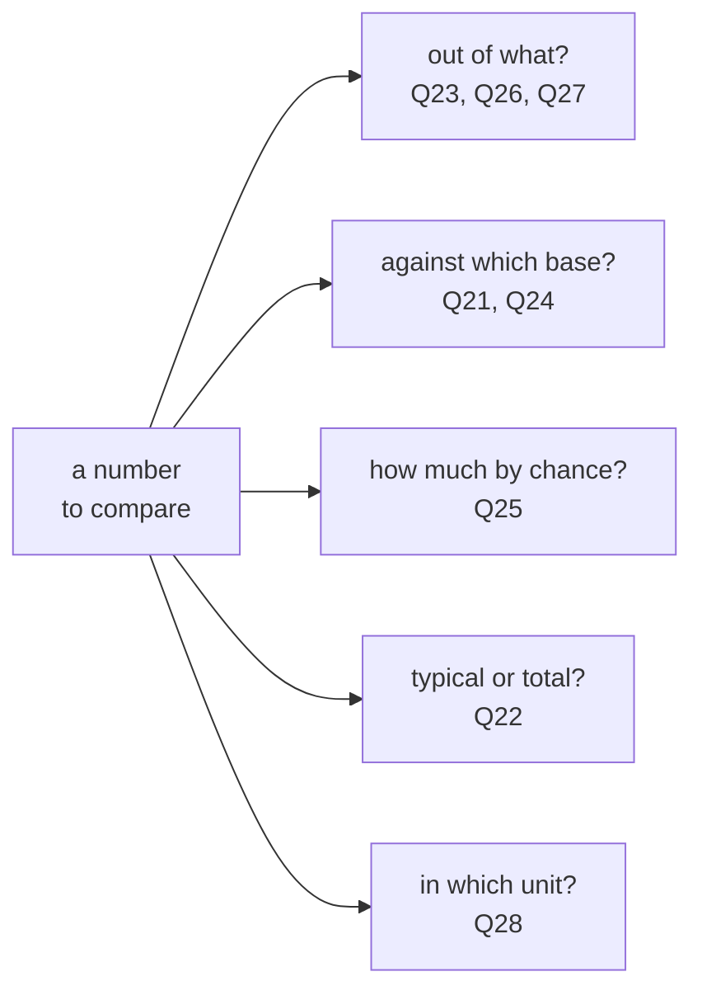
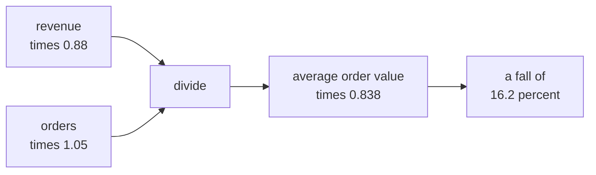
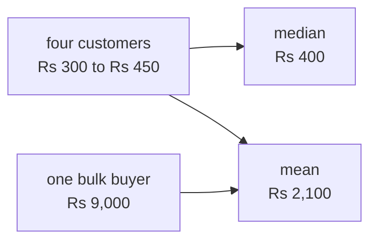
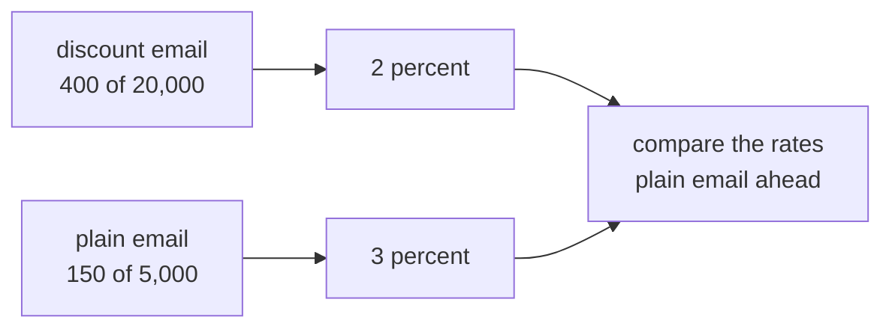
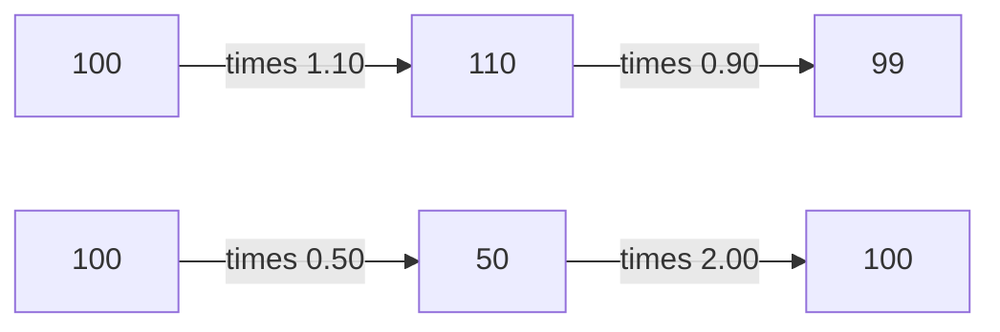
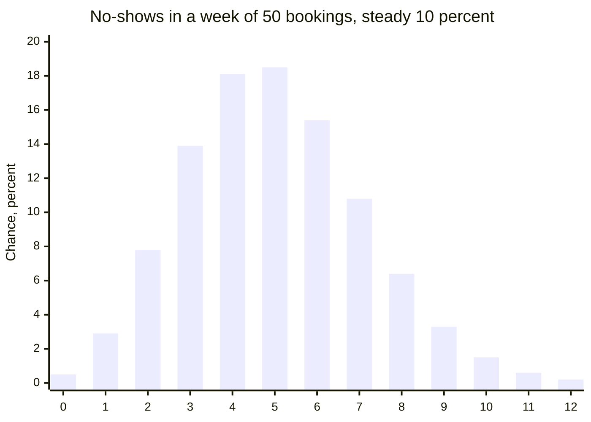
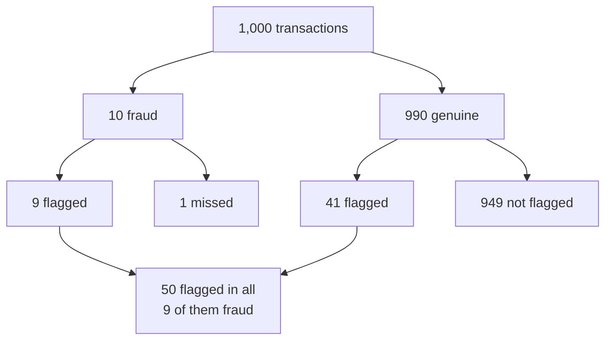
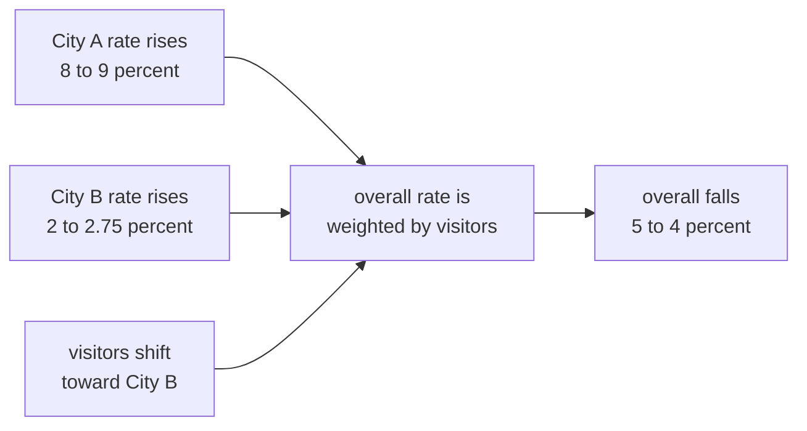
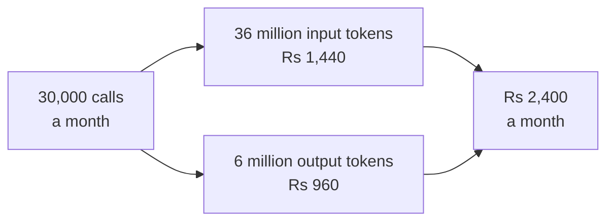

# Diagnostic, Section C: Numbers and reasoning, every question worked

Section C gave you eight questions in about fourteen minutes, with rough working on paper and no
calculator. Every one of them turns on a single move: multiply the changes, divide by the right
base, or ask how much chance alone would move the number. This thread works through all eight.
Every figure below was recomputed in Python 3.11.15 on 28 September 2026.

Your report email gave one line per question. This thread gives the long version: the working, a
picture, why each wrong option looks right, where the idea comes from, and a new version of the
question to try.

| Question | What it tests | Answer |
|---|---|---|
| Q21 | It tests combining two percentage changes into the change of a ratio. | D |
| Q22 | It tests choosing the median when one value sits far from the rest. | A |
| Q23 | It tests comparing rates when the groups differ in size. | B |
| Q24 | It tests why equal percentage rises and falls do not cancel. | C |
| Q25 | It tests how much a small count moves by chance alone. | A |
| Q26 | It tests precision against recall when the event is rare. | D |
| Q27 | It tests how every part can rise while the whole falls. | B |
| Q28 | It tests pricing an LLM feature by input and output tokens. | C |

## How to use this thread

- Open your report email beside this thread and read the questions you missed before the ones you
  got right.
- Cover the answer and do the working on paper first, since the working is the skill.
- Reply in this thread with the question number when anything here disagrees with your own working.

## One picture for the whole section

Before comparing any two numbers, ask what each one is out of, against which base it changed, how
much it would move by chance, whether it describes the typical case or the total, and what unit it
is priced in.

---

## Q21. Reason with numbers

The question: Kalpa Retail revenue fell 12 percent from Q1 to Q2 while the order count rose
5 percent. Which statement about the average order value must be true?

**The answer is D: it fell by about 16 percent.** Average order value is revenue divided by orders,
so its multiplier is the revenue multiplier divided by the orders multiplier: 0.88 / 1.05 = 0.838, a
fall of 16.2 percent.

**Work it.** Put numbers on it and the rule shows itself.

| Quarter | Revenue | Orders | Average order value |
|---|---|---|---|
| Q1 | Rs 1,00,000 | 100 | Rs 1,000 |
| Q2 | Rs 88,000 | 105 | Rs 838.10 |

The average fell by Rs 161.90, which is 16.2 percent of Rs 1,000. A quick check for small changes:
a ratio's percentage change is close to the top's change minus the bottom's, here -12 - 5 = -17,
which lands near the exact -16.2.

**The picture.**

**Every option.**

| Option | It says | Why it tempts | What happens |
|---|---|---|---|
| A | It fell by about 7 percent | It adds the two changes, -12 and +5, as if percentages stacked. | The average is revenue divided by orders, so the orders change works against it, and the multiplier is 0.88 / 1.05. |
| B | It fell by about 12 percent | It carries the revenue change straight over. | The same revenue spread over 5 percent more orders makes each order smaller again. |
| C | It cannot be determined without the number of customers | Customers feel like part of every revenue question. | Average order value needs only revenue and orders; customers matter for revenue per customer, which is a different number. |
| D | It fell by about 16 percent | This is the answer. | 0.88 / 1.05 is 0.838, a fall of 16.2 percent. |

**Where the idea comes from.** School mathematics teaches this as successive percentage change. BBC
Bitesize puts it plainly: "The most efficient way to work with more than one percentage change is
to use decimal multipliers for each stage", and warns that "A 20% increase followed by a 5% increase
is not a 25% increase overall", since 1.2 × 1.05 = 1.26.

Source: [BBC Bitesize, Repeated percentage change, interest and exponential change](https://www.bbc.co.uk/bitesize/articles/zvdhkhv), checked 28 September 2026.

**Practise it.** If revenue rises 10 percent and orders rise 10 percent, what happens to the average
order value? It stays exactly where it was, since 1.10 / 1.10 = 1.

---

## Q22. Reason with numbers

The question: five Plus customers spent Rs 300, 350, 400, 450 and 9,000 this quarter. Meera wants one
number on her slide for "what a typical Plus customer spends". Which number, and why?

**The answer is A: 400, the median.** Four of the five customers spent between Rs 300 and Rs 450, and
the median sits among them, while the mean is pulled far above all four by one buyer.

**Work it.**

| Measure | Working | Result |
|---|---|---|
| Median | Sort the five values and take the middle one: 300, 350, **400**, 450, 9,000. | Rs 400 |
| Mean | Add all five and divide by 5: 10,500 / 5. | Rs 2,100 |
| Mean of the other four | Add 300, 350, 400 and 450 and divide by 4: 1,500 / 4. | Rs 375 |

Take the one bulk buyer away and the mean falls from Rs 2,100 to Rs 375, while the median barely
moves. That sensitivity is the whole story.

**The picture.**

**Every option.**

| Option | It says | Why it tempts | What happens |
|---|---|---|---|
| A | 400, the median, since one bulk buyer drags the mean above the other four | This is the answer. | The median describes the customers Meera means by typical. |
| B | 2,100, the mean, since it is the only number that uses every value | Using every value sounds fairer. | Rs 2,100 is more than four times what four of the five customers spent, so it describes none of them. |
| C | 300 to 9,000, the range, since any single number would mislead the board | Showing the spread feels honest. | Meera asked for one number for a typical customer, and a range stretched by one buyer answers a different question. |
| D | 1,250, the midpoint between the mean and the median, as a compromise | Splitting the difference sounds balanced. | An average of two summaries means nothing on its own, and Rs 1,250 is still about three times what a typical customer spent. |

**A second look.** The bulk buyer is no noise to be hidden. That one customer brought Rs 9,000 of the
Rs 10,500, which is 86 percent of this group's spend. The slide should carry the median as the
typical spend and give the bulk buyer a line of its own, since Meera will want to know who it is.

**Where the idea comes from.** Statistical agencies report income as a median for this reason. The
US Census Bureau's American Community Survey definitions say that "The median, which is not affected
by extreme values, is, therefore, a better measure than the mean when the population base is small."
The UK's Office for National Statistics says a limitation of the mean "is that it can be influenced
by just a few individuals with very high incomes and therefore does not necessarily reflect the
standard of living of the "typical" person", and one of its own charts shows the two parting in real
data: "Median income remained relatively stable and mean income decreased by 5.9% between FYE 2022
and FYE 2024".

Sources: [US Census Bureau, American Community Survey 2024 Subject Definitions (PDF, page 97)](https://www2.census.gov/programs-surveys/acs/tech_docs/subject_definitions/2024_ACSSubjectDefinitions.pdf), checked 28 September 2026; [Office for National Statistics, Average household income, UK](https://www.ons.gov.uk/peoplepopulationandcommunity/personalandhouseholdfinances/incomeandwealth/bulletins/householddisposableincomeandinequality/financialyearending2024), checked 28 September 2026.

**The interview question.** Tuesday's row carries **[S] Mean or median for this data, and why?** A
strong answer looks at the shape of the numbers before choosing: when one value sits far from the
rest, the median describes the typical case and the mean describes the total, so the choice follows
the question being asked.

**Practise it.** Add a sixth customer who spent Rs 380 and recompute both. The median becomes Rs 390,
halfway between 380 and 400, and the mean becomes Rs 1,813.33.

---

## Q23. Reason with numbers

The question: a monsoon discount email went to 20,000 customers and produced 400 orders. A plain
email went to 5,000 customers and produced 150 orders. Which group responded better?

**The answer is B: the plain-email group, since 3 percent beats 2 percent.** A count grows with the
size of the group, so groups of different sizes are compared by their rates.

**Work it.**

| Email | Reached | Orders | Rate | Orders per 1,000 reached |
|---|---|---|---|---|
| Monsoon discount | 20,000 | 400 | 2 percent | 20 |
| Plain | 5,000 | 150 | 3 percent | 30 |

**The picture.**

**Every option.**

| Option | It says | Why it tempts | What happens |
|---|---|---|---|
| A | The discount group, since 400 orders is more than double 150 | The bigger count is the easier number to see. | The discount email reached four times as many people, so its count had four times the room to grow. |
| B | The plain-email group, since 3 percent beats 2 percent | This is the answer. | Per person reached, the plain email did half as well again. |
| C | They are level once the group sizes are allowed for | It sounds like the careful correction. | Allowing for size is exactly what gives 2 percent against 3 percent, and those are not level. |
| D | It cannot be judged without the revenue per order | Revenue is often the real goal. | The question asks about response, which is orders per person reached; revenue per email is a good next question and a different one. |

**A second look.** A rate beats a count, and it still assumes the two groups were alike. If the plain
email went to the 5,000 most loyal customers, its 3 percent says more about them than about the
email. Q31 in Section D comes back to this.

**Where the idea comes from.** Epidemiology built its methods on this. The CDC's training course on
the principles of epidemiology says rates "are particularly useful for comparing disease frequency
in different locations, at different times, or among different groups of persons with potentially
different sized populations".

Source: [CDC, Principles of Epidemiology, Lesson 3, Section 1](https://archive.cdc.gov/www_cdc_gov/csels/dsepd/ss1978/lesson3/section1.html), an archived page last reviewed in 2012 and checked 28 September 2026.

**Practise it.** A third email went to 800 customers and produced 30 orders. Its rate is 3.75 percent,
the highest of the three. Before crowning it, read Q25 on how much a small group's rate moves by
chance.

---

## Q24. Two statements

The question gave two statements. Statement I: a number that rises 10 percent and then falls
10 percent is back where it started. Statement II: a number that falls 50 percent needs a rise of
100 percent to recover.

**The answer is C: only II is true.** Each change is taken on the value the previous change left
behind, so equal percentages do not cancel.

**Work it.**

| Start | First change | After it | Second change | End |
|---|---|---|---|---|
| 100 | up 10 percent, adding 10 | 110 | down 10 percent of 110, taking 11 | 99 |
| 100 | down 50 percent, taking 50 | 50 | up 100 percent of 50, adding 50 | 100 |

**The picture.**

**Every option.**

| Option | It says | Why it tempts | What happens |
|---|---|---|---|
| A | Only I is true | Equal and opposite changes feel as if they cancel. | The fall is taken on the larger base of 110, so it removes 11, more than the 10 the rise added. |
| B | Both are true | Both statements sound like rules from school. | Statement I fails, since 1.10 × 0.90 is 0.99. |
| C | Only II is true | This is the answer. | Statement II holds, since 0.50 × 2.00 is exactly 1. |
| D | Neither is true | Having caught one false statement, it is easy to distrust the other. | Halving and then doubling returns exactly to the start. |

**Where the idea comes from.** Investors trip on this so often that it has been measured. Philip
Newall's 2016 paper "Downside financial risk is misunderstood", in the journal Judgment and Decision
Making, says "a 50% loss requires a subsequent 100% gain to break-even", and reports that "Over
3,498 participants and five experiments, the widespread illusion that a sequence of equal percentage
gains and losses produces a zero overall return was demonstrated." It gives a famous example: "a
subsequent 29.2% increase is required to reverse Black Monday's 22.6% decrease."

Source: [Newall (2016), Judgment and Decision Making 11(5), 416 to 423, via Crossref](https://api.crossref.org/works/10.1017/S1930297500004526), checked 28 September 2026.

**Practise it.** A share price falls 20 percent. What rise brings it back? The answer is 25 percent,
since 0.80 × 1.25 = 1.

---

## Q25. Reason with numbers

The question: a clinic with 50 bookings a week saw its no-show rate go from 10 percent to 14 percent
this week. What is the fairest reading?

**The answer is A: two extra no-shows out of 50 sits inside normal week-to-week noise, so watch a few
more weeks.** The rate moved from 5 people to 7. Small counts jump about by chance, and a jump of two
is well inside what chance alone produces.

**Simulate it.** Suppose nothing at all changed, and each of the 50 bookings has the same 10 percent
chance of a no-show every week. The number of no-shows then follows a binomial distribution, and
the chance of each count is:

| No-shows in the week | 3 | 4 | 5 | 6 | 7 | 8 | 9 |
|---|---|---|---|---|---|---|---|
| Chance, percent | 13.9 | 18.1 | 18.5 | 15.4 | 10.8 | 6.4 | 3.3 |

Adding up 7 and above gives about 23 percent: with no change at all, roughly one week in four shows
7 or more no-shows. Twelve simulated weeks at a steady 10 percent came out as 2, 5, 4, 2, 5, 3, 4, 6,
7, 5, 8 and 3, with two of the twelve at 7 or more.

**The picture.** The chance of each weekly count at a steady 10 percent:

**Every option.**

| Option | It says | Why it tempts | What happens |
|---|---|---|---|
| A | Two extra no-shows out of 50 sits inside normal week-to-week noise; watch a few more weeks | This is the answer. | At a steady 10 percent, a week of 7 or more comes round about one week in four. |
| B | A rise from 10 to 14 percent is a 40 percent jump in the rate, which needs action this week | Forty percent sounds alarming, and the arithmetic is right. | A relative change on a base of five people is two people, and its size says nothing about whether it is real. |
| C | The rate has been miscalculated, since 7 out of 50 is 12 percent and not 14 | It invites a recount, and recounting is a good habit. | 7 out of 50 is 14 percent, so the stated rate is right. |
| D | Nothing can be said either way until a proper significance test has been run | It sounds rigorous. | Something can be said now: the change sits well inside what chance produces, which is what a formal test would confirm. |

**Where the idea comes from.** In 1971 Amos Tversky and Daniel Kahneman named the mistake behind
option B in a paper called "Belief in the law of small numbers", in Psychological Bulletin. Its
opening says: "People have erroneous intuitions about the laws of chance. In particular, they regard
a sample randomly drawn from a population as highly representative, that is, similar to the
population in all essential characteristics."

Sources: [Crossref record for Tversky and Kahneman (1971), Psychological Bulletin 76(2), 105 to 110](https://api.crossref.org/works/10.1037/h0031322), checked 28 September 2026; [OpenAlex record with the opening text](https://api.openalex.org/works/doi:10.1037/h0031322), checked 28 September 2026.

**Practise it.** At a steady 10 percent of 50, how many no-shows in one week would make you look
closer? A week of 10 or more happens only about two or three weeks in a hundred, so 10 is where a
single week starts to say something.

---

## Q26. Reason with numbers

The question: a fraud model flags 5 percent of all transactions. It catches 90 percent of the
transactions that are actually fraudulent, and fraud is 1 percent of all transactions. Of the flagged
transactions, roughly what share are actually fraud?

**The answer is D: about 18 percent.** Fraud is rare, so even a model that catches most of it raises
far more false alarms than true ones.

**Work it.** Picture 1,000 transactions.

| Step | Working | Count |
|---|---|---|
| Fraud is 1 percent of all transactions | 1,000 × 0.01 | 10 fraudulent |
| The model catches 90 percent of fraud | 10 × 0.90 | 9 caught |
| The model flags 5 percent of everything | 1,000 × 0.05 | 50 flagged |
| Flags that are false alarms | 50 - 9 | 41 genuine transactions flagged |
| Share of flags that are fraud | 9 / 50 | 18 percent |

**The picture.**

**Every option.**

| Option | It says | Why it tempts | What happens |
|---|---|---|---|
| A | About 90 percent | Ninety percent is the one large number in the question. | Ninety percent is the share of fraud the model catches, called recall; the share of flags that are fraud, called precision, is 9 in 50. |
| B | About 5 percent | It is the flag rate, the first number given. | Five percent is how many transactions get flagged, and the question asks how many flags are right. |
| C | About 1 percent | It is the base rate of fraud. | Flagging concentrates fraud: 1 percent of all transactions are fraud, while 18 percent of the flagged ones are. |
| D | About 18 percent | This is the answer. | Nine true flags out of fifty. |

**Where the idea comes from.** The reasoning is Bayes' rule. Thomas Bayes died in 1761, and his essay
on the problem was published after his death in the Royal Society's Philosophical Transactions,
volume 53, which the Royal Society dates 1763 (some histories give 1764). In 1980 the psychologist
Maya Bar-Hillel named the everyday mistake "the base-rate fallacy" in a paper in Acta Psychologica.
Machine learning uses the same two ideas under the names in the options: Google's Machine Learning
Crash Course defines recall as "the proportion of all actual positives that were classified
correctly as positives" and precision as "the proportion of all the model's positive
classifications that are actually positive", and warns that on data where one class appears "say
1% of the time, a model that predicts negative 100% of the time would score 99% on accuracy, despite
being useless."

Sources: [Crossref record for Bayes' essay](https://api.crossref.org/works/10.1098/rstl.1763.0053), checked 28 September 2026; [MacTutor, Thomas Bayes](https://mathshistory.st-andrews.ac.uk/Biographies/Bayes/), checked 28 September 2026; [Crossref record for Bar-Hillel (1980)](https://api.crossref.org/works/10.1016/0001-6918(80)90046-3), checked 28 September 2026; [Google Machine Learning Crash Course, accuracy, precision and recall](https://developers.google.com/machine-learning/crash-course/classification/accuracy-precision-recall), checked 28 September 2026.

**Practise it.** Keep recall at 90 percent and the flag rate at 5 percent, and make fraud 4 percent of
transactions. Out of 1,000 there are now 40 frauds, 36 caught and 50 flagged, so 72 percent of flags
are fraud. The base rate moved the answer from 18 to 72 percent with the model unchanged.

---

## Q27. Reason with numbers

The question: overall conversion fell from 5 percent to 4 percent, yet conversion rose in every
single city. How can both be true?

**The answer is B: the mix shifted toward cities with lower conversion.** The overall rate is an
average of the city rates weighted by each city's share of visitors, and the weights moved.

**Simulate it.** Two cities, with numbers made up for this thread:

| City | Period 1 visitors | Period 1 rate | Period 1 buyers | Period 2 visitors | Period 2 rate | Period 2 buyers |
|---|---|---|---|---|---|---|
| A | 2,000 | 8 percent | 160 | 1,000 | 9 percent | 90 |
| B | 2,000 | 2 percent | 40 | 4,000 | 2.75 percent | 110 |
| Overall | 4,000 | 5 percent | 200 | 5,000 | 4 percent | 200 |

City A rose from 8 to 9 percent and City B from 2 to 2.75 percent, and the overall rate still fell
from 5 to 4 percent, because City B's share of visitors went from half to four fifths.

**The picture.**

**Every option.**

| Option | It says | Why it tempts | What happens |
|---|---|---|---|
| A | They cannot both be true, since the total is just the cities added up; one figure must be wrong | Counts do add up across cities, so it feels as if rates should too. | Buyers and visitors add; the overall rate weights each city by its share of visitors, so it can move against every city. |
| B | The mix shifted toward cities with lower conversion, so the total fell as each city rose | This is the answer. | The example above shows it with no rounding and no error. |
| C | Rounding in the city figures hides small falls that only show up in the total | Rounding does cause small puzzles in reports. | The example has no rounding at all, and the reversal still happens. |
| D | Seasonality moves the total without moving any single city's own figure | Seasonality moves many business numbers. | The total is made of the cities, so a seasonal effect would show up inside them too. |

**Where the idea comes from.** This is Simpson's paradox, after E. H. Simpson's 1951 paper "The
Interpretation of Interaction in Contingency Tables" in the Journal of the Royal Statistical Society.
Its most famous case is Berkeley's graduate admissions, studied by Bickel, Hammel and O'Connell in
Science in 1975. The Stanford Encyclopedia of Philosophy describes it: "The data revealed that men
were more likely than women to be accepted to the university's graduate programs, but the authors
were unable to detect a bias towards men in any individual department", because "women were more
likely to apply to departments with lower acceptance rates."

Sources: [Stanford Encyclopedia of Philosophy, Simpson's Paradox](https://plato.stanford.edu/entries/paradox-simpson/), checked 28 September 2026; [Crossref record for Simpson (1951)](https://api.crossref.org/works/10.1111/j.2517-6161.1951.tb00088.x), checked 28 September 2026; [Crossref record for Bickel, Hammel and O'Connell (1975)](https://api.crossref.org/works/10.1126/science.187.4175.398), checked 28 September 2026.

**Practise it.** Whenever a total moves, compute the mix before the rates: each part's share of the
base in both periods. Here City B went from 50 to 80 percent of visitors, which explains the fall
before any rate is read.

---

## Q28. Estimate

The question: Farhan plans one LLM call per support ticket. Suppose the model bills Rs 40 per million
input tokens and Rs 160 per million output tokens, and a call uses about 1,200 input tokens and 200
output tokens. At 1,000 tickets a day for 30 days, the monthly bill is closest to which figure?

**The answer is C: Rs 2,400.** Input and output are priced separately, so each is counted and priced
on its own and the two are added.

**Work it.**

| Part | Tokens in a month | Price | Cost |
|---|---|---|---|
| Input | 1,200 × 1,000 × 30 = 36 million | Rs 40 per million | Rs 1,440 |
| Output | 200 × 1,000 × 30 = 6 million | Rs 160 per million | Rs 960 |
| Total | | | Rs 2,400 |

**The picture.**

**Every option.**

| Option | It says | Why it tempts | What happens |
|---|---|---|---|
| A | Rs 1,440 | It is the input bill, from the larger token count. | Output tokens cost four times as much per million here and add Rs 960. |
| B | Rs 6,720 | It uses every token, which feels thorough. | It prices all 1,400 tokens per call at the output rate: 42 million × Rs 160 per million. |
| C | Rs 2,400 | This is the answer. | Rs 1,440 of input plus Rs 960 of output. |
| D | Rs 24,000 | It has the right digits. | It is ten times the answer, which is where a slip in the zeros of a million lands. |

**Where the idea comes from.** Providers price this way. Anthropic's pricing page lists every model
with separate Input and Output prices, each quoted per million tokens, and OpenAI's pricing page
says "Prices per 1M tokens." A token is a piece of a word: in 2016 Sennrich, Haddow and Birch showed
how to handle rare words by "encoding rare and unknown words as sequences of subword units", and the
ACL Anthology notes that their byte pair encoding "now serves as the default tokenization method for
most large language models". The prices in the question are made up for the arithmetic, since real
prices differ by model and change often.

Sources: [Anthropic, Claude Platform pricing](https://platform.claude.com/docs/en/about-claude/pricing), checked 28 September 2026; [OpenAI API pricing](https://developers.openai.com/api/docs/pricing), checked 28 September 2026; [ACL Anthology, Neural Machine Translation of Rare Words with Subword Units](https://aclanthology.org/P16-1162/), checked 28 September 2026.

**Practise it.** Farhan trims the prompt from 1,200 to 800 input tokens. The input bill falls to 24
million tokens, which is Rs 960, and the month costs Rs 1,920.

---

## Questions learners ask about this section

**"Do I need to memorise formulas for these?"**
No. Each question needs one move: multiply the changes (Q21, Q24), divide by the right base (Q23,
Q26, Q27), ask how much chance moves a small count (Q25), pick the summary that fits the question
(Q22), or count units carefully (Q28).

**"Q25 says to watch a few more weeks. How many?"**
Enough that the count stops being small. Over four weeks of 50 bookings, a steady 10 percent gives
about 20 no-shows, give or take about 4. A real rise to 14 percent would show as about 28, a count a
steady 10 percent reaches only about four times in a hundred, so four weeks start to separate a real
change from noise.

**"Q26 is about fraud. Why does it matter for AI work?"**
Every classifier you build has a recall and a precision, including an LLM that flags urgent tickets.
When the thing you look for is rare, a high recall still leaves most of your flags wrong, and the
people reading the flags feel it first.

**"In Q28 the prices are made up. What do real models cost?"**
Real prices differ by model and change often, so read the provider's pricing page on the day you
estimate. The skill is the arithmetic: count input and output tokens separately and price each.

## Watch and read

The video titles and channels below were checked on 28 September 2026.

- Watch "Bayes theorem, the geometry of changing beliefs" by 3Blue1Brown, for Q26: https://www.youtube.com/watch?v=HZGCoVF3YvM (checked 28 September 2026).
- Watch "The medical test paradox, and redesigning Bayes' rule" by 3Blue1Brown, for Q26: https://www.youtube.com/watch?v=lG4VkPoG3ko (checked 28 September 2026).
- Watch "Simpson's Paradox" by minutephysics, for Q27: https://www.youtube.com/watch?v=ebEkn-BiW5k (checked 28 September 2026).
- Read Kalid Azad's "An Intuitive (and Short) Explanation of Bayes' Theorem" on BetterExplained, which ends on the line "For a rare disease, most of the positive test results will be wrong": https://betterexplained.com/articles/an-intuitive-and-short-explanation-of-bayes-theorem/ (checked 28 September 2026).
- Read the Stanford Encyclopedia of Philosophy's "Simpson's Paradox" by Jan Sprenger and Naftali Weinberger, for Q27: https://plato.stanford.edu/entries/paradox-simpson/ (checked 28 September 2026).
- Read the Australian Bureau of Statistics' "Measures of central tendency", for Q22: https://www.abs.gov.au/statistics/understanding-statistics/statistical-terms-and-concepts/measures-central-tendency (checked 28 September 2026).
- Read BBC Bitesize's "Repeated percentage change, interest and exponential change", for Q21 and Q24: https://www.bbc.co.uk/bitesize/articles/zvdhkhv (checked 28 September 2026).
