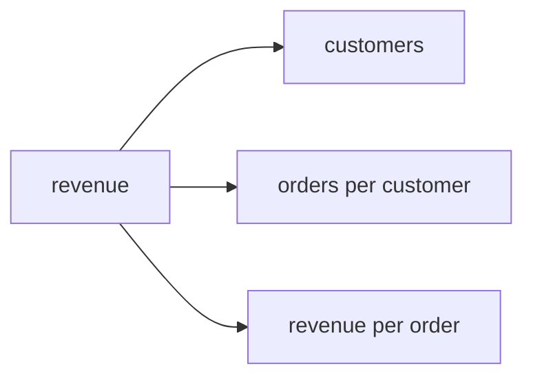
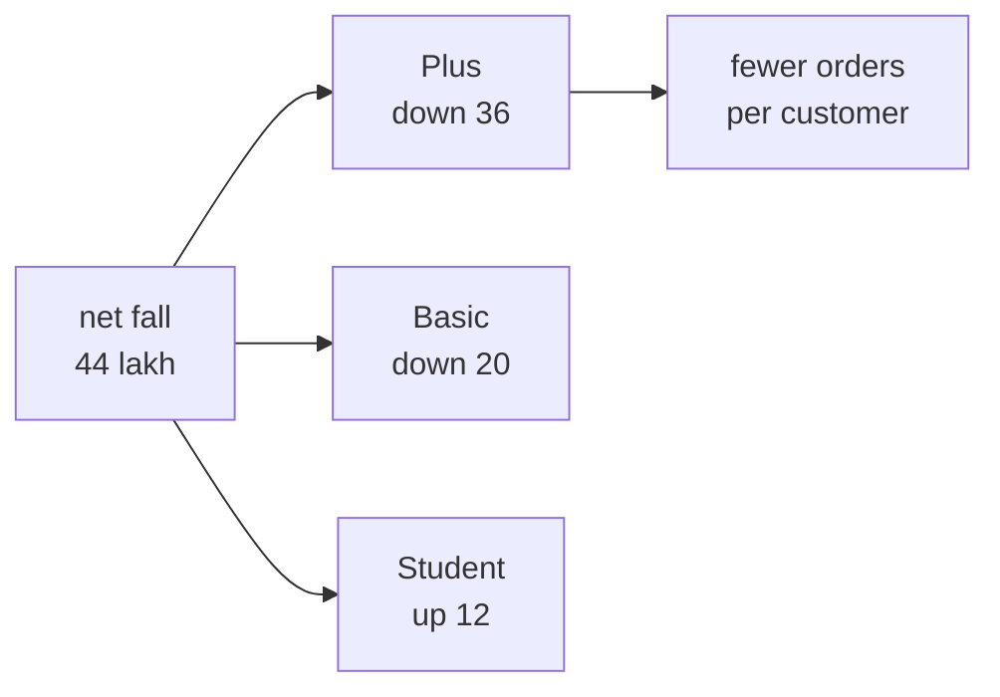
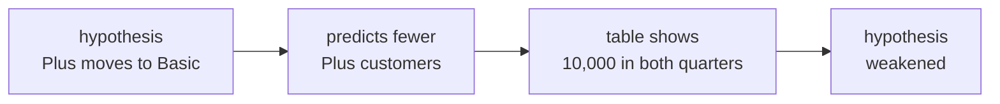
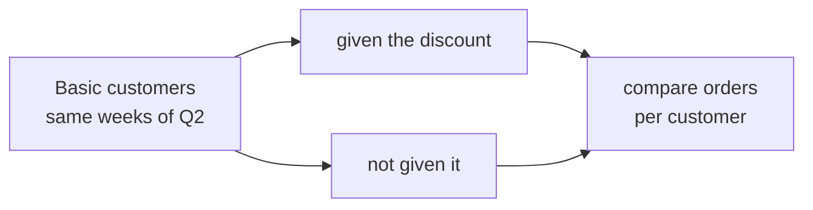
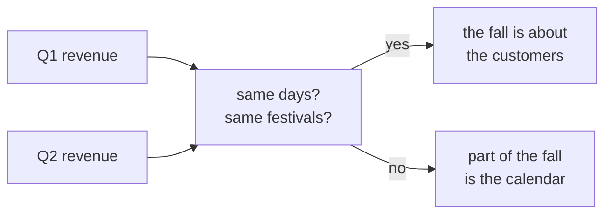
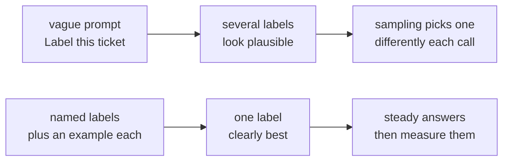
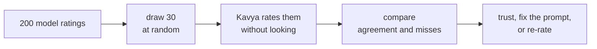

# Diagnostic, Section D: the Kalpa case and two LLM scenarios, every question worked

Section D gave you about ten minutes for a short case and two scenarios. In the case, Meera
Raghavan, CEO of Kalpa Retail, asks where Q1's revenue went by Q2, and Kavya Nair has pulled one
table. In the scenarios, Farhan's team and Kavya use an LLM at work. This thread works through all
six questions. The case figures were recomputed in Python 3.11.15 on 28 September 2026.

Your report email gave one line per question. This thread gives the long version: the working, a
picture, why each wrong option looks right, where the idea comes from, and what a sharper analyst
would add.

| Question | What it tests | Answer |
|---|---|---|
| Q29 | It tests finding where a fall sits by splitting revenue into its drivers. | A |
| Q30 | It tests reading what a table says about a hypothesis, and how strongly. | C |
| Q31 | It tests choosing the fairest comparison for a cause. | B |
| Q32 | It tests checking the window before trusting a finding. | D |
| Q33 | It tests why the same prompt can give two answers, and the first fix. | A |
| Q34 | It tests the fastest honest check on labels a model produced. | B |

## How to use this thread

- Open your report email beside this thread and read the questions you missed before the ones you
  got right.
- For the case, redo the arithmetic yourself from the table before reading the working.
- Reply in this thread with the question number when anything here disagrees with your own reading.

## The case as you saw it

Meera has one question for the analytics team: revenue fell from Q1 to Q2, so where did it go? Kavya
pulled this table. Revenue is in Rs lakh.

| Tier | Q1 customers | Q1 orders | Q1 revenue | Q2 customers | Q2 orders | Q2 revenue |
|---|---|---|---|---|---|---|
| Plus | 10,000 | 30,000 | 360 | 10,000 | 27,000 | 324 |
| Basic | 40,000 | 60,000 | 420 | 44,000 | 64,000 | 400 |
| Student | 5,000 | 6,000 | 24 | 8,000 | 9,000 | 36 |
| Total | 55,000 | 96,000 | 804 | 62,000 | 100,000 | 760 |

## One picture for the case

Revenue is a product of three drivers, and each driver can be read straight off the table.

The same table with the drivers worked out:

| Tier | Customers | Orders per customer | Revenue per order | Revenue, Rs lakh | Change, Rs lakh |
|---|---|---|---|---|---|
| Plus | 10,000 to 10,000 | 3.00 to 2.70 | Rs 1,200 to Rs 1,200 | 360 to 324 | -36 |
| Basic | 40,000 to 44,000 | 1.50 to 1.45 | Rs 700 to Rs 625 | 420 to 400 | -20 |
| Student | 5,000 to 8,000 | 1.20 to 1.13 | Rs 400 to Rs 400 | 24 to 36 | +12 |
| Total | 55,000 to 62,000 | 1.75 to 1.61 | Rs 838 to Rs 760 | 804 to 760 | -44 |

---

## Q29. Which line best explains most of the fall?

**The answer is A: Plus customers ordered less often at the same order value, and that tier carries
most of the fall.** Plus kept all 10,000 customers and its Rs 1,200 per order, while its orders per
customer fell from 3.0 to 2.7, and that alone cost 36 lakh of the net 44.

**Work it.** Put both quarters on every driver and look for the one that moved.

| Tier | What moved | Revenue change |
|---|---|---|
| Plus | Orders per customer fell by a tenth, and nothing else moved. | -36 lakh |
| Basic | Customers rose, orders per customer dipped slightly, and revenue per order fell by Rs 75. | -20 lakh |
| Student | Customers rose, and revenue per order held at Rs 400. | +12 lakh |
| Total | The three add to the net change. | -44 lakh |

**The picture.**

**Every option.**

| Option | It says | Why it tempts | What happens |
|---|---|---|---|
| A | Plus customers ordered less often at the same order value; that tier carries most of the fall | This is the answer. | Plus lost 36 lakh of the net 44, all of it through orders per customer. |
| B | Basic customers paid less per order than in Q1; that tier carries most of the fall | Its first half is true, since Basic's revenue per order fell from Rs 700 to Rs 625. | Its second half is false: Basic lost 20 lakh and Plus lost 36. |
| C | Student growth pulled spending away from the Plus tier, which is why Plus orders fell by a tenth | Both facts inside it are true: Student grew and Plus orders fell by a tenth. | The table cannot show one causing the other, and Plus kept all 10,000 of its customers. |
| D | Fewer customers overall placed orders in Q2, which lowered revenue across every tier | A fall in revenue often starts with fewer customers. | Customers rose from 55,000 to 62,000, and Student revenue went up. |

**A second look.** This part is the thread's own working, beyond what the question asked. Split each
tier's change into a volume part, meaning more or fewer orders at Q1's revenue per order, and a
price part, meaning the change in revenue per order on Q2's orders.

| Tier | Volume part, Rs lakh | Price part, Rs lakh | Net, Rs lakh |
|---|---|---|---|
| Plus | -36 | 0 | -36 |
| Basic | +28 | -48 | -20 |
| Student | +12 | 0 | +12 |
| Total | +4 | -48 | -44 |

Read this way, Basic's smaller orders are the largest single lever at 48 lakh, and more Basic and
Student orders almost pay for it. Both readings are true at once: Plus is the tier that lost the most,
and Basic's revenue per order is the driver that moved the most. A good answer to Meera gives her
both, and Q31 asks whether the discount explains the Basic lever.

**Where the idea comes from.** Consultants call this a driver tree. A guide by Taylor Warfield, a
former Bain manager, defines it as "a visual framework that breaks down a business metric into its
underlying mathematical components, so you can pinpoint exactly which variable is causing a change",
gives the same split ("Revenue = Number of Customers × Revenue per Customer", with "Revenue per
Customer = Average Order Value × Purchase Frequency"), and says to "Compare current period data to a
baseline". Finance has done the same for about a century: the DuPont analysis splits return on equity into
three factors, and its name "derives from the Dupont company, which began using this formula in the
1920s."

Sources: [Hacking the Case Interview, Driver Tree: Complete Guide with Examples](https://www.hackingthecaseinterview.com/pages/driver-tree), checked 28 September 2026; [Wikipedia, DuPont analysis](https://en.wikipedia.org/wiki/DuPont_analysis), checked 28 September 2026.

**Practise it.** If Plus customers had kept ordering 3.0 times each, what would Q2's total revenue have
been? Plus would have stayed at 360 lakh, the total would have been 796 lakh, and the fall would have
been only 8 lakh.

---

## Q30. Kavya's first hypothesis is that Plus customers are downgrading to Basic. What does the table say about it?

**The answer is C: it weakens it, since the Plus customer count did not fall.** Customers who moved
from Plus to Basic would leave the Plus count lower, and it stayed at 10,000.

**Work it.** Write down what the hypothesis predicts before looking.

| If Plus customers were downgrading | What the table shows |
|---|---|
| The Plus customer count falls. | It stayed at 10,000. |
| Basic gains the same customers. | Basic gained 4,000, which new customers would explain equally well. |
| Plus revenue falls because Plus has fewer customers. | Plus revenue fell because each customer ordered less often. |

**The picture.**

**Every option.**

| Option | It says | Why it tempts | What happens |
|---|---|---|---|
| A | It supports it, since Basic gained 4,000 customers | Basic did gain customers, which is what downgraders would add. | New customers would add the same 4,000, and Plus lost none, so the gain cannot be traced to Plus. |
| B | It supports it, since the Basic order value fell | A falling order value in Basic fits many stories. | It fits a discount at least as well as downgrading, so it cannot support one story over another. |
| C | It weakens it, since the Plus customer count did not fall | This is the answer. | The one number the hypothesis must move did not move. |
| D | It cannot be judged without customer-level churn data from both quarters | Customer-level data would settle it, and asking for more data sounds careful. | The table already weakens the hypothesis today, and churn data is the next check to run, which is different from saying nothing now. |

**A second look.** The flat 10,000 could hide a swap: a thousand Plus customers leaving for Basic and
a thousand new ones joining Plus. That is why the answer says the table weakens the hypothesis and
stops short of refuting it, and why the next check is the count of customers who were Plus in Q1 and
Basic in Q2.

**Where the idea comes from.** Mixpanel's guide to metric trees separates two kinds of link. "In
component relationships, the metrics have a direct and quantifiable impact on each other", which is
what the arithmetic in Q29 settles. "The second type of relationship is an influence relationship.
These are metrics that are correlated but don't have the same quantifiable connection", which is what
a hypothesis such as downgrading claims, and what a table can weaken without proving.

Source: [Mixpanel, What is a metric tree?](https://mixpanel.com/blog/metric-tree/), checked 28 September 2026.

**Practise it.** Write the one query you would ask Kavya to run next, in plain words: count the
customers who were Plus in Q1 and Basic in Q2.

---

## Q31. A monsoon discount was given to some Basic customers in Q2. Meera asks whether it caused the rise in Basic orders. Which comparison is the fairest one available?

**The answer is B: discounted Basic customers against non-discounted Basic customers, in the same
weeks.** The fair comparison holds everything else still, so the discount is the only difference
between the two groups.

**Work it.** List what differs between the two sides of each comparison.

| Comparison | What differs besides the discount |
|---|---|
| Basic in Q2 against Basic in Q1 | The season, prices, marketing and everything else that changed between the quarters. |
| Basic in Q2 against Plus in Q2 | The customers themselves, whose habits differ by tier, and Plus had its own fall. |
| Basic revenue against the plan | Whatever the plan got wrong, which has nothing to do with the discount. |
| Discounted Basic against other Basic, same weeks | Only the discount, if the two groups were alike to begin with. |

**The picture.**

**Every option.**

| Option | It says | Why it tempts | What happens |
|---|---|---|---|
| A | Basic Q2 orders against Basic Q1 orders, since the before-and-after is the change in question | The change over time is what Meera saw, so comparing the quarters feels direct. | Everything else that changed between the quarters is mixed into the difference. |
| B | Discounted Basic customers against non-discounted Basic customers, same weeks | This is the answer. | Same tier and same weeks leave the discount as the main difference. |
| C | Basic Q2 orders against Plus Q2 orders, since Plus had no discount | Plus had no discount, so it looks like a control group. | Plus and Basic are different customers, and Plus orders were falling for their own reasons. |
| D | Basic Q2 revenue against the plan line, since the plan assumed no discount | A plan is a clear reference line. | A plan is a forecast, and beating it cannot separate the discount from anything else the plan got wrong. |

**A second look.** The question says "some" Basic customers got the discount. Who chose them? If the
discount went to the most active Basic customers, even option B flatters it, because those customers
would have ordered more anyway. The strongest version assigns the discount at random within Basic,
which is an A/B test, and that is the design to propose for next quarter.

**Where the idea comes from.** Ronald Fisher set out randomised comparison as a method in his 1935
book The Design of Experiments, which Wikipedia describes as "considered to be a foundational work in
modern statistics and experimental methodology"; the MacTutor history of mathematics credits him with
"introducing the concept of randomisation and the analysis of variance, procedures now used
throughout the world." Online
businesses run the same idea as A/B tests, and Kohavi, Tang and Xu open their 2020 book Trustworthy
Online Controlled Experiments with "Getting numbers is easy; getting numbers you can trust is hard."
Their website adds that "causal claims based on observations alone should have a lower level of
trust than properly run randomized controlled experiments".

Sources: [Wikipedia, The Design of Experiments](https://en.wikipedia.org/wiki/The_Design_of_Experiments), checked 28 September 2026; [MacTutor, R A Fisher](https://mathshistory.st-andrews.ac.uk/Biographies/Fisher/), checked 28 September 2026; [Cambridge University Press, Trustworthy Online Controlled Experiments](https://www.cambridge.org/core/books/trustworthy-online-controlled-experiments/D97B26382EB0EB2DC2019A7A7B518F59), checked 28 September 2026; [Experiment Guide, Refuted Observational Studies](https://experimentguide.com/refuted_observational_studies/), checked 28 September 2026.

**Practise it.** Design the test for next quarter in four lines: which Basic customers get the
discount and how they are chosen, which do not, how many weeks it runs, and which number you compare
at the end.

---

## Q32. Before you put the Plus finding in front of Meera, which check protects the finding most?

**The answer is D: check that Q1 and Q2 have the same trading days and that no festival sat in one
quarter only.** A difference in the calendar can create a fall on its own, before any customer
changes anything.

**Work it.** Quarters differ by up to two days, 90 against 92, which is a gap of 2.2 percent. The
fall Meera is asking about is 44 of 804 lakh, which is 5.5 percent, so the calendar alone could
account for a large share of it. Festivals move too. In the Government of India's holiday lists for
its offices, Diwali fell on Monday 20 October in 2025 and falls on Sunday 8 November in 2026, and the
restricted holidays for Dussehra's Saptami and Mahashtami moved from 29 and 30 September in 2025 to
18 and 19 October in 2026, which puts them in a different quarter.

**The picture.**

**Every option.**

| Option | It says | Why it tempts | What happens |
|---|---|---|---|
| A | Ask for the Plus tier's marketing budget for Q2 and compare it with Q1's | Marketing is a common reason orders fall. | It tests one possible cause of the finding, while the finding itself could still be the calendar. |
| B | Re-add the six revenue figures in a spreadsheet to confirm that the totals match the table exactly | Checking arithmetic is a good habit. | It protects against a typo and leaves an unfair comparison untouched. |
| C | Compute the Plus tier's share of total revenue in each quarter and compare | It produces a new number, which feels like progress. | It describes the same figures a different way, with the same calendar inside them. |
| D | Check that Q1 and Q2 have the same trading days and that no festival sat in one quarter only | This is the answer. | It is the one check that could make the whole finding disappear, so it comes first. |

**Where the idea comes from.** Official statistics adjust for this. The US Census Bureau explains
that "Recurring effects associated with the days of the week are trading day effects" and that
"Trading day effects can make it difficult to compare series values or to compare movements in one
series with movements in another." Its example of a holiday that moves between quarters is Easter,
"which can fall in March or April (or in Quarter 1 or Quarter 2)". In India, Diwali and Dussehra play
Easter's part. The festival dates above come from the Department of Personnel and Training's Office
Memoranda F.No.12/2/2023-JCA dated 9 July 2024 (for 2025) and 3 July 2025 (for 2026), read from copies
hosted by StaffNews because the department's own site refused the connection.

Sources: [US Census Bureau, Seasonal Adjustment Questions and Answers](https://www.census.gov/data/software/x13as/seasonal-adjustment-questions-answers.html), checked 28 September 2026; [StaffNews copy of the 2025 holiday memorandum](https://www.staffnews.in/2024/07/holidays-to-be-observed-in-central-government-offices-year-2025.html), checked 28 September 2026; [StaffNews copy of the 2026 holiday memorandum](https://www.staffnews.in/2025/07/list-of-holidays-2026-dopt-order-reg-closed-and-restricted-holidays.html), checked 28 September 2026.

**Practise it.** Before any comparison of two quarters, write three lines for each: the number of days,
the number of weekends, and the festivals that fell inside it.

---

## Q33. The same ticket, sent twice, came back labelled refund once and delivery the second time. The prompt says only "Label this ticket". Which explanation and first fix fit best?

**The answer is A: sampling above zero temperature varies the reply, and the prompt never names the
labels, so lower the temperature and list the three labels with an example each.** A model does not
look up one fixed answer; it samples its reply, and a vague prompt leaves it several plausible
answers to sample from.

**Simulate it.** A toy model, made up for this thread, gives three scores to the possible labels:
refund 2.0, delivery 1.6 and other 0.2. The toy divides each score by the temperature before turning
the scores into chances, then draws a label. Twenty draws at each temperature:

| Temperature | Chance of refund | Chance of delivery | Chance of other | Twenty simulated calls |
|---|---|---|---|---|
| 1.0 | 54.5 percent | 36.5 percent | 9.0 percent | 9 refund, 9 delivery, 2 other |
| 0.5 | 67.7 percent | 30.4 percent | 1.9 percent | 15 refund, 5 delivery, 0 other |
| 0.2 | 88.1 percent | 11.9 percent | 0.0 percent | 16 refund, 4 delivery, 0 other |

A lower temperature sharpens the choice, and the same ticket can still come back with a different
label. The lasting fix changes the scores themselves: a prompt that names the three labels, gives an
example of each and asks for exactly one of them.

**The picture.**

**Every option.**

| Option | It says | Why it tempts | What happens |
|---|---|---|---|
| A | Sampling above zero temperature varies the reply, and the prompt never names the labels; lower it and list the three labels with an example each | This is the answer. | It fixes both causes, the sampling and the vague instruction. |
| B | The model remembers the first call and changed its mind on the second; clear its conversation history before every call so each starts fresh | Chat apps seem to remember, so it is natural to assume the API does. | Each API call is independent, and nothing from the first call reaches the second unless your code sends it. |
| C | The ticket text must contain a typo or odd formatting that confuses the model; clean the data before calling again and re-check | Messy input does cause bad output. | The same text went in twice and two labels came out, so the input cannot explain the difference. |
| D | The model is too small for a three-way classification; switch to the largest model available and re-run the whole batch | Bigger models are often better, and switching feels decisive. | A larger model given the same vague prompt still samples, costs more on every ticket, and the cheaper fix comes first. |

**Where the idea comes from.** OpenAI's API reference describes temperature as the sampling
temperature, "between 0 and 2. Higher values like 0.8 will make the output more random, while lower
values like 0.2 will make it more focused and deterministic." Anthropic's reference calls it the
"Amount of randomness injected into the response" and adds: "Note that even with temperature of 0.0,
the results will not be fully deterministic." Anthropic now lists the setting as deprecated: "Models
released after Claude Opus 4.6 do not support setting temperature", so on the newest models the prompt
is the fix you control. On memory, Anthropic's documentation says "The Messages API is stateless,
which means that you always send the full conversational history to the API", and OpenAI's says "each
text generation request is independent and stateless".

Sources: [OpenAI API reference, create chat completion](https://developers.openai.com/api/reference/resources/chat/subresources/completions/methods/create), checked 28 September 2026; [Anthropic API reference, create a message](https://platform.claude.com/docs/en/api/messages/create), checked 28 September 2026; [Anthropic, using the Messages API](https://platform.claude.com/docs/en/build-with-claude/working-with-messages), checked 28 September 2026; [OpenAI, conversation state](https://developers.openai.com/api/docs/guides/conversation-state), checked 28 September 2026.

**Practise it.** Write the prompt Farhan's team should have sent: the three labels, one example ticket
for each, and the instruction to reply with exactly one label. Then plan the check in Q34 that tells
you whether it worked.

---

## Q34. A model rated 200 customer reviews for sentiment from 1 to 5, and the ratings look plausible. Which check tells Kavya fastest whether they can be trusted?

**The answer is B: hand-rate a random 30 reviews herself and compare with the model's ratings.**
Ratings that look plausible are no evidence at all; agreement with a careful human on a random sample
is evidence, and it takes about an hour.

**Simulate it.** Kavya draws 30 reviews at random, rates them without looking at the model's ratings,
and then compares. Suppose the two agree exactly on 27 of the 30.

| What she measures | Result | What it tells her |
|---|---|---|
| Exact agreement | 27 of 30, which is 90 percent | The model matches a careful reader on most reviews. |
| How precise that is | a 95 percent interval of about 74 to 97 percent | Thirty reviews give a first read, and more reviews would narrow it. |
| Where they disagree | three reviews, to be read one by one | The disagreements show where the prompt needs work, for example 3 against 4 on mixed reviews. |

The interval is the Wilson score interval for 27 successes in 30, computed for this thread.

**The picture.**

**Every option.**

| Option | It says | Why it tempts | What happens |
|---|---|---|---|
| A | Ask the model to add a confidence score to each rating and keep the high ones | A confidence score looks like a measurement. | The score comes from the same model that produced the ratings, so it is more unverified output. |
| B | Hand-rate a random 30 reviews herself and compare with the model's ratings | This is the answer. | It measures agreement against a careful human on a fair sample. |
| C | Run the prompt through a second model and average the two ratings for each review | Two opinions sound better than one. | Two models can agree with each other and both be wrong, and neither has been compared with a human reading. |
| D | Add "be accurate and careful" to the prompt and re-run the whole batch | It is the quickest change to make. | It measures nothing, so after the re-run Kavya still cannot say whether the ratings can be trusted. |

**Where the idea comes from.** The providers' own guides say the same. OpenAI's evaluation guide
lists "Maintain agreement: Use human feedback to calibrate automated scoring" as a practice and
"Ignoring human feedback: Not calibrating your automated metrics against human evals" as an
anti-pattern. Anthropic's guide gives "1,000 tweets with human-labeled sentiments" as an example set
of test cases, and says of grading with a model: "Test to ensure reliability first then scale."
Measuring agreement between two raters has a long history: Jacob Cohen introduced the kappa statistic
in 1960, in "A Coefficient of Agreement for Nominal Scales", to count agreement beyond what chance
alone would give.

Sources: [OpenAI, evaluation best practices](https://developers.openai.com/api/docs/guides/evaluation-best-practices), checked 28 September 2026; [Anthropic, define success criteria and build evaluations](https://platform.claude.com/docs/en/test-and-evaluate/develop-tests), checked 28 September 2026; [Crossref record for Cohen (1960)](https://api.crossref.org/works/10.1177/001316446002000104), checked 28 September 2026.

**Practise it.** Say why the 30 must be drawn at random and never the first 30 in the file: the first
30 may be the oldest, the shortest or the easiest, and a check on an easy sample flatters the model.

---

## Questions learners ask about this section

**"My answer to Q29 was B, and the second look says Basic's price moved the most. Was I right?"**
Option B says Basic "carries most of the fall", and by tier it carries 20 lakh of 44, so B is false as
written. The second look adds that Basic's lower revenue per order is the biggest single driver
before the extra orders offset it. The strongest answer to Meera says both, in that order.

**"Isn't option D in Q30 the most careful answer?"**
It is the most cautious one. A table that cannot prove a hypothesis can still weaken it, and saying
so today, with the next check named, is more useful to Meera than waiting.

**"Can I set temperature to 0 and stop worrying?"**
No. Anthropic's documentation says results are not fully deterministic even at 0.0, and its newest
models accept only the default value of 1.0 and reject any other. Write a precise prompt, then
measure agreement as in Q34.

**"Does the model learn from my earlier calls?"**
No. Each call starts from what your code sends. OpenAI lets you chain responses with a
`previous_response_id`, and its documentation adds that "all previous input tokens for responses in
the chain are billed as input tokens in the API", so the history is sent and paid for every time.

**"Is 30 reviews enough?"**
For a first read, yes. The interval in Q34 shows how rough 30 is, and doubling the sample narrows it.

## The interview question this section answers

Tuesday's row carries **[F] A business asks you to 'improve sales'; what are the first five questions
you ask?** Q29 to Q32 work the same muscle on a table: which part of the business moved, what the table
can and cannot say, what the fair comparison is, and what could fake the whole finding. A strong
spoken answer asks what "sales" means, how far it fell and against what, where the fall sits, what
changed, and what "improved" would mean, before anyone proposes a fix.

## Watch and read

The video title and channel below were checked on 28 September 2026.

- Watch "Ronny Kohavi: A/B Testing Pitfalls: Getting Numbers You Can Trust is Hard - CXL LIVE 2016" by CXL, for Q31: https://www.youtube.com/watch?v=HEGI5QN3fXE (checked 28 September 2026).
- Read Taylor Warfield's "Driver Tree: Complete Guide with Examples (2026)", for Q29 and Q30: https://www.hackingthecaseinterview.com/pages/driver-tree (checked 28 September 2026).
- Read Dillon Baker's "What is a metric tree? The complete guide with examples." on the Mixpanel blog, for Q30: https://mixpanel.com/blog/metric-tree/ (checked 28 September 2026).
- Read Eugene Yan's "Evaluating the Effectiveness of LLM-Evaluators (aka LLM-as-Judge)", which aims for "the LLM-human correlation to match human-human correlation", for Q34: https://eugeneyan.com/writing/llm-evaluators/ (checked 28 September 2026).
- Read Anthropic's "Define success criteria and build evaluations", for Q34: https://platform.claude.com/docs/en/test-and-evaluate/develop-tests (checked 28 September 2026).
- Read OpenAI's "Evaluation best practices", for Q34: https://developers.openai.com/api/docs/guides/evaluation-best-practices (checked 28 September 2026).
