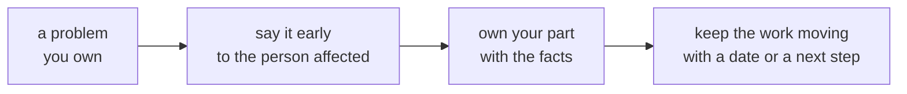
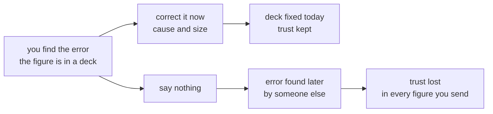
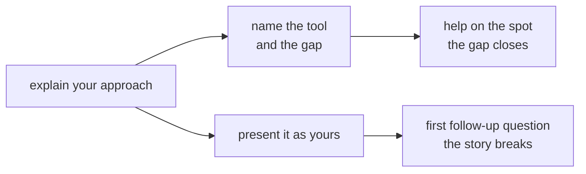
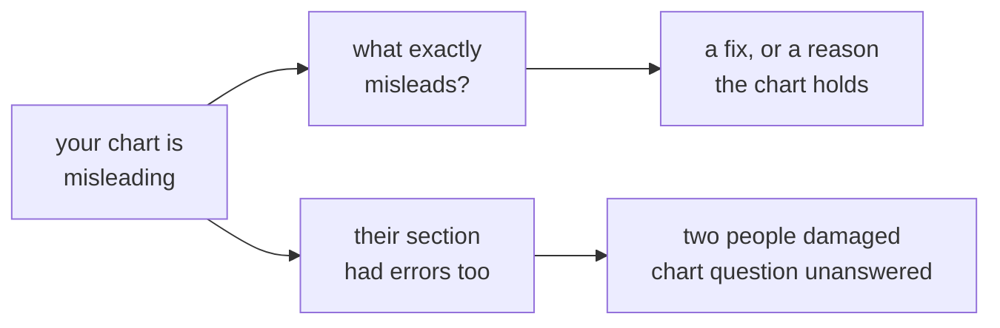
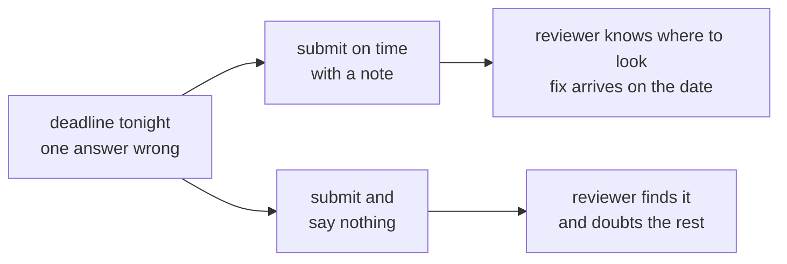
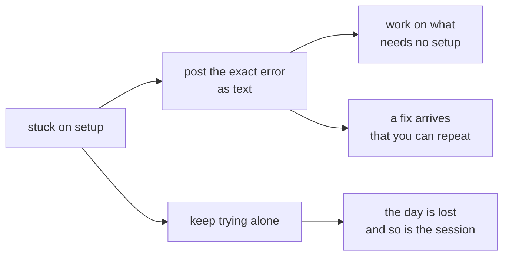
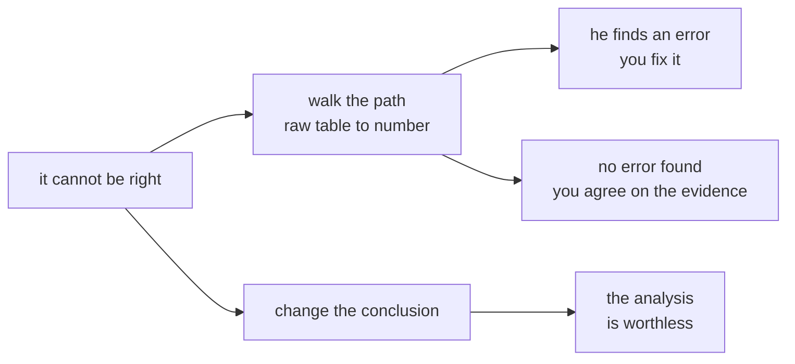

# Diagnostic, Section E: six judgment calls, the best and the worst of each

Section E gave you six situations in about five minutes and asked for the best action and the worst
action in each, one point for each pick, twelve in all. None of them hides a trick. Each one tests
what you do when being right and being comfortable pull in different directions, which is most of
what a client, a manager or a panel remembers about you.

This thread explains all four options in each situation, because the two middle options are where
most real decisions sit. They are defensible in some teams, which is why they were never the answer
to either question.

| Situation | What it tests | Best | Worst |
|---|---|---|---|
| Q35 | It tests correcting your own error in a figure someone else is already using. | C | A |
| Q36 | It tests being asked to explain work you did not understand. | B | D |
| Q37 | It tests taking criticism in front of a panel. | D | B |
| Q38 | It tests a deadline that arrives before the fix. | A | C |
| Q39 | It tests being stuck while the room moves on. | C | D |
| Q40 | It tests holding a finding when a senior person pushes back. | B | A |

## One picture for the whole section

Five of the six best answers make the same three moves, and four of the six worst answers (Q35, Q36,
Q38 and Q39) skip the first by staying quiet or hiding the problem.

---

## Q35. The figure in the board deck

You sent Anand Iyer, the Finance Controller, the quarterly revenue figure yesterday. This morning you
find your query counted returned orders as sales, so the figure is about 4 percent too high, and it
is already in a board deck.

**Best: C, send Anand the corrected figure now, with the cause and the size of the error.** It is the
only option that protects the board figure and your credibility at once, and every hour of delay is
an hour in which the wrong number can travel further.

**Worst: A, fix the query so next month's figure is right and say nothing about this one, since
4 percent sits inside normal variance.** A known error in a board figure always surfaces, and when it
does, the silence costs more trust than the error.

**The picture.**

**The two middle options.**

| Option | It says | Why it tempts | Where it falls short |
|---|---|---|---|
| B | Ask a peer to re-run your query and send a correction only once they confirm the error is real | Checking before you speak is a good instinct. | You already know the cause, so the check takes you minutes; waiting on a peer holds a board figure hostage to someone else's diary. |
| D | Tell your reporting manager and let them decide whether Finance needs to hear about it | Many teams expect the manager to hear first, and telling them is right. | It lets Finance's knowledge depend on someone else's decision, while Anand is the person relying on the number now. Tell your manager and send the correction, in whichever order your team expects, within the hour. |

**What the message looks like.** "Anand, the Q2 revenue figure I sent yesterday is about 4 percent
too high: my query counted returned orders as sales. The corrected figure is [figure], and the query
is fixed. I can walk you through the change whenever it suits you."

**Where the idea comes from.** Google's Site Reliability Engineering book calls blameless
postmortems "a tenet of SRE culture" and names the cost of the alternative: "If a culture of finger
pointing and shaming individuals or teams for doing the "wrong" thing prevails, people will not bring
issues to light for fear of punishment." Its companion workbook explains why speed matters: "The
people who were affected by the outage are waiting for an explanation and some demonstration that
you have things under control. The longer you wait, the more they will fill the gap with the products
of their imagination." Amazon's leadership principles ask the same of individuals: "They are vocally
self-critical, even when doing so is awkward or embarrassing."

Sources: [Google SRE book, chapter 15, Postmortem Culture: Learning from Failure](https://sre.google/sre-book/postmortem-culture/), checked 28 September 2026; [Google SRE Workbook, chapter 10, Postmortem Culture](https://sre.google/workbook/postmortem-culture/), checked 28 September 2026; [Amazon, Leadership Principles](https://www.amazon.jobs/content/en/our-workplace/leadership-principles), checked 28 September 2026.

---

## Q36. The answer you did not understand

During an ungraded exercise you got the answer from an AI assistant and submitted it without
understanding it. The trainer asks you to explain your approach to the room.

**Best: B, say you used an AI assistant, then walk through what you do and do not yet understand.**
It is the honest answer, and it is the one that gets you help on the spot, from a trainer whose job
is exactly that.

**Worst: D, present the answer as your own reasoning and improvise wherever the logic is unclear to
you.** Borrowed reasoning comes apart at the first follow-up question, usually within minutes, and
what the room remembers is the pretending.

**The picture.**

**The two middle options.**

| Option | It says | Why it tempts | Where it falls short |
|---|---|---|---|
| A | Ask the trainer to come back to you once you have had time to study the answer properly | It buys time without saying anything false. | It hides the reason, and the room loses the chance to see how you think about a gap, which is the useful part. |
| C | Ask the person next to you, who solved it without help, to explain the approach instead | Their explanation will be better than yours. | The question was about your approach, and handing it on avoids it. |

**In this programme.** The orientation deck sets an AI-use ladder. In Weeks 1 to 6, "Core exercises
and every assessment run without AI assistants. The habit of thinking first is built before any tool
is allowed." In Weeks 7 to 15, "Assistants are permitted on build work, and every line you ship is one
you can explain and defend in the viva." In Weeks 16 to 20, "You use assistants as accelerators and
disclose where you did." Option B is the disclosure habit the last step asks for, practised early.

**Where the idea comes from.** Google's research on its own teams, published on its re:Work site,
ranked psychological safety first among the factors that made teams effective, and describes it as
teammates who "feel confident that no one on the team will embarrass or punish anyone else for
admitting a mistake, asking a question, or offering a new idea." The idea comes from Amy Edmondson of
Harvard, who defined team psychological safety as "a shared belief held by members of a team that the
team is safe for interpersonal risk taking", in a 1999 paper in Administrative Science Quarterly.
Among her suggestions the guide lists "Acknowledge your own fallibility."

Sources: [Google re:Work, Understand team effectiveness](https://rework.withgoogle.com/intl/en/guides/understand-team-effectiveness), checked 28 September 2026; [Crossref record for Edmondson (1999)](https://api.crossref.org/works/10.2307/2666999), checked 28 September 2026.

---

## Q37. "Your chart is misleading"

During your group's presentation a group-mate says, in front of the panel, that your chart is
misleading.

**Best: D, ask what specifically misleads and offer to fix it before the presentation moves on.** It
turns criticism into a fix in front of the panel, which shows the panel how you work, and if the
chart holds up, the question gives you the chance to show why.

**Worst: B, point out that their own section had errors too, so the panel hears both sides.**
Retaliating in front of a panel damages both of you and answers nothing about the chart.

**The picture.**

**The two middle options.**

| Option | It says | Why it tempts | Where it falls short |
|---|---|---|---|
| A | Say nothing now, since the panel is watching, and fix the chart after the presentation | It avoids a scene. | The panel is left holding a doubt it cannot resolve, and silence reads as agreement or as not having heard. |
| C | Defend the chart, since you checked the numbers twice before the presentation | Checked numbers feel like a complete defence. | A chart can mislead with every number right, for example when its axis starts far above zero and turns a small gap into a large one, so defending the numbers answers a different charge. |

**Where the idea comes from.** The same re:Work guide describes the teams that do this well:
"Those on teams with strong cultures feel safe taking risks in the face of being seen as ignorant,
incompetent, negative, or disruptive." Edmondson's 1999 study of 51 work teams found that "team
psychological safety is associated with learning behavior", and asking what exactly is wrong is
learning behaviour in public. Amazon's principle for earning trust says: "Leaders listen
attentively, speak candidly, and treat others respectfully."

Sources: [Google re:Work, Understand team effectiveness](https://rework.withgoogle.com/intl/en/guides/understand-team-effectiveness), checked 28 September 2026; [OpenAlex record for Edmondson (1999), with its abstract](https://api.openalex.org/works/doi:10.2307/2666999), checked 28 September 2026; [Amazon, Leadership Principles](https://www.amazon.jobs/content/en/our-workplace/leadership-principles), checked 28 September 2026.

---

## Q38. The deadline arrives before the fix

A take-home is due tonight. Your notebook runs, but the answer to the last question is wrong and you
know why; the fix needs two more hours.

**Best: A, submit on time with a note saying which part is wrong, why, and when the fix follows.**
It keeps the deadline and your credibility, and it tells the reviewer exactly where to look.

**Worst: C, submit as it is and say nothing, since the notebook runs and the deadline is what
counts.** Knowingly submitting a wrong answer as right is exactly the failure the note would have
prevented.

**The picture.**

**The two middle options.**

| Option | It says | Why it tempts | Where it falls short |
|---|---|---|---|
| B | Message the TA that you will submit tomorrow with the fix included, since correctness matters more | Correctness does matter. | The orientation deck is plain about deadlines: "Exercises and projects go on GitHub Discussions and the LMS by the stated deadline. What is not submitted there is not submitted." |
| D | Submit only the parts that are right and quietly drop the last question from the notebook | Everything submitted is then correct. | The reviewer finds a missing question with no reason given, and the quiet part is what costs the trust. |

**What the note looks like.** "The answer to the last question is wrong: the notebook filters the
wrong quarter before computing it. The fix needs about two hours, and the corrected notebook will be
in this thread by [date]."

**Where the idea comes from.** Software teams ship this way every week. Red Hat's style guide for
release notes says "Known issues describe existing problems that customers should be aware of, so that
they can mitigate them and avoid unnecessary reporting", and asks each one to state its cause, its
consequence and any workaround. The same guide adds: "Do not promise that a feature or a fix for a
known issue will be included in an upcoming release or according to a specific timeline." That rule
protects customers who would plan around a date nobody controls. The date in your note is different,
because the fix is your own work, so give the date and keep it.

Source: [Red Hat supplementary style guide, release notes, known issues](https://redhat-documentation.github.io/supplementary-style-guide/#release-notes-known-issues), checked 28 September 2026.

---

## Q39. Ninety minutes stuck

You have spent 90 minutes stuck on an environment error while the session moves on without you.

**Best: C, post the exact error text in the Discussions thread and continue with the parts that need
no setup.** The exact text is the fastest route to a fix, and the parts that need no environment keep
the day productive while help arrives.

**Worst: D, keep trying alone, since asking now would show the room you cannot handle the basics.**
Ninety minutes alone is already too long, and the fear of looking slow is what made it ninety.

**The picture.**

**The two middle options.**

| Option | It says | Why it tempts | Where it falls short |
|---|---|---|---|
| A | Ask the person next to you to do the setup on your machine so you can catch up with the session | It gets you moving fastest. | You lose the fix, since you could not repeat it, and your neighbour loses part of their session. Use it after posting the error, never in place of it. |
| B | Wait until the end of the day and email a screenshot of the error to the TA | It avoids interrupting anyone. | It gives up the rest of the day, and a screenshot cannot be copied, searched or pasted into a fix. |

**What the post looks like.** A title that names the error, such as "Setup: ModuleNotFoundError after
opening the Codespace"; one line on what you ran; the full error text pasted as text inside a code
block; and one line on what you already tried.

**In this programme.** One of the ten statements you rated at the end of the diagnostic was "I ask for
help within thirty minutes of getting stuck." Thirty minutes is a good rule to adopt from today.

**Where the idea comes from.** Stack Overflow's guide to asking says: "Tell other readers what the
exact wording of the error message is, and which line of code is producing it." Its guide to a good
question asks you to "Include any error messages", and to paste them as text, never as a picture.
Writing the question down often solves it: programmers call this rubber duck debugging, after a story
in The Pragmatic Programmer (1999) in which explaining the code step by step "often causes the problem
to leap off the screen and announce itself". Jeff Atwood wrote on his blog, Coding Horror, that many
people "in the process of writing up their thorough, detailed question for Stack Overflow or
another Stack Exchange site, figured out the answer to their own problem."

Sources: [Stack Overflow, How to create a Minimal, Reproducible Example](https://stackoverflow.com/help/minimal-reproducible-example), checked 28 September 2026; [Stack Overflow, How do I ask a good question?](https://stackoverflow.com/help/how-to-ask), checked 28 September 2026; [Wikipedia, Rubber duck debugging](https://en.wikipedia.org/wiki/Rubber_duck_debugging), checked 28 September 2026; [Coding Horror, Rubber Duck Problem Solving](https://blog.codinghorror.com/rubber-duck-problem-solving/), checked 28 September 2026.

---

## Q40. "It cannot be right"

Anand says your analysis "cannot be right" because it contradicts his experience, and asks you to
change the conclusion before the meeting.

**Best: B, walk him through the path from raw table to final number and ask which step he doubts.**
Either he points at a real error, which you fix and thank him for, or the disagreement ends with both
of you looking at the same evidence.

**Worst: A, change the conclusion, since he has run Finance for years and knows the business better
than the data.** Changing a conclusion because of pushback abandons the evidence and makes the
analysis worthless to everyone, including him.

**The picture.**

**The two middle options.**

| Option | It says | Why it tempts | Where it falls short |
|---|---|---|---|
| C | Tell him the numbers do not lie and keep the conclusion exactly as it is | Keeping a sound conclusion is right. | The words close the conversation and assume your own work has no error in it, which is the one thing you have not checked with him. |
| D | Escalate to Meera at once so she can decide between his experience and your analysis | It gets a decision quickly. | It skips the conversation that could settle it and turns a question about one step into a contest of rank. |

**Where the idea comes from.** Amazon's principle "Have Backbone; Disagree and Commit" says: "Leaders
are obligated to respectfully challenge decisions when they disagree, even when doing so is
uncomfortable or exhausting. Leaders have conviction and are tenacious. They do not compromise for the
sake of social cohesion. Once a decision is determined, they commit wholly." Two other principles on
the same page describe how to hold the line well: leaders "stay connected to the details, audit
frequently, and are skeptical when metrics and anecdote differ", and "They seek diverse perspectives
and work to disconfirm their beliefs." The last one applies to you as much as to Anand: walking the
path is also how you find out whether you are wrong.

Source: [Amazon, Leadership Principles](https://www.amazon.jobs/content/en/our-workplace/leadership-principles), checked 28 September 2026.

---

## Questions learners ask about this section

**"Only the best and the worst are scored. Why have middle options at all?"**
Because real choices are rarely between a hero and a villain. The middle options are what a sensible
person does on a tired day, and seeing why each falls short is most of the learning.

**"In Q35, isn't telling my manager the professional thing to do?"**
Yes, tell them. The weak part of option D is making Finance's knowledge wait on the manager's
decision. Do both, in whichever order your team expects, within the hour.

**"Will the programme really ask about AI use in a viva?"**
The orientation deck says so for Weeks 7 to 15: "every line you ship is one you can explain and defend
in the viva." The habit in Q36's best answer is the one that viva rewards.

**"What if the chart in Q37 really was fine?"**
Then asking what misleads lets your group-mate say it, and you can show the panel why the chart
holds. Either way the panel watches you handle criticism well.

**"I rated 'I ask for help within thirty minutes' as 2. Is that bad?"**
It is honest, and it is the most useful of the ten to change. Set a timer the next time you are stuck,
and post the exact error at thirty minutes.

## Watch and read

The video titles and channels below were checked on 28 September 2026.

- Watch "Building a psychologically safe workplace | Amy Edmondson | TEDxHGSE" by TEDx Talks, for Q36 and Q37: https://www.youtube.com/watch?v=LhoLuui9gX8 (checked 28 September 2026).
- Watch "Postmortem Culture at Google | Ramon Medrano Llamas | Conf42 SRE 2022" by Conf42, for Q35: https://www.youtube.com/watch?v=qgHWzQ2zcqQ (checked 28 September 2026).
- Read the Google SRE book's chapter "Postmortem Culture: Learning from Failure" by John Lunney and Sue Lueder, for Q35: https://sre.google/sre-book/postmortem-culture/ (checked 28 September 2026).
- Read Google re:Work's "Understand team effectiveness", for Q36 and Q37: https://rework.withgoogle.com/intl/en/guides/understand-team-effectiveness (checked 28 September 2026).
- Read Stack Overflow's "How to create a Minimal, Reproducible Example", for Q39: https://stackoverflow.com/help/minimal-reproducible-example (checked 28 September 2026).
- Read Jeff Atwood's "Rubber Duck Problem Solving" on Coding Horror, for Q39: https://blog.codinghorror.com/rubber-duck-problem-solving/ (checked 28 September 2026).
