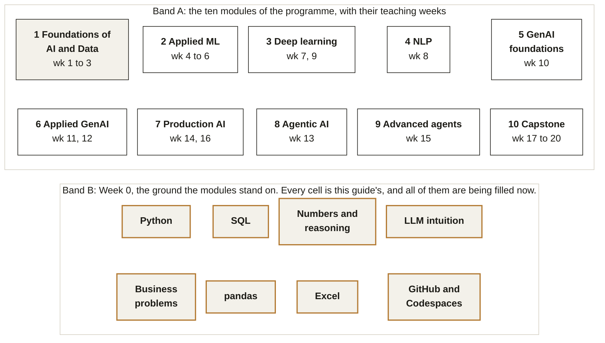
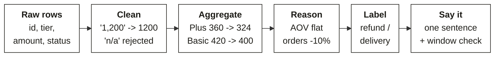

# From the Diagnostic to Week 1: the foundations guide

Week 0 · Foundations before teaching starts · PG Diploma in AI-ML and Agentic AI Engineering, IIT Gandhinagar, Cohort 2

*After this guide you can read code and queries the way the machine does, reason about a business
number without a formula, hold a sensible conversation about how a language model works, and keep
all of it in a GitHub portfolio an interviewer will open.*

137 minute read · 36 figures

## How to read this guide

You sat the diagnostic and you have the emailed report open beside you. This guide is built for the
four days between that report and the first hour of Week 1, and it does the four things the
diagnostic could not: it places each idea inside the programme, it adds the history and the real
cases, it compresses each area into one picture you can redraw, and it shows where each idea gets
tested.

Reading time is stated once at the top of each chapter, and it assumes you read at a working pace and
stop to redraw each picture. The mini projects at the end of each chapter are the point of the
guide; the reading exists to make them possible.

| Chapter | What it asserts | Diagnostic questions it revisits | Reading | Hands-on |
|---|---|---|---|---|
| [1 Python](C2_W00_D02_foundations_01_python_STUDENT.md) | Python reads data the way it is written, never the way you meant it | Q1 to Q12 | 13 min | 90 min |
| [2 SQL](C2_W00_D02_foundations_02_sql_STUDENT.md) | A query runs in an order that is not the order you write | Q13 to Q20 | 11 min | 90 min |
| [3 Numbers](C2_W00_D02_foundations_03_numbers_STUDENT.md) | Most wrong numbers are right arithmetic on the wrong denominator | Q21 to Q28 | 12 min | 60 min |
| [4 Language models](C2_W00_D02_foundations_04_language_models_STUDENT.md) | A language model is a sampler, and a prompt is a specification | Q28, Q33, Q34 | 11 min | 60 min |
| [5 Business problems and judgment](C2_W00_D02_foundations_05_business_problems_STUDENT.md) | An unfamiliar problem is decomposed, never solved in one move | Q29 to Q40 | 9 min | 60 min |
| [6 pandas](C2_W00_D02_foundations_06_pandas_STUDENT.md) | A DataFrame is the SQL pipeline with a different spelling | none, new | 7 min | 90 min |
| [7 Excel](C2_W00_D02_foundations_07_excel_STUDENT.md) | A PivotTable is GROUP BY for people who will never see your code | none, new | 5 min | 45 min |
| [8 GitHub](C2_W00_D02_foundations_08_github_STUDENT.md) | Your GitHub is the portfolio interviewers actually open | none, new | 13 min | 60 min |
| [9 The diagnostic, worked](C2_W00_D02_foundations_09_diagnostic_worked_STUDENT.md) | Every question, its answer, the steps, and why the other options fail | Q1 to Q40 | 44 min, as a reference | |
| [The path](C2_W00_D02_foundations_10_path_STUDENT.md) | Videos, reading and the six mini projects, in order | | 5 min | |

Every historical claim, organisation and number in this guide was checked against a live source on
29 September 2026, and the source is named where the claim appears. Anything marked as this course's
own construction is a teaching device, not an industry standard.

## The forty questions, in sequence

This map is the spine of the guide. Chapters 1 to 8 teach the ideas in the order that builds them,
which is not the order of the paper; this table restores the paper's order, and every row links to
the worked item in Chapter 9.

| Q | Section | What it asked | Answer | Taught in | Worked at | Discussion thread |
|---|---|---|---|---|---|---|
| Q1 | A | Predict the output: types do not convert on their own | C | Chapter 1 | [Q1 in Chapter 9](C2_W00_D02_foundations_09_diagnostic_worked_STUDENT.md#q1) | [Section A, part 1](C2_W00_D02_discussion_A1_python_STUDENT.md) |
| Q2 | A | Spot the bug, if there is one: two names, one list | B | Chapter 1 | [Q2 in Chapter 9](C2_W00_D02_foundations_09_diagnostic_worked_STUDENT.md#q2) | [Section A, part 1](C2_W00_D02_discussion_A1_python_STUDENT.md) |
| Q3 | A | Trace the flow (pseudocode): accumulator and running best, strict comparison on a tie | D | Chapter 1 | [Q3 in Chapter 9](C2_W00_D02_foundations_09_diagnostic_worked_STUDENT.md#q3) | [Section A, part 1](C2_W00_D02_discussion_A1_python_STUDENT.md) |
| Q4 | A | Predict the output: counting labels with dict.get | A | Chapter 1 | [Q4 in Chapter 9](C2_W00_D02_foundations_09_diagnostic_worked_STUDENT.md#q4) | [Section A, part 1](C2_W00_D02_discussion_A1_python_STUDENT.md) |
| Q5 | A | Fix the code: reading a nested JSON response | B | Chapter 1 | [Q5 in Chapter 9](C2_W00_D02_foundations_09_diagnostic_worked_STUDENT.md#q5) | [Section A, part 1](C2_W00_D02_discussion_A1_python_STUDENT.md) |
| Q6 | A | Predict the output: truthiness drops zero as well as None | D | Chapter 1 | [Q6 in Chapter 9](C2_W00_D02_foundations_09_diagnostic_worked_STUDENT.md#q6) | [Section A, part 1](C2_W00_D02_discussion_A1_python_STUDENT.md) |
| Q7 | A | Which line: integer division hides the fraction | A | Chapter 1 | [Q7 in Chapter 9](C2_W00_D02_foundations_09_diagnostic_worked_STUDENT.md#q7) | [Section A, part 2](C2_W00_D02_discussion_A2_python_STUDENT.md) |
| Q8 | A | Predict the output: a default argument is created once | C | Chapter 1 | [Q8 in Chapter 9](C2_W00_D02_foundations_09_diagnostic_worked_STUDENT.md#q8) | [Section A, part 2](C2_W00_D02_discussion_A2_python_STUDENT.md) |
| Q9 | A | Fix the code: defensive conversion: skip and count the bad rows | A | Chapter 1 | [Q9 in Chapter 9](C2_W00_D02_foundations_09_diagnostic_worked_STUDENT.md#q9) | [Section A, part 2](C2_W00_D02_discussion_A2_python_STUDENT.md) |
| Q10 | A | Spot the bug: sorted() on tuples orders by the first element | D | Chapter 1 | [Q10 in Chapter 9](C2_W00_D02_foundations_09_diagnostic_worked_STUDENT.md#q10) | [Section A, part 2](C2_W00_D02_discussion_A2_python_STUDENT.md) |
| Q11 | A | Predict the output: braces inside a format template are placeholders | B | Chapter 1 | [Q11 in Chapter 9](C2_W00_D02_foundations_09_diagnostic_worked_STUDENT.md#q11) | [Section A, part 2](C2_W00_D02_discussion_A2_python_STUDENT.md) |
| Q12 | A | Fix the code: a repeated inner list is one object | C | Chapter 1 | [Q12 in Chapter 9](C2_W00_D02_foundations_09_diagnostic_worked_STUDENT.md#q12) | [Section A, part 2](C2_W00_D02_discussion_A2_python_STUDENT.md) |
| Q13 | B | Predict the result: COUNT(*) against COUNT(column) with NULL | B | Chapter 2 | [Q13 in Chapter 9](C2_W00_D02_foundations_09_diagnostic_worked_STUDENT.md#q13) | [Section B](C2_W00_D02_discussion_B_sql_STUDENT.md) |
| Q14 | B | Fix the query: integer division in SQL | A | Chapter 2 | [Q14 in Chapter 9](C2_W00_D02_foundations_09_diagnostic_worked_STUDENT.md#q14) | [Section B](C2_W00_D02_discussion_B_sql_STUDENT.md) |
| Q15 | B | Predict the result: WHERE before grouping, HAVING after | D | Chapter 2 | [Q15 in Chapter 9](C2_W00_D02_foundations_09_diagnostic_worked_STUDENT.md#q15) | [Section B](C2_W00_D02_discussion_B_sql_STUDENT.md) |
| Q16 | B | Spot the bug: NULL in a comparison | C | Chapter 2 | [Q16 in Chapter 9](C2_W00_D02_foundations_09_diagnostic_worked_STUDENT.md#q16) | [Section B](C2_W00_D02_discussion_B_sql_STUDENT.md) |
| Q17 | B | Spot the bug and fix it: a WHERE on the right table turns a LEFT JOIN into an inner join | A | Chapter 2 | [Q17 in Chapter 9](C2_W00_D02_foundations_09_diagnostic_worked_STUDENT.md#q17) | [Section B](C2_W00_D02_discussion_B_sql_STUDENT.md) |
| Q18 | B | Predict the result: aggregates cannot sit in WHERE | B | Chapter 2 | [Q18 in Chapter 9](C2_W00_D02_foundations_09_diagnostic_worked_STUDENT.md#q18) | [Section B](C2_W00_D02_discussion_B_sql_STUDENT.md) |
| Q19 | B | Predict the result: latest row per group with ROW_NUMBER | D | Chapter 2 | [Q19 in Chapter 9](C2_W00_D02_foundations_09_diagnostic_worked_STUDENT.md#q19) | [Section B](C2_W00_D02_discussion_B_sql_STUDENT.md) |
| Q20 | B | Fix the query: join fan-out inflates a SUM | C | Chapter 2 | [Q20 in Chapter 9](C2_W00_D02_foundations_09_diagnostic_worked_STUDENT.md#q20) | [Section B](C2_W00_D02_discussion_B_sql_STUDENT.md) |
| Q21 | C | Reason with numbers: ratios of percentage changes | D | Chapter 3 | [Q21 in Chapter 9](C2_W00_D02_foundations_09_diagnostic_worked_STUDENT.md#q21) | [Section C](C2_W00_D02_discussion_C_numbers_STUDENT.md) |
| Q22 | C | Reason with numbers: median against mean under one extreme value | A | Chapter 3 | [Q22 in Chapter 9](C2_W00_D02_foundations_09_diagnostic_worked_STUDENT.md#q22) | [Section C](C2_W00_D02_discussion_C_numbers_STUDENT.md) |
| Q23 | C | Reason with numbers: compare rates, not counts | B | Chapter 3 | [Q23 in Chapter 9](C2_W00_D02_foundations_09_diagnostic_worked_STUDENT.md#q23) | [Section C](C2_W00_D02_discussion_C_numbers_STUDENT.md) |
| Q24 | C | Two statements: percentage changes do not add | C | Chapter 3 | [Q24 in Chapter 9](C2_W00_D02_foundations_09_diagnostic_worked_STUDENT.md#q24) | [Section C](C2_W00_D02_discussion_C_numbers_STUDENT.md) |
| Q25 | C | Reason with numbers: small counts move for no reason | A | Chapter 3 | [Q25 in Chapter 9](C2_W00_D02_foundations_09_diagnostic_worked_STUDENT.md#q25) | [Section C](C2_W00_D02_discussion_C_numbers_STUDENT.md) |
| Q26 | C | Reason with numbers: base rates: precision from recall and prevalence | D | Chapter 3 | [Q26 in Chapter 9](C2_W00_D02_foundations_09_diagnostic_worked_STUDENT.md#q26) | [Section C](C2_W00_D02_discussion_C_numbers_STUDENT.md) |
| Q27 | C | Reason with numbers: mix shift can reverse a total | B | Chapter 3 | [Q27 in Chapter 9](C2_W00_D02_foundations_09_diagnostic_worked_STUDENT.md#q27) | [Section C](C2_W00_D02_discussion_C_numbers_STUDENT.md) |
| Q28 | C | Estimate: token economics, multi-step estimate | C | Chapter 3 and 4 | [Q28 in Chapter 9](C2_W00_D02_foundations_09_diagnostic_worked_STUDENT.md#q28) | [Section C](C2_W00_D02_discussion_C_numbers_STUDENT.md) |
| Q29 | D | Case: Kalpa Retail, Q1 against Q2: which branch moved | A | Chapter 5 | [Q29 in Chapter 9](C2_W00_D02_foundations_09_diagnostic_worked_STUDENT.md#q29) | [Section D](C2_W00_D02_discussion_D_case_STUDENT.md) |
| Q30 | D | Case: Kalpa Retail, Q1 against Q2: test a hypothesis against the table | C | Chapter 5 | [Q30 in Chapter 9](C2_W00_D02_foundations_09_diagnostic_worked_STUDENT.md#q30) | [Section D](C2_W00_D02_discussion_D_case_STUDENT.md) |
| Q31 | D | Case: Kalpa Retail, Q1 against Q2: the fair comparison | B | Chapter 5 | [Q31 in Chapter 9](C2_W00_D02_foundations_09_diagnostic_worked_STUDENT.md#q31) | [Section D](C2_W00_D02_discussion_D_case_STUDENT.md) |
| Q32 | D | Case: Kalpa Retail, Q1 against Q2: like-with-like windows before presenting | D | Chapter 5 | [Q32 in Chapter 9](C2_W00_D02_foundations_09_diagnostic_worked_STUDENT.md#q32) | [Section D](C2_W00_D02_discussion_D_case_STUDENT.md) |
| Q33 | D | Scenario: LLM intuition: sampling variance and an under-specified prompt | A | Chapter 4 | [Q33 in Chapter 9](C2_W00_D02_foundations_09_diagnostic_worked_STUDENT.md#q33) | [Section D](C2_W00_D02_discussion_D_case_STUDENT.md) |
| Q34 | D | Scenario: LLM intuition: a small hand-labelled set is the fastest trust check | B | Chapter 4 | [Q34 in Chapter 9](C2_W00_D02_foundations_09_diagnostic_worked_STUDENT.md#q34) | [Section D](C2_W00_D02_discussion_D_case_STUDENT.md) |
| Q35 | E | Best and worst: disclosing an error you found yourself | best C, worst A | Chapter 5 | [Q35 in Chapter 9](C2_W00_D02_foundations_09_diagnostic_worked_STUDENT.md#q35) | [Section E](C2_W00_D02_discussion_E_judgment_STUDENT.md) |
| Q36 | E | Best and worst: owning what you do not yet understand | best B, worst D | Chapter 5 | [Q36 in Chapter 9](C2_W00_D02_foundations_09_diagnostic_worked_STUDENT.md#q36) | [Section E](C2_W00_D02_discussion_E_judgment_STUDENT.md) |
| Q37 | E | Best and worst: taking criticism in front of others | best D, worst B | Chapter 5 | [Q37 in Chapter 9](C2_W00_D02_foundations_09_diagnostic_worked_STUDENT.md#q37) | [Section E](C2_W00_D02_discussion_E_judgment_STUDENT.md) |
| Q38 | E | Best and worst: deadline against a known defect | best A, worst C | Chapter 5 | [Q38 in Chapter 9](C2_W00_D02_foundations_09_diagnostic_worked_STUDENT.md#q38) | [Section E](C2_W00_D02_discussion_E_judgment_STUDENT.md) |
| Q39 | E | Best and worst: asking for help at the right time | best C, worst D | Chapter 5 | [Q39 in Chapter 9](C2_W00_D02_foundations_09_diagnostic_worked_STUDENT.md#q39) | [Section E](C2_W00_D02_discussion_E_judgment_STUDENT.md) |
| Q40 | E | Best and worst: holding a finding under pushback | best B, worst A | Chapter 5 | [Q40 in Chapter 9](C2_W00_D02_foundations_09_diagnostic_worked_STUDENT.md#q40) | [Section E](C2_W00_D02_discussion_E_judgment_STUDENT.md) |

## Where Week 0 sits, and the one question that runs through every chapter

The programme has ten modules across twenty weeks. Week 0 is the ground they stand on: Python and SQL
are used in class from the first hour of Week 1, Build 1 in Week 3 turns data into an insight and
presents it, and the interviews that start around Week 15 test exactly the habits this guide names.
The terrain figure below is the map every later set of notes will mark; today, every cell in the
bottom band is being filled.

*Figure 0. The ten modules with their teaching weeks in the top band, and the eight Week 0 areas in
the bottom band. Every bottom cell is ringed because every one is being filled this week. Fill
states: white, not yet touched; shaded, worked on; ringed in bronze, being filled now. Terminal
outcome the bands lead to: the capstone panel defence in Week 20 and the interviews that start
around Week 15. This map is the programme's own construction.*

The running thread is Meera Raghavan's question from the diagnostic case. She is the CEO of Kalpa
Retail, a fictional company you will meet again from Week 1, and her question is the one every
chapter applies its idea to: revenue fell from Q1 to Q2, where did it go?

*Figure 1. Meera's question, 'revenue fell from Q1 to Q2, where did it go?', followed through the
guide. Meera's question followed from raw order rows to the sentence she hears. Each chapter shows
what happens to this same question when its idea is applied.*
