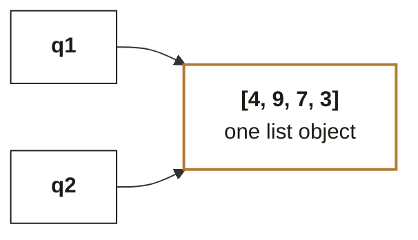
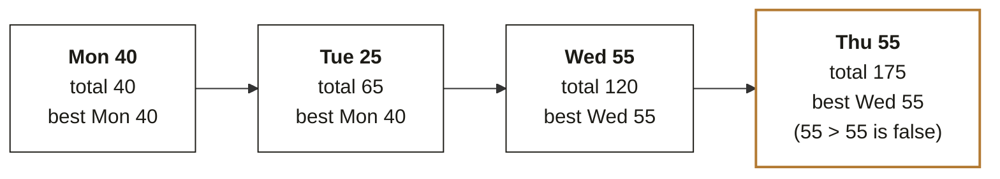
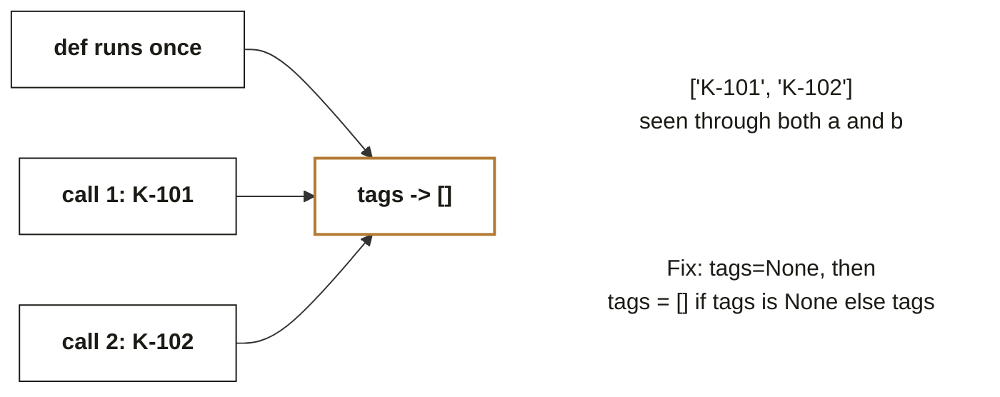
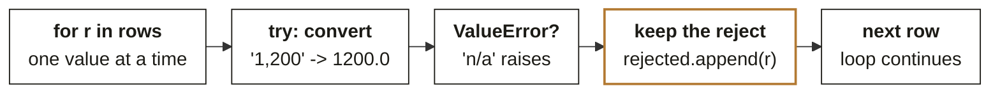

# Chapter 1. Python reads data the way it is written, never the way you meant it

Week 0 foundations guide, chapter 1 of 9. [Back to the map](C2_W00_D02_foundations_00_map_STUDENT.md).

Every Python bug in the diagnostic was the same bug wearing different clothes: the code did exactly
what was written, and the writer expected something else. Reading time: 13 minutes.

Diagnostic questions this chapter revisits, in the paper's order:
[Q1](C2_W00_D02_foundations_09_diagnostic_worked_STUDENT.md#q1),
[Q2](C2_W00_D02_foundations_09_diagnostic_worked_STUDENT.md#q2),
[Q3](C2_W00_D02_foundations_09_diagnostic_worked_STUDENT.md#q3),
[Q4](C2_W00_D02_foundations_09_diagnostic_worked_STUDENT.md#q4),
[Q5](C2_W00_D02_foundations_09_diagnostic_worked_STUDENT.md#q5),
[Q6](C2_W00_D02_foundations_09_diagnostic_worked_STUDENT.md#q6),
[Q7](C2_W00_D02_foundations_09_diagnostic_worked_STUDENT.md#q7),
[Q8](C2_W00_D02_foundations_09_diagnostic_worked_STUDENT.md#q8),
[Q9](C2_W00_D02_foundations_09_diagnostic_worked_STUDENT.md#q9),
[Q10](C2_W00_D02_foundations_09_diagnostic_worked_STUDENT.md#q10),
[Q11](C2_W00_D02_foundations_09_diagnostic_worked_STUDENT.md#q11),
[Q12](C2_W00_D02_foundations_09_diagnostic_worked_STUDENT.md#q12); each is worked step by step in
Chapter 9.

## What you can now do

You can predict what a short piece of Python prints before running it. You can explain why two names
can change together and how to stop it. You can trace a loop by hand with two variables and a running
total. You can read a nested API response and write the one path that reaches the text inside it. You
can turn a crash on a bad value into a counted, logged rejection. You can read a traceback from the
bottom line up and say which line to look at.

## Where this sits

**What this chapter covers.** Values and their types, names and objects, loops and accumulators,
functions and their defaults, dicts and lists as the shape of JSON, and errors as information. Each
was worked in the diagnostic through one question; here each gets the mechanism behind the question.
Files, modules and notebooks are mentioned at the end and worked in Week 1.

**Placement.** Python is the first cell of the bottom band and the language of every notebook from
Week 1 onward. Module 1, Foundations of AI and Data, assumes it from its first session.

**Outcome tie.** The specific moment this chapter serves is the first afternoon of Week 1, when a
notebook on Kalpa's order rows fails on a value like `'1,200'` and the room has to say why before
anyone touches the code.

**What was left out.** Classes and objects you define yourself arrive in Week 2, and pandas, which
replaces most hand-written loops over rows, has its own chapter here.

## The picture to remember: the name-and-object board

Names on the left point at objects on the right. Assignment moves an arrow; it never copies an object.



*Figure 2. Two names, one object. Assignment moves an arrow; only a method or a copy touches the
object. Call this the board; every section below comes back to it. q2 = q1 adds the second arrow.
q2.append(3) changes the object, so q1 sees 4 elements. q2 = q1.copy() would build a second object
and point q2 at that instead.*

**ORIGIN.** Python was released by Guido van Rossum in February 1991 as version 0.9.0, written at the
CWI research institute in Amsterdam as a successor to a teaching language called ABC (sources: the
Python 0.9.1 archive on GitHub; luisllamas.es, history of Python). The board above is why its
assignment statement has behaved the same way for thirty-five years.

## Values have types, and Python never guesses

Q1 added an integer 0 to the string `"120"` and Python refused with `TypeError`. That refusal is the
design. A value carries its type with it, and the operators ask the type what to do: `+` on two
strings joins them, `+` on two numbers adds them, `+` across the two has no meaning and stops the
program rather than inventing one.

| Value as written | Type | What `+` does | What `int()` or `float()` does |
|---|---|---|---|
| `"120"` | `str` | joins strings | reads the digits: 120 |
| `120` | `int` | adds numbers | unchanged |
| `120.0` | `float` | adds numbers | `int()` truncates to 120 |
| `None` | `NoneType` | raises `TypeError` | raises `TypeError` |
| `True` | `bool` | counts as 1 | 1 |

*Figure 3. The five types the diagnostic used, what `+` does to each, and what conversion does.
Conversion is always something you ask for.*

Applied to Meera's question: the order rows arrive from a CSV, and every field in a CSV is text.
Revenue by tier is impossible until each amount has been converted with
`float(amount.replace(",", ""))`, and the only honest place for that conversion is one function,
called on every row, that either returns a number or raises.

**WATCH OUT.** Truthiness drops zeros. `[s for s in sales if s]` removes `None` and also removes `0`,
because in an `if` test both are false (Q6). A report that filters "empty" values this way silently
deletes every genuine zero. The tell is a count of rows that is smaller than the count of non-missing
values.

**CALLBACK.** Diagnostic Q1, Q6 and Q14 were the same lesson: the machine keeps types strictly, and
SQL's integer division in Q14 is the same strictness in a different language.

## One object, many names

Q2 surprised most of the room. `q2 = q1` did not copy the list; it added a second name pointing at
the same object, so `q2.append(3)` showed through `q1`. On the board, assignment only moves an arrow.
The rule is short: assignment never copies, methods that end in place change the object, and
`copy()` or `list()` makes a new object.

Q12 was the same rule one level down. `[[0] * 3] * 2` builds one inner list and repeats the arrow to
it twice, so writing through row 0 shows in row 1. `list()` and `copy()` copy only the outer list,
which is why they fail as fixes; only a comprehension, `[[0] * 3 for _ in range(2)]`, builds a fresh
inner list each time.

**IN THE FIELD.** Ned Batchelder's PyCon 2015 talk, "Facts and Myths about Python names and values",
was built around exactly this board and is still the reference the Python community links when the
question comes up; the written version on
[nedbatchelder.com](https://nedbatchelder.com) (checked 30 September 2026) carries the same figures
(source: us.pycon.org 2015 schedule;
[nedbatchelder.com/text/names.html](https://nedbatchelder.com/text/names) (checked 30 September 2026)).

Applied to the thread: when you build a totals dictionary per tier and then "copy" it to try an
adjustment, you are adjusting the original unless you copied. The check is `a is b`, which is `True`
when two names share one object.

## Loops you can trace by hand

Q3 was pseudocode, and the diagnostic put it there to see whether you can hold two variables in your
head for four rows. The method is a table, not talent: one column per variable, one row per
iteration, and the comparison written out where it matters.



*Figure 4. Tracing the pseudocode by hand: two variables, one row at a time. The trace table for Q3.
The strict `>` on the tie is the whole item: Thursday's 55 does not replace Wednesday's 55.*

Q4 was the same habit on a dictionary. `count.get(lab, 0) + 1` reads "the current count, or zero if
this label is new, plus one", and by the end of the loop the dictionary holds one key per distinct
label. Counting by key with `get` is the pattern that turns a list of LLM labels into a table you can
reason about, and you will write it in Week 1 before pandas takes it over.

Applied to the thread: revenue by tier is this loop with amounts instead of ones.
`totals[tier] = totals.get(tier, 0) + amount`, once per row, gives Plus 360 and Basic 420 for Q1
without a single library.

## Functions, defaults and what a call returns

Q8 was the interview classic. `def tag_order(order_id, tags=[])` evaluates the empty list once, when
`def` runs, and every call that omits `tags` reuses that one object, so the second call sees the first
call's tag.



*Figure 5. def tag_order(order_id, tags=[]) evaluates [] once, when def runs. Every call without tags
reuses that same list. One default object, shared by every call. The idiom `tags=None` followed by
`tags = [] if tags is None else tags` builds a fresh list per call.*

Q7 was about what a function returns rather than what it prints. `totals[tier] // counts[tier]` is
floor division and hands back a whole number; the calculator showed 833.33 because it used true
division. When a function's answer differs from a calculator's, look at the operator before the data.

**WATCH OUT.** Methods that work in place return `None`. `ranked = scores.sort()` sorts `scores` and
sets `ranked` to `None`; `sorted(scores)` returns the new list. Half the "my variable is None"
questions on any forum are this.

## Dicts, lists and JSON: the shape of data

Every API you call this programme returns JSON, and JSON is only two shapes nested: braces are
dictionaries you index by key, brackets are lists you index by position. Q5's response put a list
inside `"choices"`, so the path had to say `[0]` before it could say `["message"]`.

```text
{"choices": [
{"message": {"role": "assistant", "content": "Refund approved"}}
],
"usage": {"prompt_tokens": 412, "completion_tokens": 9}}

one path, read left to right:
resp["choices"][0]["message"]["content"]
```

*Figure 6. The shape of an API response: braces are dicts (key lookup), brackets are lists (integer
index). Reading a response is reading its brackets. One path, left to right, one index per level.*

Q10 belongs here too. `sorted()` orders tuples element by element from the first, so a list of
`(name, spend)` pairs sorts by name; `key=lambda c: c[1]` says which element to sort on. Q11 is the
JSON trap in reverse: `str.format()` treats every `{...}` as a placeholder, so a JSON example inside a
template raises `KeyError`, and the fix is doubled braces or building the JSON part separately.

Applied to the thread: the ticket classifier in Chapter 4 returns a response like Q5's, and the two
lines that read `content` out of it are the two lines you will copy into every notebook that calls a
model.

## Errors are information, not failure

Q9 asked for a rewrite that skipped every bad value and counted it, whatever the value looked like.
The comprehension crashed on `'n/a'`; skipping a fixed list of bad strings misses the next one; a
`try` around the whole loop drops every row after the first failure. The only shape that survives
real data is a `try` inside the loop.



*Figure 7. One `try` per value. The bad rows are kept in a list, counted, and reported, which is what
Anand asked for. One try/except inside the loop. A try around the whole loop stops at the first bad
value and drops every row after it.*

A traceback reads from the bottom. The last line names the exception and the reason
(`TypeError: unsupported operand type(s) for +: 'int' and 'str'`); the line above it points at the
code that raised it. Read those two lines before anything else, and you will fix most errors without
searching.

**IN THE FIELD.** The official Python tutorial's chapter on errors makes the same point with the same
example, `'2' + 2`, and shows the current interpreter marking the exact span of code with `~~~~^~~`
under the offending expression (source:
[docs.python.org](https://docs.python.org/3/) (checked 30 September 2026), The Python Tutorial,
section 8, Errors and Exceptions).

## Files, modules and the notebook, briefly

Three things the diagnostic did not test and Week 1 uses on Monday. A file is opened with
`with open("orders.csv") as f:` and closed for you at the end of the block; `import csv` gives a
reader that splits each line on commas. An `import` line loads a module, which is just another Python
file, once. A notebook runs cells in the order you run them, not the order they appear, so a restart
followed by "run all" is the only proof a notebook works.

## Where this shows up in the work

**The first Monday.** A colleague's script totals revenue as `0` because every amount was a string
and a bare `except` swallowed the errors. Ten minutes with the traceback finds it; a day of guessing
does not.

**The code review.** A function with `results=[]` as a default passes every test that calls it once
and fails in production on the second request. Reviewers who know the board catch it in the
signature.

**The model call.** A notebook that reads `resp["choices"]["message"]` crashes on the first live call
after working on a hand-typed dict. The cost is a wasted API call, plus the meeting where it was meant
to run.

## Try this yourself

**No-code self-check.** Answer in your head, then check against the key. (1) After
`a = [1, 2]; b = a; b += [3]`, what does `len(a)` return? (2) Which returns a new list: `sorted(x)`
or `x.sort()`? (3) In `def f(n, seen=set())`, how many set objects exist after three calls that omit
`seen`? Key: (1) 3, since `+=` on a list works in place; (2) `sorted(x)`; (3) one. A miss on (1) or
(3) sends you back to the board; a miss on (2) to the functions section.

**Mini project 1, Python: clean and total Kalpa's orders.** Create a repository named
`w00-diagnostic-python` (Chapter 8 shows how) and a notebook with three cells. Cell one holds a list
of ten order rows as tuples of `(order_id, tier, amount_text, status)`, with at least two bad amounts
such as `'n/a'` and `''` and one cancelled order. Cell two defines `to_amount(text)` and a loop that
builds `totals` by tier for paid orders only, collecting rejected rows in a list. Cell three prints
the totals, the rejected rows, and an `assert` that the sum of the totals equals the sum of the clean
amounts. Self-check: the notebook restarts and runs top to bottom with no error; the rejected list has
exactly the bad rows you planted; changing one amount to `'0'` keeps the row (a truthiness test would
drop it).

**GUIDED PRACTICE.** A guided notebook walks this hands-on step by step inside its 90 minutes: you redraw the chapter's picture, predict before you run, trace one step by hand and break the chapter's trap on purpose, and the last step says what to copy into your repository. Start with [the guided notebook](../exercises/guided/C2_W00_D02_foundations_01_python_guided_STUDENT.ipynb), and open [the worked solution](../exercises/solutions/C2_W00_D02_foundations_01_python_solution_STUDENT.ipynb) once you have tried it. [All eight exercises](../exercises/C2_W00_D02_foundations_exercises_STUDENT.md) are listed together.

## Where this gets tested

**Interview question.** "What does `b = a` do when `a` is a list?" Tested: whether you hold the
board. Strong answer: it binds a second name to the same object, so mutation through either name is
visible through both; a copy needs `a.copy()`, `list(a)` or a slice. Weak answer: "it copies the
list", or a correct answer with no mention of mutation.

**Interview question.** "Why is a mutable default argument a bug?" Tested: whether you know when
defaults are evaluated. Strong answer: once, at definition time, so the object is shared across
calls; the idiom is `None` plus a fresh object inside. Weak answer: "it is bad practice", with no
mechanism.

**Interview question.** "Your script crashes on one bad row in a million. What do you change?"
Tested: error handling as a design choice. Strong answer: a `try` per row that records the rejects
with their reason and continues, plus a count reported at the end. Weak answer: a `try` around the
loop, or `except: pass`.

**Interview question.** "Read this traceback and tell me the line to look at." Tested: whether you
read from the bottom. Strong answer names the exception, the message, and the nearest line in your own
code, in that order.

## Glossary

| Term | Plain meaning | Where it appeared | Example |
|---|---|---|---|
| Object | A value living in memory, with a type | The board | The list `[4, 9, 7]` |
| Name | A label bound to an object by assignment | The board | `q1`, `q2` |
| Mutable | Can be changed in place | Names section | Lists and dicts; strings and tuples are not |
| Truthiness | How a value behaves in an `if` test | Types section | `0`, `None`, `""` and `[]` are false |
| Floor division | `//`, which discards the fraction | Functions section | `2500 // 3` is `833` |
| Traceback | The report Python prints when an exception is not caught | Errors section | Read the last two lines first |
| Comprehension | A loop that builds a list in one expression | Names section | `[[0] * 3 for _ in range(2)]` |

## Go deeper, in this order

| Step | Resource | Time | Why this one |
|---|---|---|---|
| 1 | Ned Batchelder, "Facts and Myths about Python names and values", PyCon 2015, [youtube.com/watch?v=_AEJHKGk9ns](https://youtube.com/watch?v=_AEJHKGk9ns) (checked 30 September 2026) | 30 min | The board, animated, by the person who drew it |
| 2 | The same talk in text, [nedbatchelder.com/text/names.html](https://nedbatchelder.com/text/names) (checked 30 September 2026) | 20 min | For re-reading after the mini project |
| 3 | The Python Tutorial, section 8, Errors and Exceptions, [docs.python.org/3/tutorial/errors.html](https://docs.python.org/3/tutorial/errors.html) (checked 30 September 2026) | 25 min | The tracebacks you will actually see, explained by the source |
| 4 | Mini project 1 | 90 min | The loop, the conversion and the rejects, in a notebook you keep |
