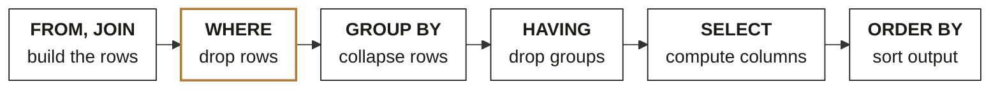
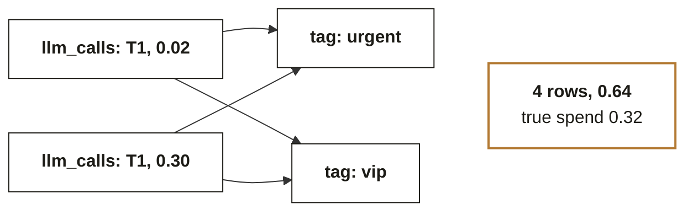

# Chapter 2. SQL runs in an order that is not the order you write

Week 0 foundations guide, chapter 2 of 9. [Back to the map](C2_W00_D02_foundations_00_map_STUDENT.md).

A query is read by the database from `FROM` outward, not from `SELECT` down, and every SQL question in
the diagnostic was decided by that order or by the meaning of NULL. Reading time: 11 minutes.

Diagnostic questions this chapter revisits, in the paper's order:
[Q13](C2_W00_D02_foundations_09_diagnostic_worked_STUDENT.md#q13),
[Q14](C2_W00_D02_foundations_09_diagnostic_worked_STUDENT.md#q14),
[Q15](C2_W00_D02_foundations_09_diagnostic_worked_STUDENT.md#q15),
[Q16](C2_W00_D02_foundations_09_diagnostic_worked_STUDENT.md#q16),
[Q17](C2_W00_D02_foundations_09_diagnostic_worked_STUDENT.md#q17),
[Q18](C2_W00_D02_foundations_09_diagnostic_worked_STUDENT.md#q18),
[Q19](C2_W00_D02_foundations_09_diagnostic_worked_STUDENT.md#q19),
[Q20](C2_W00_D02_foundations_09_diagnostic_worked_STUDENT.md#q20); each is worked step by step in
Chapter 9.

## What you can now do

You can say which rows a query returns before running it. You can explain why NULL neither equals nor
differs from anything and what that does to a filter. You can place a condition in `WHERE`, `HAVING`
or `ON` on purpose. You can predict when a join multiplies rows and stop it. You can keep every row
while adding a per-group number with a window function. You can write the query that answers Meera's
question in one statement.

## Where this sits

**What this chapter covers.** Rows and NULL, the execution pipeline, types and integer division, what
a LEFT JOIN keeps, join fan-out, and window functions. Common table expressions, subqueries and dates
are mentioned at the end and worked in Week 2.

**Placement.** SQL is the second cell of the bottom band. Module 1 runs it against a live PostgreSQL
database from Week 2, and Build 1 in Week 3 is written in it.

**Outcome tie.** The specific moment is Build 1 in Week 3, when a group's revenue-by-category total
comes out higher than the raw table's total and the group has to find the join that did it before the
presentation.

**What was left out.** Indexes, query plans and writing to the database arrive in Week 2; the
modelling of tables, which is a design skill, arrives with the first data-to-insight build.

## The picture to remember: the pipeline



*Figure 8. The order the database executes a query in. Every SQL question in the diagnostic was
decided by where a condition sat in this row. Call this the pipeline. Written order: SELECT, FROM,
WHERE, GROUP BY, HAVING, ORDER BY. Executed order: this row. An aggregate such as SUM exists only from
GROUP BY onward, which is why WHERE cannot see it.*

**ORIGIN.** E. F. Codd published "A Relational Model of Data for Large Shared Data Banks" in June
1970 at IBM's San Jose laboratory; Donald Chamberlin and Raymond Boyce turned his algebra into
SEQUEL, later SQL, in 1974, and ANSI accepted SQL as a standard in 1986 (sources: Britannica, Edgar
Frank Codd; historyofinformation.com, Chamberlin and Boyce 1974; historyofdatascience.com, key
dates).

## Rows and the meaning of NULL

Q13 and Q16 were both about one row: the order whose amount was NULL. NULL is not a value; it is the
absence of one, and every comparison with it is unknown rather than true or false.
`WHERE amount <> 800` keeps rows whose test is true, so the NULL row is dropped alongside the 800
row, and Kavya gets 3 where she expected 4.

| `amount` | `amount <> 800` | `WHERE keeps it?` | `COUNT(*)` | `COUNT(amount)` | `SUM(amount)` |
|---|---|---|---|---|---|
| 1200 | true | yes | 1 | 1 | 1200 |
| **NULL** | unknown | no | 1 | 0 | ignored |
| 800 | false | no | 1 | 1 | 800 |
| 300 | true | yes | 1 | 1 | 300 |

*Figure 9. Three-valued logic: a comparison with NULL is unknown, and WHERE keeps only true.
Three-valued logic on four rows. `COUNT(*)` counts rows, `COUNT(amount)` counts values, and `SUM`
ignores NULL rather than becoming NULL.*

The three aggregates in Q13 fall out of the same table: after `WHERE status <> 'cancelled'` four
rows remain, three of them with an amount, summing to 2000. When you want NULL rows kept, say so:
`amount <> 800 OR amount IS NULL`.

**IN THE FIELD.** Codd himself extended the relational model in 1979 to handle missing information,
in "Extending the Database Relational Model to Capture More Meaning" (ACM Transactions on Database
Systems, 1979); the three-valued logic you met in Q16 is a direct descendant of that paper (source:
the VLDB bibliography of Codd's papers).

## The pipeline: WHERE, GROUP BY, HAVING

Q15 and Q18 were the pipeline read twice. `WHERE` runs before grouping and sees single rows;
`HAVING` runs after grouping and sees group totals. That is why `WHERE SUM(amount) > 1000` fails
outright on PostgreSQL, and why `WHERE status = 'paid'` removed the cancelled Plus order before
`HAVING COUNT(*) > 1` kept only Basic.

Applied to the thread, the query for revenue by tier is the pipeline written out once:

```sql
SELECT tier, COUNT(*) AS orders, SUM(amount) AS revenue
FROM orders
WHERE status = 'paid' AND order_date >= '2026-04-01' AND order_date < '2026-07-01'
GROUP BY tier
ORDER BY revenue DESC;
```

The date range is written as a half-open interval, `>=` the first day and `<` the day after the
last, which is the one form that never miscounts the last day.

**CALLBACK.** Chapter 1's loop, `totals[tier] = totals.get(tier, 0) + amount`, is this `GROUP BY`
written by hand. Every `GROUP BY` you write from now on is that loop delegated to the database.

## Types, and integer division

Q14 returned 0 for a cancel rate of one in five because both operands were integers and PostgreSQL
divides integers as integers. Multiplying by `1.0` or casting one side makes the division decimal.
The same strictness lives in the types of every column: a date stored as text sorts as text, and
`'2026-1-5'` lands before `'2026-01-20'`.

**WATCH OUT.** `COUNT(status = 'cancelled')` looks like it counts the cancelled rows and instead
counts every row where the expression is not NULL, which is all of them. Count a condition with
`SUM(CASE WHEN ... THEN 1 ELSE 0 END)` or, on PostgreSQL,
`COUNT(*) FILTER (WHERE status = 'cancelled')`.

## What a LEFT JOIN keeps

Q17 was the trap that catches working analysts. A `LEFT JOIN` keeps every customer, filling the
order columns with NULL for those who never ordered; a `WHERE` on an order column then drops exactly
those NULL rows, and the join behaves like an inner join.

| customers | orders after LEFT JOIN | WHERE order_date >= '2026-01-01' |
|---|---|---|
| C1 | 1, 2026-01-15 | kept |
| C1 | 3, 2026-03-02 | kept |
| C2 | 2, 2025-11-03 | **dropped by WHERE** |
| C3 | 4, 2026-02-20 | kept |
| C4 | NULL, NULL | **dropped by WHERE** |

*Figure 10. LEFT JOIN keeps every customer; a WHERE on the right-hand table then throws the NULL rows
away. The join keeps C2 and C4; the `WHERE` throws them out. A condition in `ON` filters the right
side before the join and every customer survives with a count of zero. Move the date test into ON
and it filters the orders side before the join, so C2 and C4 survive with a count of 0.*

The rule to say out loud: a condition on the right-hand table goes in `ON` when you want to keep the
left-hand rows, and in `WHERE` when you want to drop them.

## Fan-out, the silent multiplier

Q20 inflated LLM spend by joining a table with several rows per ticket. Each call row was repeated
once per tag, and `SUM` added the repeats. Nothing errors, the numbers look plausible, and the total
disagrees with the raw table by the exact amount of the repeated rows.



*Figure 11. A one-to-many join repeats every left-hand row once per match. SUM then counts the
repeats. One call row, two tags, two copies. The cheap check is the one from Q20: compare the joined
total with the raw table's total before you trust either. Drop the join the question does not need,
or aggregate the many side first and join the totals. SUM(DISTINCT) is not a fix: it also merges two
genuinely equal costs into one.*

The fix is structural: drop the join the question does not need, or aggregate the many side to one
row per key first and join the totals. `SUM(DISTINCT)` is not a fix, because it also merges two
identical costs.

**WATCH OUT.** The tell for fan-out is a row count that grew when you added a join that was supposed
to add columns. Print `COUNT(*)` before and after every join in a build week and you will never
present an inflated total.

## Window functions: every row keeps its seat

Q19 needed the latest call per ticket. `GROUP BY` would have collapsed the calls to one row per
ticket and lost the call id; `ROW_NUMBER() OVER (PARTITION BY ticket_id ORDER BY call_id DESC)`
numbers each ticket's calls without collapsing anything, and `WHERE rn = 1` in an outer query keeps
the latest.

| llm_calls | GROUP BY ticket_id | ROW_NUMBER() OVER (PARTITION BY ticket_id ORDER BY call_id DESC) |
|---|---|---|
| 1 T1 | T1 -> 2 calls | **2 T1 rn=1** |
| 2 T1 | T2 -> 2 calls | 1 T1 rn=2 |
| 3 T2 | T3 -> 1 call | **5 T2 rn=1** |
| 4 T3 | | 3 T2 rn=2 |
| 5 T2 | | **4 T3 rn=1** |

*Figure 12. GROUP BY collapses rows; a window function keeps every row and adds a column computed
over its partition. `GROUP BY` collapses; a window function annotates. The filter on `rn` has to live
in an outer query because a window value does not exist yet when `WHERE` runs. WHERE rn = 1 in an
outer query keeps the latest call per ticket: 5 rows in, 3 rows out, nothing summed.*

**IN THE FIELD.** Oracle shipped analytic functions with an `OVER` clause in Oracle 8i in 1998, five
years before the ISO standard added window functions in SQL:2003; PostgreSQL, the database this
programme runs on, supports them in every currently maintained version, 14 through 18 as of the
February 2026 releases (sources:
[learnsql.com](https://learnsql.com) (checked 30 September 2026), history of window functions;
mariadb.com, window functions overview;
[postgresql.org](https://www.postgresql.org/) (checked 30 September 2026) release notes,
26 February 2026).

## Subqueries, common table expressions and dates, briefly

A subquery is a query used as a table; a common table expression, written `WITH totals AS (...)`, is
the same thing with a name, and the name is what makes a long query readable. Dates on PostgreSQL are
a real type with arithmetic: `order_date + INTERVAL '90 days'` and
`DATE_TRUNC('month', order_date)` both work, and both fail on text. In Week 2 you connect VS Code to
the programme's PostgreSQL instance through Codespaces and run `.sql` files against it; nothing
installs on your laptop.

## Where this shows up in the work

**The build week presentation.** A category total that exceeds the raw total by 40 percent is a
fan-out, and a panel member will ask for the row count before and after the join. Having it on the
slide is the difference between a question and a correction.

**The first Finance request.** "Customers with no orders this quarter" is a `LEFT JOIN` with the date
test in `ON` and `WHERE o.order_id IS NULL`. Written with the test in `WHERE`, the query returns
nobody and the report says the business has no dormant customers.

**The dashboard that lies.** A cancel rate that reads 0 percent for a year is integer division. It
costs nothing to write `* 1.0`, and it costs a quarter of wrong decisions not to.

## Try this yourself

**No-code self-check.** (1) A `LEFT JOIN` from customers to orders followed by
`WHERE orders.amount > 0` returns which customers? (2) After `GROUP BY tier`, can you
`SELECT order_id`? (3) `SELECT 7 / 2` on PostgreSQL returns what? Key: (1) only customers with a
qualifying order, since the NULL rows fail the test; (2) no, unless it is aggregated, because one
output row stands for many; (3) `3`. A miss on (1) sends you to the join section, on (2) to the
pipeline, on (3) to types.

**Mini project 2, SQL: Meera's question in one statement.** In your `w00-diagnostic-sql`
repository, create `orders.sql` that builds a small `orders` table with twelve rows across three
tiers and two quarters, including one NULL amount and two cancelled orders, and a `customers` table
with one customer who never ordered. Then write four queries in `answers.sql`: revenue and order
count by tier and quarter for paid orders; the average order value by tier as a decimal; every
customer with their count of Q2 orders, including zero; and the latest order per customer using
`ROW_NUMBER`. Run them in a Codespace against PostgreSQL, or in any SQL playground, and paste the four
result tables into the README. Self-check: the tier totals add up to the raw table's paid total; the
customer with no orders appears with 0; the average order value is not a whole number; the
`ROW_NUMBER` query returns exactly one row per customer.

## Where this gets tested

**Interview question.** "What is the difference between `WHERE` and `HAVING`?" Tested: the pipeline.
Strong answer: `WHERE` filters rows before grouping and cannot see aggregates; `HAVING` filters groups
after, and can. Weak answer: "`HAVING` is for aggregates", with no mention of order.

**Interview question.** "Why did my `LEFT JOIN` return the same rows as an inner join?" Tested: NULL
and `WHERE`. Strong answer: a `WHERE` on the right-hand table discards the NULL-filled rows; move the
condition into `ON` or add `OR col IS NULL`. Weak answer: "the join type was wrong".

**Interview question.** "Your total is bigger than the source table's total. Name the cause and the
check." Tested: fan-out. Strong answer: a one-to-many join repeated rows; compare row counts before
and after each join, and aggregate the many side first. Weak answer: "use `DISTINCT`".

**Interview question.** "When would you use a window function instead of `GROUP BY`?" Tested: whether
you know the difference in output shape. Strong answer: when you need a per-group number on every
row, such as rank, running total or latest per key, without collapsing rows.

## Glossary

| Term | Plain meaning | Where it appeared | Example |
|---|---|---|---|
| NULL | The absence of a value; comparisons with it are unknown | Rows section | `amount <> 800` drops the NULL row |
| Three-valued logic | True, false and unknown as the results of a comparison | Rows section | `WHERE` keeps only true |
| Aggregate | A function that turns many rows into one value | Pipeline section | `SUM`, `COUNT`, `AVG` |
| Fan-out | Row multiplication caused by a one-to-many join | Fan-out section | Two tags per ticket doubled the spend |
| Window function | A per-row calculation over a partition, without collapsing | Windows section | `ROW_NUMBER() OVER (...)` |
| Half-open interval | A date range with `>=` start and `<` next start | Pipeline section | `>= '2026-04-01' AND < '2026-07-01'` |

## Go deeper, in this order

| Step | Resource | Time | Why this one |
|---|---|---|---|
| 1 | PostgreSQL documentation, Tutorial, chapter 2, The SQL Language, [postgresql.org/docs/current/tutorial-sql.html](https://www.postgresql.org/docs/current/tutorial-sql.html) (checked 30 September 2026) | 40 min | The database you will use, explained by its own project, with joins and aggregates |
| 2 | freeCodeCamp, SQL Tutorial, Full Database Course for Beginners, [youtube.com/watch?v=HXV3zeQKqGY](https://youtube.com/watch?v=HXV3zeQKqGY) (checked 30 September 2026) | 4 h, watch the joins and nested queries chapters first | Long, MySQL-based, and the clearest walk from tables to joins on YouTube; every idea transfers to PostgreSQL |
| 3 | Mini project 2 | 90 min | The four queries above, run against a real database |
| 4 | learnsql.com, "What Are SQL Window Functions?", [learnsql.com/blog/window-functions](https://learnsql.com/blog/window-functions) (checked 30 September 2026) | 25 min | Window functions with the history and four worked examples |
