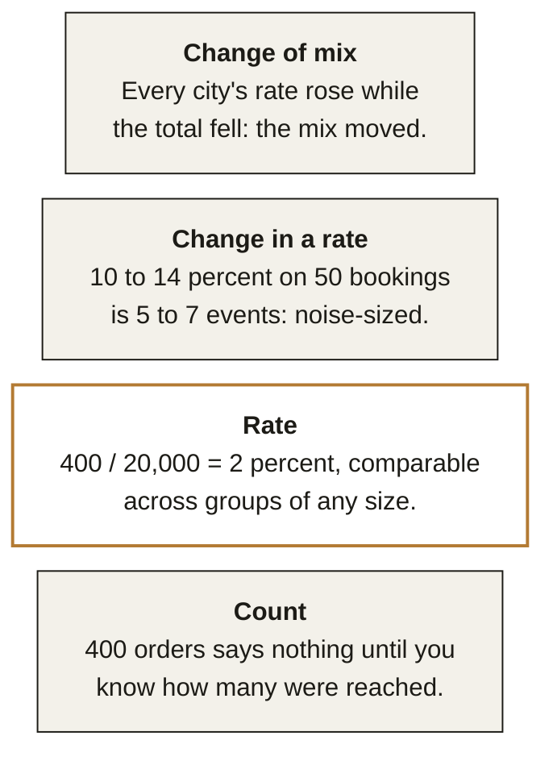
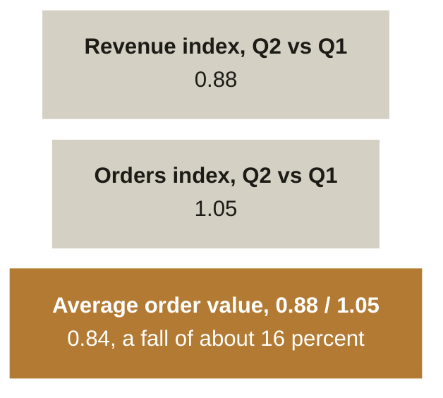
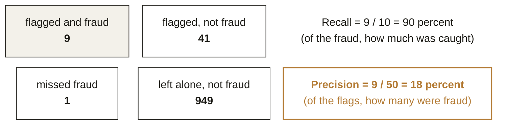
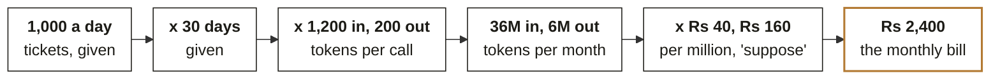

# Chapter 3. Most wrong numbers are right arithmetic on the wrong denominator

Week 0 foundations guide, chapter 3 of 9. [Back to the map](C2_W00_D02_foundations_00_map_STUDENT.md).

Nobody in the diagnostic lost a Section C mark by miscalculating. Marks were lost by dividing the
right numerator by the wrong thing, subtracting percentages that multiply, and reading a two-event
move as a trend. Reading time: 12 minutes.

Diagnostic questions this chapter revisits, in the paper's order:
[Q21](C2_W00_D02_foundations_09_diagnostic_worked_STUDENT.md#q21),
[Q22](C2_W00_D02_foundations_09_diagnostic_worked_STUDENT.md#q22),
[Q23](C2_W00_D02_foundations_09_diagnostic_worked_STUDENT.md#q23),
[Q24](C2_W00_D02_foundations_09_diagnostic_worked_STUDENT.md#q24),
[Q25](C2_W00_D02_foundations_09_diagnostic_worked_STUDENT.md#q25),
[Q26](C2_W00_D02_foundations_09_diagnostic_worked_STUDENT.md#q26),
[Q27](C2_W00_D02_foundations_09_diagnostic_worked_STUDENT.md#q27),
[Q28](C2_W00_D02_foundations_09_diagnostic_worked_STUDENT.md#q28); each is worked step by step in
Chapter 9.

## What you can now do

You can turn a count into a rate before comparing two groups. You can combine two percentage changes
without adding them. You can choose between mean and median by looking at the values, not the
formula. You can say whether a week's movement is noise from the size of the count. You can turn a
recall figure and a base rate into the precision a stakeholder actually wants. You can explain how
every part can rise while the whole falls. You can build a cost estimate as a chain with units on
every link.

## Where this sits

**What this chapter covers.** Rates against counts, the arithmetic of percentage change, typical
values, noise in small counts, base rates, mix shift, and chain estimates. All were worked in the
diagnostic; the base-rate item and the mix-shift item are the two the room found hardest, and they
get the most space.

**Placement.** Numbers and reasoning is the third cell of the bottom band. Module 1 uses this
reasoning from Week 1 and Module 2 formalises it as evaluation metrics in Weeks 4 to 6.

**Outcome tie.** The specific moment is the Week 5 exam and the model evaluation that follows it,
where precision, recall and the base rate stop being a diagnostic question and become the difference
between a fraud model that ships and one that floods the review team.

**What was left out.** Distributions, confidence intervals and hypothesis tests arrive in Weeks 1 to
2; here you learn to say "that is noise" by inspection, which is what an analyst does before any
test.

## The picture to remember: the denominator ladder

Each rung fixes the mistake the rung below invites. The denominator ladder, this course's
construction.

*Figure 13. Four rungs, each fixing the mistake the rung below invites. Before any comparison, say
which rung you are on. This is this course's own construction; call it the ladder.*

## Rates, not counts

Q23 put 400 orders beside 150 and asked which group responded better. Four hundred is bigger, and it
is also 2 percent of the 20,000 people reached, against 3 percent for the plain email. A count
compares nothing until the reach is known; a rate compares groups of any size.

Applied to the thread: Basic orders rose from 60,000 to 64,000 while Basic customers rose from 40,000
to 44,000, so orders per customer went from 1.50 to 1.45. The count went up and the rate went down,
and Meera's question is about the rate.

**WATCH OUT.** The tell for a count masquerading as a rate is a comparison with no denominator in the
sentence. "Discount customers placed 400 orders" is a count; "2 percent of discount customers
ordered" is a rate. Ask for the denominator before agreeing with anything.

## Percentage changes multiply

Q21 and Q24 were one fact. Revenue fell 12 percent and orders rose 5 percent, so average order value
moved by 0.88 divided by 1.05, about 0.84, a fall of 16 percent; subtracting gives the wrong 7. A 10
percent rise then a 10 percent fall lands at 0.99 of the start; a 50 percent fall needs a 100 percent
rise to recover.

*Figure 14. Percentage changes divide; they do not subtract (12 minus 5 gives the wrong 7). Turn
every change into an index (1.00 is the start), then multiply or divide. The subtraction habit
survives because it is close enough for small changes and badly wrong for large ones.*

## Mean, median and what "typical" means

Q22 gave five Plus customers at 300, 350, 400, 450 and 9,000. The mean is 2,100 and describes none of
them; the median is 400 and describes four. Look at the values before choosing: one value far from
the rest pulls the mean toward itself, and the median ignores how far.

Applied to the thread: average order value for the Plus tier, 360 lakh over 30,000 orders, is a mean,
and it is the right mean because it answers "revenue per order", which is what Meera's revenue
arithmetic needs. "What does a typical Plus customer spend" is a different question and wants the
median. The word "typical" is your cue.

## Noise in small counts

Q25 moved a no-show rate from 10 percent to 14 percent on 50 bookings. That is five events becoming
seven. Two extra events on a base of fifty sit inside normal week-to-week variation, and the honest
reading is "watch several more weeks". The relative jump, 40 percent, is arithmetic on noise.

A working rule, marked as this course's construction: on a count of n events, movements smaller than
about the square root of n are the ordinary breathing of the number. Five events breathe by about
two; five hundred breathe by about twenty-two. Weeks 1 to 2 give this rule its proper statistical
form.

**IN THE FIELD.** The naming of the mix-shift effect in the next section ran on the same small-count
logic in reverse: Edward Simpson's 1951 paper worked with contingency tables small enough to check by
hand, and it was Colin Blyth who attached Simpson's name to the effect in 1972, half a century after
Pearson and Yule first described it (source: Stanford Encyclopedia of Philosophy, Simpson's Paradox,
revised June 2026).

## Base rates: recall is not precision

Q26 was the item with the largest gap between confidence and correctness. A fraud model catches 90
percent of fraud, flags 5 percent of transactions, and fraud is 1 percent of transactions; of the
flagged transactions, only about 18 percent are fraud. The 90 percent is recall, the share of fraud
the model finds; the 18 percent is precision, the share of flags that are fraud; the base rate of 1
percent is what separates them.

*Figure 15. 1,000 transactions. Fraud is 1 percent; the model catches 90 percent of it and flags 5
percent of everything. One thousand transactions laid out as four cells. Every question about a
classifier is a ratio of two cells, and the base rate sets the cell sizes.*

Applied to the thread: when Farhan's ticket classifier reports "90 percent accurate", the first
question is the base rate of each label, because a classifier that says "other" for everything is
highly accurate on a queue that is mostly "other".

**CALLBACK.** Chapter 4's golden set is how you measure these cells for an LLM classifier; this
section is why the measurement has to be reported as precision and recall per label rather than one
accuracy number.

## Mix shift: every part up, the whole down

Q27 gave a total conversion rate that fell while every city's rate rose. The total is a weighted
average of the cities, weighted by traffic, and if traffic moved toward the city with the lower rate,
the total falls with no city getting worse.

| | Q1 | Q2 |
|---|---|---|
| City A | 8% of 1,000 = 80 | 9% of 400 = 36 |
| City B | 2% of 1,000 = 20 | 2.5% of 1,600 = 40 |
| **Total** | 100 / 2,000 = 5% | **76 / 2,000 = 3.8%** |

*Figure 16. Every city converts better in Q2, and the total still falls, because more traffic now
comes from the low-converting city. Two cities, both improving; the total falls because the weights
moved. The question to ask is never "which city got worse" but "where did the traffic go". The total
is a weighted average of the cities. Weights moved from A to B; that is the whole story.*

Applied to the thread: Kalpa's customer base moved toward Basic and Student in Q2 (55,000 to 62,000
customers, with all the growth in the two cheaper tiers). Even if every tier had held its average
order value, revenue per customer would have fallen. Mix is one of the first three hypotheses on any
"the total moved" question.

**ORIGIN.** Karl Pearson described the effect in 1899, Udny Yule in 1903, and Edward Simpson in 1951
in "The Interpretation of Interaction in Contingency Tables"; Colin Blyth named it Simpson's paradox
in 1972. It keeps being rediscovered because it is not a paradox of mathematics but of reading a
total without its weights (source: Stanford Encyclopedia of Philosophy; Wikipedia, Simpson's
paradox).

## Chain estimates with units on every link

Q28 asked for a monthly LLM bill from tickets per day, tokens per call and prices per million tokens.
The answer, Rs 2,400, was reached by anyone who wrote the chain before the arithmetic; the wrong
answers each dropped a link or applied a price to the wrong tokens.

*Figure 17. Six links, each with a unit. A chain written this way cannot lose a factor of thirty or
apply the output price to input tokens without the error being visible. Write the chain before the
arithmetic. A chain with the units on every link cannot slip a factor of ten without you seeing it.*

## Where this shows up in the work

**The marketing review.** A campaign is declared a success on 400 orders. The reach was 20,000 and
the control's rate was higher; the campaign cost the discount for nothing. The analyst who asked for
the denominator saved the next quarter's budget.

**The fraud model.** A model with 90 percent recall goes live and the review team drowns in false
alarms, because nobody computed precision at the real base rate. Recall, precision and the base rate
on one slide would have set the threshold before launch.

**The board deck.** Overall conversion fell and every regional lead shows their region improved.
Nobody is lying; the mix moved. The analyst who brings the weighted table ends the argument in one
minute.

## Try this yourself

**No-code self-check.** (1) A price rises 25 percent then falls 20 percent; where is it? (2) A test
with 99 percent recall flags 10 percent of a population where the condition is 1 percent; roughly
what share of flags are true? (3) Revenue per customer fell while every tier's revenue per customer
rose; name the cause in two words. Key: (1) at the start, since 1.25 times 0.80 is 1.00; (2) about 10
percent, since 0.99 of 1 percent is caught out of 10 percent flagged; (3) mix shift. A miss on (1)
sends you to the multiply section, on (2) to base rates, on (3) to mix shift.

**Mini project 3, numbers: the tier decomposition.** In a notebook in `w00-diagnostic-numbers`, type
the Kalpa Q1 and Q2 table from the diagnostic case as a small dictionary. Compute, for each tier,
revenue per customer, orders per customer and revenue per order in both quarters, then compute the
overall revenue per customer in both quarters. Show, in one printed table, that overall revenue per
customer fell more than any single tier's fall would explain, and attribute the difference to mix.
Self-check: your three per-tier ratios multiply back to the tier's revenue per customer; the overall
figure for Q1 is 804 divided by 55,000; changing the Student customer count changes the overall
figure but no tier's own ratios.

## Where this gets tested

**Interview question.** "Conversion fell overall but rose in every segment. What happened?" Tested:
mix shift. Strong answer names the weighted average, asks where the traffic moved, and offers to show
the weighted table. Weak answer: "one of the numbers must be wrong".

**Interview question.** "Our model has 95 percent accuracy on fraud. Is that good?" Tested: base
rates. Strong answer: at a 1 percent base rate, predicting "no fraud" for everything is 99 percent
accurate, so accuracy is the wrong number; ask for precision and recall at the real base rate. Weak
answer: "yes, that is high".

**Interview question.** "A metric moved from 10 to 14 percent this week. Do we act?" Tested: noise
in small counts. Strong answer asks for the count behind the percentage and, at 50, calls it noise
and proposes a watch window. Weak answer treats the 40 percent relative jump as the finding.

**Interview question.** "Estimate our monthly spend on this API." Tested: chain estimation. Strong
answer writes the chain with units aloud, states which links are assumptions, and gives a range. Weak
answer gives one number with no chain.

## Glossary

| Term | Plain meaning | Where it appeared | Example |
|---|---|---|---|
| Denominator | The thing a count is divided by to become a rate | Rates section | 20,000 people reached |
| Index | A change written as a multiplier of the start | Multiply section | A 12 percent fall is 0.88 |
| Median | The middle value when sorted | Typical section | 400 of 300, 350, 400, 450, 9,000 |
| Base rate | How common the condition is before any test | Base rate section | Fraud at 1 percent of transactions |
| Precision | Of the flags, the share that were right | Base rate section | 9 of 50, 18 percent |
| Recall | Of the true cases, the share that were caught | Base rate section | 9 of 10, 90 percent |
| Mix shift | A total moving because its weights moved | Mix section | Traffic shifting to a low-converting city |

## Go deeper, in this order

| Step | Resource | Time | Why this one |
|---|---|---|---|
| 1 | 3Blue1Brown, "Bayes theorem, the geometry of changing beliefs", [youtube.com/watch?v=HZGCoVF3YvM](https://youtube.com/watch?v=HZGCoVF3YvM) (checked 30 September 2026) (December 2019) | 15 min | The base-rate grid as geometry; watch it twice |
| 2 | Google, Machine Learning Crash Course, the Classification module, [developers.google.com/machine-learning/crash-course](https://developers.google.com/machine-learning/crash-course) (checked 30 September 2026) | 45 min | Thresholds, the confusion matrix, precision and recall, with interactive exercises |
| 3 | Stanford Encyclopedia of Philosophy, Simpson's Paradox, [plato.stanford.edu/entries/paradox-simpson](https://plato.stanford.edu/entries/paradox-simpson/) (checked 30 September 2026) | 30 min | The history and the worked cases, at a level you can quote in an interview |
| 4 | Mini project 3 | 60 min | The decomposition, in your own notebook |
