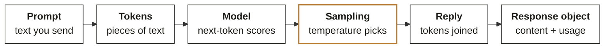
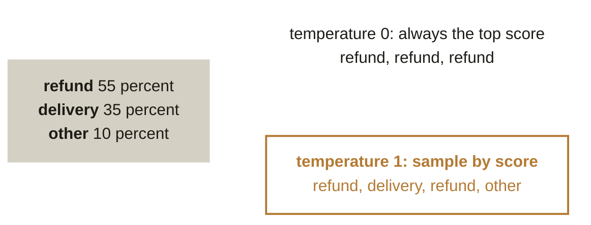
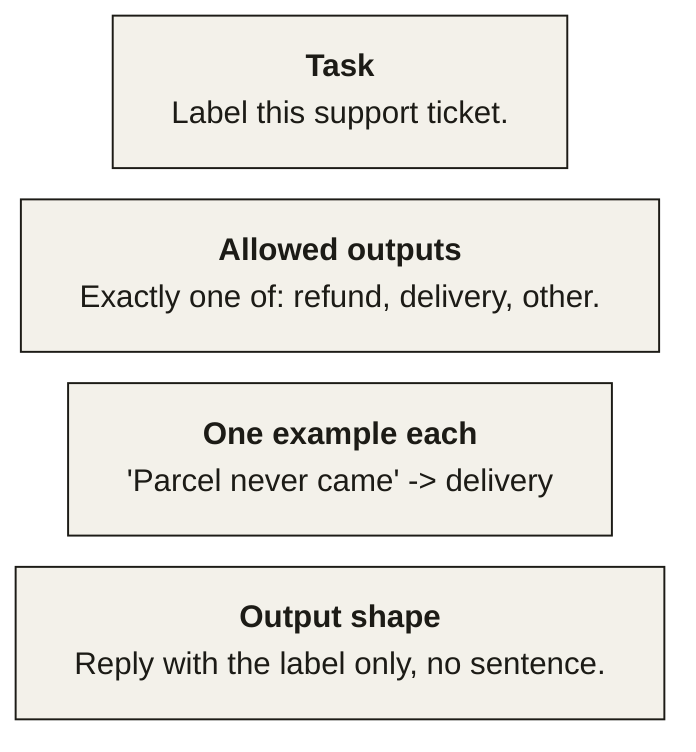
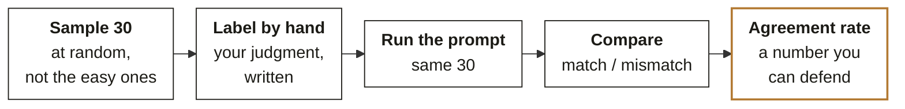

# Chapter 4. A language model is a sampler, and a prompt is a specification

Week 0 foundations guide, chapter 4 of 9. [Back to the map](C2_W00_D02_foundations_00_map_STUDENT.md).

Every LLM item in the diagnostic became easy the moment you stopped thinking of the model as a person
and started thinking of it as a machine that scores the next token and picks one. Reading time: 11
minutes.

Diagnostic questions this chapter revisits, in the paper's order:
[Q28](C2_W00_D02_foundations_09_diagnostic_worked_STUDENT.md#q28),
[Q33](C2_W00_D02_foundations_09_diagnostic_worked_STUDENT.md#q33),
[Q34](C2_W00_D02_foundations_09_diagnostic_worked_STUDENT.md#q34); each is worked step by step in
Chapter 9.

## What you can now do

You can explain, in three sentences, how a language model produces text. You can say why the same
ticket got two different labels and what to change first. You can write a prompt that names the
task, the allowed outputs, one example each and the output shape. You can read the response object
and find the text and the token counts. You can measure whether a model's labels can be trusted with
thirty hand labels. You can estimate a month's bill before writing a line of code.

## Where this sits

**What this chapter covers.** How text is generated, sampling and temperature, prompts as
specifications, the response object and statelessness, the golden set, and token economics.
Everything here is worked through Farhan's ticket classifier, which is the Kalpa scenario from Q33
and Q34.

**Placement.** LLM intuition is the fourth cell of the bottom band. Modules 5 and 6 build on it from
Week 10, and Build 4 in Week 12 ships a retrieval assistant that lives or dies by the golden set.

**Outcome tie.** The specific moment is the Build 4 demo in Week 12, when a panel member asks "how do
you know the assistant's answers are right?" and the only acceptable reply is an agreement rate
measured on a hand-labelled set.

**What was left out.** How the model was trained, what attention does inside it, and retrieval over
your own documents are Modules 3 to 6. Here the model is a box with a known interface.

## The picture to remember: the call anatomy

*Figure 18. Six stages from your text to the response object. Sampling is ringed because it is the
stage that explains Q33. Call this the call anatomy. Every call is stateless: the model sees only
what this request carries. Memory is you resending the history.*

**ORIGIN.** The architecture behind every model you will call was published on 12 June 2017 by eight
researchers at Google in "Attention Is All You Need"; its original job was translation between
English and German, and its base configuration had about 65 million parameters (sources: arXiv
1706.03762, submission history; memx.app, Transformer glossary entry).

## How text is generated

A language model turns your text into tokens, pieces of text a few characters long, and for each
position produces a score for every token that could come next. Something picks one token from those
scores, appends it, and the loop runs again until a stop token. That is the whole interface: text
in, one token at a time out. Everything a model "knows" is in how it scores the next token.

**IN THE FIELD.** Andrej Karpathy's one-hour introduction describes an open model of the time as two
files, the parameters and the few hundred lines of code that run them, with the parameters produced
by compressing roughly 10 TB of text into about 140 GB; the "dreams" section of the talk shows the
model generating plausible but invented product pages, which is the failure the golden set below is
designed to catch (source: "[1hr Talk] Intro to Large Language Models", November 2023,
[youtube.com/watch?v=zjkBMFhNj_g](https://youtube.com/watch?v=zjkBMFhNj_g) (checked 30 September 2026)).

## Temperature, or why one ticket got two labels

Q33 sent the same ticket twice and got "refund" then "delivery". Nothing changed between the calls
except the pick. At temperature 0 the pick is the top-scoring token every time; above 0 the pick is
sampled in proportion to the scores, so a token with a 35 percent score wins about one call in three.

*Figure 19. The model scores every possible next token. Temperature decides how the pick is made from
those scores. The same scores, two picking rules. Low temperature makes the output repeatable, and it
does not make it right; the scores were already the model's opinion. A prompt that never lists the
labels adds a second source of variety: the model invents the label set itself.*

Q33's second cause was the prompt: "Label this ticket" never said which labels exist, so the model
chose the label set as well as the label. The first fix is the label list; the second is the
temperature. Setting temperature to 0 makes replies far more repeatable, and vendors do not promise
it makes them identical, so a pipeline that needs the same answer every time still checks the output
against the allowed set.

**WATCH OUT.** "The model remembered my first call" is the most common wrong explanation. A call
carries no memory of any other call; what you did not send, the model did not see. Conversation
history is the caller resending the earlier turns.

## A prompt is a specification

The prompt that fixes Q33 has four parts, and each removes one kind of guessing.

*Figure 20. A prompt is a specification. The four parts below remove four kinds of guessing. Task,
allowed outputs, one example each, output shape. Most bad prompts are missing part two; most
unparseable outputs are missing part four. Part two is the one Q33 was missing. Without it, two calls
on the same ticket can return two labels.*

Applied to the thread: the tickets Farhan's team labels are complaints about the same Q2 that Meera
is asking about. A prompt that names the three labels, gives one example each and asks for the label
alone turns 1,000 free-text tickets into a column you can count, which is the loop from Chapter 1
applied to a model's output.

**CALLBACK.** Chapter 1, Q11: a JSON example inside a `str.format` template raises `KeyError`. Every
prompt you build from a template meets that bug once.

## The response object, and statelessness

The response is a dictionary with a list inside it, and reading it is Chapter 1's Q5:
`resp["choices"][0]["message"]["content"]` for the text, and a `usage` dictionary with the token
counts for the bill. Vendors differ in field names, and the shape is always braces and brackets you
can read the same way.

Two rules about state. The model sees only this request, so a "conversation" is the caller sending
the whole history every time. And the token count grows with that history, so a long conversation
costs more per turn than a short one; that is the arithmetic behind context windows, which Module 5
covers.

## The golden set

Q34 asked how to know whether two hundred sentiment ratings can be trusted. Plausible is not
evidence; confidence scores are more model output; a second model agreeing is two opinions. The check
is a golden set: thirty reviews chosen at random, rated by hand, compared with the model's ratings,
giving an agreement rate you can state and defend.

*Figure 21. Sample at random, label by hand, run the prompt, compare, report the rate. Thirty items
takes under an hour and is the smallest set that says anything. Thirty hand labels take under an
hour. They turn 'the output looks plausible' into a measured agreement rate.*

Report the result per label, as precision and recall, because one accuracy number hides the label the
model never predicts. That is Chapter 3's base-rate grid applied to a classifier you did not train.

## Token economics

Q28's chain, tickets per day times days times tokens per call times price per million tokens, is the
estimate you make before any project is approved. The two prices in the item were given as a
supposition; real prices change and are looked up on the day. What does not change is the shape:
input and output tokens are priced separately, output is usually several times dearer, and the
response's `usage` field is where the real counts come from.

## Where this shows up in the work

**The classification pipeline.** A team labels tickets with "label this" at default temperature and
reports 8 percent unparseable outputs. The four-part prompt and a check against the allowed set take
the number to near zero in an afternoon.

**The assistant demo.** The panel asks how you know the answers are right. A team with a golden set
says "84 percent agreement on 30 hand-labelled questions, and here are the five misses". A team
without one says "it seems to work".

**The budget line.** Finance asks what the feature will cost per month. The chain with units, plus
the `usage` counts from a pilot week, is an answer; a per-call price alone is not.

## Try this yourself

**No-code self-check.** (1) Same prompt, same ticket, two different labels: name the two most likely
causes. (2) A model's ratings look right; what is the cheapest check that produces a number? (3) A
call costs more on turn ten than on turn one of a conversation; why? Key: (1) temperature above 0 and
a prompt with no label list; (2) a hand-labelled sample and an agreement rate; (3) the whole history
is resent, so the input token count grows. A miss on (1) sends you to temperature, on (2) to the
golden set, on (3) to statelessness.

**Mini project 4, language models: a golden set without an API key.** In `w00-diagnostic-llm`, write
twenty short support tickets in a text file, label each by hand as refund, delivery or other, and
record your labels in a CSV. Then, using any chat assistant you already have access to, paste the
four-part prompt from Figure 20 with the twenty tickets and record the model's labels in a second
column. Compute agreement overall and per label in a notebook, and write the three worst misses in
the README with one sentence each on why the model went wrong. Self-check: the CSV has twenty rows
and no empty labels; the per-label counts add up to twenty; the README names the label the model
over-predicts.

## Where this gets tested

**Interview question.** "Explain how an LLM generates text." Tested: the call anatomy. Strong
answer: tokens in, next-token scores out, one token picked and appended per step, stateless per
call. Weak answer: "it understands the question and answers".

**Interview question.** "Why do I get different answers to the same prompt?" Tested: sampling.
Strong answer: temperature above 0 samples from the scores; lower it and constrain the output, and
still validate against the allowed set. Weak answer: "the model is random".

**Interview question.** "How would you evaluate an LLM classifier before shipping it?" Tested: the
golden set. Strong answer: a random hand-labelled sample, precision and recall per label, and the
misses reviewed. Weak answer: "look at some outputs".

**Interview question.** "What does temperature 0 guarantee?" Tested: honesty about limits. Strong
answer: far more repeatable output, not a guarantee of identical output, so pipelines still
validate. Weak answer: "deterministic output".

## Glossary

| Term | Plain meaning | Where it appeared | Example |
|---|---|---|---|
| Token | A piece of text the model reads and writes | Generation section | "refund" may be one token; "unparseable" may be three |
| Temperature | How much the pick is spread across the scores | Temperature section | 0 picks the top score; 1 samples by score |
| Stateless | A call sees only what it was sent | Response section | History is resent each turn |
| Golden set | Hand-labelled items used to measure a model | Golden set section | Thirty random reviews, rated by you |
| Agreement rate | Share of items where model and hand label match | Golden set section | 25 of 30, 83 percent |
| Usage | The response field with token counts | Response section | `prompt_tokens: 412` |

## Go deeper, in this order

| Step | Resource | Time | Why this one |
|---|---|---|---|
| 1 | 3Blue1Brown, "Transformers, the tech behind LLMs \| Deep Learning Chapter 5", [youtube.com/watch?v=wjZofJX0v4M](https://youtube.com/watch?v=wjZofJX0v4M) (checked 30 September 2026) (April 2024) | 27 min | Tokens, scores and sampling drawn, not asserted |
| 2 | Andrej Karpathy, "[1hr Talk] Intro to Large Language Models", [youtube.com/watch?v=zjkBMFhNj_g](https://youtube.com/watch?v=zjkBMFhNj_g) (November 2023) | 60 min | The two files, training against inference, and the failure modes |
| 3 | Anthropic, prompt engineering overview, [platform.claude.com/docs/en/build-with-claude/prompt-engineering](https://platform.claude.com/docs/en/build-with-claude/prompt-engineering/overview) (checked 30 September 2026) | 30 min | The four-part prompt as the vendor states it, with examples |
| 4 | OpenAI, prompt engineering guide, [platform.openai.com/docs/guides/prompt-engineering](https://developers.openai.com/api/docs/guides/prompt-engineering) (checked 30 September 2026) | 20 min | The same ideas in a second vendor's words, which is how you learn what is general |
| 5 | Mini project 4 | 60 min | Your first golden set |
