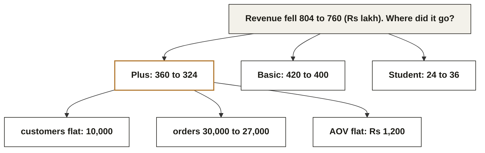
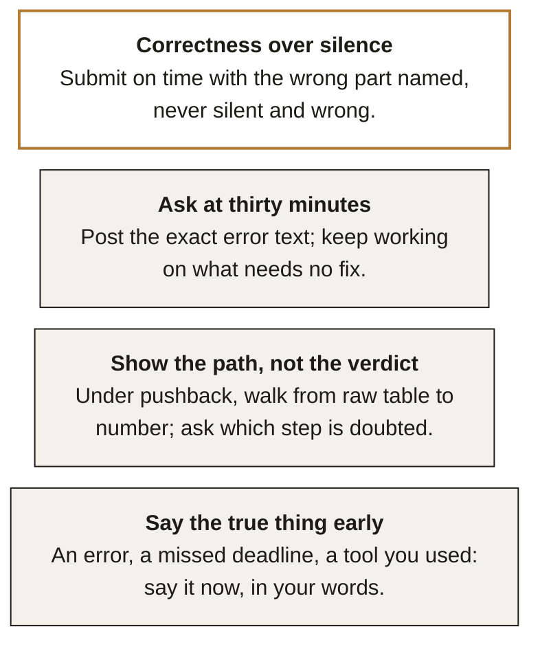

# Chapter 5. An unfamiliar business problem is decomposed, never solved in one move

Week 0 foundations guide, chapter 5 of 9. [Back to the map](C2_W00_D02_foundations_00_map_STUDENT.md).

Section D of the diagnostic contained no arithmetic harder than division, and it separated the room
more than any other section, because it tested the order in which you look at a table. Reading time:
9 minutes.

Diagnostic questions this chapter revisits, in the paper's order:
[Q29](C2_W00_D02_foundations_09_diagnostic_worked_STUDENT.md#q29),
[Q30](C2_W00_D02_foundations_09_diagnostic_worked_STUDENT.md#q30),
[Q31](C2_W00_D02_foundations_09_diagnostic_worked_STUDENT.md#q31),
[Q32](C2_W00_D02_foundations_09_diagnostic_worked_STUDENT.md#q32),
[Q33](C2_W00_D02_foundations_09_diagnostic_worked_STUDENT.md#q33),
[Q34](C2_W00_D02_foundations_09_diagnostic_worked_STUDENT.md#q34),
[Q35](C2_W00_D02_foundations_09_diagnostic_worked_STUDENT.md#q35),
[Q36](C2_W00_D02_foundations_09_diagnostic_worked_STUDENT.md#q36),
[Q37](C2_W00_D02_foundations_09_diagnostic_worked_STUDENT.md#q37),
[Q38](C2_W00_D02_foundations_09_diagnostic_worked_STUDENT.md#q38),
[Q39](C2_W00_D02_foundations_09_diagnostic_worked_STUDENT.md#q39),
[Q40](C2_W00_D02_foundations_09_diagnostic_worked_STUDENT.md#q40); each is worked step by step in
Chapter 9.

## What you can now do

You can read a table for its shape before computing on it. You can split a total into the parts that
moved and name the one that carries the change. You can test a hypothesis against a table instead of
reaching for more data. You can choose the fairest comparison available. You can name the check that
protects a finding before it goes in front of a decision maker. You can act well in the six
situations from Section E because you can say the rule they share.

## Where this sits

**What this chapter covers.** Reading a table, the driver question, hypothesis against evidence, the
fair comparison, the window check, and the four habits behind the six judgment situations. All of it
runs on Meera's table.

**Placement.** Business problems is the fifth cell of the bottom band. Build 1 in Week 3 is exactly
this chapter with real data, and the business case discussions in every build week score it.

**Outcome tie.** The specific moment is the capstone panel defence in Week 20, where the first
question after your demo is "so what changed for the business", and the answer is a sentence built
the way this chapter builds it.

**What was left out.** Experiment design, which makes the fair comparison rigorous, arrives in
Module 2; stakeholder writing arrives with the Week 16 solution proposal.

## The picture to remember: the decomposition tree

*Figure 22. Total at the top, the parts that moved below, the driver under the part that moved most.
Every "where did it go" question is this tree; call it the tree.*

## Read the table before computing on it

Q29's table had six numbers per tier, and the fall was visible before any division: Plus lost 36
lakh, Basic lost 20, Student gained 12, net 44 down. Reading the deltas first tells you where to
compute. The Plus column then shows customers flat at 10,000, orders down 10 percent, and revenue per
order flat at Rs 1,200, so the driver is frequency, not price and not churn.

**WATCH OUT.** The instinct to compute a ratio before reading the deltas is the instinct that
produced the wrong answers to Q29. A ratio on the wrong tier is precise and useless. Read down the
columns, circle the biggest delta, then compute inside that column.

## Hypothesis against evidence

Q30 offered "Plus customers are downgrading to Basic" as Kavya's first hypothesis. The table already
tests it: Plus customers were 10,000 in both quarters. Downgrades would have lowered that count unless
upgrades exactly replaced them, which the table gives no reason to believe. The hypothesis is
weakened by the evidence in front of you, and the reflex to ask for churn data is a reflex to avoid
reading.

The habit, marked as this course's construction: for every hypothesis, write the one number in the
table that would move if it were true, then look at it.

**CALLBACK.** Chapter 3's mix-shift section is the second hypothesis for this table: the customer
base moved toward the cheaper tiers. It is tested the same way, by the customer counts per tier.

## The fair comparison

Q31 asked whether the monsoon discount caused the rise in Basic orders. Before-and-after compares the
discount plus the season plus the festival calendar with nothing; the fair comparison holds
everything else still and varies only the discount: Basic customers who received it against Basic
customers who did not, over the same weeks.

| Comparison | What else changed between the two sides | Fair? |
|---|---|---|
| Basic Q2 vs Basic Q1 | season, festivals, days, the discount | no |
| Basic Q2 vs Plus Q2 | the tier itself | no |
| **Discounted vs non-discounted Basic, same weeks** | only the discount | yes |

*Figure 23. The fairest comparison is the one where only the thing you are testing differs. Three
candidate comparisons and what else each one lets vary. Fairness is the shortness of the "what else
changed" column.*

**IN THE FIELD.** Google's engineering education team taught its Machine Learning Crash Course to
more than 18,000 of its own engineers before publishing it in March 2018; the course's classification
module is where the fair-comparison habit becomes a held-out evaluation set, which is the same idea
applied to a model rather than a discount (source: Google Developers blog, "Machine Learning Crash
Course", 2 March 2018).

## The window check

Q32 asked which check protects the Plus finding most. Not the marketing budget, not re-adding the
sums, not the share of revenue: the check is whether Q1 and Q2 had the same number of trading days
and whether a festival sat in one quarter only. A 3 percent difference in trading days is a 3 percent
difference in revenue with nothing else changed, and a festival can move a tenth of a quarter's
orders on its own.

The window check runs before every "X fell" sentence you will ever say to a decision maker. It costs
one calendar lookup.

Applied to the thread, the sentence Meera hears is now buildable: "Revenue fell 44 lakh from Q1 to
Q2. Thirty-six of it is the Plus tier, where the same 10,000 customers ordered 10 percent less often
at the same order value; the quarters had the same trading days and no festival difference; the first
thing to test is Plus frequency, and the discount's effect on Basic needs a like-for-like comparison
before we credit it."

## The six situations, and the four habits behind them

Section E asked for the best and worst action in six situations. They reduce to four habits, and the
habits are the reason the section was in a technical diagnostic: an analyst who cannot do these is
not employable, whatever the code looks like.

*Figure 24. The six diagnostic situations reduce to four habits. This course's construction. Q35 to
Q40 as four habits. Say the true thing early covers the board figure, the AI-assisted answer and the
criticised chart; show the path covers Anand's pushback; ask at thirty minutes covers the environment
error; correctness over silence covers the deadline. This is this course's own construction.*

The worst actions across all six had one shape: a silence, a delay or a pretence that made the next
conversation harder. The best actions had one shape too: they made the problem visible sooner and
cheaper. When in doubt, choose the option that lets someone else check you.

## Where this shows up in the work

**The first Finance meeting.** Anand says the analysis cannot be right. The path from raw table to
number, shown line by line, either finds his objection or ends it. Changing the conclusion to please
him costs the whole analysis; escalating costs the relationship.

**The build week presentation.** "Revenue fell because of the discount" is a hypothesis presented as
a finding. The panel asks for the fair comparison, and a group that ran it before the presentation
keeps its credibility.

**The board figure.** A 4 percent error you found yourself, disclosed within the hour with cause and
size, is a footnote. The same error found by someone else a week later is a trust event.

## Try this yourself

**No-code self-check.** (1) Total up, every segment down: possible? (2) Which single number tests
"customers are leaving"? (3) Before saying "orders fell 8 percent", what do you check? Key: (1) yes,
by mix shift; (2) the customer count per period; (3) that the two windows have the same length and no
one-sided event. A miss on (1) sends you to Chapter 3's mix section, on (2) to hypothesis against
evidence, on (3) to the window check.

**Mini project 5, business problem: the one-paragraph answer.** In `w00-diagnostic-business`, write
a README with three parts. Part one is the decomposition tree for Meera's table as a nested list, with
the delta beside every node. Part two is a table of three hypotheses, the one number in the table
that tests each, and the verdict. Part three is the sentence Meera hears, in your own words, followed
by the check you would run first. Self-check: every node's deltas add up to its parent's; every
hypothesis names a number that already exists in the table; the sentence contains a number, a driver
and a check, and no word you would not say aloud.

**GUIDED PRACTICE.** A guided notebook walks this hands-on step by step inside its 60 minutes: you redraw the chapter's picture, predict before you run, trace one step by hand and break the chapter's trap on purpose, and the last step says what to copy into your repository. Start with [the guided notebook](../exercises/guided/C2_W00_D02_foundations_05_business_problems_guided_STUDENT.ipynb), and open [the worked solution](../exercises/solutions/C2_W00_D02_foundations_05_business_problems_solution_STUDENT.ipynb) once you have tried it. [All eight exercises](../exercises/C2_W00_D02_foundations_exercises_STUDENT.md) are listed together.

## Where this gets tested

**Interview question.** "Revenue fell 5 percent. Walk me through what you would do." Tested: the
tree. Strong answer: split by segment, find the part that carries the fall, decompose it into
customers, frequency and order value, check the window, then hypothesise. Weak answer: "I would look
at the data" or a list of possible causes with no order.

**Interview question.** "Your stakeholder disagrees with your number. What do you do?" Tested: show
the path. Strong answer: walk from raw table to number and ask which step is doubted; change the
number only if a step is wrong. Weak answer: "explain it again more clearly" or "escalate".

**Interview question.** "How would you know if the discount worked?" Tested: the fair comparison.
Strong answer: recipients against non-recipients in the same weeks, and what could still differ
between them. Weak answer: before-and-after.

**Interview question.** "You find an error in a figure you already sent. What now?" Tested: say the
true thing early. Strong answer: send the correction now, with cause and size, to the person who
received it. Weak answer: fix it quietly for next time.

## Glossary

| Term | Plain meaning | Where it appeared | Example |
|---|---|---|---|
| Delta | The change in a number between two periods | Reading section | Plus revenue 360 to 324, delta 36 |
| Driver | The component whose movement carries the change | Reading section | Plus order frequency |
| Hypothesis | A claim about cause that a number can test | Hypothesis section | "Plus customers are downgrading" |
| Fair comparison | Two groups that differ only in the thing tested | Comparison section | Discounted against non-discounted Basic |
| Window check | Confirming two periods are comparable in length and events | Window section | Same trading days, no one-sided festival |
| Like for like | The same thing measured the same way in both periods | Comparison section | Same weeks, same tier |

## Go deeper, in this order

| Step | Resource | Time | Why this one |
|---|---|---|---|
| 1 | Barbara Minto, The Pyramid Principle (the book that codified the answer-first structure used in consulting; any edition) | 3 h for the first three chapters | The sentence Meera hears is a Minto sentence: answer, then the support |
| 2 | Google, Machine Learning Crash Course, Classification module, [developers.google.com/machine-learning/crash-course](https://developers.google.com/machine-learning/crash-course) (checked 30 September 2026) | 45 min | The fair comparison as a held-out set |
| 3 | Mini project 5 | 60 min | Your first one-paragraph answer |
