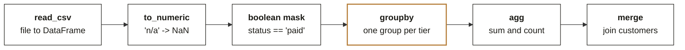

# Chapter 6. A DataFrame is the SQL pipeline with a different spelling

Week 0 foundations guide, chapter 6 of 9. [Back to the map](C2_W00_D02_foundations_00_map_STUDENT.md).

pandas was not in the diagnostic, and it is the tool that replaces most of Chapter 1's loops from
Week 1 onward. It takes an afternoon to learn once you see that every move has a SQL twin. Reading
time: 7 minutes.

## What you can now do

You can load a CSV into a DataFrame and say what each column's type is. You can turn text amounts
into numbers with the bad ones marked, not dropped. You can filter rows with a boolean mask. You can
group by a column and aggregate. You can merge two tables and check the row count before and after.
You can write a notebook whose last cell asserts the answer.

## Where this sits

**What this chapter covers.** The DataFrame and Series, loading and cleaning, filtering and
grouping, merging, and the assert-cell habit. Plotting and dates are mentioned and worked in Week 1.

**Placement.** pandas is the sixth cell of the bottom band. Every Module 1 notebook uses it, and
Build 1 in Week 3 is built in it.

**Outcome tie.** The specific moment is the Week 1 notebook where the room computes revenue by tier
for Kalpa in six lines of pandas after having written it as a thirty-line loop the day before.

**What was left out.** Time series, pivoting and plotting arrive in Week 1; performance on large
data arrives when it matters, in Module 7.

## The picture to remember: the DataFrame

A DataFrame is a table with an index; each column is a Series with one dtype. Most bugs are dtype
bugs.

| index | order_id | tier | **amount** | status |
|---|---|---|---|---|
| 0 | 1 | Plus | **1200.0** | paid |
| 1 | 2 | Basic | **NaN** | paid |
| 2 | 3 | Plus | **800.0** | cancelled |

`df['amount']` is a Series, dtype float64

NaN is pandas' missing value; sum() skips it, like SQL's SUM

*Figure 25. A table with an index, each column a Series with one type. The ringed column is a float Series with a missing value, which is where most bugs live.*

**ORIGIN.** Wes McKinney started building pandas in 2008 at AQR Capital Management, a quantitative
investment firm, because Python had no tool for the tabular analysis he needed, and persuaded AQR to
open-source it in 2009; the project became a fiscally sponsored NumFOCUS project in 2015 (sources:
Wikipedia, pandas (software); O'Reilly, Learning Pandas, chapter 1).

## DataFrame and Series

A DataFrame is a table; each column is a Series; every Series has one dtype, and the dtype decides
what arithmetic means, exactly as Chapter 1's types did. `df.dtypes` is the first thing to print
after loading anything. A column that should be numbers and reads as `object` is a column of
strings, and every sum on it will be wrong or will fail.

## Load and clean: the bad values are marked, not dropped

`pd.read_csv("orders.csv")` gives strings where the file had text amounts like `'1,200'`. The
conversion is one line: `pd.to_numeric(df["amount"].str.replace(",", ""), errors="coerce")`. Values
that cannot convert become `NaN`, pandas' missing value, and stay in the table where you can count
them. That is Chapter 1's `try` per row, applied to a whole column at once, with the rejects kept as
`NaN` instead of a list.

`NaN` behaves like SQL's NULL for aggregation: `sum()` and `mean()` skip it, `count()` does not
count it, and `df["amount"].isna().sum()` tells you how many rows failed conversion, which is the
number Anand asked for in [Q9](C2_W00_D02_foundations_09_diagnostic_worked_STUDENT.md#q9).

## Filter and group: the pipeline again



The same six moves as the SQL pipeline, in the same order. Learn one and you have learned both.

*Figure 26. Six moves that mirror the SQL pipeline. The mask is `WHERE`, `groupby` is `GROUP BY`, `agg` is the `SELECT` list, `merge` is `JOIN`.*

Applied to the thread, Meera's revenue by tier is:

```python
paid = df[df["status"] == "paid"]
by_tier = paid.groupby("tier").agg(orders=("order_id", "count"), revenue=("amount", "sum"))
by_tier["aov"] = by_tier["revenue"] / by_tier["orders"]
```

The mask `df["status"] == "paid"` is a Series of True and False; indexing with it keeps the True
rows. `groupby("tier")` collapses to one row per tier; `agg` names the output columns. The division
on the last line is true division, so `aov` is a float and Chapter 1's
[Q7](C2_W00_D02_foundations_09_diagnostic_worked_STUDENT.md#q7) cannot happen.

**CALLBACK.** Chapter 2's pipeline figure is this chain. If a pandas expression confuses you, write
the SQL it corresponds to, and the order becomes clear.

## Merge, and the fan-out again

`paid.merge(customers, on="customer_id", how="left")` is Chapter 2's `LEFT JOIN`. The fan-out from
[Q20](C2_W00_D02_foundations_09_diagnostic_worked_STUDENT.md#q20) happens here too, silently. Print
`len()` before and after, and use `validate="many_to_one"` on the merge, which raises an error the
moment the right-hand table has duplicate keys instead of quietly multiplying your rows.

**WATCH OUT.** `df2 = df` in pandas is Chapter 1's board: two names, one object. A DataFrame you
meant to keep untouched changes when you modify the "copy". Use `df.copy()` when you want a separate
object.

**IN THE FIELD.** The pandas user guide's own first stop for new users is a page called "10 minutes to pandas", and its opening moves are exactly the ones in this chapter: build a Series and a DataFrame, look at `dtypes`, select, filter, group and merge (source: [pandas.pydata.org](https://pandas.pydata.org) (checked 30 September 2026), User Guide).

## The assert cell

Every notebook you submit ends with a cell that checks the answer:
`assert abs(by_tier["revenue"].sum() - paid["amount"].sum()) < 1e-6` proves the group totals add up
to the raw total, and `assert len(merged) == len(paid)` proves the merge did not fan out. A notebook
that ends with an assertion is a notebook a reviewer can trust without reading it.

## Where this shows up in the work

**The loop that took a day.** A colleague's thirty-line loop over rows is replaced by three lines
and runs in a second on a million rows. The tell is a `for` loop over `df.iterrows()`.

**The silent duplication.** A merge doubled the revenue column and nobody noticed until Finance did.
`validate="many_to_one"` would have raised on the first run.

**The object column.** A sum over an `object` column concatenated strings and produced a number with
nine digits. `df.dtypes` after load is a ten-second habit.

## Try this yourself

**No-code self-check.** (1) A column of amounts loads as `object`; what happened? (2) Which pandas
argument turns `'n/a'` into `NaN` instead of raising? (3) Rows doubled after a merge; which argument
would have caught it? Key: (1) at least one value is text, so the whole column is strings; (2)
`errors="coerce"`; (3) `validate="many_to_one"`. A miss on (1) sends you to dtypes, on (2) to load
and clean, on (3) to merge.

**Mini project 6, pandas: mini project 1 again, in six lines.** In `w00-diagnostic-pandas`, save the
ten rows from mini project 1 as `orders.csv`. Load it, convert `amount` with
`to_numeric(errors="coerce")`, print the count of `NaN`, compute revenue and order count by tier for
paid orders, merge a two-row `customers.csv` with `validate="many_to_one"`, and end with two assert
cells. Self-check: the `NaN` count equals the number of bad amounts you planted; the tier totals
equal mini project 1's totals; the notebook runs top to bottom after a restart.

## Where this gets tested

**Interview question.** "How do you handle a numeric column that has some bad strings?" Tested:
cleaning without dropping. Strong answer: `to_numeric(errors="coerce")`, then count and inspect the
`NaN` rows before deciding anything. Weak answer: "drop the bad rows".

**Interview question.** "What is the difference between `groupby().sum()` and a window function?"
Tested: output shape. Strong answer: `groupby` collapses to one row per key; `transform` keeps every
row with the group value attached, which is the pandas window. Weak answer: no distinction.

**Interview question.** "Your merge produced more rows than you expected. Why?" Tested: fan-out.
Strong answer: duplicate keys on the many side; `validate` catches it and aggregating first fixes
it.

## Glossary

| Term | Plain meaning | Where it appeared | Example |
|---|---|---|---|
| DataFrame | A table with an index and typed columns | The picture | `pd.read_csv("orders.csv")` |
| Series | One column, with one dtype | The picture | `df["amount"]` |
| dtype | The type of a column | DataFrame section | `float64`, `object` |
| NaN | pandas' missing value | Load section | The result of `to_numeric` on `'n/a'` |
| Boolean mask | A True/False Series used to select rows | Filter section | `df["status"] == "paid"` |
| validate | A merge argument that checks key uniqueness | Merge section | `validate="many_to_one"` |

## Go deeper, in this order

| Step | Resource | Time | Why this one |
|---|---|---|---|
| 1 | pandas User Guide, "10 minutes to pandas", [pandas.pydata.org/docs/user_guide/10min.html](https://pandas.pydata.org/docs/user_guide/10min.html) (checked 30 September 2026) | 30 min | The official first stop, in the order this chapter used |
| 2 | Corey Schafer, Python Pandas Tutorial (Part 1): Getting Started, [youtube.com/watch?v=ZyhVh-qRZPA](https://youtube.com/watch?v=ZyhVh-qRZPA) (checked 30 September 2026), and the rest of the playlist, [youtube.com/playlist?list=PL-osiE80TeTsWmV9i9c58mdDCSskIFdDS](https://youtube.com/playlist?list=PL-osiE80TeTsWmV9i9c58mdDCSskIFdDS) (checked 30 September 2026) | 25 min for part 1, then parts 4 and 8 | Filtering and grouping shown on a real dataset |
| 3 | Mini project 6 | 90 min | Mini project 1 rebuilt in pandas, with the asserts |
