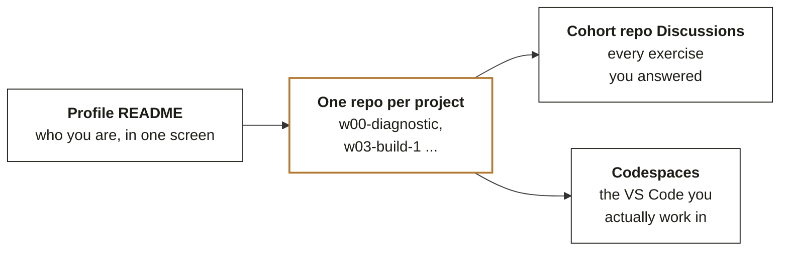
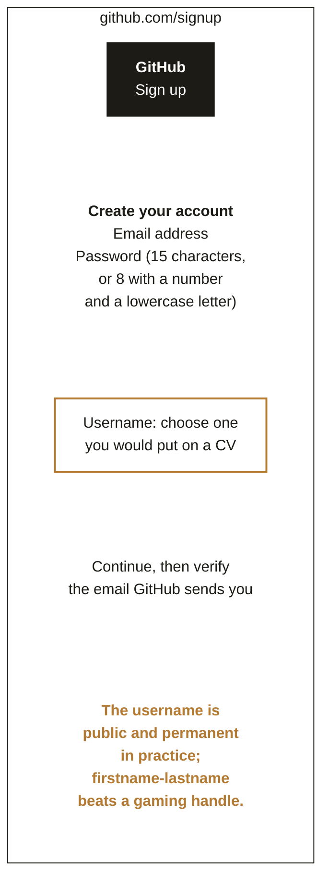
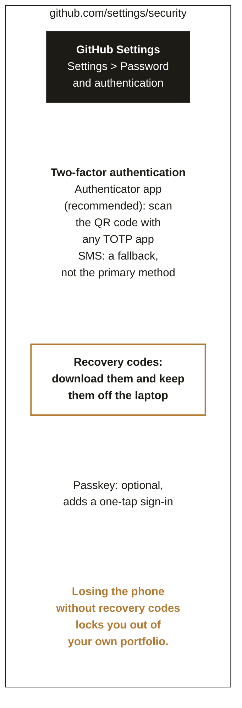
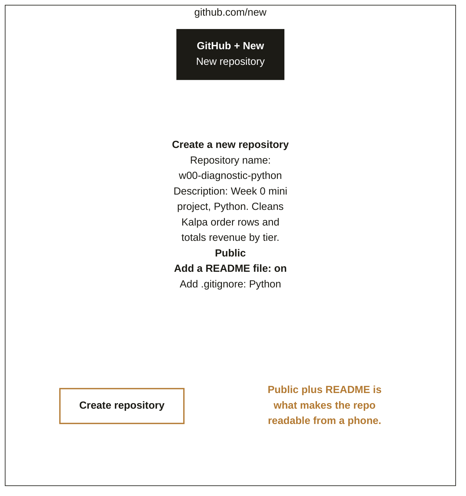
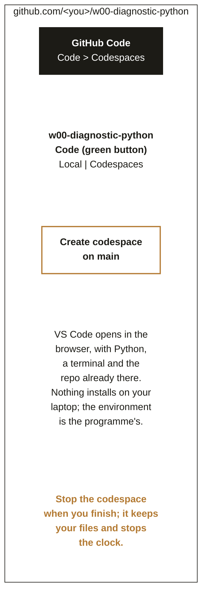
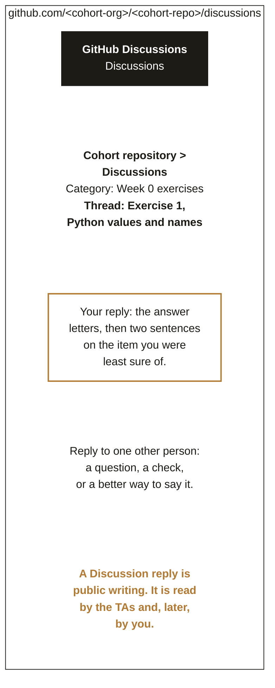
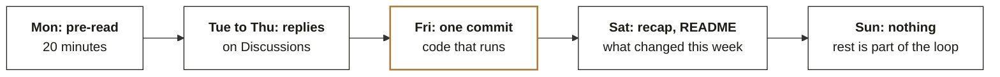

# Chapter 8. Your GitHub is the portfolio interviewers actually open

Week 0 foundations guide, chapter 8 of 9. [Back to the map](C2_W00_D02_foundations_00_map_STUDENT.md).

You created the account this week. This chapter is the difference between an account and a
portfolio: a profile that says who you are, one repository per project with a README that proves the
code ran, a public record of your thinking in Discussions, and a weekly loop that adds to all three.
Reading time: 13 minutes.

## What you can now do

You can pick a username you will not regret and lock the account with two-factor authentication. You
can publish a profile README. You can create a repository, commit a file in the browser, and open
the same repository in a Codespace with VS Code, Python and a terminal ready. You can answer an
exercise on GitHub Discussions in the form the programme expects. You can lay out twenty weeks of
work so a recruiter finds any piece in seconds.

## Where this sits

**What this chapter covers.** Account and security, the profile README, repositories and commits,
Codespaces as the programme's single environment, Discussions etiquette, the portfolio layout and
the weekly loop. Branches, pull requests and the Git command line arrive in Week 1 and are not
needed to start.

**Placement.** GitHub is the eighth cell of the bottom band and the surface everything else lands
on: exercises and submissions live on GitHub Discussions and the LMS, and every notebook runs in
Codespaces so nothing installs locally.

**Outcome tie.** The specific moment is the first interview around Week 15, when the interviewer
opens your profile on their phone while you are still introducing yourself.

**What was left out.** Git branching, merge conflicts and pull request review are Week 1; GitHub
Actions and Pages are later, when you have something to automate or publish.

## The picture to remember: the account anatomy

The anatomy of your GitHub account by the end of Week 20. Everything an interviewer opens sits in
these four places



Repository names carry the week and the artifact, so a month later you and a recruiter can find the
thing in seconds.

*Figure 28. Four places an interviewer looks, connected by the Codespace you work in. Call this the anatomy; the portfolio section fills it in.*

**ORIGIN.** Git was written by Linus Torvalds in April 2005 to manage the Linux kernel after the
previous tool's licence changed, and GitHub was launched on 10 April 2008 by Tom Preston-Werner,
Chris Wanstrath and PJ Hyett as a hosted, social layer over it; Microsoft acquired GitHub in June
2018, and by the mid-2020s the platform reported more than 100 million users (sources: noze.it,
GitHub founding; Britannica, GitHub).

## The account, the username and the lock

The figures in this chapter are illustrations drawn to the current layout of the screens, and each
is paired with the GitHub Docs page that carries the real screenshot, since the interface changes
and the documentation moves with it.

Illustration of the screen, not a screenshot



*Figure 29. The sign-up form. The username is public, shows in every repository address and is what a recruiter types; a real-name form is the safe choice.*

Go to [github.com](https://github.com) (checked 30 September 2026), choose Sign up, enter an email you will still own in five years, a password, and a username. Verify the email from the message GitHub sends; without a verified email you cannot create a repository (source: [docs.github.com](https://docs.github.com/en) (checked 30 September 2026), Creating an account on GitHub). If your current username is a handle you would not put on a CV, change it now in Settings, before any repository links exist.

Illustration of the screen, not a screenshot



*Figure 30. Settings, then Password and authentication. The ringed step is the one people skip, and it is the one that recovers the account when the phone is lost.*

Turn on two-factor authentication with an authenticator app, download the recovery codes, and store
them somewhere that is not the laptop. GitHub Docs, "Configuring two-factor authentication", has the
current screenshots for the app you choose.

## The profile README

A repository with the same name as your username, public, containing a `README.md`, is shown at the top of your profile (source: [docs.github.com](https://docs.github.com/en), Managing your profile README). Create it now with four lines: who you are in one sentence, what you are building on this programme, the three things you want to be good at by Week 20, and a link to your best repository. Rewrite it in Week 10 and Week 20. GitHub's own docs page for this is [docs.github.com/en/account-and-profile/how-tos/profile-customization/managing-your-profile-readme](https://docs.github.com/en/account-and-profile/how-tos/profile-customization/managing-your-profile-readme) (checked 30 September 2026), and it shows the exact New repository dialog.

**WATCH OUT.** A profile README that lists twenty technologies you have not used reads as noise to
anyone who has hired before. Three things you can demonstrate, each linked to a repository, beats a
wall of badges.

## The first repository and the first commit

Illustration of the screen, not a screenshot



*Figure 31. The New repository form. Public plus a README is what makes the repository readable from a phone before any code exists.*

Click the plus in the top right, then New repository. Name it `w00-diagnostic-python`, add the
one-line description, keep it Public, tick Add a README file, choose the Python `.gitignore`, and
create it. Then open `README.md`, click the pencil to edit, replace the text with the five headings
from Figure 32, and choose Commit changes with a message such as "Add README skeleton". That is a
commit: a saved, named, dated change. Everything you do on GitHub from now on is a series of these.

A project README that a recruiter reads in twenty seconds. Five headings, in this order, every repo.

```markdown
# w00-diagnostic-python
One sentence: what this does and for whom (Kalpa Retail's Q1 to Q2 revenue question).
## What it shows (the concept, in your words)
## How to run (open in Codespaces, run notebook.ipynb, top to bottom)
## Result (one table or one number, pasted)
## What I would do next (one honest limit)
```

The Result heading is the one most people skip, and it is the only one that proves the code ran.

*Figure 32. The five-heading README every project repository carries. The Result heading is the one that proves the code ran.*

## Codespaces: the programme's single environment

Illustration of the screen, not a screenshot



*Figure 33. The green Code button, the Codespaces tab, and Create codespace on main. VS Code opens in the browser with the repository already checked out.*

On the repository page, click Code, then the Codespaces tab, then Create codespace on main. In under a minute you have VS Code in the browser with Python, a terminal and the files. Create `notebook.ipynb`, run a cell, and when you are done open the Source Control view, write a message, and commit and push; or simply close the tab, since the codespace keeps your work until you delete it. Stop the codespace when you finish a session to preserve your free hours. The quickstart at [docs.github.com/en/codespaces/getting-started/quickstart](https://docs.github.com/en/codespaces/quickstart) (checked 30 September 2026) is the canonical walkthrough, and GitHub Skills' "Code with GitHub Codespaces and Visual Studio Code" (github.com/skills/code-with-codespaces) is a guided exercise that takes under an hour.

**IN THE FIELD.** GitHub's own Skills course for Codespaces is a public repository you copy into your account and complete by making commits; its automation checks each step and moves you to the next, which is the same commit-and-verify loop this programme's take-homes use (source: [github.com/skills/code-with-codespaces](https://github.com/skills/code-with-codespaces) (checked 30 September 2026)).

**CALLBACK.** Chapter 1's rule that a notebook is proven only by restart and run-all is what you do
in the Codespace before every commit that touches a notebook.

## Discussions: public writing, on purpose

Illustration of the screen, not a screenshot



*Figure 34. The cohort repository's Discussions tab, one thread per exercise. Your reply is the answer letters, then two sentences on the item you were least sure of, then one reply to someone else.*

Exercises in this programme are answered as replies in the cohort repository's Discussions, in the
thread for that exercise. The form is fixed so that TAs can read forty replies quickly: your answer
letters on one line, two sentences on the item you were least sure of and why, and one reply to
another learner that asks a question, checks a step or says the same thing better. Do not paste
solutions to graded work; do paste tracebacks, because a traceback is how you ask for help at thirty
minutes, the habit from Chapter 5.

## The portfolio layout for twenty weeks

| Repository | Holds | Named like |
|---|---|---|
| `<username>` | The profile README | your username, exactly |
| `w00-diagnostic-<area>` | The six mini projects from this guide, one repository each, or one repository with six folders if you prefer fewer links | `w00-diagnostic-python` |
| `w03-build-1-data-to-insight` | Build 1, with the group's notebook, the deck and your own README | week, build number, topic |
| `w06-build-2-ml`, `w09-build-3-dl-llm`, `w12-build-4-retrieval`, `w15-build-5-agentic` | The later builds, same pattern | the same |
| `w17-capstone-<theme>` | The capstone, with the panel deck and the demo link | week, capstone, theme |

The week prefix sorts the list into the story of the programme; a recruiter who scrolls it sees a
progression without reading anything. Each repository carries the five-heading README. Pin your best
four repositories on your profile; pins are the first thing shown.

## The weekly loop



Twenty weeks of this loop is a portfolio with about a hundred commits and forty public answers. That
is what an interviewer scrolls through.

*Figure 35. Five moves a week, twenty weeks. The Friday commit is ringed because it is the one that builds the contribution graph an interviewer glances at.*

The loop is small on purpose. Twenty minutes with the pre-read on Monday, your Discussion replies
through the week, one real commit to a project repository on Friday, a README update on Saturday
after the recap, and nothing on Sunday. Kept for twenty weeks, it produces about a hundred commits
and forty public answers with no heroics.

## Where this shows up in the work

**The interview.** The interviewer opens your profile on a phone. A README with three claims and
three links gets read; a bare profile with default avatar gets closed.

**The team's first week.** A new hire who can create a branch, commit with a message and open a pull
request on day one is productive on day one; the rest of Git can be learned on the job.

**The lost phone.** Recovery codes stored off the laptop are the difference between a ten-minute
recovery and a portfolio that is gone.

## Try this yourself

**Checklist, verifiable by a TA in two minutes.** Two-factor authentication is on and recovery codes
are saved off the laptop; the profile README exists with three claims and three links;
`w00-diagnostic-python` exists, is public, has the five-heading README and a notebook that runs top
to bottom in a Codespace; at least one Discussion reply is posted in the required form; the best
repositories are pinned.

**GUIDED PRACTICE.** A guided walkthrough walks this hands-on step by step inside its 60 minutes: you redraw the chapter's picture, predict before you run, trace one step by hand and break the chapter's trap on purpose, and the last step says what to copy into your repository. Start with [the guided walkthrough](../exercises/guided/C2_W00_D02_foundations_08_github_guided_STUDENT.md), and open [the worked solution](../exercises/solutions/C2_W00_D02_foundations_08_github_solution_STUDENT.md) once you have tried it. The walkthrough's README checker, [C2_W00_D02_foundations_08_readme_check_STUDENT.py](../exercises/guided/C2_W00_D02_foundations_08_readme_check_STUDENT.py), tells you when your README carries the five headings with a Result that proves the code ran. [All eight exercises](../exercises/C2_W00_D02_foundations_exercises_STUDENT.md) are listed together.

## Where this gets tested

**Interview question.** "Show me something you built." Tested: whether the anatomy exists. Strong
answer opens a pinned repository whose README shows the result and whose notebook runs. Weak answer:
"it is on my laptop".

**Interview question.** "What does a commit represent?" Tested: whether you understand version
control at all. Strong answer: a saved, named, dated snapshot of the repository you can return to;
commits are what a team reviews. Weak answer: "saving the file".

**Interview question.** "How do you set up your environment on a new machine?" Tested:
reproducibility. Strong answer: open the repository in a Codespace, where the environment is defined
in the repository, so nothing depends on the machine.

## Glossary

| Term | Plain meaning | Where it appeared | Example |
|---|---|---|---|
| Repository | A project folder with its full change history | Repositories section | `w00-diagnostic-python` |
| Commit | A named, dated snapshot of changes | Repositories section | "Add README skeleton" |
| README | The front page of a repository | Profile and repository sections | Five headings, Result included |
| Codespace | A cloud VS Code with the repository checked out | Codespaces section | Code, Codespaces, Create |
| Discussion | A public thread in a repository | Discussions section | One per exercise |
| Two-factor authentication | A second proof of identity at sign-in | Account section | Authenticator app plus recovery codes |

## Go deeper, in this order

| Step | Resource | Time | Why this one |
|---|---|---|---|
| 1 | GitHub Docs, Creating an account on GitHub, [docs.github.com/en/get-started/start-your-journey/creating-an-account-on-github](https://docs.github.com/en/account-and-profile/how-tos/account-management/creating-an-account-on-github) (checked 30 September 2026) | 10 min | The real screenshots for Figure 29 |
| 2 | GitHub Docs, Managing your profile README, [docs.github.com/en/account-and-profile/how-tos/profile-customization/managing-your-profile-readme](https://docs.github.com/en/account-and-profile/how-tos/profile-customization/managing-your-profile-readme) (checked 30 September 2026) | 10 min | The real dialog for the profile repository |
| 3 | GitHub Docs, Quickstart for GitHub Codespaces, [docs.github.com/en/codespaces/getting-started/quickstart](https://docs.github.com/en/codespaces/quickstart) (checked 30 September 2026) | 20 min | The canonical walkthrough for Figure 33 |
| 4 | GitHub Skills, Code with GitHub Codespaces and Visual Studio Code, [github.com/skills/code-with-codespaces](https://github.com/skills/code-with-codespaces) (checked 30 September 2026) | 45 min | A guided, automated exercise you complete by committing |
| 5 | freeCodeCamp, "Git and GitHub for Beginners - Crash Course", [youtube.com/watch?v=RGOj5yH7evk](https://youtube.com/watch?v=RGOj5yH7evk) (checked 30 September 2026) (May 2020) | 70 min | Step by step on screen, from install to branches, using VS Code |
| 6 | freeCodeCamp, "How to Use Git and GitHub, Introduction for Beginners", [freecodecamp.org/news/introduction-to-git-and-github](https://www.freecodecamp.org/news/introduction-to-git-and-github) (checked 30 September 2026) | 20 min | The same ground in text, with a profile README example |
