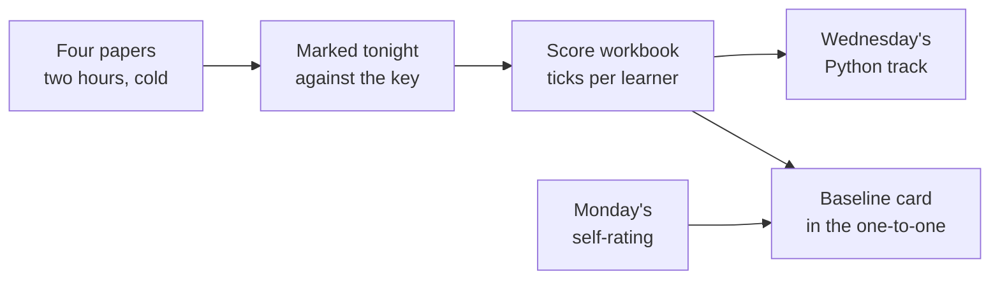

# Trainer day sheet: Week 0, Tuesday. The diagnostic

TRAINER ONLY. For the Programme Head, the Academic TA and the Support TA.

Module: <!-- sync:module:W00/D2 -->no module, since Week 0 sits outside the 510 hours<!-- /sync:module:W00/D2 -->. Date: <!-- sync:day-date:W00/D2 -->Tue 29 Sep 2026<!-- /sync:day-date:W00/D2 -->.

## What today is for

Four papers measure, cold and without an assistant, what Monday's self-rating claimed. Tonight's
ticks set Wednesday's two Python tracks and fill the measured column of each learner's baseline
card. Nothing is taught today, and nothing a learner sees carries a cut-off, a level label or
another learner's count.

**Stop before** explaining any item, during the papers or after them. Anyone absent today sits the
same papers on Wednesday, and the answers are taught in Wednesday's brush-up.

## The shape of the afternoon

The institute's address and orientation take the first half of the day. The programme's half runs
as below, with each paper collected before the next is handed out.

| Block | Duration | What has to happen |
|---|---|---|
| Paper 1: Python, items 1 to 11 | 45 min | Predict eight outputs, fix two broken lines, write one function |
| Paper 2: SQL, items 12 to 18 | 30 min | Predict the rows of four queries, write three |
| Paper 3: statistics, items 19 to 26 | 20 min | Four choices, three sums and one true or false |
| Paper 4: stating a problem, items 27 and 28 | 25 min | Five questions and three hypotheses for one owner's request |
| Briefing for Wednesday's introductions | 10 min | The four-minute shape, below |
| Setup fixes | The rest of the half | The help desk takes anything still failing from Monday |

## Before the room opens

1. Print the four papers in `paper/`, every file there except the baseline card, from each file's
   page on GitHub: one set per learner and five spares, each paper stapled on its own. Item 22 is a
   bar chart drawn on the page, so check on the print preview that it has printed before running
   the full set.
2. Print nothing from `answer-key/` or `trainer/` for the room.
3. Copy the score workbook, `trainer/C2_W00_D02_scores_TRAINER.xlsx`, to the programme's own drive.
   The filled copy never goes into the repository, which is public: a learner's name beside a
   count is personal data.
4. Bring Monday's self-rating forms for tonight's marking, since the workbook takes each learner's
   letters from them.
5. Take the attendance from the help desk sheet, so the make-up list starts before paper 1.

## Running the papers

Say the rules once, before paper 1: no assistant, no notes, no laptop and no phone for the whole
two hours; the papers are not graded; an item left blank tells the TA more than one copied from a
neighbour; and a question about what an item's words mean gets an answer, while a question about
how to solve it does not.

Hand each paper out face down, start the room together and collect every copy at time before the
next goes out. A learner who finishes early turns the paper over and waits. To any "how do I"
question, the one answer is: write what you would do, and move on. Items 9 and 10 each show the
last line of a real Python error; when a learner asks whether the error is real, it is.

## The briefing, 10 minutes

Tomorrow each learner speaks for four minutes: two on who they are and the role they are aiming
for, and two on one thing they built, covering what it did, their own part in it, one thing that
broke, and what they would change. Say two things plainly. "My part" means the part they did,
said in the first person, since a project told entirely as "we" hides the speaker. "What broke"
means a real failure and what they did about it, since a project with no failure in it sounds
rehearsed. Those are the two places where interview answers about projects fall apart. Point the
room to tonight's pre-read, which carries the same shape.

## Marking tonight

The Academic TA and the Support TA mark every paper tonight against
`answer-key/C2_W00_D02_diagnostic_key_TRAINER.md`. One marker takes each paper for the whole room,
so every paper is held to one reading of the key: the Academic TA marks Python and SQL, and the
Support TA marks statistics and stating a problem.

1. Before the piles are split, both markers mark the same three stating-a-problem papers alone
   and compare their counts. Where they differ, they settle the reading against the key's
   categories and its three-part test, then carry on.
2. Tick or cross each item on the paper in pen, then type 1 or 0 per tick into the workbook's
   Scores sheet. A blank is 0.
3. Type each learner's Monday letters beside their ticks, from the self-rating form.
4. A case the key does not settle is decided by the Academic TA and added to the key file before
   the make-up.

By the end of the evening, the Room sheet gives the two track sizes, the make-up count and the
ticks the room missed most, which are where the taught track starts on Wednesday.

## The track rule

Settings B9 in the workbook holds the rule: a learner with fewer than half the Python ticks, which
is 6 or fewer of 13, joins the taught track, and everyone else joins the practice track. It
changes in that cell and nowhere else, and every track recalculates.

Tell each learner their track one to one as they arrive on Wednesday, and never post a list: a list
of names by track is a level label the whole room can read. A learner who missed the paper joins the
taught track on Wednesday and moves once the make-up is marked, if the ticks say so.

## The make-up

Anyone absent today sits the same four papers, in the same order and for the same minutes, during
Wednesday's lab time, and is marked that evening against the same key. Nobody who sat today's
papers talks the make-up group through them.

## The interview angle, with the answers

The four questions are the ones the row carries. The room met them today as items; the answers
below are for the team, so a one-to-one can hold a learner to them.

**[SV] Predict the output of this snippet.** A strong answer reads the code aloud a line at a time,
keeps each variable's value as it changes, and gives the output with its type: for
`print(9 / 3)`, "3.0, a float, because `/` always gives a float in Python 3, and `9 // 3` would
give the integer 3." The weak answer guesses from the shape of the code, and the tell is an answer
that arrives before the candidate has looked at the last line.

**[SV] What rows does this query return?** A strong answer runs the clauses in the order the
database does, which differs from the order they are written: the table, then `WHERE` on rows,
then `GROUP BY`, then `HAVING` on the groups, then the columns, then `ORDER BY`, then `LIMIT`. It
names the rows a boundary drops, for example that `> 14` leaves out a row holding exactly 14, and
it says when two rows tie and the order between them is not fixed.

**[S] Mean or median for this data, and why?** A strong answer looks at the shape of the numbers
before choosing. When a few values sit far from the rest, the median describes the typical case
and the mean describes the total, so the choice follows the question: the median for what a
typical customer spends, the mean when the question is the month's takings or a budget. It ends by
saying which one was reported, so nobody reads one as the other.

**[F] A business asks you to 'improve sales'; what are the first five questions you ask?** Five
questions of five different kinds, before any proposal: what "sales" means here and how it is
counted; how far down, against which baseline and since when; where the fall sits, by outlet,
product or customer; what changed; and what "improved" would mean, by when and within what limits.
A first question that proposes a fix, such as "have you tried a discount?", answers a problem
nobody has stated yet.

## What to record today

1. Attendance at each paper, from the collected piles.
2. Every paper's ticks in the workbook, tonight.
3. The track sizes and the make-up list from the Room sheet, to the Programme Head before
   Wednesday's brush-up starts.
4. Every case the markers disagreed on, added to the key.

## Tomorrow

Wednesday runs the Python brush-up in two tracks, the introductions, the one-to-ones during lab
time and the make-up for anyone absent today. Print one baseline card per learner from
`paper/C2_W00_D02_baseline_card_STUDENT.md`, and bring each learner's four papers and Monday's form
to their one-to-one, where the workbook's last column gives the line for the card.
