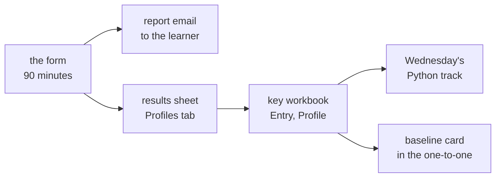

# Trainer day sheet: Week 0, Tuesday. The diagnostic

TRAINER ONLY. For the Programme Head, the Academic TA and the Support TA.

Module: <!-- sync:module:W00/D2 -->no module, since Week 0 sits outside the 510 hours<!-- /sync:module:W00/D2 -->. Date: <!-- sync:day-date:W00/D2 -->Tue 29 Sep 2026<!-- /sync:day-date:W00/D2 -->.

## What today is for

The baseline diagnostic measures, cold and without an assistant, where each learner starts: forty
questions across Python, SQL, numbers and reasoning, a short business case and six judgment calls,
with the learner's own rating of five areas taken on the first page before any question is seen.
It runs on the Google Form for about 90 minutes, with the paper version for anyone whose laptop
fails. Each learner's report arrives by email the moment they submit, the programme's copy lands in
the form's results spreadsheet, and tonight the key workbook turns both into Wednesday's Python
tracks and the one-to-one sheet.

**Stop before** explaining any item during the sitting. The explanations reach every learner by
email on submission, and at length afterwards on GitHub Discussions.

## The shape of the afternoon

The institute's address and orientation take the first half of the day. The programme's half runs:

| Block | Duration | What has to happen |
|---|---|---|
| The diagnostic | 90 min | Every learner submits the form once, or hands in a paper answer sheet |
| Briefing for Wednesday's introductions | 10 min | The four-minute shape, below |
| Setup fixes | The rest of the half | The help desk takes anything still failing from Monday |

## Before the room opens

1. Open the form's respond link in a private browser window. It must load without asking for a
   Google sign-in, which is the check the form's builder script asks for.
2. In the form's settings, confirm that grades are released immediately after each submission and
   that respondents can see missed questions, correct answers and point values. Those are the quiz
   defaults the builder script relies on, and the requester has chosen to keep them.
3. Put the respond link on the projector and on the LMS. The learner-facing page with the link and
   the rules is `paper/C2_W00_D02_diagnostic_form_STUDENT.md`.
4. Print five copies of `paper/C2_W00_D02_diagnostic_STUDENT.docx` for laptops that fail.
5. Copy `answer-key/C2_W00_D02_diagnostic_key_INTERNAL.xlsx` to the programme's own drive. The
   filled copy never goes into the repository, which is public: a learner's name beside a score is
   personal data.

## Running the sitting

Say the rules once, as the form states them: your own head only, with no second tab, no notes and no
AI assistant; rough working on paper is fine; the section times are a guide and the paper runs in one
sitting. Laptops stay open on the form and nothing else, and phones stay away. A question about what
an item's words mean gets an answer; a question about how to solve it does not.

Two things go wrong often enough to watch for. A learner who mistypes the email address never gets
the report, and it cannot be resent, so ask the room to check the address before the first section.
And the form accepts a second submission from the same person: the results sheet labels it
"Repeat of row N", and the one-to-one always uses the first sitting.

## The briefing, 10 minutes

Tomorrow each learner speaks for four minutes: two on who they are and the role they are aiming for,
and two on one thing they built, covering what it did, their own part in it, one thing that broke,
and what they would change. Say two things plainly. "My part" means the part they did, said in the
first person, since a project told entirely as "we" hides the speaker. "What broke" means a real
failure and what they did about it, since a project with no failure in it sounds rehearsed. Point the
room to tonight's pre-read, which carries the same shape.

## After the sitting: the results

1. The form's results spreadsheet holds one row per submission on its Profiles tab. From column C
   onward its columns follow the key workbook's Entry tab, so each learner's row pastes into Entry
   from column A. A paper answer sheet is typed straight into Entry.
2. The workbook's Profile tab then shows each learner's section scores, the scores by tier, the
   rating against the scored band for each area, the Python and SQL brush-up calls, the calibration
   and a one-line note for the one-to-one. The Dashboard shows the room, including the hardest eight
   items.
3. The brush-up calls come from the Dashboard's inputs: a Python or SQL score below 50 percent of its
   section is a full brush-up, and anything above is light. For Wednesday, a full Python call joins
   the taught track and a light call joins the practice track. Tell each learner their track one to
   one as they arrive, and never post a list.
4. Anyone absent today sits the same form first thing on Wednesday in a separate room, before the
   brush-up teaches anything, and joins the taught track for its last hour.

## The interview angle, with the answers

The four questions are the ones Tuesday's row carries, and the diagnostic measures each of them. The
answers below are for the team, so a one-to-one can hold a learner to them.

**[SV] Predict the output of this snippet.** Q1, Q3, Q4, Q6 and Q8 ask it. A strong answer reads the
code a line at a time, keeps each variable's value as it changes, and gives the output with its type:
for `print(9 / 3)`, "3.0, a float, because `/` always gives a float in Python 3". The weak answer
guesses from the shape of the code.

**[SV] What rows does this query return?** Q13, Q15 and Q19 ask it. A strong answer runs the clauses
in the order the database does, which differs from the order they are written: the table, then
`WHERE` on rows, then `GROUP BY`, then `HAVING` on the groups, then the columns, then `ORDER BY`. It
says what a `NULL` does at each step.

**[S] Mean or median for this data, and why?** Q22 asks it. A strong answer looks at the shape of the
numbers first: when one value sits far from the rest, the median describes the typical case and the
mean describes the total, so the choice follows the question being answered.

**[F] A business asks you to 'improve sales'; what are the first five questions you ask?** Q29 to
Q32 work the same muscle on a table: which part of the business moved, what the table can and cannot
say, what the fair comparison is, and what could fake the whole finding. The spoken answer asks what
"sales" means, how far down and against what, where the fall sits, what changed, and what "improved"
would mean, before anyone proposes a fix.

## What to record today

1. Who submitted, who handed in paper, and who was absent, so the make-up list is ready.
2. Every submission pasted or typed into the workbook's Entry tab tonight.
3. The Python track for each learner, to the Programme Head before Wednesday's brush-up starts.
4. Anyone who says their report email never arrived, so their one-to-one starts from the Profile tab.

## Tomorrow

Wednesday runs the make-up first thing for anyone absent today, then the Python brush-up in two
tracks, the one-to-ones beside the practice track, and the introductions. Print one baseline card per
learner from `paper/C2_W00_D02_baseline_card_STUDENT.md`, and bring each learner's Profile line to
their one-to-one.
