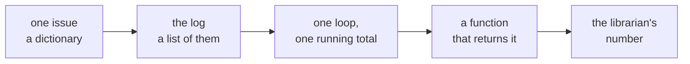

# The Python Week 1 runs on

Week 0, Wednesday. Five ideas, one page, kept beside you until Week 1 Monday opens.

## Panel 1: One way to answer any question about a log



The librarian's four asks, how many issues, which department borrows most, how many days late, and the same numbers every week, all take this shape.

**Crux:** Every question about a log is one loop carrying one running total, inside a function that returns the answer.

## Panel 2: The type decides what an operator does

| Line | Prints | Because |
|---|---|---|
| `"5" * 2` | `55` | `*` repeats text |
| `5 * 2` | `10` | `*` multiplies numbers |
| `7 / 2` | `3.5` | `/` always gives a float |
| `7 // 2` | `3` | `//` drops the remainder |
| `7 % 2` | `1` | `%` is the remainder |

`type(x)` names the type of any value.

**Crux:** Name each value's type before you read the operator.

## Panel 3: A position picks the record, a key picks the field

```python
issue = {"book": "Calculus", "days_kept": 20}
log = [issue, ...]       # a list of records
log[2]["book"]           # the third: counting starts at 0
len(log)                 # how many records
```

**Crux:** Square brackets with a number reach into the list; square brackets with a name reach into the record.

## Panel 4: A running total makes three moves

```python
counts = {}               # start, before the loop
for issue in log:
    dept = issue["dept"]
    if dept not in counts:
        counts[dept] = 0  # start, once per key
    counts[dept] = counts[dept] + 1   # update
print(counts)             # read, after the loop
```

Swap `+ 1` for `+ issue["days_kept"]` and the same loop adds days instead of counting issues.

**Crux:** Start the total once, update it once per record, and read it only after the loop.

## Panel 5: Return hands the answer back; the last line says what broke

```python
def late_days(issue):
    return issue["days_kept"] - 14
```

Swap `return` for `print` and the function hands back `None`, and adding `None` to a number stops with `TypeError: unsupported operand type(s) for +: 'int' and 'NoneType'`.

Read a traceback from the bottom: the last line says what happened, the line above it shows where, and the lines above that show how the program got there.

**Crux:** A function returns its answer, and a traceback is read from its last line up.
