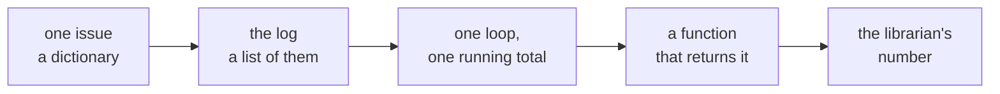
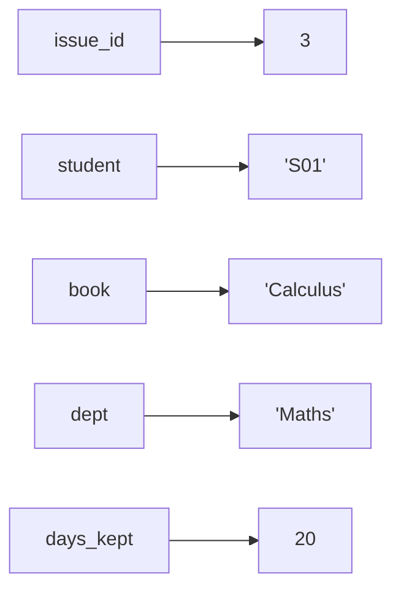
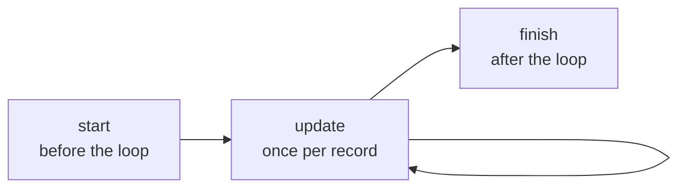
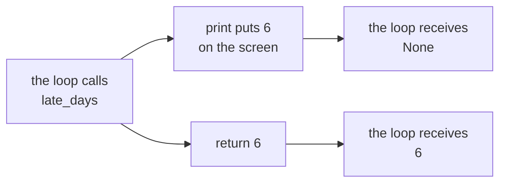
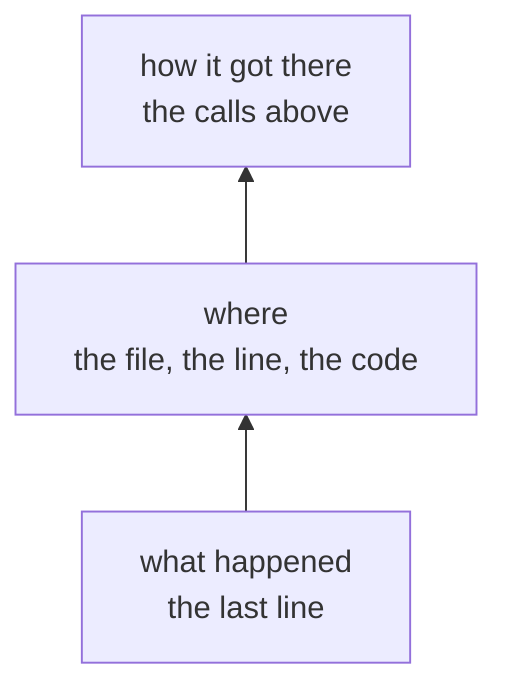

# Half one: the librarian's log

Week 0, Day 3. Slide source. One idea per slide.

Position bar, repeated at every section boundary:
`[the ask] > [values and records] > [one loop] > [functions] > [tracebacks]`

---

## SECTION A. The ask

---

## S1. Every book that goes out is logged
The college librarian, before the term review:

> "Every book that goes out is logged. Before the term review I need how many issues we had, which department borrows most, and how many days late books came back. And I need the same numbers every week."

You are the one person in the building who can write Python. The log holds one row per book lent out.

---

## S2. Four questions, one way of answering them


| The librarian asks | Python needs |
|---|---|
| How many issues? | A count |
| Which department borrows most? | A count per department |
| How many days late? | A sum of the days past the loan |
| The same numbers every week | A function that returns each answer |

---

## SECTION B. Values and records

---

## S3. Every value has a type, and the type decides
| Value | Type | What `*` does to it |
|---|---|---|
| `12` | `int` | Multiplies |
| `3.5` | `float` | Multiplies, and keeps the decimal |
| `"12"` | `str` | Repeats the text |
| `True` | `bool` | Counts as 1 |

`type(12)` names the type of any value. Every surprise in this half starts with a value whose type you guessed.

---

## D4. What does this line print?
**Question.** Write the four values before anything runs.

```python
print("5" * 2, 5 * 2, 7 / 2, 7 // 2)
```

---

## D5. Answer: 55 10 3.5 3
```
55 10 3.5 3
```

`"5" * 2` repeats the text. `5 * 2` multiplies. `7 / 2` always gives a float. `7 // 2` divides and drops the remainder.

The same symbol did four different things, because four values carried their types in with them.

---

## S6. One issue is one dictionary


```python
issue = {"issue_id": 3, "student": "S01", "book": "Calculus", "dept": "Maths", "days_kept": 20}
issue["days_kept"]    # 20
```

A key names a field, and the value sits beside it. One row of the log is one dictionary.

---

## S7. The log is a list of those dictionaries
```python
log = [
    {"issue_id": 1, "student": "S01", "book": "Algebra", "dept": "Maths", "days_kept": 12},
    {"issue_id": 2, "student": "S02", "book": "Poetry", "dept": "Arts", "days_kept": 5},
    {"issue_id": 3, "student": "S01", "book": "Calculus", "dept": "Maths", "days_kept": 20},
    {"issue_id": 4, "student": "S03", "book": "Poetry", "dept": "Arts", "days_kept": 9},
    {"issue_id": 5, "student": "S04", "book": "Physics", "dept": "Science", "days_kept": 14},
    {"issue_id": 6, "student": "S02", "book": "Algebra", "dept": "Maths", "days_kept": 3},
    {"issue_id": 7, "student": "S05", "book": "Chemistry", "dept": "Science", "days_kept": 21},
    {"issue_id": 8, "student": "S03", "book": "Calculus", "dept": "Maths", "days_kept": 7},
]
len(log)              # 8
log[2]["book"]        # 'Calculus': the list counts from 0, the dictionary answers by name
```

---

## SECTION C. One loop, one running total

---

## S8. A running total makes three moves


```python
total = 0                                  # start
for issue in log:
    total = total + issue["days_kept"]     # update
print(total)                               # finish: 91
```

A count is the same three moves with `+ 1` in the update. The librarian's first answer is 8 issues.

---

## S9. A dictionary can be the running total
```python
counts = {}
for issue in log:
    dept = issue["dept"]
    if dept not in counts:
        counts[dept] = 0                   # the first time a department appears
    counts[dept] = counts[dept] + 1
print(counts)
```

```
{'Maths': 4, 'Arts': 2, 'Science': 2}
```

Maths borrows most. The start move now happens once per key, inside the loop.

---

## D10. Whose books spend the most days out?
**Question.** Change one line of the counting loop so it answers this, then predict the three totals.

---

## D11. Answer: Maths 42, Science 35, Arts 14
```python
    counts[dept] = counts[dept] + issue["days_kept"]    # add the days, not 1
```

```
{'Maths': 42, 'Arts': 14, 'Science': 35}
```

Science reaches 35 days from two issues, while Maths needs four for 42. Borrowing most and keeping longest are different questions, and the loop answers whichever one its update line asks.

---

## SECTION D. A function that returns

---

## S12. Wrap the loop so next week gets the same answer
```python
def busiest_department(log):
    counts = {}
    for issue in log:
        dept = issue["dept"]
        if dept not in counts:
            counts[dept] = 0
        counts[dept] = counts[dept] + 1
    best = None
    for dept in counts:
        if best is None or counts[dept] > counts[best]:
            best = dept
    return best

busiest_department(log)    # 'Maths'
```

Next week's log goes in, and the same question comes back answered.

---

## D13. The helper printed 6, so why did the total stop?
**Question.** The loan is 14 days. Read the output, then say what `late_days` gave back.

```python
def late_days(issue):
    print(issue["days_kept"] - 14)

late = 0
for issue in log:
    if issue["days_kept"] > 14:
        late = late + late_days(issue)
```

```
6
TypeError: unsupported operand type(s) for +: 'int' and 'NoneType'
```

---

## D14. Answer: print shows a value, return hands it back


```python
def late_days(issue):
    return issue["days_kept"] - 14    # the loop now adds 6, then 7: 13 days late
```

A function without `return` gives back `None`, and `late + None` is the line that fails.

---

## SECTION E. Tracebacks

---

## S15. Read a traceback from the bottom up


The Python tutorial says it in one line: "The last line of the error message indicates what happened."

Then find the line it names, and ask what value each name on that line held when it ran.

---

## S16. Your turn
| What | Where |
|---|---|
| Twelve items on the log, answered as letters | The unguided exercise |
| The next week's log, with checks that tell you when you are right | The hands-on notebook |
| The five ideas on one page | Today's cheat sheet |

The next week's log has different numbers, so nothing from the demo can be pasted in.
