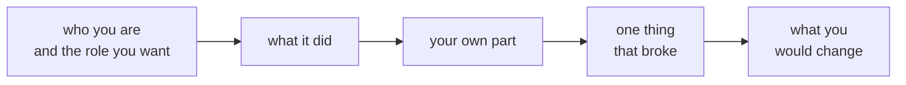

# Half two: four minutes each

Week 0, Day 3. Slide source. One idea per slide.

Position bar, repeated at every section boundary:
`[the shape] > [two versions of one story] > [the clock]`

---

## SECTION A. The shape

---

## S1. Two minutes on you, two on one thing you built

| Minutes | What they cover |
|---|---|
| Two on you | Who you are, what you have done so far, and the role you are here to become |
| Two on the thing you built | What it did, your own part in it, one thing that broke, and what you would change |

Any project counts: a college assignment, an internship task, a script that saved someone an hour.

---

## SECTION B. Two versions of one story

---

## D2. What is missing from this version?
**Question.** Name the two things an interviewer would ask about next.

> "For our final-year project we built an app for the college fest. We used Python and Firebase, with the front end in Flutter. It was a great team effort, it went really well, and we learned a lot about teamwork and new technologies."

---

## D3. Answer: your own part, and what broke
| What the story needs | The second version |
|---|---|
| What it did | "The registration page for our college fest, which about 400 students used in its first week." |
| Your own part | "I built the form and the table behind it; two friends did the design and the payment step." |
| What broke | "The confirmation email landed in spam for the first hundred sign-ups, because the college's mail server did not recognise our sending address." |
| What you would change | "I moved sending to the college's own mail account. Next time I would send a test email to five different inboxes before opening registration." |

The first version says "we" throughout and nothing went wrong, so the listener learns nothing about the speaker.

---

## SECTION C. The clock

---

## S4. Four minutes, then the next speaker
| When | What happens |
|---|---|
| Three minutes in | A card goes up: one minute left |
| Four minutes in | The next speaker starts, finished or not |
| While you listen | Note two people whose project you want to ask about over lunch |

The order of speakers is on the screen before the first one starts.
