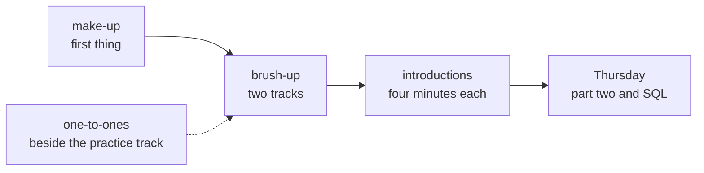

# Trainer day sheet: Week 0, Wednesday. The librarian's log, and four minutes each

TRAINER ONLY. For the Programme Head, the Academic TA and the Support TA.

Module: <!-- sync:module:W00/D3 -->no module, since Week 0 sits outside the 510 hours<!-- /sync:module:W00/D3 -->. Date: <!-- sync:day-date:W00/D3 -->Wed 30 Sep 2026<!-- /sync:day-date:W00/D3 -->.

## What today is for

The first half brings everyone to the Python Week 1 runs on, in two tracks set from the diagnostic's
Python brush-up calls. The second half is the introductions: four minutes each, two on the speaker
and two on one thing they built. Beside both, the ten-minute one-to-ones begin, and anyone absent on
Tuesday sits the diagnostic first thing, before any teaching reaches them.

**Stop before** everything Week 1 has planted for the room to find. The brush-up's data carries no
amount stored as text, no missing field, no file and no order large enough to split a mean from a
median, and the brush-up never shows `.get()` with a default. Those are Week 1 Monday's, Tuesday's
and Wednesday's moments. Stop before Kalpa, the revenue tree and any solution design as well. The
warden's framing class and its Kahoot run on Thursday, in the one-hour class the student sheet
promises.



## The shape of the day

| Block | Duration | What has to happen |
|---|---|---|
| The make-up, in a separate room | About 90 min, from the start of the first half | The diagnostic on the form, for anyone absent on Tuesday |
| Python brush-up, taught track | About 3 h | The librarian's log, from the deck's half one and the demo notebook, coded along in a blank notebook |
| Python brush-up, practice track | About 3 h, beside the taught track | The exercise, then the hands-on notebook, with the one-to-ones pulling learners out one at a time |
| The introductions | About 3 h, the second half | Every learner speaks for four minutes, from the run sheet |

The three morning jobs run at the same time, so each needs its own person in the room.

## Before the room opens

1. Take the tracks from the key workbook's Profile tab: a full Python brush-up call joins the taught
   track and a light call joins the practice track. Tell each learner their track one to one as they
   arrive, and never post the list.
2. Seat anyone absent on Tuesday in a separate room with a laptop open on the diagnostic form, and
   a paper copy in reserve, before the brush-up starts.
3. Print one baseline card per learner from `content/W00/D2/paper/C2_W00_D02_baseline_card_STUDENT.md`
   and print each learner's Profile line from the key workbook for the one-to-ones; the learner
   brings the report email.
4. Print the exercise, `exercises/unguided/C2_W00_D03_library_log_STUDENT.md`, one per learner, and
   the hands-on notebook's GitHub page, `notebooks/C2_W00_D03_ex1_hands_on_STUDENT.ipynb`, one per
   practice-track learner. Learners work in their own codespace from a blank notebook, since the
   course's own repository is not open to them yet.
5. Open the demo notebook, `notebooks/C2_W00_D03_01_library_log_STUDENT.ipynb`, in a codespace on
   the projector account and run it top to bottom once, so the helper and the data load before the
   room is watching.
6. Draw the speaking order for the introductions at random from the attendance list and load it
   into the run sheet.

## The taught track, about three hours

Teach from `slides/C2_W00_D03_half1_STUDENT.pptx` and the demo notebook, with the room typing along
in a blank notebook. Allow ten minutes for typing the eight records from slide S7, since every
typo it produces is a traceback worth reading together.

| Section | Duration | The move |
|---|---|---|
| The librarian's ask and the picture | 10 min | S1 and S2: four asks, one way of answering them |
| A value and its type | 20 min | D4 and D5: predict `55 10 3.5 3` before running it |
| One record, then the log | 30 min | S6 and S7: type the log, then reach the third issue by position and key |
| One loop, one running total | 40 min | S8 to D11: count, sum, then a dictionary as the total |
| A function that returns | 30 min | S12 to D14: the deliberate failure below, then the one-word fix |
| Reading a traceback | 20 min | S15: the last line first, on the failure the room has just seen |
| The exercise | 20 min | Twelve items, posted as letters, then the most-missed two discussed |
| Close | 10 min | S16, and tonight's hands-on notebook |

**Start from the diagnostic.** The key workbook's hardest-eight list says where to slow down. Q1, Q6
and Q7 belong to the types section, Q2, Q5 and Q12 to records and lists, Q3 and Q4 to the running
total, Q8 to functions, and Q9 and Q11 to reading an error. Q10, sorting with a key, sits outside
today's five ideas and waits for the discussion posts.

**The deliberate failure: a helper that prints.** On D13, the helper prints the days past the loan
instead of returning them. The room sees the helper work, since it prints `6`, and then the total
stop:

```
TypeError: unsupported operand type(s) for +: 'int' and 'NoneType'
```

Ask which of the two names on the failing line is the `NoneType`, then ask what `late_days` handed
back. Give the room a minute to find that printing and returning are different acts. The fix is
the word `return`, and the total comes out at 13 days late.

## The practice track, about three hours

The practice track starts on the same exercise, then works through the hands-on notebook on the next
week's log, where every number differs from the demo's. Each step ends in a check that says whether
the learner's letter was right, so the track runs without a trainer at the front. Learners post the
exercise's letters and the notebook's twelve letters when they finish, and anyone done early takes
the notebook's last step as far as the weekly report.

The one-to-ones run beside this track, ten minutes each, from
`trainer/C2_W00_D03_one_to_one_guide_TRAINER.md`. Start with the practice-track learners, since the
taught track cannot lose ten minutes of its class, and carry the rest to Thursday's lab time.

## The make-up

Anyone absent on Tuesday sits the diagnostic first thing, in a separate room, for about 90 minutes
on the form, before the brush-up has taught anything. The Tuesday rules apply unchanged: their own
head only, with no second tab, no notes and no AI assistant. They then join the taught track for its
last hour, and move to the practice track once their Profile line reads light, if it does.

## The introductions, about three hours

Run the second half from `trainer/C2_W00_D03_introductions_run_sheet_TRAINER.md` and the deck's half
two. Before the first learner speaks, read the first version on D2 aloud and let the room name what
is missing, then show the second version on D3. After that, the clock is the facilitator: a card at
three minutes, and the next speaker at four, finished or not.

## The interview angle, with the answers

The two questions move to Wednesday with the talks, from the tracker's Saturday row. The answers are
for the team, so a one-to-one can hold a learner to them.

**[S] Tell me about a project you built: what was your part, and what broke?** A strong answer names
the project in one sentence with a number attached, then the speaker's own part in the first person
("I built the form and the table behind it"), then one real failure, its cause and what they did
about it. The weak answer says "we" throughout, and the tell is a project in which nothing went
wrong.

**[F] What would you do differently if you built it again?** A strong answer changes one specific
decision and says what it would have prevented: "I would send a test email to five different inboxes
before opening registration, because the first hundred confirmations went to spam." The weak answer
is general ("plan better", "test more") and could be said of any project.

## What to record today

1. The make-up submissions, pasted into the key workbook's Entry tab tonight.
2. Each one-to-one that ran, with the card's two actions noted, and who is left for Thursday.
3. The introductions capture from the run sheet, which feeds the one-to-ones still to come.
4. The exercise's most-missed items, which Thursday's part two opens on.

## Tomorrow

Thursday runs the Python brush-up's part two into SQL, the one-hour class on stating a problem before
solving it with the warden's ask, and the SQL brush-up. The SQL brush-up runs queries from VS Code
against Postgres, which the Jupyter starter does not carry, so the room needs the course's own
repository, or another workspace with a database, before it starts.
