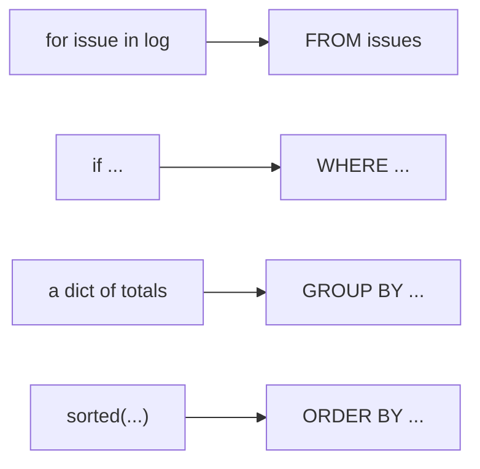

# The SQL Week 2 starts from

Week 0, Thursday. Five ideas, one page, kept beside you until Week 2 Monday opens.

## Panel 1: Each Python move has a clause



The librarian's three questions, how many issues, which department borrows most and how many days late, came out the same in Python and in SQL.

**Crux:** A loop over records becomes `FROM`, its `if` becomes `WHERE`, and its dictionary of totals becomes `GROUP BY`.

## Panel 2: Written in one order, run in another

| You write | Postgres runs |
|---|---|
| `SELECT` | `FROM` |
| `FROM` | `WHERE` |
| `WHERE` | `GROUP BY` |
| `GROUP BY` | `HAVING` |
| `HAVING` | `SELECT` |
| `ORDER BY` | `ORDER BY` |

A clause out of written order stops with `ERROR:  syntax error at or near`, naming the first word Postgres could not place.

**Crux:** Write in the fixed order, and reason in the run order.

## Panel 3: Which rows

| Condition | Keeps |
|---|---|
| `dept = 'Arts'` | text in single quotes |
| `days_kept > 14 AND week = 1` | both true |
| `dept = 'Arts' OR dept = 'Maths'` | either true |
| `book IN ('Poetry', 'History')` | one of a list |
| `days_kept BETWEEN 10 AND 14` | a range, both ends included |

Double quotes name a column, so `dept = "Arts"` stops with `ERROR:  column "Arts" does not exist`.

**Crux:** Single quotes for text, double quotes never for text.

## Panel 4: One row per group, then groups that pass

```sql
SELECT dept, COUNT(*) AS issues, SUM(days_kept) AS days_out
FROM issues
WHERE days_kept > 14          -- rows, before the groups
GROUP BY dept                 -- one row per department
HAVING COUNT(*) >= 2          -- groups, after they exist
ORDER BY issues DESC, dept;   -- a second column settles ties
```

`COUNT(*)`, `SUM`, `MIN`, `MAX` and `AVG` each turn many rows into one number.

**Crux:** `WHERE` filters rows, `GROUP BY` makes the groups, and `HAVING` filters the groups.

## Panel 5: Postgres in your codespace

```bash
sudo service postgresql start     # after every restart
psql -d library                   # open the database
psql -d library -f setup.sql      # run a whole file
```

Inside psql, end every query with `;`, leave with `\q`, and press `q` to close a long result.

`connection to server on socket ... failed` means the server is not running: start it and try again.

**Crux:** Start the server, open the database, and end every query with a semicolon.
