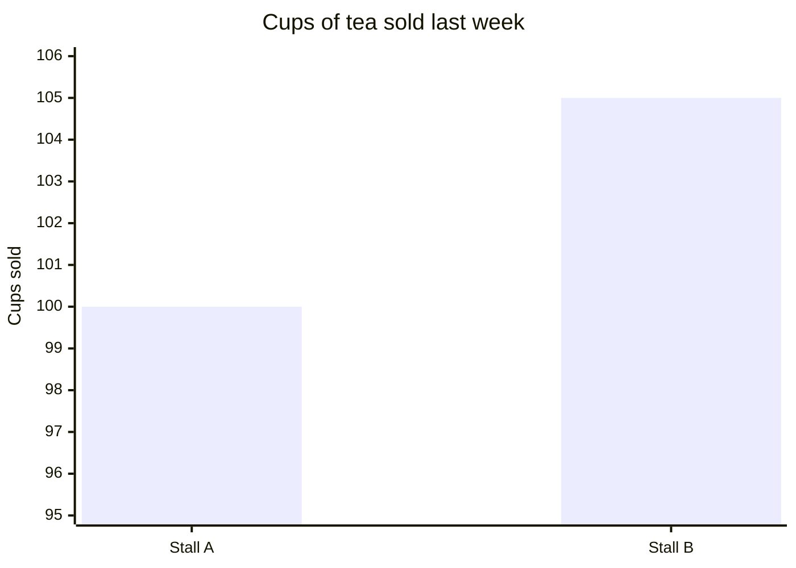

# Practice set, part 3 of 4: Numbers

Week 0, for the long weekend. About 20 minutes, on paper, with no assistant and no calculator; work
out sums in the margin. The set is ungraded: answer every item, then check yourself against the
self-check key.

Items 19 to 26. Where an item offers lettered options, circle the one letter you choose. Where it
asks for a number, write the number.

---

### 19

Seven students' canteen spend yesterday, in Rs: 40, 45, 50, 55, 60, 65 and 900. The canteen
manager wants one number for what a typical student spends.

Which number should the manager use, and why?

a) The mean, Rs 173.6, since it is the only average that counts every student's spend in it.
b) The median, Rs 55, since the one Rs 900 spend lifts the mean above six of the seven.
c) The mean, Rs 173.6, since the Rs 900 is real money the canteen took in yesterday.
d) The median, Rs 55, since the median is the more honest average for any set of numbers.

### 20

What is the median of 3, 9, 4 and 7?

Your answer: ______________

### 21

Two shops' sales on three days, in thousands of rupees:

| Day | Shop P | Shop Q |
|---|---|---|
| Monday | 48 | 20 |
| Tuesday | 50 | 50 |
| Wednesday | 52 | 80 |

Which statement is true?

a) Both shops average 50 a day, and Shop Q's sales are the more spread out.
b) Both shops average 50 a day, so the two shops' sales behave the same way.
c) Shop Q averages more, since its best day is higher than any day at Shop P.
d) Both shops average 50 a day, and Shop P's sales are the more spread out.

### 22

A canteen committee was shown this chart of the cups of tea its two stalls sold last week.

Which statement does the chart support?

a) Stall B sold about twice as many cups as Stall A last week.
b) The chart cannot compare the stalls, since its axis does not start at zero.
c) Stall B sold about 5 more cups a day than Stall A last week.
d) Stall B sold about 5 percent more cups than Stall A last week.

### 23

A tea stall added a new flavour last week, and it sold out on 3 of the 4 days it was stocked. The
regular flavour has sold out on 60 of the last 100 days. The owner says the new flavour is the more
popular of the two.

Which reply is fair?

a) The owner is right, since selling out on 75 percent of days beats 60 percent.
b) The regular flavour is more popular, since 60 sell-outs are far more than 3.
c) Four days are too few to tell yet, so keep stocking both and compare again.
d) The two are about as popular as each other, since both sold out on most days.

### 24

A shop's takings rose from Rs 20,000 one month to Rs 25,000 the next, then fell back to
Rs 20,000 the month after.

By what percentage did the takings rise, and by what percentage did they fall?

Rise: __________ percent &nbsp;&nbsp;&nbsp; Fall: __________ percent

### 25

True or false: a single very large value moves the median of a list more than it moves the mean.

Circle one: &nbsp; True &nbsp;&nbsp; False

### 26

What is the range of 12, 5, 9, 20 and 7?

Your answer: ______________
