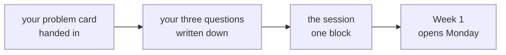

# Before Saturday: a working forward deployed engineer, and your questions

Ships tonight, for the long weekend. Friday is Gandhi Jayanti, with no session. About thirty minutes
of preparation, done any time before Saturday.

---

## What Saturday is

A working forward deployed engineer spends the session on the job itself and on your questions. It
runs as one block of about four hours, and up to six. Every build week in this programme is run the
way a forward deployed engineer would run it, so Saturday is the first look at the work the whole
programme points toward.

---

## Bring three things

| What | What it is |
|---|---|
| Your problem card | One page, from Thursday's class: a real problem from a field you know, the four questions answered for it, the stated problem and a candidate real problem written apart, and the three questions you would ask first. It is handed in on Saturday |
| Three questions for the engineer | Written down before you arrive, so the best ones get asked. The bank below is a place to start |
| Your laptop, with Postgres running | So nothing about setup waits for Monday |

## A bank of questions to start from

Pick three, sharpen them, or write your own. A good question asks for a specific time something
happened, which gets a better answer than a question about what usually happens.

| About | Question |
|---|---|
| The client | What did your last client think the problem was, and what did it turn out to be? |
| The first week | What do you do in your first week with a new client, before any code? |
| Saying no | When did you last talk a client out of a model, and what did you build instead? |
| The day | How much of a working day is code, and how much is conversation? |
| Failure | What broke in your last deployment, and who noticed it first? |
| The path | What should someone starting now learn this year to be useful on your team? |

---

## The foundations guide, for the long weekend

Three chapters of the foundations guide fit the weekend. Chapter 5 is the one closest to Saturday,
since it is how an unfamiliar problem gets taken apart before anyone solves it.

| Chapter | Reading | Hands-on |
|---|---|---|
| [Chapter 3, Numbers](../../D2/study-notes/C2_W00_D02_foundations_03_numbers_STUDENT.md) | 12 min | 60 min |
| [Chapter 4, Language models](../../D2/study-notes/C2_W00_D02_foundations_04_language_models_STUDENT.md) | 11 min | 60 min |
| [Chapter 5, Business problems and judgment](../../D2/study-notes/C2_W00_D02_foundations_05_business_problems_STUDENT.md) | 9 min | 60 min |

---

## If you want more before Saturday

The self-prep page lists the weekend's practice set, the mess project and four things to explore. The
fourth, your own project through the four questions, is the one most worth bringing to Saturday.
