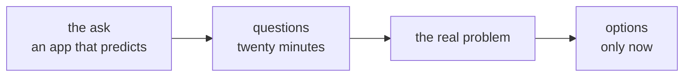
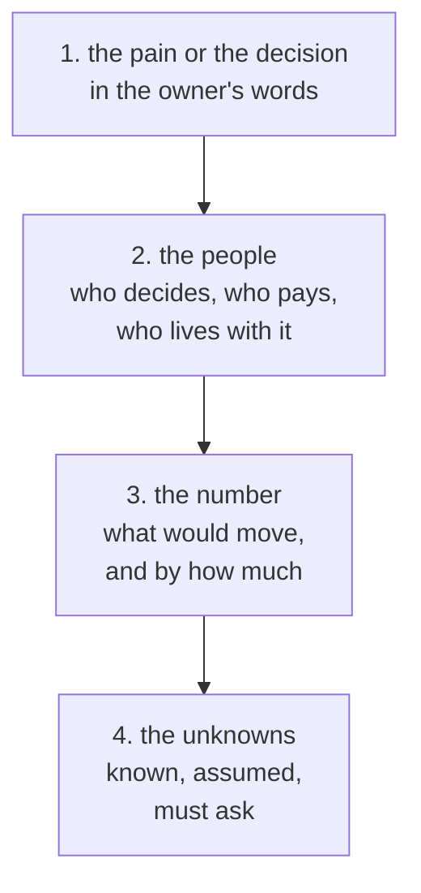
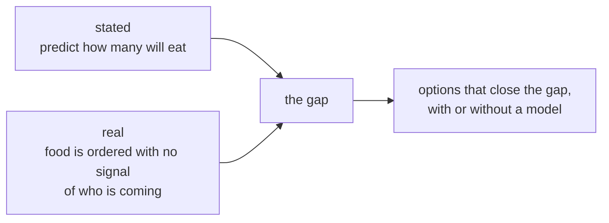
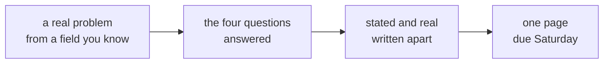

# The warden's mess: the problem before the solution

Week 0, Day 4. Slide source. One idea per slide.

Position bar, repeated at every section boundary:
`[the ask] > [twenty minutes of questions] > [the four questions] > [stated and real] > [your card]`

---

## SECTION A. The ask

---

## S1. "I want an app that predicts how many will eat"
The warden of a student hostel:

> "Our mess throws away about a fifth of what it cooks. I want an app that predicts how many students will eat."

The mess manager adds:

> "Students skip dinner without telling anyone, and the vendor bills us for what we order, eaten or not."

You are the engineer in the room. For the first twenty minutes you may ask anything, and you may propose nothing.

---

## SECTION B. Twenty minutes of questions

---

## S2. Ask first: the ask arrives with its answer attached

The warden has already chosen a solution. Your first job is to find the problem it was chosen for, and whether it is the right one.

Every answer you get in the next twenty minutes comes only from a question someone asked.

---

## SECTION C. The four questions

---

## S3. Four questions come before any proposal

| Question | For the warden's mess |
|---|---|
| The pain or the decision | Money spent on food nobody eats |
| The people | The warden, the mess manager, the vendor, the students, the mess committee |
| The number | Plates thrown away each week, and the bill |
| The unknowns | What the records show, how early the vendor needs a count, who must agree to a new rule |

---

## D4. Known, assumed or must ask?
**Question.** Sort the eight statements. Known means someone who would know has said it; assumed means nobody has checked it; must ask means only the owner can fill the gap.

| # | Statement |
|---|---|
| 1 | The mess cooks for all 240 students every night. |
| 2 | About a fifth of the food is thrown away. |
| 3 | Students would use an app to say they are skipping dinner. |
| 4 | The vendor bills for every plate ordered, eaten or not. |
| 5 | Weekends waste the most. |
| 6 | Who has to agree before students are asked to do anything new? |
| 7 | How early does the vendor need the next day's count? |
| 8 | Students skip dinner without telling anyone. |

---

## D5. Answer: three known, three assumed, two must ask
| Known | Assumed | Must ask |
|---|---|---|
| 1, the mess manager cooks for all 240 | 2, the warden's estimate until the register is read | 6, who must agree |
| 4, the mess manager knows the bill | 3, nobody has asked a student | 7, the vendor's deadline |
| 8, the mess manager sees it nightly | 5, a guess until the register is read | |

An assumption becomes a fact the moment someone checks it. The mess keeps a register of plates served each night, so statements 2 and 5 can be checked this week.

---

## SECTION D. Stated and real

---

## S6. The stated problem and the real one

| | In the warden's words | Underneath |
|---|---|---|
| The ask | "An app that predicts how many students will eat" | A way to order closer to what is eaten |
| The cause | "Students skip dinner without telling anyone" | Nobody has a way to tell the mess in time |
| The cost | "The vendor bills us for what we order" | Every uneaten plate is paid for |

---

## S7. The cheapest fix may need no model
| Option | What it takes | Model? |
|---|---|---|
| A sign-out each morning on the mess group | One message a day from each student who will skip | No |
| Cook each weekday's recent average, plus a small margin | The mess register and a calculator | No |
| An app that predicts attendance | Data, a model, an app, and someone to keep it running | Yes |

The first two could start next week. Choosing between the three is the weekend project's work; today's work is being sure the problem underneath is the right one.

---

## D8. Write it for the warden's ask
**Question.** Write the stated problem, a candidate real problem, and five questions ranked by importance, each with the decision its answer would change.

---

## D9. Answer: one strong version
**Stated:** predict how many students will eat dinner.

**Real, as a candidate:** the mess orders food for all 240 students because it has no signal of who is coming, and the vendor bills for every plate.

| Rank | Question | The decision its answer changes |
|---|---|---|
| 1 | How many plates are thrown away, and on which nights? | Whether the fix is needed every night or only some |
| 2 | How early does the vendor need the count, and can that move? | How late a signal can arrive and still help |
| 3 | Who has to agree before students are asked to do something new? | Whether a sign-out rule is possible at all |
| 4 | Which number would tell you it is fixed, by how much, and by when? | What to measure, and when to stop |
| 5 | How do students tell anyone today that they will skip? | Whether to build on a habit that already exists |

---

## SECTION E. Your card

---

## S10. The problem card, due Saturday

One page, handed in on Saturday: a real problem from a field you know, the four questions answered for it, the stated problem and a candidate real problem written apart, and the three questions you would ask first.
