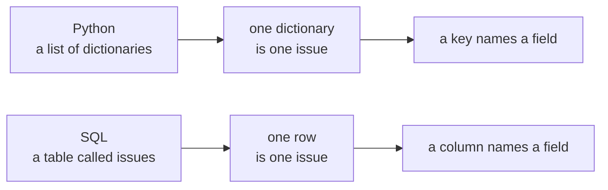
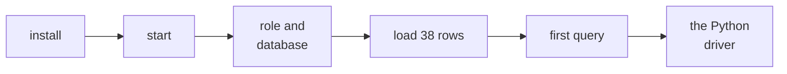
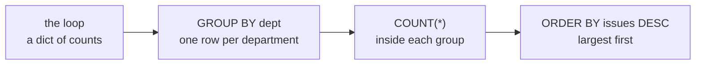
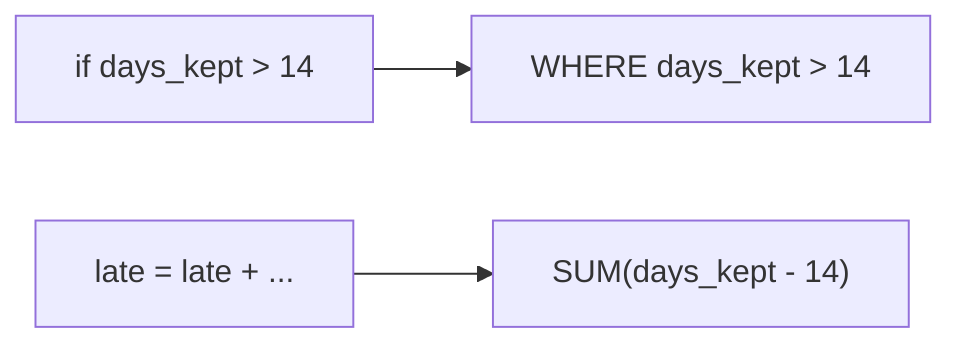
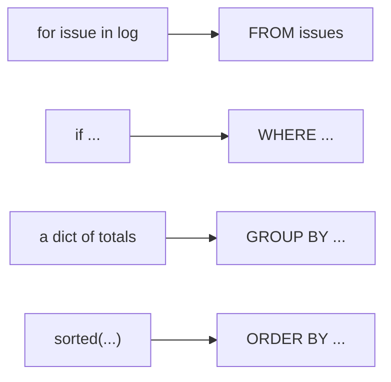

# Half one: the librarian's questions, asked in SQL

Week 0, Day 4. Slide source. One idea per slide.

Position bar, repeated at every section boundary:
`[the new ask] > [a table in your codespace] > [one row, one record] > [three questions, twice] > [every week at once]`

---

## SECTION A. The new ask

---

## S1. The log has moved into a database
The college librarian, the morning after your function worked:

> "The office has moved the issue log into the library's database, and it grows every week. Can the same three numbers come straight out of the database, for any week I ask about, without anyone copying rows into a notebook?"

The database is Postgres. The language it answers in is SQL.

---

## S2. The same log, two shapes


| Python on Wednesday | SQL today |
|---|---|
| `log`, a list | `issues`, a table |
| `{"dept": "Maths", ...}`, a dictionary | one row |
| `issue["days_kept"]` | the column `days_kept` |

The table holds four weeks: week 1 is Wednesday's class log, row for row.

---

## SECTION B. A table in your codespace

---

## S3. Six ticks, about fifteen minutes


The setup sheet has every command and what you should see after it. The server does not start by itself, so a stopped codespace needs `sudo service postgresql start` again.

---

## SECTION C. One row, one record

---

## S4. Ask for columns, and say which rows
```sql
SELECT issue_id, student, book, dept, days_kept
FROM issues
WHERE week = 1;
```

| Clause | Says |
|---|---|
| `SELECT` | which columns come back |
| `FROM` | which table |
| `WHERE` | which rows count |

Eight rows come back: Wednesday's class log, from the database.

---

## D5. How many issues did Maths have in week 1?
**Question.** This line looks right. Predict what Postgres prints.

```sql
SELECT COUNT(*) FROM issues WHERE week = 1 AND dept = "Maths";
```

---

## D6. Answer: an error, because double quotes name a column
```text
ERROR:  column "Maths" does not exist
```

In SQL, double quotes wrap the name of a column or a table. Single quotes wrap text.

```sql
SELECT COUNT(*) FROM issues WHERE week = 1 AND dept = 'Maths';   -- 4
```

Python accepts either kind of quote around text. Postgres gives each kind a different job.

---

## SECTION D. Three questions, twice

---

## S7. How many issues? A count
```python
count = 0
for issue in log:
    count = count + 1        # 8
```

```sql
SELECT COUNT(*) AS issues
FROM issues
WHERE week = 1;              -- 8
```

The loop's start, update and finish all live inside `COUNT(*)`.

---

## S8. Which department borrows most? A count per group


```sql
SELECT dept, COUNT(*) AS issues
FROM issues
WHERE week = 1
GROUP BY dept
ORDER BY issues DESC, dept;
```

```text
  dept   | issues
---------+--------
 Maths   |      4
 Arts    |      2
 Science |      2
```

---

## D9. How many days late in week 1?
**Question.** The loan is 14 days. Which two lines turn the Python below into one query?

```python
late = 0
for issue in log:
    if issue["days_kept"] > 14:
        late = late + (issue["days_kept"] - 14)
```

---

## D10. Answer: the if becomes WHERE, the total becomes SUM
```sql
SELECT SUM(days_kept - 14) AS late_days
FROM issues
WHERE week = 1
  AND days_kept > 14;        -- 13
```



Issue 3 adds 6 and issue 7 adds 7: 13, the same number the function returned.

---

## SECTION E. Every week at once

---

## S11. The same numbers every week
```sql
SELECT week, COUNT(*) AS issues
FROM issues
GROUP BY week
ORDER BY week;
```

```text
 week | issues
------+--------
    1 |      8
    2 |     10
    3 |     10
    4 |     10
```

Wednesday wrapped the loop in a function so next week could reuse it. Grouping by `week` answers every week in one query.

---

## S12. Each Python move has a clause


| In Python | In SQL |
|---|---|
| loop over the records | `FROM issues` |
| `if` inside the loop | `WHERE` |
| running count or total | `COUNT(*)`, `SUM(...)` |
| a dictionary keyed by department | `GROUP BY dept` |
| `sorted(..., reverse=True)` | `ORDER BY ... DESC` |

---

## S13. Your turn
| What | Where |
|---|---|
| The five queries of this half, with the answer each should print | `C2_W00_D04_01_librarian_STUDENT.sql` |
| The same questions in Python and SQL, side by side | The demo notebook |
| Whose books spend the most days out, in SQL | Change one word of S8's query and check for Maths 42, Science 35, Arts 14 |
