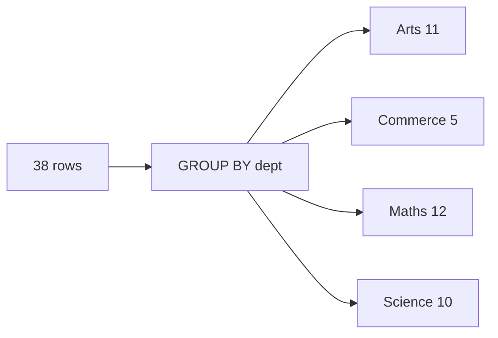
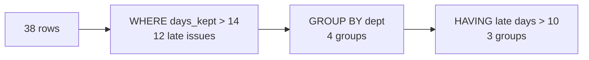

# Half two: SQL, the clauses and the order they run in

Week 0, Day 4. Slide source. One idea per slide.

Position bar, repeated at every section boundary:
`[the month's questions] > [which rows] > [in what order] > [one row per group] > [groups that pass]`

---

## SECTION A. The month's questions

---

## S1. Four weeks of the log, five questions
The librarian, before the library committee meets:

> "The committee wants the month, not the week. Which departments borrow most, and who keeps books longest? Which students are our regulars? And which departments return books late?"

The `issues` table now holds four weeks: 38 issues, and a fourth department, Commerce, from week 3.

---

## S2. Written in one order, run in another


| You write | Postgres runs |
|---|---|
| `SELECT`, `FROM`, `WHERE`, `GROUP BY`, `HAVING`, `ORDER BY` | `FROM`, `WHERE`, `GROUP BY`, `HAVING`, `SELECT`, `ORDER BY` |

Almost every surprise in this half is a clause doing its work at a different moment from the one you pictured.

---

## SECTION B. Which rows

---

## S3. WHERE keeps the rows its condition calls true
```sql
SELECT issue_id, student, book, days_kept
FROM issues
WHERE dept = 'Science'
  AND days_kept > 14
ORDER BY days_kept DESC;
```

```text
 issue_id | student |   book    | days_kept
----------+---------+-----------+-----------
        7 | S05     | Chemistry |        21
       17 | S02     | Chemistry |        19
       21 | S05     | Physics   |        17
        9 | S02     | Physics   |        16
```

---

## S4. Three more ways to say which rows
| Condition | Keeps | Rows back |
|---|---|---|
| `book IN ('Economics', 'Accounts')` | a value from the list | 5 rows |
| `days_kept BETWEEN 10 AND 14` | a value in the range, both ends included | 11 rows |
| `dept = 'Arts' OR dept = 'Commerce'` | either condition true | 16 rows |

Text always sits in single quotes, as the first half showed.

---

## D5. How many books were kept between 10 and 14 days?
**Question.** Predict the count before running it.

```sql
SELECT COUNT(*) FROM issues WHERE days_kept BETWEEN 10 AND 14;
```

---

## D6. Answer: 11, because both ends count


Issues 19 and 36 were kept exactly 10 days and issues 5, 14 and 35 exactly 14, and all five count. With the ends left out, `days_kept > 10 AND days_kept < 14`, the count is 6.

---

## SECTION C. In what order

---

## S7. ORDER BY on more than one column
```sql
SELECT dept, issue_id, days_kept
FROM issues
ORDER BY dept, days_kept DESC, issue_id;
```

| Column | Job |
|---|---|
| `dept` | Arts, then Commerce, then Maths, then Science |
| `days_kept DESC` | inside each department, the longest keep first |
| `issue_id` | settles the two Science books kept exactly 14 days |

Each column after the first only breaks ties left by the ones before it.

---

## SECTION D. One row per group

---

## S8. Five aggregates, one row back
```sql
SELECT COUNT(*), SUM(days_kept), MIN(days_kept), MAX(days_kept),
       ROUND(AVG(days_kept), 1)
FROM issues;
```

| Aggregate | Answer |
|---|---|
| `COUNT(*)` | 38 issues |
| `SUM(days_kept)` | 452 days out in all |
| `MIN(days_kept)` and `MAX(days_kept)` | 3 and 23 days |
| `ROUND(AVG(days_kept), 1)` | 11.9 days on average |

---

## S9. GROUP BY turns one answer into one per department


```sql
SELECT dept, COUNT(*) AS issues, ROUND(AVG(days_kept), 1) AS average_days
FROM issues
GROUP BY dept
ORDER BY issues DESC;
```

Maths borrows most, 12 issues; Science keeps longest, 13.5 days on average.

---

## S10. Two columns make smaller groups
```sql
SELECT dept, week, COUNT(*) AS issues
FROM issues
GROUP BY dept, week
ORDER BY dept, week;
```

Fourteen rows come back, one for each department in each week it borrowed. Commerce has only two, weeks 3 and 4, because it first borrowed in week 3.

---

## SECTION E. Groups that pass

---

## S11. HAVING keeps the groups its condition calls true
```sql
SELECT student, COUNT(*) AS issues
FROM issues
GROUP BY student
HAVING COUNT(*) >= 5
ORDER BY issues DESC, student;
```

```text
 student | issues
---------+--------
 S02     |      6
 S01     |      5
 S03     |      5
```

`WHERE` filters rows before the groups exist, and `HAVING` filters the groups after they do.

---

## S12. Both filters in one query


```sql
SELECT dept, SUM(days_kept - 14) AS late_days
FROM issues
WHERE days_kept > 14
GROUP BY dept
HAVING SUM(days_kept - 14) > 10
ORDER BY late_days DESC;
```

Science 17, Maths 16 and Arts 11. Commerce's one late book adds 9, which stays under the bar.

---

## D13. Why does this query fail?
**Question.** The departments sorted by name, with a count each. Read the error before reading on.

```sql
SELECT dept, COUNT(*) FROM issues ORDER BY dept GROUP BY dept;
```

```text
ERROR:  syntax error at or near "GROUP"
```

---

## D14. Answer: the written order of clauses is fixed


`ORDER BY` always comes last in what you write, so Postgres met `GROUP BY` where nothing may follow the sort. Moving `ORDER BY dept` to the end fixes it.

"Syntax error at or near" names the first word Postgres could not place, which is usually just after the real mistake.

---

## S15. Your turn
| Track | What |
|---|---|
| Both | Each query of this half, in `C2_W00_D04_02_brushup_STUDENT.sql`, with the answer to expect in its comment |
| Practice | Twelve questions on the month's log, answered as letters, then checked by running them |
| Both | The committee's last question: which departments return books late, with the late days per department |
