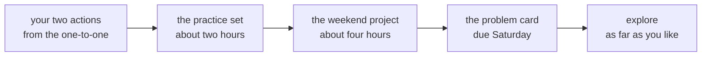

# The long weekend: practice, a project, and what to explore

Friday is Gandhi Jayanti, with no session, and Saturday is the session with a working forward
deployed engineer. Everything on this page is optional, ungraded and self-checking, so you can tell
on your own whether you have it right. Start with the actions you agreed in your one-to-one; this page
is where most of them point.

## What there is, in order

| What | About | Where | How you check it |
|---|---|---|---|
| The practice set, four parts: Python, SQL, numbers and stating a problem | Two hours | The day's `exercises/unguided/` files named `practice` | A self-check key for each part |
| The weekend project: the warden's mess, with numbers | Four hours | The day's `takehome/` brief | Every step names the number a right answer gives |
| The problem card | One hour | One page, from Thursday's class | The four questions, all answered |
| The reading and watching path | As long as your actions need | Below | Each item names what to look for |

---

## A reading and watching path, by area

Pick the area your one-to-one named first. Every link below was checked on 28 September 2026.

**Python.**

- Read chapters 3, 4, 5 and 8 of the Python tutorial: numbers and text, loops and functions, lists and dictionaries, and errors: https://docs.python.org/3/tutorial/index.html (checked 28 September 2026).
- Watch Corey Schafer's "Python Programming Beginner Tutorials" playlist, videos 2 to 8, which cover types, lists, dictionaries, loops and functions: https://www.youtube.com/playlist?list=PL-osiE80TeTskrapNbzXhwoFUiLCjGgY7 (checked 28 September 2026).
- Watch Ned Batchelder's "Facts and Myths about Python names and values" from PyCon 2015, 25 minutes, for why two names can share one list: https://www.youtube.com/watch?v=_AEJHKGk9ns (checked 28 September 2026).

**SQL.**

- Read Chapter 2 of the PostgreSQL tutorial, "The SQL Language", which builds tables and queries them step by step: https://www.postgresql.org/docs/current/tutorial-sql.html (checked 28 September 2026).
- Work through SQLBolt's interactive lessons on `SELECT` queries, each checked in the browser as you type: https://sqlbolt.com/ (checked 28 September 2026).
- Read Markus Winand's "The Three-Valued Logic of SQL", for what a NULL does inside a condition: https://modern-sql.com/concept/three-valued-logic (checked 28 September 2026).

**Numbers.**

- Read BBC Bitesize's "Repeated percentage change, interest and exponential change", for why percentages multiply: https://www.bbc.co.uk/bitesize/articles/zvdhkhv (checked 28 September 2026).
- Watch 3Blue1Brown's "The medical test paradox, and redesigning Bayes' rule", for why a rare event fills a flag list with false alarms: https://www.youtube.com/watch?v=lG4VkPoG3ko (checked 28 September 2026).

**Stating a problem.**

- Read Aced's "How to Answer Decomposition Interview Questions: The Definitive Guide (2026)", for clarifying before solving, which is the order Thursday's class practised: https://www.tryexponent.com/blog/decomposition-interview (checked 28 September 2026).

---

## Four things to explore

### 1. The coaching centre

The owner of a coaching centre says: "Get me an AI chatbot for admission enquiries. My competitor has
one." Asking her the four questions turns up the problem underneath: enquiries arrive by phone after
the front desk closes, nobody calls back, and about a third of callers never hear from the centre.

Bring her three different ways to stop losing enquiries, one of them with no AI in it. Judge each on
the same four measures: what it costs to build and run, how long until it works, what breaks and who
notices, and how much of the real problem it removes. Rule out two with reasons she would accept, and
say what the thinnest version of the third looks like by next Monday. Post it in the thread in half
a page.

### 2. The margin in the mess project

Step 7 of the weekend project uses a 5 percent margin. Run the rule again with 2 percent and with 10
percent, and check your numbers against these, all for weeks 2 to 4:

| Margin | Plates wasted | Nights short | Plates short |
|---|---|---|---|
| 2 percent | 88 | 1 | 1 |
| 5 percent | 202 | 0 | 0 |
| 10 percent | 399 | 0 | 0 |

The 2 percent rule wastes 114 fewer plates than the 5 percent rule and leaves one student without
dinner on one night. Which would you recommend, and who should make that call: you, the warden or the
mess committee? Write the answer in two sentences.

### 3. One real API response

Open OpenAI's reference page for creating a chat completion, find its example response, and write the
path from the top of the response down to the reply's text. Then compare it with Section A's Q5 in
the diagnostic's threads: https://developers.openai.com/api/reference/resources/chat/subresources/completions/methods/create/ (checked 28 September 2026).

### 4. Your own project, through the four questions

Take the project you described on Wednesday and answer the four questions for the problem it solved:
the pain in its owner's words, the people, the number that would move, and what was known, assumed
and never asked. Bring it to Saturday. A working forward deployed engineer asks exactly these
questions for a living, and yours make a better conversation than any general one.
