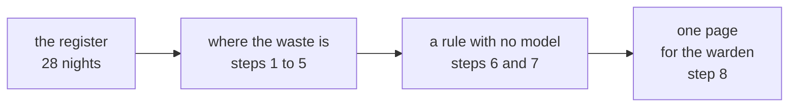

# Weekend project: the warden's mess, with numbers

Self-paced over the long weekend, about four hours in all, alone. Ungraded, and every step tells you
the number a correct answer produces, so you know when you are right without asking anyone. Post
your one-page recommendation and your notebook in the project's thread by Sunday.

---

## The situation

On Thursday the warden asked for "an app that predicts how many students will eat", and the class
found the problem underneath: the mess orders dinner for all 240 students every night because it has
no signal of who is coming, and the vendor bills for every plate. After the class the mess manager
sent you the register: four weeks of dinners, with the plates cooked and the plates eaten each night.

The warden wants a recommendation on one page. You may not recommend anything the numbers cannot
support.

## What you need

| Item | Where |
|---|---|
| The register as Python records | `C2_W00_D04_mess_log_STUDENT.py`, which holds `RECORDS`, one dictionary per night with `day`, `week`, `weekday`, `cooked` and `eaten` |
| The register as a Postgres table | `C2_W00_D04_03_mess_setup_STUDENT.sql`, which builds the table `dinners` in your `library` database |
| A notebook | A new one in your codespace, started from a blank page |

Copy the data file next to your notebook and load it with `from C2_W00_D04_mess_log_STUDENT import
RECORDS`. Each step below is one or two cells.

---

## Step 1. Load the register

Count the nights and add up the plates cooked.

**Check:** 28 nights, and 6,720 plates cooked.

## Step 2. Eaten and wasted

Add up the plates eaten, then the plates wasted, which are the plates cooked minus the plates eaten,
and the waste as a percentage of what was cooked.

**Check:** 5,230 eaten, 1,490 wasted, and 22.2 percent of what was cooked. The warden said "about a
fifth", and now you know how close that was.

## Step 3. Waste by weekday, in Python

Build a dictionary with one key per weekday and the plates wasted on that weekday across all four
weeks as its value, then print the weekdays from most waste to least.

**Check:**

| Weekday | Plates wasted |
|---|---|
| Sat | 360 |
| Sun | 322 |
| Fri | 260 |
| Thu | 160 |
| Mon | 139 |
| Wed | 129 |
| Tue | 120 |

Friday, Saturday and Sunday together waste 942 plates, which is 63 percent of all the waste.

## Step 4. The same breakdown, in SQL

Load the table with the setup file, then write one query that returns the plates wasted per weekday,
most first.

**Check:** the query returns the same seven numbers as step 3. If a number differs, one of your two
versions is wrong, and finding out which is the point of the step.

## Step 5. What the waste costs

Suppose the vendor charges Rs 40 a plate, which is a price invented for this project. Work out the
month's bill and the part of it spent on plates nobody ate.

**Check:** a bill of Rs 2,68,800, of which Rs 59,600 bought food nobody ate.

## Step 6. A rule with no model, first without a margin

Test a simple rule on weeks 2, 3 and 4: each night, cook the average number eaten on the same weekday
in the earlier weeks. On the Monday of week 3, for example, that is the average of the two earlier
Mondays, (206 + 203) / 2 = 204.5, rounded up to 205. Round up with `math.ceil`. For each night, compare
what the rule would cook with what was eaten.

Count the nights on which the rule cooks fewer plates than were eaten, and the plates short in all.

**Check:** 11 of the 21 nights come up short, by 28 plates in all. On those nights students would
have gone without dinner, which is worse than waste.

## Step 7. The same rule with a 5 percent margin

Multiply the average by 1.05 before rounding up, and run step 6 again.

**Check:** no night comes up short, and the waste over weeks 2 to 4 falls to 202 plates, against
1,116 plates when the mess cooked for all 240 every night. That is 914 fewer plates wasted, about
82 percent less.

## Step 8. One page for the warden

Write the page with these five parts, in this order:

1. **The problem, in two sentences.** The stated problem and the real one, written apart.
2. **The number.** Where the waste is and what it costs, from steps 2 to 5.
3. **Three options.** At least three that differ in kind, one of them with no model: for example a
   sign-out each morning on the mess group, the weekday rule from step 7, and the prediction app. For
   each, one line on what it costs, how long it takes to start and what could go wrong.
4. **Two ruled out.** Rule out two, each with a reason the warden would accept.
5. **The thinnest first version.** What the mess does differently from next Monday, how it will know
   within two weeks whether it worked, and which number it will watch.

End with one line on what four weeks of data cannot tell you. Exam weeks, festivals, the first week
of a term and a change of menu all break the pattern the rule depends on.

---

## The self-check spine

| Step | Your answer is right when |
|---|---|
| 1 | 28 nights and 6,720 plates cooked |
| 2 | 5,230 eaten, 1,490 wasted, 22.2 percent |
| 3 | Saturday 360 at the top, Tuesday 120 at the bottom |
| 4 | The SQL query returns the same seven numbers as step 3 |
| 5 | Rs 2,68,800 billed, Rs 59,600 wasted |
| 6 | 11 short nights, 28 plates short |
| 7 | No short nights, 202 plates wasted against 1,116 |
| 8 | Someone who missed Thursday's class understands your page without asking you anything |

The worked solution is released after the weekend, beside the other solutions. Try every step before
opening it.
