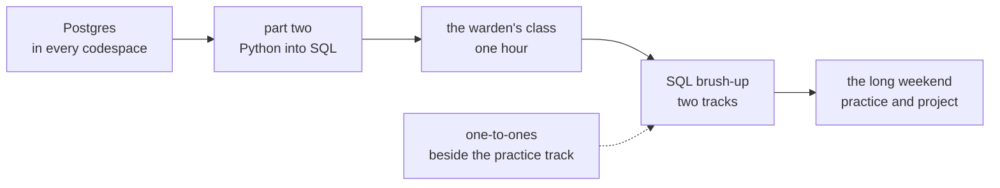

# Trainer day sheet: Week 0, Thursday. The librarian in SQL, and the warden's mess

TRAINER ONLY. For the Programme Head, the Academic TA and the Support TA.

Module: <!-- sync:module:W00/D4 -->no module, since Week 0 sits outside the 510 hours<!-- /sync:module:W00/D4 -->. Date: <!-- sync:day-date:W00/D4 -->Thu 01 Oct 2026<!-- /sync:day-date:W00/D4 -->.

## What today is for

The first half carries Wednesday's questions from Python into SQL, on the same eight rows, then runs
the one-hour class on stating a problem before solving it, on the warden's mess. The second half is
the SQL brush-up, in two tracks, on four weeks of the same log: the clauses Week 2 starts from, and
running a query from VS Code against Postgres. The one-to-ones that did not happen on Wednesday
happen beside the practice track.

**Stop before** everything Week 2 has planted for the room to find, and everything Week 1 keeps.
Today's data has no NULLs, no joins and no ties at the top of any sorted answer, and the day stages
neither the GROUP BY error nor `LIMIT` without `ORDER BY`, which are Week 2 Monday's two reveals. No
join, no CTE and no window function appears. The Python half stays away from files, the mean and the
median, and `.get()` with a default. No Kalpa, no revenue tree, and no architecture or real prices in
the class.

## The shape of the day

| Block | Duration | What has to happen |
|---|---|---|
| Postgres in every codespace | About 15 min, at the start of the first half | Every learner reaches tick 6 of the setup sheet |
| Python brush-up, part two, into SQL | About 1 h 45 min | The librarian's three questions answered twice, from the half-one deck and the demo notebook |
| The warden's class | 60 min | From the run sheet, `trainer/C2_W00_D04_warden_class_TRAINER.md` |
| SQL brush-up, taught track | About 3 h, the second half | The half-two deck and the brush-up file, run live |
| SQL brush-up, practice track | About 3 h, beside the taught track | The exercise, then the practice set, with the one-to-ones pulling learners out one at a time |

## Before the room opens

1. Take the SQL tracks from the key workbook's Profile tab: a full SQL brush-up call joins the taught
   track and a light call joins the practice track. Tell each learner their track one to one, and never
   post the list.
2. Post the day's files where learners can copy them: the three `.sql` files in `sql/`, the setup
   sheet in `whiteboards/`, and the exercise in `exercises/unguided/`. The course's own repository is
   not open to learners yet.
3. Run the setup sheet once, start to finish, in a fresh codespace made from GitHub's Jupyter starter,
   the same way Monday's learners made theirs. The install takes a minute or two, so start it before
   the room fills.
4. Open the demo notebook, `notebooks/C2_W00_D04_01_python_to_sql_STUDENT.ipynb`, on the projector
   account and run it top to bottom once, so the database answers before the room is watching.
5. Load the Kahoot from `kahoot/C2_W00_D04_quiz_STUDENT.md`.
6. Bring the list of learners still without a one-to-one, their Profile lines and blank baseline cards.

## Postgres in every codespace, about 15 minutes

Everyone follows the setup sheet together, one step at a time, with the support TA walking the room.
Two things go wrong often enough to watch for: a learner in a codespace other than Monday's, who has
nothing to lose by carrying on in it, and a learner who skips step 2 and meets the "connection to
server on socket" error. The sheet's last section names that error and its fix, so point to it rather
than fixing the laptop.

## Part two, about 1 hour 45 minutes

| Section of the half-one deck | Duration | What the room does |
|---|---|---|
| A. The new ask | 5 min | The librarian's database, and the same log in two shapes |
| C. One row, one record | 20 min | `SELECT`, `FROM` and `WHERE` on week 1; D5 and D6 are the deliberate failure |
| D. Three questions, twice | 45 min | Each question in Python, then in SQL, with the demo notebook showing both agree |
| E. Every week at once | 25 min | `GROUP BY week`, then the bridge table on S12 |
| Your turn | 10 min | The librarian file, run from the terminal |

**The deliberate failure, D5 and D6.** Put the double-quoted query on screen and have everyone
predict, then run it. The error reads `ERROR:  column "Maths" does not exist`, and the demo notebook
shows the same failure from Python. The point is one sentence: double quotes name a column, single
quotes wrap text.

## The warden's class, 60 minutes

The run sheet has the hour, the deliberate failure and the fact sheet. The class and its Kahoot moved
here from the tracker's Wednesday row, because the student sheet gives Wednesday's second half to the
introductions and promises this hour on Thursday.

## The SQL brush-up, taught track, about 3 hours

| Section of the half-two deck | Duration | What the room does |
|---|---|---|
| A. The month's questions | 15 min | The committee's questions, and the written order against the run order |
| B. Which rows | 35 min | `WHERE`, `AND`, `OR`, `IN` and `BETWEEN`; D5 and D6 on the range's ends |
| C. In what order | 20 min | `ORDER BY` on more than one column, and why the third column is there |
| D. One row per group | 45 min | Aggregates, then `GROUP BY` on one column and on two |
| E. Groups that pass | 45 min | `HAVING`, then both filters in one query; D13 and D14 are the deliberate failure |
| Your turn | 20 min | The committee's last question, written from scratch |

**The deliberate failure, D13 and D14.** The query with `ORDER BY` before `GROUP BY` stops with
`ERROR:  syntax error at or near "GROUP"`. Read the message aloud and ask which word Postgres could
not place, then fix it by moving the sort to the end. Keep this error and leave the GROUP BY error
alone: "must appear in the GROUP BY clause" is Week 2 Monday's to stage.

## The practice track, about 3 hours

The practice track works alone: the exercise, `exercises/unguided/C2_W00_D04_monthly_log_STUDENT.md`,
predicted on paper and then checked by running each query, then the brush-up file and the practice
set's SQL part. The one-to-ones pull learners out one at a time, from the guide in Wednesday's pack,
`content/W00/D3/trainer/C2_W00_D03_one_to_one_guide_TRAINER.md`.

## The interview angle, with the answers

The framing class carries the three questions of the tracker's Wednesday row, with their answers in
the run sheet. The four below are the tracker's Thursday row, whose solution-thinking class has no
slot in the student sheet; its work moved into the weekend project and the coaching-centre prompt on
the self-prep page, so the answers are here for the one-to-ones and for Saturday.

**[S] Walk me through how you would approach a problem you have never seen before.** A strong answer
names the steps before any tool: the pain or decision in the owner's words, the people, the number
that would move, and what is known against assumed, then options that differ in kind, then the
thinnest version that runs end to end.

**[F] Give me three ways to solve this, and tell me which two you would rule out.** Three options
that differ in kind, one of them with no model, each judged on cost, time, what breaks and how much of
the real problem it removes, and two ruled out aloud with reasons the owner would accept. For the
mess: a sign-out each morning, the weekday rule with a margin, and a prediction app.

**[F] When is a model the wrong answer?** When a rule or a process change removes most of the
problem more cheaply, when there is too little data to learn from, or when nobody will maintain it.
The weekend project's weekday rule cuts the mess's waste by about 82 percent over three weeks with a
calculator.

**[D] The client wants what the competitor has; how do you move them to what they need?** Agree the
number that matters to them first, show where it moves in their own records, and put their choice and
the cheaper option side by side on the same measures, so the comparison does the persuading.

## What to record today

1. Who reached tick 6 of the setup sheet, and who needs the support TA before the weekend.
2. The one-to-ones done today, and the two actions each agreed, on the TAs' own sheet and never in the
   repository. Anyone still waiting carries to Saturday, before the session starts.
3. Anyone who needs the problem card explained again before Saturday.

## The long weekend and Saturday

Friday is Gandhi Jayanti, with no session. The self-prep page, `study-notes/C2_W00_D04_self_prep_STUDENT.md`,
lists what is on offer: the practice set in four parts with its self-check keys, the weekend project
with its self-check spine, the problem card due Saturday, and four things to explore. The project's
worked solution, in `exercises/solutions/`, is released after the weekend. Saturday is the session
with a working forward deployed engineer, and the pre-read for it ships tonight.
