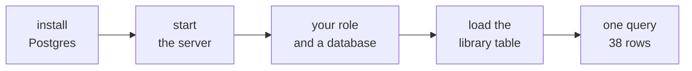

# Setup: Postgres in your codespace, and your first query

About fifteen minutes, six ticks, in the codespace you made on Monday. Every command runs in the
terminal at the bottom of VS Code; open one from the menu if none is showing.



Why the steps are needed: Monday's codespace runs on Microsoft's universal image, which is Ubuntu
24.04 and does not include a Postgres server, and it gives your codespace user permission to install
software with `sudo`. Both were checked on 28 September 2026 against the image's own documentation.

---

## 1. Install Postgres

```bash
sudo apt-get update
sudo apt-get install -y postgresql
```

On Ubuntu 24.04 this installs PostgreSQL 16. It takes a minute or two.

**You should see** the terminal finish with lines that mention `postgresql-16`, and the prompt come
back.

---

## 2. Start the server

```bash
sudo service postgresql start
```

**You should see**

```text
 * Starting PostgreSQL 16 database server
   ...done.
```

The server does not start by itself. Whenever your codespace has been stopped and opened again, run
this step again before anything else.

---

## 3. Your own role and a database

```bash
sudo -u postgres createuser --superuser $(whoami)
createdb library
```

The first line creates a Postgres user with your codespace's user name, so Postgres recognises you
without a password. The second creates an empty database called `library`.

**You should see** nothing at all: both commands are silent when they work.

**If you see this instead:**

```text
createuser: error: creation of new role failed: ERROR:  role "codespace" already exists
```

or `database "library" already exists`, you ran the step before, and there is nothing to fix.

---

## 4. Load the library's log

Copy today's setup file, `C2_W00_D04_00_library_setup_STUDENT.sql`, from where the day's files are
posted into your codespace, then run it from the folder you saved it in:

```bash
psql -d library -f C2_W00_D04_00_library_setup_STUDENT.sql
```

**You should see**

```text
psql:C2_W00_D04_00_library_setup_STUDENT.sql:9: NOTICE:  table "issues" does not exist, skipping
DROP TABLE
CREATE TABLE
INSERT 0 38
 rows_loaded
-------------
          38
(1 row)
```

The NOTICE appears only the first time, because the file removes any old copy of the table before
building it. Running the file again rebuilds the table from scratch, so a mistake is never
permanent.

---

## 5. Your first query

```bash
psql -d library
```

psql prints its version and `Type "help" for help.`, then waits at a prompt that reads `library=#`.
Type the query, with its semicolon, and press Enter:

```sql
SELECT COUNT(*) FROM issues;
```

**You should see**

```text
 count
-------
    38
(1 row)
```

Type `\q` and press Enter to leave psql. When a result is longer than the screen, psql shows it one
screen at a time; press `q` to get back to the prompt.

---

## 6. The driver for Python

```bash
pip install psycopg2-binary
```

This lets a notebook in the same codespace send SQL to the same database, which the demo notebook
does.

**You should see** the install end with a line that begins `Successfully installed`.

---

## If you see this instead

```text
psql: error: connection to server on socket "/var/run/postgresql/.s.PGSQL.5432" failed: No such file or directory
	Is the server running locally and accepting connections on that socket?
```

The server is not running. Run step 2, then try again. This is the message you will meet most often,
usually the first time you open a codespace that has been stopped.

---

## The six ticks

| Tick | Done when |
|---|---|
| 1 | The install finished without an error. |
| 2 | The server reported `...done.` |
| 3 | Your role and the `library` database exist. |
| 4 | The setup file printed 38. |
| 5 | Your own `SELECT COUNT(*)` printed 38. |
| 6 | `psycopg2-binary` installed. |
