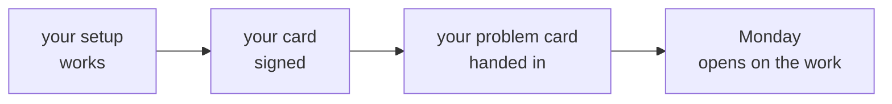

# Ready for Week 1

Handed out on Saturday, for the weekend. Tick every line before Week 1 opens on <!-- sync:day-date:W01/D1 -->Mon 05 Oct 2026<!-- /sync:day-date:W01/D1 -->. Anything you cannot tick, take to
the support TA on Saturday, or post the exact error in your setup thread.

## Your setup

| Tick | Done when |
|---|---|
| Your codespace opens | The codespace you made on Monday opens in the browser |
| A notebook runs | Monday's first cell still draws its chart |
| Postgres starts | `sudo service postgresql start` reports `...done.` |
| The library answers | `psql -d library` then `SELECT COUNT(*) FROM issues;` prints 38 |

Open the codespace once more before Monday, since Monday's setup instructions, which ship on Sunday
evening, start from it.

## Your baseline

| Tick | Done when |
|---|---|
| Your baseline card is signed | You and a TA have both signed it, and you have kept your copy |
| Your two actions have dates | Each action says how you will know it is done, and by when |
| Your problem card is in | Handed in on Saturday |

## How a week runs from Monday

These come from the orientation, and they hold from the first day.

| What | How it works |
|---|---|
| Every day | It opens on a business situation and the questions someone is asking, before any tool |
| Python and SQL | Week 1 runs on Python from its first hour, and Week 2 runs on SQL |
| AI assistants | In Weeks 1 to 6, core exercises and every assessment run without them |
| The daily Kahoot | Ungraded, as on Thursday |
| Saturdays of teaching weeks | A recap paper, pen and paper with no assistant, and you see your own score |
| Attendance | Recorded in every session, with a minimum of 90 percent over the programme as a whole |
| Submissions | Exercises and projects go on GitHub Discussions and the LMS by the stated deadline |

## Your foundations

The foundations guide is the long version of the diagnostic, and its mini projects are the
portfolio's first repositories. [The map](../../D2/study-notes/C2_W00_D02_foundations_00_map_STUDENT.md) lists the
diagnostic questions each chapter revisits, so a low section on your baseline card points you to its
chapter. [The path](../../D2/study-notes/C2_W00_D02_foundations_10_path_STUDENT.md) lays the six mini projects out as a
week. Three chapters cover what the diagnostic did not test: pandas and Excel arrive in Week 2, and
GitHub carries your work and your submissions from the first day.

| Chapter | Reading | Hands-on |
|---|---|---|
| [Chapter 6, pandas](../../D2/study-notes/C2_W00_D02_foundations_06_pandas_STUDENT.md) | 7 min | 90 min |
| [Chapter 7, Excel](../../D2/study-notes/C2_W00_D02_foundations_07_excel_STUDENT.md) | 5 min | 45 min |
| [Chapter 8, GitHub](../../D2/study-notes/C2_W00_D02_foundations_08_github_STUDENT.md) | 13 min | 60 min |

## Bring on Monday

Your laptop, charged, with the codespace opened once over the weekend, and Monday's pre-read read.
