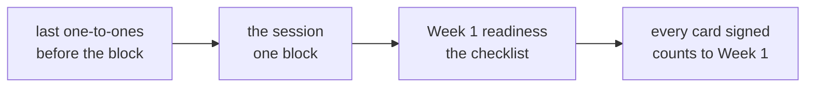

# Trainer day sheet: Week 0, Saturday. A working forward deployed engineer, and sign-off

TRAINER ONLY. For the Programme Head, who hosts, and the two TAs.

Module: <!-- sync:module:W00/SAT -->no module, since Week 0 sits outside the 510 hours<!-- /sync:module:W00/SAT -->. Date: <!-- sync:day-date:W00/SAT -->Sat 03 Oct 2026<!-- /sync:day-date:W00/SAT -->.

## What today is for

A working forward deployed engineer spends one block, about four hours and up to six, on the job
itself and on the cohort's questions. Around that block the week closes: the last one-to-ones, every
baseline card signed, the problem cards handed in, and the room's readiness for Week 1 Monday.

**Stop before** Kalpa and anything Week 1 opens with, any learner's score in front of the room, and
any client detail the guest has not made public. No file names the guest, because no source does.

## The shape of the day

| Block | Duration | What has to happen |
|---|---|---|
| Before the session | About 30 min | The one-to-ones still waiting, problem cards collected at the door, and the learners' written questions gathered |
| The session | About 4 h, and up to 6 | The guest's block, in the shape agreed from the guest brief, with its breaks |
| After the session | About 30 min | The Week 1 readiness checklist, and the last card signatures |

The student sheet promises the session as one block, so nothing else is scheduled inside it. A
one-to-one that cannot finish before it runs in a break.

## Before the session

1. Send the guest brief, `trainer/C2_W00_SAT_guest_brief_TRAINER.md`, well before Saturday, and agree
   the shape of the block and its breaks with the guest.
2. Collect every problem card at the door. A missing card gets a date on the TAs' sheet, never a
   conversation in front of the room.
3. Collect the three written questions each learner brings, from Thursday's pre-read, and sort them
   into a stack for the host: the best first, one per theme, duplicates merged.
4. Run the last one-to-ones from the list, with Wednesday's guide.

## Hosting the session

| Moment | The host's job |
|---|---|
| The opening | Introduce the guest by role and the cohort by what it did this week, in under two minutes |
| While the guest talks | Keep time against the agreed shape, and call the breaks |
| The questions | Put the learners' written questions first, from the sorted stack, then open the floor |
| If the talk drifts to a named client | Steer back to the shape of the work: the problem, the options, what shipped, what broke |
| The close | Thank the guest, and ask each learner to write one thing they will do differently in Week 1 |

## If the session does not run

The tracker keeps the guest to be confirmed. If the session does not run, the slot becomes practice
and Week 1 readiness: the weekend project with a TA in the room, the practice set, and the readiness
checklist done together.

## After the session: Week 1 readiness

Hand out `preread/C2_W00_SAT_week1_readiness_STUDENT.md` and go through it in the room. Anyone whose
Postgres does not start, or whose codespace does not open, stays for the support TA now, so Monday
opens on the work.

## By the close

1. Every baseline card signed by the learner and a TA, with two actions and a date for each. The card
   goes home with the learner; the TA keeps a copy off the repository.
2. The room's baseline goes to the Week 1 trainer as counts per section and per brush-up call, with no
   names, taken from the key workbook's Dashboard. The Week 1 trainer reads it before Monday, and
   Monday opens as written.
3. Monday's setup instructions and pre-read ship on Sunday evening.

## The interview angle, with the answers

These are the tracker's three questions for the day. The project talks they were written for moved to
Wednesday with the student sheet, so they now belong to the last one-to-ones and to the card.

**[S] Tell me about a project you built: what was your part, and what broke?** A strong answer names
the problem and whose it was, the learner's own part in the first person, one real failure and what
the learner did about it, in under two minutes.

**[F] What would you do differently if you built it again?** One specific change tied to the failure
just described, with the reason, never a general wish to have planned better.

**[D] What did you believe you knew this week that the paper showed you did not, and what are you
doing about it?** The learner names the area where their own rating and their section score
disagreed most, the question behind it, and the dated action on their card. It is the card, said
aloud.

## What to record today

1. Every card signed, and any still open with the date agreed to close it.
2. The problem cards handed in, and who owes one.
3. Who needs the support TA before Monday.
