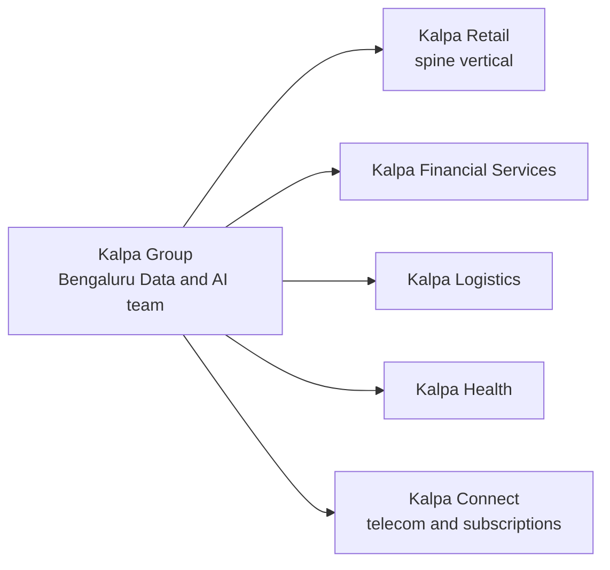
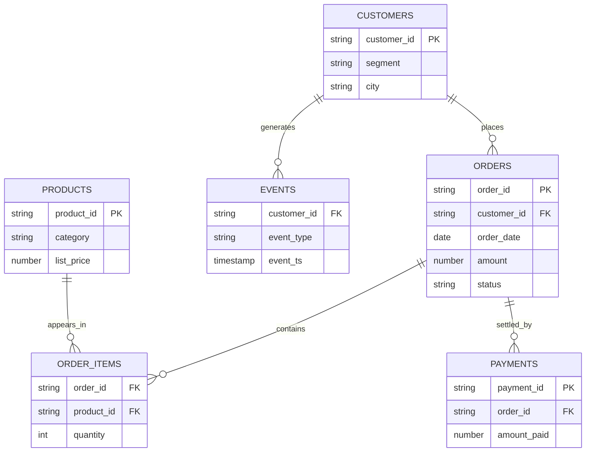

# Introduction: the company, the journey, the room

Week 1, Day 1. Slide source. One idea per slide.

Position bar, repeated at every section boundary:
`[the company] > [the journey] > [the room]`

---

## S1. You have just watched a notebook answer a question

The notebook on this screen answered one question: "Of these thirty Kalpa Retail orders, how much did we actually collect?"

It came back with 13 delivered orders, Rs 25,720.

Nobody has told you who Kalpa is. That is the first thing to fix.

---

## S2. Where we are

`[the company] > [the journey] > [the room]`

Three things stand between you and the code: the company every example lives inside, the journey you are twenty weeks into starting, and how this room actually runs.

---

## SECTION 1: THE COMPANY

`**[the company]** > [the journey] > [the room]`

---

## S3. Kalpa Group

Kalpa Group is a diversified global conglomerate with five business units across five industries, and it is headquartered in Singapore.

Its largest engineering and data centre sits in Bengaluru.

Every example you meet for the next twenty weeks happens inside this company.

---

## S4. Where you sit

You sit in the Data and AI team inside Kalpa's Bengaluru global capability centre, and that centre serves all five business units.

Each business unit owns its own operations. The Bengaluru centre owns the data, the models and the AI systems that every unit runs on.

This cohort is that team's newest member, and it started work this morning.

---

## S5. The mental map

Five territories under one group.

Kalpa Retail sells consumer goods online and in store across India and South-East Asia.

Kalpa Financial Services sells payments and consumer lending.

Kalpa Logistics runs last-mile delivery and warehousing for every other unit.

Kalpa Health runs diagnostic labs and clinic operations.

Kalpa Connect sells mobile, broadband and subscription services.

---

## S6. Which territory you live in

Teaching lives in Kalpa Retail and stays there. Every demo, every exercise and every take-home on a teaching day works Kalpa Retail records.

Build weeks tour the other four units, one sub-problem per unit, so you meet fraud, delivery times, no-shows and churn inside the same company.

The domain never changes on a teaching day, because you cannot absorb a new idea and a new business at the same time.

---

## S7. The entity picture

These are the tables of Kalpa Retail. Today you meet one of them, as a list.

---

## S8. What each table holds

CUSTOMERS holds one row per person who buys from Kalpa Retail, with the segment they sit in and the city they buy from.

ORDERS holds one row per order, with its date, its amount in Rs and its status.

ORDER_ITEMS holds one row per product inside an order, with the quantity ordered.

PAYMENTS holds one row per payment that settles an order, with the amount actually paid.

PRODUCTS holds one row per product, with its category and its list price.

EVENTS holds one row per thing a customer did, such as a visit, a search or a checkout, with the moment it happened.

---

## S9. The same records, five shapes

The thirty orders in front of you are a Python list today.

The same records become a table in Postgres in Week 2, and a DataFrame in pandas in the same week.

They become a feature table when the modelling weeks arrive, and a document corpus when retrieval arrives in Weeks 11 and 12.

The tool changes every few weeks. The company is the one thing that does not.

---

## S10. Draw it back

Close the laptop and take a sheet of paper.

In 3 minutes, draw Kalpa from memory: five boxes for the five units, then the six tables of Kalpa Retail with the lines that join them.

Compare with the person next to you and fix whichever box either of you missed. By the end of this week you should be able to draw this from memory, because every example for the rest of the programme lands inside it.

---

## S11. One disclaimer, said once

Kalpa Group is fictional. Any resemblance to a real company is coincidental.

The problems are real, the data behaves the way real data behaves, and the company is a teaching device that lets you grow inside one business instead of re-orienting to a new one every session.

---

## SECTION 2: THE JOURNEY

`[the company] > **[the journey]** > [the room]`

---

## S12. The programme in five phases

Each phase is a promise about what you can do when it closes.

| Phase | Weeks | What you can do when it closes |
|---|---|---|
| Genesis | 1 to 4 | You can take a file nobody prepared, clean it, query it in SQL, reshape it in pandas, and turn it into the metrics a business decision rests on. |
| Forge | 5 to 8 | You can frame a problem as a model, train it, say honestly how well it works and where it fails, and explain what a language model does when it produces the next token. |
| Ascent | 9 to 12 | You can build with a generative model and ship a retrieval assistant that answers from Kalpa's own documents and refuses when the documents do not answer. |
| Build | 13 to 16 | You can build an agentic system that uses tools, and run it under production conditions where cost, latency and failure are measured. |
| Launch | 17 to 20 | You can carry one problem from a brief to a working system and defend it in front of a panel. |

---

## S13. The weeks that run differently

Build weeks fall at Weeks 3, 6, 9, 12 and 15. Weeks 17 to 20 are the capstone weeks. Every other week teaches.

The three major exams fall in Weeks 5, 10 and 15. Each one runs across its week as a continuous activity.

That is the whole of what is fixed about them today. The rest arrives with the week.

---

## S14. This week, day by day

Monday, today: you can open the Codespace, run and recover a notebook, and answer a counting question on records nobody explained to you.

Tuesday: you can package a rule into a function you call again, survive a bad record by name, log why you rejected it, and move data across the file boundary in both directions.

Wednesday: you can profile a dataset before you touch it, clean it with a written reason behind every decision, and prove that input equals clean plus rejected.

Thursday: you can say what is typical and how spread out the data is without misleading anyone, and hand over a segment summary that carries its denominators.

---

## S15. Friday and Saturday this week

Friday 2 October is Gandhi Jayanti. The institute is closed and there is no session, so teaching for Week 1 ends on Thursday.

Saturday is the recap paper built from this week's own interview question set, then the discussion of every answer as an interview answer.

---

## S16. The Saturday promise

By Saturday you can take a file nobody prepared to a defensible answer.

Four days build that sentence, one step each: read it, clean it, profile it, describe it.

---

## S17. Today, as four promises

You understand that the kernel holds what you gave it between runs, that a value's type decides what an operator means, and that a dataset is a list of named records.

You can launch the Codespace, run and edit and recover the notebook, and answer counting and totalling questions with a loop, a condition and an accumulator.

You can handle a NameError that came from running cells out of order, a TypeError when a text amount meets a number, and a missing key through `.get()` with a default you chose on purpose.

You can defend what a kernel restart resets, and say why refusing a cross-type comparison is safer than a spreadsheet quietly guessing.

The one line to carry out of today. You can take thirty records nobody explained to you and come back with a number, and you can say what would break it.

---

## SECTION 3: THE ROOM

`[the company] > [the journey] > **[the room]**`

---

## S18. How a teaching day runs

1. Scenario setting: the day opens on a question somebody at Kalpa actually needs answered.
2. The trainer demo: a working thing runs on screen with its output visible before anything is explained.
3. The guided exercise: the trainer builds it step by step and the room mirrors it on their own Codespace.
4. The unguided exercise: you attempt it in session with no hints, and the solution is released at the close of the session.
5. The Kahoot traps round, which is ungraded and is read as a signal of attention and retention.
6. A short platform check on Neo.
7. Close-out, which names tomorrow.

---

## S19. How Saturday runs on a teaching week

Saturday opens with a pen-and-paper recap paper drawn from the week's own interview question set. It runs for about two hours, it is AI-free by its format, and it is ungraded.

After a break, the Academic TA leads the solution discussion. Papers are swapped so that you cross-evaluate a peer's answers against the discussed solution, every answer is treated as an interview answer, and call-outs land at random throughout.

---

## S20. How a build week differs

The Programme Head opens a build week by introducing the mini projects.

You work in groups of four. Each build week carries five sub-problems, one drawn from each Kalpa unit, and three groups take each sub-problem, so the panel hears three views of the same business problem back to back.

The industry expert attends on Friday and Saturday. A build week runs no weekly recap paper, and a major exam can still fall inside a build week.

---

## S21. The platforms

| Platform | What it is for |
|---|---|
| Neo | Neo carries all the tests and the exams, and the daily platform check runs there. |
| CodeChef | CodeChef carries the daily competitive coding practice, which carries no assessment. |
| GitHub | GitHub carries your exercises, your projects and your portfolio. |
| LMS | The LMS carries the content and your submissions. |

This cohort does not use Slack.

---

## S22. The environment

You work in VS Code with GitHub Codespaces, so nothing is installed on your laptop and every learner runs the same machine.

Python work lives in `.ipynb` notebooks. SQL work lives in `.sql` files run against Postgres.

The Codespace you opened this morning is the environment for the whole programme.

---

## S23. What runs AI-free

The three major exams, the mock interviews, the project presentations and the business case discussions all run AI-free and proctored.

The Saturday recap paper is AI-free because it is written on paper.

Individual labs are marked AI-free on the day they run, and tomorrow's read-clean-write lab is one of them.

---

## S24. Before tomorrow

Finish the take-home, `C2_W01_D01_takehome_STUDENT.md`. It extends today's counter to report two buckets, above and below the threshold, and it asks for one markdown cell explaining the planted text amount in your own words.

Read the pre-read, `C2_W01_D01_preread_STUDENT.md`, and fill its gap sheet before you sleep. Tomorrow's first hour will feel like revision.

Watch the dictionaries video on the student reference list: Corey Schafer, Dictionaries, video: link to be found.

Nothing to install tonight. The Codespace is already the environment.
