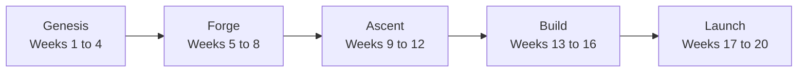

# The journey map: twenty weeks, ten modules, one company

**Current position: Week 1, Day 1, the Genesis phase, the module Foundations of AI and Data.**

---

## 1. The five phases

Each phase is a promise about what you can do when it closes, and none of them is a list of topics.

| Phase | Weeks | What you can do when it closes |
|---|---|---|
| Genesis | 1 to 4 | You can take a file nobody prepared, clean it, query it in SQL, reshape it in pandas, and turn it into the metrics a business decision rests on. |
| Forge | 5 to 8 | You can frame a problem as a model, train it, say honestly how well it works and where it fails, and explain what a language model does when it produces the next token. |
| Ascent | 9 to 12 | You can build with a generative model and ship a retrieval assistant that answers from Kalpa's own documents and refuses when the documents do not answer. |
| Build | 13 to 16 | You can build an agentic system that uses tools, and run it under production conditions where cost, latency and failure are measured. |
| Launch | 17 to 20 | You can carry one problem from a brief to a working system and defend it in front of a panel. |

---

## 2. The ten modules and the weeks they run in

| Module | Weeks | The work that closes it |
|---|---|---|
| 1. Foundations of AI and Data | 1, 2, 3 | Build 1, the data-to-insight mini project, runs in Week 3. |
| 2. Applied Machine Learning | 4, 5, 6 | The first major exam falls in Week 5, and Build 2, the machine learning mini project, runs in Week 6. |
| 3. Deep Learning and Neural Networks | 7, 9 | Build 3, the deep learning and LLM mini project, runs in Week 9. |
| 4. Natural Language Processing | 8 | The module is carried by the week's own assignments. |
| 5. Generative AI Foundations | 10 | The second major exam falls in Week 10. |
| 6. Applied Generative AI | 11, 12 | Build 4, the retrieval assistant, runs in Week 12. |
| 7. Production AI for Real-World Applications | 14, 16 | The module is carried by its weekly assignments, and Week 16 produces a solution proposal. |
| 8. Foundations of Agentic AI | 13 | Build 5, the agentic system, runs in Week 15. |
| 9. Advanced Agentic AI and Multi-Agent Systems | 15 | The third major exam falls in Week 15. |
| 10. Capstone Project | 17 to 20 | The capstone closes with the panel defence. |

---

## 3. The twenty weeks

| Week | Phase | What kind of week it is |
|---|---|---|
| 1 | Genesis | This is a teaching week. |
| 2 | Genesis | This is a teaching week. |
| 3 | Genesis | This is a build week, and it carries Build 1, the data-to-insight mini project. |
| 4 | Genesis | This is a teaching week. |
| 5 | Forge | This is a teaching week, and the first major exam runs across it. |
| 6 | Forge | This is a build week, and it carries Build 2, the machine learning mini project. |
| 7 | Forge | This is a teaching week. |
| 8 | Forge | This is a teaching week. |
| 9 | Ascent | This is a build week, and it carries Build 3, the deep learning and LLM mini project. |
| 10 | Ascent | This is a teaching week, and the second major exam runs across it. |
| 11 | Ascent | This is a teaching week. |
| 12 | Ascent | This is a build week, and it carries Build 4, the retrieval assistant. |
| 13 | Build | This is a teaching week. |
| 14 | Build | This is a teaching week. |
| 15 | Build | This is a build week and it carries Build 5, the agentic system. The third major exam falls in the same week. |
| 16 | Build | This is a teaching week, and it produces the solution proposal. |
| 17 | Launch | This is a capstone week, and the capstone project runs from here to Week 20. |
| 18 | Launch | This is a capstone week and the capstone build continues. |
| 19 | Launch | This is a capstone week and the capstone build continues. |
| 20 | Launch | This is a capstone week, and the capstone closes with the panel defence. |

A teaching week runs the daily teaching shape from Monday to Friday and closes with the Saturday recap paper and its discussion. A build week runs the mini project in groups of four, brings the industry expert in on Friday and Saturday, and runs no tests. A capstone week carries the capstone project rather than the daily teaching shape.

---

## 4. Week 1, day by day

Each day is a promise about what you can do when it closes.

| Day | What you can do when it closes |
|---|---|
| Monday | You can open the Codespace, run and recover a notebook, and answer a counting and totalling question on records nobody explained to you. |
| Tuesday | You can package a rule into a function you call again, survive a bad record by name, log why you rejected it, and move data across the file boundary in both directions. |
| Wednesday | You can profile a dataset before you touch it, clean it with a written reason behind every decision, and prove that input equals clean plus rejected. |
| Thursday | You can say what is typical and how spread out the data is without misleading anyone, and hand over a segment summary that carries its denominators. |
| Friday | Friday 2 October is Gandhi Jayanti and the institute is closed, so teaching for Week 1 ends on Thursday. |
| Saturday | You can answer the week's interview question set on paper without an assistant, defend any of those answers aloud when you are called, and mark a peer's paper against the discussed solution. |

The week adds up to one sentence: by Saturday you can take a file nobody prepared to a defensible answer.
