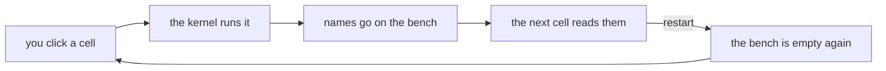

# Cheat sheet: the kernel and the records

Week 1, Day 1. Print landscape. Eight panels, one crux line each.

---

## Panel 1: the workbench



The kernel is a workbench that holds whatever you put on it for as long as it is running.

| The move | What it does to the bench | What it does to the file |
|---|---|---|
| You run a cell. | It puts a name and a value on the bench. | It changes nothing on disk. |
| You restart the kernel. | It sweeps the bench completely clean. | It changes nothing on disk. |
| You restart and run all. | It rebuilds the bench from the top in a few seconds. | It changes nothing on disk. |

The notebook file and the kernel state live in two different places, and only one of them is erased
by a restart.

**Crux:** a restart costs you the state and never the file, which is why the recovery is cheap.

---

## Panel 2: cells run in the order you ran them

The kernel sees your run history and has no opinion at all about where a cell sits on screen.

```
[2]  records = [ ... ]
[3]  count = 0
[1]  for r in records:
```

The cell at the bottom ran first, and the counter in the square brackets is the only honest record of
what happened.

```
NameError: name 'records' is not defined
```

You asked for a name the bench was not holding, and the message names the exact word it went looking
for.

**Crux:** when an output surprises you, read the execution counters before you read the code.

---

## Panel 3: four types, and the question you ask

| Type | What it holds | From today's file |
|---|---|---|
| `str` | It holds text, including text made only of digits. | The id `"KR4224"` and the amount `"4500"` on KR4200. |
| `int` | It holds a whole number you can do arithmetic with. | The amount `1460` on KR4224. |
| `float` | It holds a number with a decimal part. | A value such as `1460.5`. |
| `bool` | It holds `True` or `False`, which every comparison hands back. | The result of `2395 > 2000`. |

```
type("4500")        <class 'str'>
type(4500)          <class 'int'>
type(4500 > 2000)   <class 'bool'>
```

**Crux:** ask a value what it is before you change any code, because the quotes are the easiest
character on the line to skip.

---

## Panel 4: the comparison Python refuses

```
if r["amount"] > 2000:
```

```
TypeError: '>' not supported between instances of 'str' and 'int'
```

The loop stops on KR4200, the first card in the file, whose amount is the text `"4500"`.

The fix converts at the point of use, so the record stays as it is and the comparison gets a number.

```
if int(r["amount"]) > 2000:
```

With that one change the cell walks all thirty records and reports 13 orders above Rs 2,000 totalling
Rs 35,020.

**Crux:** Python refuses rather than guessing, and a spreadsheet would have handed you a number with
no warning attached to it.

---

## Panel 5: the loop, the condition and the accumulator

```
count = 0
total = 0
for r in records:
    if r["status"] == "delivered":
        count = count + 1
        total = total + int(r["amount"])

print(count, total)
```

```
13 25720
```

The zeros sit above the loop and inside the same cell, so rerunning the cell starts from zero instead
of adding a second copy onto the first run.

Move `total = 0` inside the loop and the cell still runs, printing `1460`, which is the amount of
KR4224 and a total of nothing at all.

**Crux:** a total over a group of orders can never be smaller than the largest order in that group,
so check the number before you trust the code.

---

## Panel 6: lists, and the second name

```
ids = ["KR4200", "KR4201", "KR4202"]

ids[0]      "KR4200"
ids[1:3]    ["KR4201", "KR4202"]
```

Counting starts at zero, and a slice stops before its second number.

```
a = ["KR4200", "KR4201"]
b = a
b.append("KR4202")

len(a)      3
```

`b = a` gives one list a second name, so appending through either name changes what both names show.
Write `b = list(a)` when you want a second list on purpose.

**Crux:** one list with two names is one list, and the bug it causes shows up far from the line that
caused it.

---

## Panel 7: records, the missing key and the default

```
r["status"]             "delivered"
r["amount"]             1460
records[0]["discount"]  KeyError: 'discount'
```

Two of the thirty orders carry a `discount` field and twenty-eight carry no such field at all, so
absent is a different thing from empty.

```
r.get("discount", 0)
```

| The default you write | What the thirty records total | What it claims |
|---|---|---|
| `r.get("discount", 0)` | The discounts total Rs 250. | It claims that a record with no discount field was not discounted. |
| `r.get("discount", 100)` | The discounts total Rs 3,050. | It claims a discount of Rs 100 on twenty-eight orders that never recorded one. |

Both cells run to the end and both print a clean number.

**Crux:** the default is a decision you own, and it leaves no mark on the screen once the cell has
run, so you have to say it out loud.

---

## Panel 8: reading an error in three questions

| The question | Where you find the answer |
|---|---|
| What is the exception type? | It is the first word on the last line of the message. |
| Which line is mine? | It is the line the message points at in your own cell. |
| What value was it holding? | It is the thing named in quotes or described by type at the end of the message. |

The third question is the one people skip, and it is the one that names the record.

| Today's error | What it was holding |
|---|---|
| `NameError: name 'records' is not defined` | It was holding nothing, because the setup cell had not run. |
| `TypeError: '>' not supported between instances of 'str' and 'int'` | It was holding the text `"4500"` from KR4200 on one side. |
| `KeyError: 'discount'` | It was holding a record that has no field of that name. |

**Crux:** every one of these names the thing it choked on, so read it before you edit anything.
