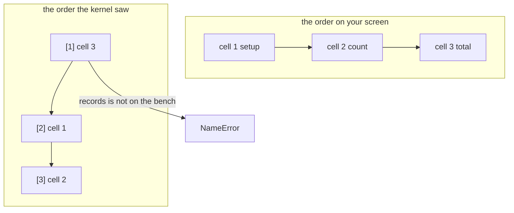
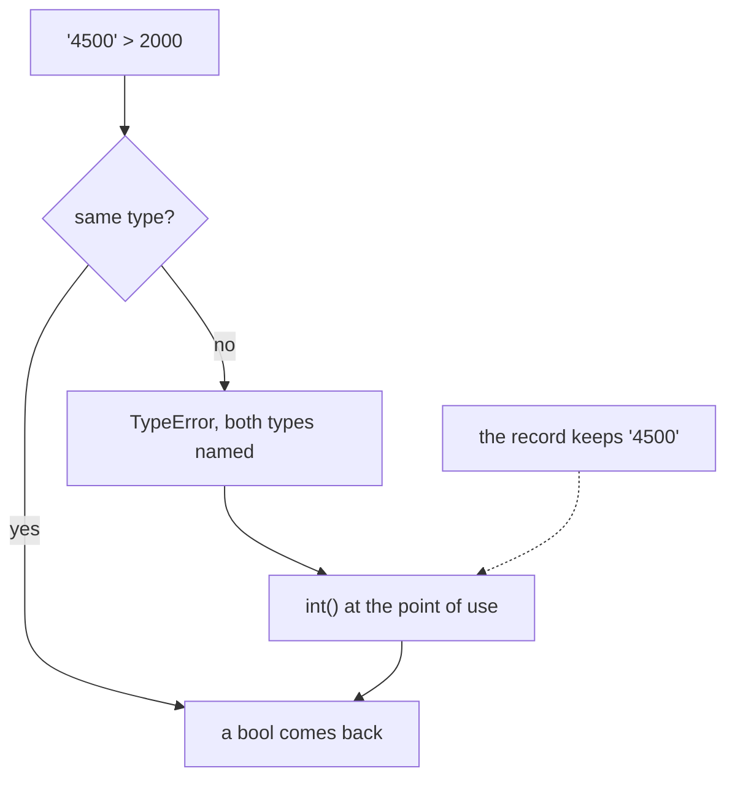
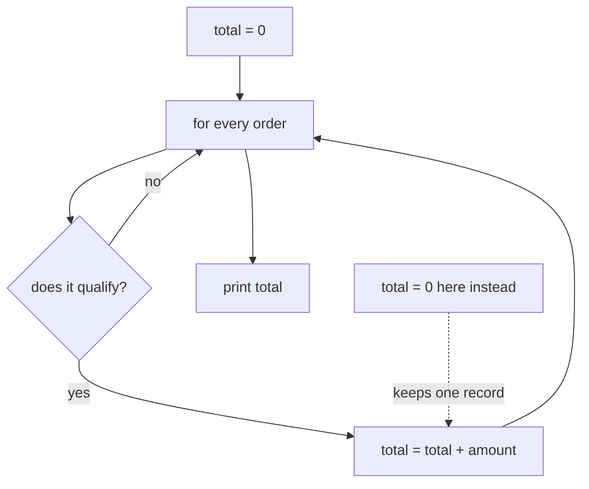
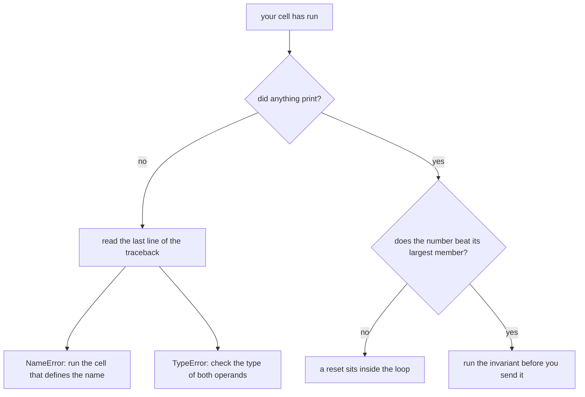
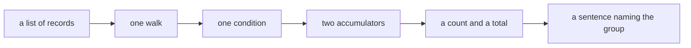

# Visual sheet: the kernel, the type and the accumulator

Week 1, Day 1. Print landscape. Six panels, pictures only. The text sheet beside this one carries the words; this one is what you redraw from memory.

---

## Panel 1: the bench

**Crux:** the kernel holds exactly what you gave it, in the order you gave it.

---

## Panel 2: the order that matters

**Crux:** the number in square brackets counts runs, and it is the only order the kernel knows about.

---

## Panel 3: type decides what the operator means

**Crux:** convert at the point of use, so the record still shows what the source sent.

---

## Panel 4: the accumulator, and the one place it can start

**Crux:** a total that equals one record's amount is a reset inside the loop.

---

## Panel 5: what to check, and in what order

**Crux:** nothing on screen flags a wrong number, so the check has to come from you.

---

## Panel 6: the shape every answer takes

**Crux:** a count without its group is not an answer to anything.

---

The landscape PDF of this sheet is deferred. The rendering toolchain the `fde-cheat-sheets` method uses was not installed in the session that built this file, and the markdown with its six panels is the shipped artifact until it is.
