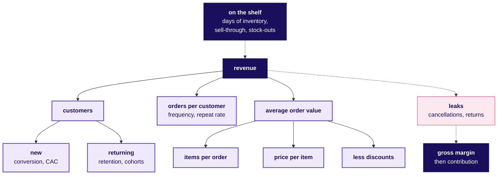

# Domain card: How does retail earn, and how is each number worked out?

Kalpa Retail in Weeks 1 and 2 runs on the metric tree, ten metrics worked out as formulas, twenty words every stakeholder meeting assumes and the rules a retail data team works under. Kalpa is fictional, and its numbers here are illustrative.

## Panel 1: Which tree does every retail number hang off?

**Revenue = customers x orders per customer x items per order x price per item, less discounts.** Stock on the shelf decides whether any of it can happen, and cancellations and returns leak out before the margin is counted.

The tree counts revenue as GMV, and panel 6 walks it down to net revenue and on to EBITDA.

**Crux:** Every retail number is a branch of revenue or a leak from it, so find its place on the tree before explaining a change in it.

## Panel 2: How is each of the ten metrics worked out?

| Metric | Formula |
|---|---|
| Conversion | Orders / visits |
| AOV | Revenue / orders |
| Frequency | Orders / customers who ordered |
| Repeat rate | Buyers with 2+ orders / all buyers |
| Retention | Cohort buyers in month k / cohort size |
| CLV | Contribution per order x orders a year x years |
| CAC and payback | CAC = acquisition spend / new customers; payback = CAC / monthly contribution |
| Gross margin | (Net revenue less COGS) / net revenue |
| Days of inventory | Average stock at cost / COGS per day |
| Like-for-like growth | Stores open all of both periods: sales / the same stores' sales last period, less 1 |

**Crux:** Change the divisor and the metric changes.

## Panel 3: Which traps make a retail number lie, and what catches each?

| Trap | The check |
|---|---|
| Denominator shifted | One session rule throughout |
| Dividing by survivors | Divide by the cohort's starting size |
| Margin on GMV | Divide margin by net revenue |
| Missed sales | Count empty shelf-days; a stock-out leaves no row |
| RTO counted as returns | Count only delivered orders that came back |
| New stores | Quote like-for-like |
| Blended CAC | Count only customers the spend brought |

**Crux:** Run each check before the number leaves the team.

## Panel 4: Which twenty words should you say fluently?

| Word | What it means |
|---|---|
| **SKU** | One sellable version of a product |
| **GMV** | All orders at the prices charged, before cancellations, returns and GST |
| **Net revenue** | GMV less cancellations, returns and GST |
| **AOV, ABV** | Revenue per order online, per bill in store |
| **MRP** | The legal price ceiling, taxes included |
| **Markdown** | A permanent cut to clear stock |
| **COGS** | What suppliers were paid for goods sold |
| **Contribution** | Gross margin less per-order costs |
| **Take rate** | A marketplace's fees as a share of GMV |
| **Shrinkage** | Stock lost to theft, damage or error |
| **Planogram** | Which product goes on which shelf |
| **Footfall** | People through a store's doors |
| **Dark store** | A warehouse for online orders only |
| **Last mile** | The final leg, hub to door |
| **COD** | Cash paid when the parcel arrives |
| **RTO** | A parcel sent back undelivered |
| **Fill rate** | Share of an order a supplier delivered |
| **Sell-through** | Units sold / units received |
| **Like-for-like** | Growth on stores open throughout both periods |
| **Cohort** | Customers grouped by first purchase |

## Panel 5: Which rules does a retail data team work under?

| Rule | What the data team does |
|---|---|
| **GST** | Says whether GST is inside each revenue column |
| **Legal Metrology** | Never prices above MRP |
| **E-commerce 2020** | Explicit consent; ranking parameters shown; complaints acknowledged in 48 hours, redressed in a month |
| **Dark patterns** | No false urgency, basket sneaking or drip pricing |
| **DPDP** | A stated purpose for every use of personal data |
| **RBI tokens** | Tokens and last four digits, never card numbers |
| **PCI DSS** | Card data stays out of analytics |
| **FDI** | Foreign-owned multi-brand e-commerce selling in India runs as a marketplace |
| **CCPA, for US** | Requests to know, delete, correct, opt out |

## Panel 6: Where does Rs 100 of GMV go, and how much is kept?

| Line | Left, Rs |
|---|---|
| **GMV** | 100 |
| Less cancellations, returns | 90 kept |
| Less GST, for the state | 80 **net revenue** |
| Less cost of the goods | 20 **gross margin** |
| Less per-order costs | 7.5 **contribution** |
| Less fixed costs, acquisition | 2.5 **EBITDA** |

**Crux:** On these illustrative numbers, owning the stock leaves about Rs 2.50 of every Rs 100 ordered, so one leak or one price cut can decide the year.
