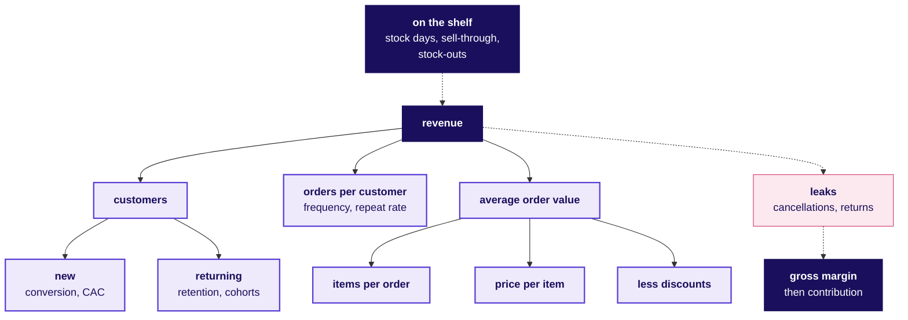

# Domain card: Retail and e-commerce at Kalpa

Kalpa Retail, Weeks 1 and 2. The metric tree, ten metrics as formulas, twenty words a stakeholder meeting assumes, and the rules a retail data team works under. Kalpa is fictional and its numbers here are illustrative.

## Panel 1: The metric tree

**Revenue = customers x orders per customer x items per order x price per item, less discounts.** Stock on the shelf decides whether any of it can happen, and cancellations and returns leak out before the margin is counted.

**Crux:** Every retail number is a branch of revenue or a leak from it, so say its denominator and its window before the number.

## Panel 2: The ten metrics, as formulas

| Metric | Formula |
|---|---|
| Conversion | Orders / visits, same window |
| AOV | Revenue / orders |
| Frequency | Orders / customers who ordered |
| Repeat rate | Buyers with 2+ orders / all buyers |
| Retention | Cohort buyers in month k / cohort size |
| CLV | Contribution per order x orders a year x years |
| CAC payback | CAC / monthly contribution per customer |
| Gross margin | (Net revenue less COGS) / net revenue |
| Inventory days | Stock at cost / COGS per day |
| Same-store growth | Both-year stores' sales / last year's, less 1 |

**Crux:** Compare rates only on the same denominator and window.

## Panel 3: Traps that make a retail number lie

| Trap | The check |
|---|---|
| Denominator shifted | One session rule; cohort's starting size |
| Margin on GMV | Divide margin by net revenue |
| Missed sales | Count empty shelf-days; a stock-out leaves no row |
| Late returns | Wait for the return window to close |
| New stores | Quote like-for-like |
| Blended CAC | Count only customers the spend brought |

**Crux:** Name the denominator, window and definition first.

## Panel 4: Twenty words to say fluently

| Word | What it means |
|---|---|
| **SKU** | One sellable version of a product |
| **GMV** | All orders at the prices charged, before cancellations, returns and GST |
| **Net revenue** | GMV less cancellations, returns and GST |
| **AOV, ABV** | Revenue per order online, per bill in store |
| **MRP** | The legal price ceiling, taxes included |
| **Markdown** | A permanent cut to clear stock |
| **COGS** | What suppliers were paid for goods sold |
| **Contribution** | Gross margin less per-order costs |
| **Take rate** | A marketplace's fees as a share of GMV |
| **Shrinkage** | Stock lost to theft, damage or error |
| **Planogram** | Which product goes on which shelf |
| **Footfall** | People through a store's doors |
| **Dark store** | A warehouse for online orders only |
| **Last mile** | The final leg, hub to door |
| **COD** | Cash paid when the parcel arrives |
| **RTO** | A parcel sent back undelivered |
| **Fill rate** | Share of an order a supplier delivered |
| **Sell-through** | Units sold / units received |
| **Like-for-like** | Growth on stores open in both periods |
| **Cohort** | Customers grouped by first purchase |

## Panel 5: The rules a retail data team works under

| Rule | What the data team does |
|---|---|
| **GST** | Says whether GST is inside each revenue column |
| **Legal Metrology** | Never prices above MRP |
| **E-commerce 2020** | Explicit consent, explained ranking, 48-hour replies |
| **Dark patterns** | No false urgency, basket sneaking or drip pricing |
| **DPDP** | A stated purpose for every use of personal data |
| **RBI tokens** | Tokens and last four digits, never card numbers |
| **PCI DSS** | Card data stays out of analytics |
| **FDI** | Foreign-owned e-commerce runs as a marketplace |
| **CCPA, for US** | Requests to know, delete, correct, opt out |

## Panel 6: Where Rs 100 of GMV goes

| Line | Left, Rs |
|---|---|
| **GMV**: ordered, at the price charged | 100 |
| Less cancellations and returns | 90 kept |
| Less GST, collected for the state | 80 **net revenue** |
| Less the cost of the goods | 20 **gross margin** |
| Less delivery, returns, fees, marketing | 7.5 **contribution** |
| Less stores, warehouses, tech, head office | 2.5 **operating profit** |

**Crux:** A marketplace earns its fees; its GMV is its sellers' sales.
