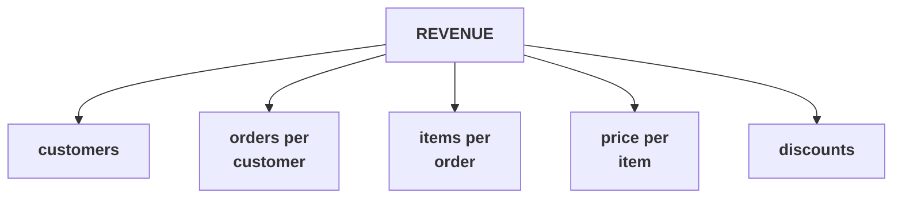

# The revenue tree

Kalpa Retail, Week 1 Day 1. Revenue is a product of five things, and growth comes from moving one of
them at a time. Keep this beside you for the rest of the week, because every day returns to it.

## Panel 1: The picture, and the one rule



**Crux:** A rate with no denominator is a rumour, so every branch is written as a numerator over a denominator before any number is computed.

## Panel 2: Every branch is a metric

| Branch | Over what | Costs |
|---|---|---|
| Customers | The window, matched both sides | Marketing, slowest |
| Orders per customer | Distinct customers, same window | Retention, a tier |
| Items per order | Orders | Merchandising |
| Price per item | Items | Pricing, risks volume |
| Discounts | Gross before discount | Margin, directly |

## Panel 3: Mean or median

| Use | When |
|---|---|
| Median | Describing a typical order |
| Mean | Dividing a total that must reconcile |
| Both | The first pass on any file |

Day 1: mean Rs 18,160, median Rs 2,205. One corporate order carries 88 percent of the revenue.

**Crux:** When the mean sits far above the median, the gap is the finding and the mean describes nobody.

## Panel 4: The three lines every leaf is made of

```python
total = 0
for order in ORDERS:
    total = total + int(order["amount"])
```

Start at zero. Walk the list. Add. Count adds one, sum adds the value, distinct uses a `set`.

## Panel 5: Errors you meet today

| Message | First move |
|---|---|
| `TypeError: ... 'int' and 'str'` | Find the row, then write a rule rather than a patch |
| `KeyError: 'discount'` | Ask whether it is missing or absent by design |
| `NameError: name ... not defined` | Restart the kernel and run all cells |

## Panel 6: Four readings of one word

Gross bookings. Delivered revenue. Net of returns. Cash collected.

Four different numbers live inside the word sales.

**Crux:** Say which reading you used, every time, or the room spends an hour arguing about the wrong number.

## Panel 7: The sentence shape

Claim, with its number and its denominator. The caveat that would change it. What you would do next.

That shape closes every day this week, and it opens every good interview answer.
