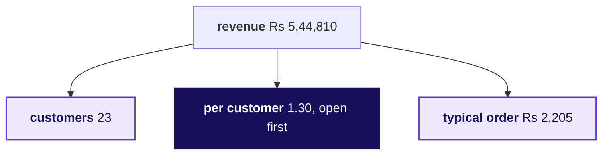

# The revenue tree

Kalpa Retail, Week 1 Monday. Revenue is a tree of metrics that multiply, every number carries its definition, and each chapter's trap below is a plausible wrong number with the check that catches it. The retail story's formulas are on the domain card.

## Panel 1: The revenue tree, with Monday's numbers on it

```mermaid
flowchart TB
    R["<b>revenue</b> Rs 5,44,810"] --> C["<b>customers</b> 23"]
    R --> F["<b>per customer</b> 1.30, open first"]
    R --> A["<b>typical order</b> Rs 2,205"]
    classDef known fill:#EEEAFB,stroke:#5B3FD6,color:#1A0F5C,stroke-width:2px
    classDef bet fill:#1A0F5C,stroke:#1A0F5C,color:#FFFFFF
    class C,A known
    class F bet
```

**Crux:** Revenue is customers times orders per customer times average order value; the identity 23 x (30 / 23) x (Rs 5,44,810 / 30) lands on Rs 5,44,810.

## Panel 2: Ch 1, which total is "sales"

| | |
|---|---|
| Wrong number | Rs 5,44,810 called sales, with 4 cancelled store orders inside it. |
| Check | Count by status first: 21 delivered, 5 returned, 4 cancelled. |
| Fix | Not cancelled is Rs 5,35,760 on 26 orders; delivered is Rs 5,20,790 on 21. |

**Crux:** Name the definition before the number: booked, "not cancelled", or delivered.

## Panel 3: Ch 2, a fraction from two reports

| | |
|---|---|
| Wrong number | AOV Rs 25,943: booked rupees over delivered orders. |
| Check | AOV x the 30 orders the revenue covers gives Rs 7,78,300, not Rs 5,44,810. |
| Fix | Rs 18,160 booked, or Rs 24,800 delivered, each named. |

**Crux:** Build every fraction on one definition, and check that it multiplies back.

## Panel 4: Ch 3, rows counted as customers

| | |
|---|---|
| Wrong number | 30 customers, so 30 / 30 = 1.00 and "nobody comes back". |
| Check | `len(rows)` against `len(set(ids))`: 30 against 23. |
| Fix | 23 customers, 1.30 orders each, 7 came back and 16 bought once. |

**Crux:** Count customers by their id, never by the rows.

## Panel 5: Ch 4, the mean sold as typical

| | |
|---|---|
| Wrong number | A first order valued at the mean, Rs 18,160. |
| Check | Orders above the mean: 1 of 30. Sort and read the top. |
| Fix | Median Rs 2,205 booked, Rs 2,060 delivered; the top order gets its own line. |

**Crux:** Report the median when one order can move the mean, and say why.

## Panel 6: Ch 5, lifts added instead of multiplied

| | |
|---|---|
| Wrong number | Customers +10 percent and frequency +10 percent called 20 percent. |
| Check | Recompute through the tree: 1.10 x 1.10 = 1.21. |
| Fix | Rs 6,59,220, not Rs 6,53,772. On the 29 everyday orders the plan needs 3.3 customers or 4.35 orders: open frequency. |

**Crux:** Lifts multiply along the tree: two 10 percent lifts make 21 percent.

## Panel 7: Ch 6, one-time buyers called lost

| | |
|---|---|
| Wrong number | 16 of 23 bought once, so "70 percent are lost". |
| Check | Median repeat gap 45 days; 9 of the 16 bought in the last 45. |
| Fix | 7 came back, 7 had time and did not, 9 are too recent to judge. |

**Crux:** A one-time buyer is not a lost customer until they have had time to come back.

## Panel 8: What goes to Meera

"23 customers, 1.30 orders each, a typical order of Rs 2,205; 7 came back and 9 are too recent to judge, so open frequency first and hold the Rs 12 crore for Tuesday's two quarters."

**Crux:** One window shows the shape of revenue; only two windows show which branch moved.
