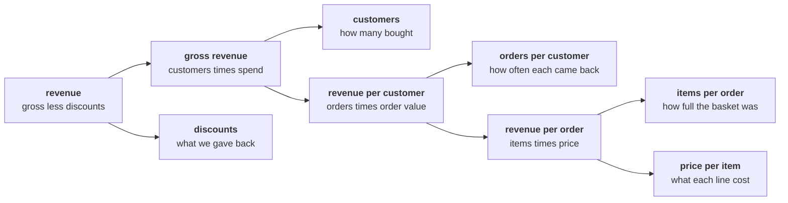

# The revenue tree

Kalpa Retail, Week 1 Monday. Revenue is a product of counts and prices, less what is given back, and
every number leaves the team with its definition. Every day this week returns to this sheet.

## Panel 1: The tree, and the one rule


```mermaid
flowchart LR
    R["<b>revenue</b><br/>gross less discounts"] --> G["<b>gross revenue</b><br/>customers times spend"]
    R --> D["<b>discounts</b><br/>what we gave back"]
    G --> C["<b>customers</b><br/>how many bought"]
    G --> V["<b>revenue per customer</b><br/>orders times order value"]
    V --> F["<b>orders per customer</b><br/>how often each came back"]
    V --> O["<b>revenue per order</b><br/>items times price"]
    O --> B["<b>items per order</b><br/>how full the basket was"]
    O --> P["<b>price per item</b><br/>what each line cost"]
```

Five leaves, and each one is a lever with its own bill. Branches multiply, so two 10 percent lifts
give 21 percent, and 15 percent off for 10 percent more volume leaves 0.935 of today.

**Crux:** Write every branch as a numerator over a denominator before any number is computed, and
move a budget only after finding which branch is short.

## Panel 2: Every leaf is a metric with a bill

| Leaf | Over what | What moving it costs |
|---|---|---|
| Customers | A count, in the window | Marketing; buyers who never return |
| Orders per customer | Distinct customers, same window | Loyalty; paying those who would return |
| Items per order | Orders | Merchandising; low-margin baskets |
| Price per item | Items | Volume; the price-sensitive leave |
| Discounts | Revenue before discounts | Margin, traded for quantity |

## Panel 3: One word, four readings

Booked, not cancelled, delivered, and after discounts: four honest totals of the same orders, each
answering a different question.

**Crux:** Name the definition and the window before the number: "Revenue, all booked orders, 1 July
to 26 September".

## Panel 4: The accumulator, three ways

```python
revenue = 0                          # start, before the loop
for order in ORDERS:
    revenue += int(order["amount"])  # update, once per record
print(revenue)                       # finish, after the loop
```

Count adds 1. Sum adds the value. A distinct count appends an id only when it is `not in` the list.
A filter puts an `if` before the update.

## Panel 5: Mean or median

| The number is for | Report |
|---|---|
| A typical order | The median |
| A total that must add up | The mean |
| A first look at a file | Both, and the gap |

The median of an even count is the average of the two middles: indexes `n // 2 - 1` and `n // 2`.
One value moved by d moves the mean by d over n and the median not at all.

**Crux:** When the mean sits far above the median, the gap is the finding: read the top of the
sorted list and name what sits there.

## Panel 6: Errors met today, read from the last line up

| Last line | First move |
|---|---|
| `NameError: name 'ORDERS' is not defined` | Restart and Run All |
| `TypeError: ... 'int' and 'str'` | Print the record the loop stopped on |
| `KeyError: 'Amount'` | Copy the key from the record |
| `ValueError: invalid literal for int()` | Decide the rule for that field |

## Panel 7: The sentence to Meera

Claim, the branch to examine first. Evidence, a number with its definition and window. Caveat,
what one window cannot show. Next step, the comparison that settles it.

**Crux:** A sentence without its evidence is an opinion, and one without its caveat is a promise.
